# GitHub Collaboration Platform Core Requirements

A compact GitHub-style collaboration platform focused on account access, organizations and members, repositories and Git content, issues, pull requests, and basic access control. Users enter as visitors or through authenticated sessions; every write runs in a specific account, organization, repository, branch, or work-item context. Persist accounts and sessions, organization members and teams, repositories with visibility and access roles, branches and commits, file content, issues and comments, and pull requests with review and merge state. On reopen, restore the last successfully saved state. Every write must verify the current identity and resource permission, report failures, and avoid partial objects or partial state changes. Real-time collaboration, Actions, Packages, Wiki, project boards, notification delivery, and external Git remote protocols are outside the core scope.

## REQ-1 Identity and Access

Core account registration, recovery, sign-in and sign-out capabilities.

**Type:** FOLDER
**Dependencies:** None

### REQ-1-1 Account Onboarding and Recovery

Capabilities required for visitors to create, recover and access accounts.

**Type:** FOLDER
**Dependencies:** None

#### REQ-1-1-1 Register a new GitHub account

A visitor uses this capability from account access pages. The capability requires that the visitor can provide the required account information. The user completes the main choices or confirmation steps for register a new github account. The system validates eligibility, shows any required warnings or unavailable states, and prevents unauthorized changes. The system creates or begins verification for the new account and makes the account available after required checks are complete.
Screenshot reference: 

**Type:** ATOMIC
**Dependencies:** None

**Scenarios:**

- Register a new GitHub account
  - **GIVEN:** Visitor is in the relevant GitHub context, and the visitor can provide the required account information.
  - **WHEN:** The user completes the workflow to register a new github account.
  - **THEN:** The system creates or begins verification for the new account and makes the account available after required checks are complete.
  - **THEN:** The visible GitHub page or object reflects the final state when it is opened again.

#### REQ-1-1-2 Sign in with an existing account

This requirement is performed in the authenticated session, page, or persistent resource context established by REQ-1-1-1 (Register a new GitHub account); it must reuse that context and remain consistent when the prerequisite state changes. A visitor uses this capability from account access pages. The capability requires that the visitor has an existing account and valid credentials. The user completes the main choices or confirmation steps for sign in with an existing account. The system validates eligibility, shows any required warnings or unavailable states, and prevents unauthorized changes. The system starts an authenticated session and shows the signed-in user's workspace.
Screenshot reference: 

**Type:** ATOMIC
**Dependencies:** REQ-1-1-1

**Scenarios:**

- Sign in with an existing account
  - **GIVEN:** Visitor is in the relevant GitHub context, and the visitor has an existing account and valid credentials.
  - **WHEN:** The user completes the workflow to sign in with an existing account.
  - **THEN:** The system starts an authenticated session and shows the signed-in user's workspace.
  - **THEN:** The visible GitHub page or object reflects the final state when it is opened again.

#### REQ-1-1-3 Recover account access by verified email

This requirement is performed in the authenticated session, page, or persistent resource context established by REQ-1-1-1 (Register a new GitHub account); it must reuse that context and remain consistent when the prerequisite state changes. A visitor uses this capability from account access pages. The capability requires that the visitor can identify a verified account email address. The user completes the main choices or confirmation steps for recover account access by verified email. The system validates eligibility, shows any required warnings or unavailable states, and prevents unauthorized changes. The system accepts the recovery request and provides the next account-recovery step without exposing account secrets.
Screenshot reference: 

**Type:** ATOMIC
**Dependencies:** REQ-1-1-1

**Scenarios:**

- Recover account access by verified email
  - **GIVEN:** Visitor is in the relevant GitHub context, and the visitor can identify a verified account email address.
  - **WHEN:** The user completes the workflow to recover account access by verified email.
  - **THEN:** The system accepts the recovery request and provides the next account-recovery step without exposing account secrets.
  - **THEN:** The visible GitHub page or object reflects the final state when it is opened again.

### REQ-1-2 Sign out and end the current web session

This requirement is performed in the authenticated session, page, or persistent resource context established by REQ-1-1-2 (Sign in with an existing account); it must reuse that context and remain consistent when the prerequisite state changes. An authenticated user ends the current web session from the account access area. The system confirms the sign-out action when needed, invalidates the active session and returns protected account, repository or organization pages to an unauthenticated access state.
Screenshot reference: 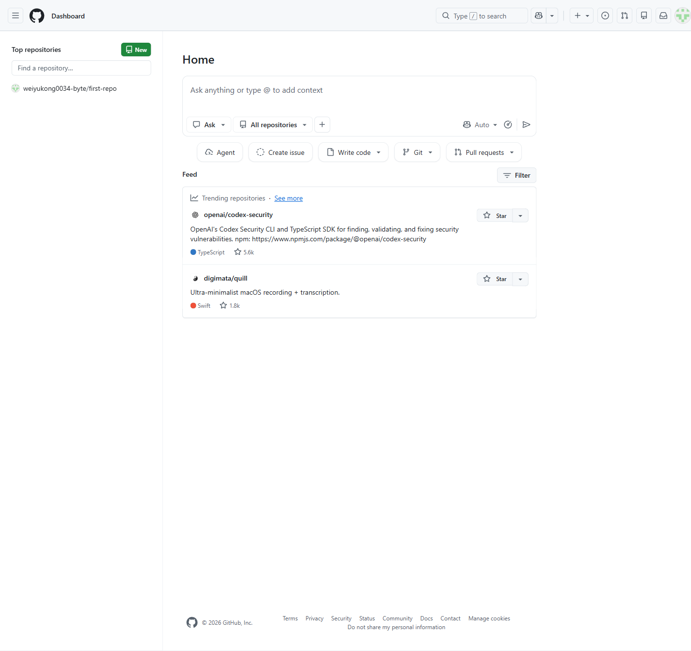

**Type:** ATOMIC
**Dependencies:** REQ-1-1-2

**Scenarios:**

- Sign out and end the current web session
  - **GIVEN:** Authenticated user is in the relevant GitHub context, and the user is authenticated and has access to the relevant account, repository or organization.
  - **WHEN:** The user completes the workflow to sign out and end the current web session.
  - **THEN:** The active session ends, and protected account pages require authentication again.
  - **THEN:** The visible GitHub page or object reflects the final state when it is opened again.

### REQ-1-3 Change the account password

This requirement is performed in the authenticated session, page, or persistent resource context established by REQ-1-1-2 (Sign in with an existing account); it must reuse that context and remain consistent when the prerequisite state changes. An authenticated user changes the account password from account security settings. The user provides the required current and new credential information, and the system validates the change, prevents unauthorized updates and applies the new password to later sign-in attempts.
Screenshot reference: 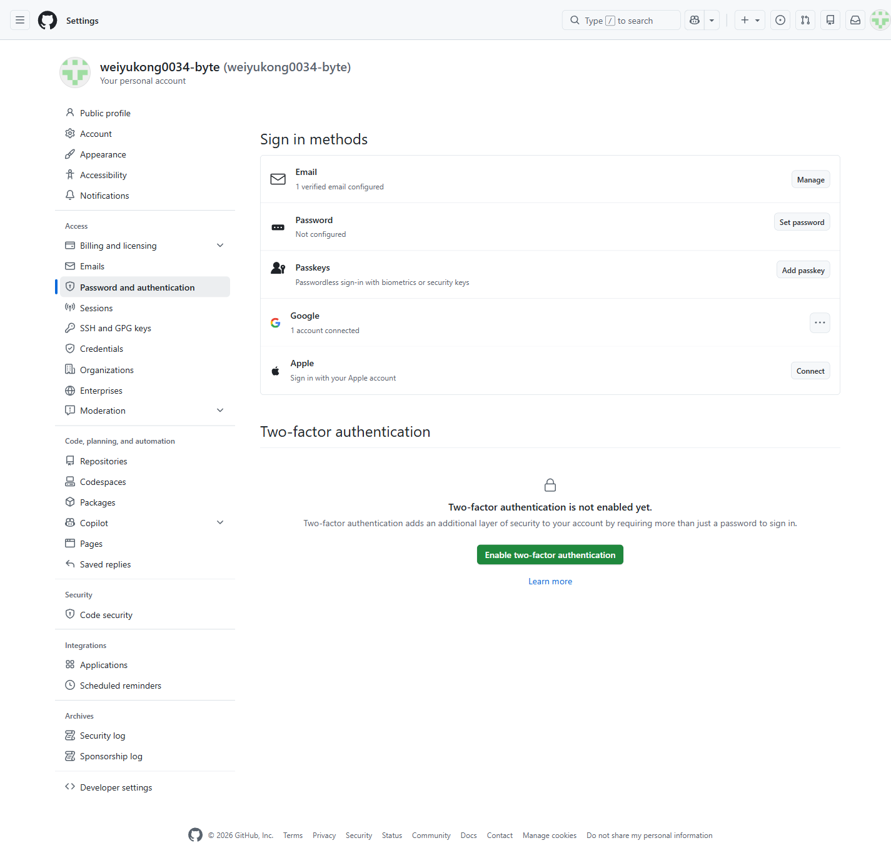

**Type:** ATOMIC
**Dependencies:** REQ-1-1-2

**Scenarios:**

- Change the account password
  - **GIVEN:** Authenticated user is in the relevant GitHub context, and the user is authenticated and has access to the relevant account, repository or organization.
  - **WHEN:** The user completes the workflow to change the account password.
  - **THEN:** The new password is saved and required for later password-based sign-in.
  - **THEN:** The visible GitHub page or object reflects the final state when it is opened again.

## REQ-2 Organization and Governance

Basic organization membership, team and repository access management. This requirement is performed in the authenticated session, page, or persistent resource context established by REQ-1-1-2 (Sign in with an existing account); it must reuse that context and remain consistent when the prerequisite state changes.

**Type:** FOLDER
**Dependencies:** REQ-1-1-2

### REQ-2-1 Organization Identity and Discovery

Core organization creation capability. This requirement is performed in the authenticated session, page, or persistent resource context established by REQ-1-1-2 (Sign in with an existing account); it must reuse that context and remain consistent when the prerequisite state changes.

**Type:** FOLDER
**Dependencies:** REQ-1-1-2

#### REQ-2-1-1 Browse organization repositories

A visitor or organization member uses this capability from organization administration or public organization pages. The capability requires that the target public object is available or the user has permission to view it. The user completes the main choices or confirmation steps for browse organization repositories. The system validates eligibility, shows any required warnings or unavailable states, and prevents unauthorized changes. The requested information is displayed with the relevant filters, metadata or status indicators visible to the user.
Screenshot reference: 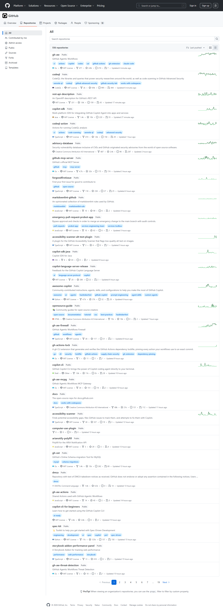

**Type:** ATOMIC
**Dependencies:** None

**Scenarios:**

- Browse organization repositories
  - **GIVEN:** Visitor or organization member is in the relevant GitHub context, and the target public object is available or the user has permission to view it.
  - **WHEN:** The user completes the workflow to browse organization repositories.
  - **THEN:** The requested information is displayed with the relevant filters, metadata or status indicators visible to the user.
  - **THEN:** The visible GitHub page or object reflects the final state when it is opened again.

#### REQ-2-1-2 Create an organization after authentication

An organization owner uses this capability from organization administration or public organization pages. The capability requires that the user is authenticated and has the required organization permission. The user completes the main choices or confirmation steps for create an organization after authentication. The system validates eligibility, shows any required warnings or unavailable states, and prevents unauthorized changes. The new object or relationship is saved and appears in the relevant GitHub context. This requirement is performed in the authenticated session, page, or persistent resource context established by REQ-1-1-2 (Sign in with an existing account); it must reuse that context and remain consistent when the prerequisite state changes.

**Type:** ATOMIC
**Dependencies:** REQ-1-1-2

**Scenarios:**

- Create an organization after authentication
  - **GIVEN:** Organization owner is in the relevant GitHub context, and the user is authenticated and has the required organization permission.
  - **WHEN:** The user completes the workflow to create an organization after authentication.
  - **THEN:** The new object or relationship is saved and appears in the relevant GitHub context.
  - **THEN:** The visible GitHub page or object reflects the final state when it is opened again.

### REQ-2-2 Team and Membership Management

Capabilities for creating teams, inviting members, removing members and organizing access. This requirement is performed in the authenticated session, page, or persistent resource context established by REQ-2-1-2 (Create an organization after authentication); it must reuse that context and remain consistent when the prerequisite state changes.

**Type:** FOLDER
**Dependencies:** REQ-2-1-2

#### REQ-2-2-1 Create an organization team

An organization owner uses this capability from organization administration or public organization pages. The capability requires that the user is authenticated and has the required organization permission. The user completes the main choices or confirmation steps for create an organization team. The system validates eligibility, shows any required warnings or unavailable states, and prevents unauthorized changes. The new object or relationship is saved and appears in the relevant GitHub context. This requirement is performed in the authenticated session, page, or persistent resource context established by REQ-2-1-2 (Create an organization after authentication); it must reuse that context and remain consistent when the prerequisite state changes.

**Type:** ATOMIC
**Dependencies:** REQ-2-1-2

**Scenarios:**

- Create an organization team
  - **GIVEN:** Organization owner is in the relevant GitHub context, and the user is authenticated and has the required organization permission.
  - **WHEN:** The user completes the workflow to create an organization team.
  - **THEN:** The new object or relationship is saved and appears in the relevant GitHub context.
  - **THEN:** The visible GitHub page or object reflects the final state when it is opened again.

#### REQ-2-2-2 Manage organization team membership and hierarchy

A visitor or organization member uses this capability from organization administration or public organization pages. The capability requires that the user is authenticated and has access to the relevant account, repository or organization. The user completes the main choices or confirmation steps for manage organization team membership and hierarchy. The system validates eligibility, shows any required warnings or unavailable states, and prevents unauthorized changes. The system shows an observable result and preserves the changed state for later use. This requirement is performed in the authenticated session, page, or persistent resource context established by REQ-2-2-1 (Create an organization team); it must reuse that context and remain consistent when the prerequisite state changes.

**Type:** ATOMIC
**Dependencies:** REQ-2-2-1

**Scenarios:**

- Manage organization team membership and hierarchy
  - **GIVEN:** Visitor or organization member is in the relevant GitHub context, and the user is authenticated and has access to the relevant account, repository or organization.
  - **WHEN:** The user completes the workflow to manage organization team membership and hierarchy.
  - **THEN:** The system shows an observable result and preserves the changed state for later use.
  - **THEN:** The visible GitHub page or object reflects the final state when it is opened again.

#### REQ-2-2-3 Invite a user to an organization

An organization owner uses this capability from organization administration or public organization pages. The capability requires that the user is authenticated and has the required organization permission. The user completes the main choices or confirmation steps for invite a user to an organization. The system validates eligibility, shows any required warnings or unavailable states, and prevents unauthorized changes. The system shows an observable result and preserves the changed state for later use. This requirement is performed in the authenticated session, page, or persistent resource context established by REQ-2-1-2 (Create an organization after authentication); it must reuse that context and remain consistent when the prerequisite state changes.

**Type:** ATOMIC
**Dependencies:** REQ-2-1-2

**Scenarios:**

- Invite a user to an organization
  - **GIVEN:** Organization owner is in the relevant GitHub context, and the user is authenticated and has the required organization permission.
  - **WHEN:** The user completes the workflow to invite a user to an organization.
  - **THEN:** The system shows an observable result and preserves the changed state for later use.
  - **THEN:** The visible GitHub page or object reflects the final state when it is opened again.

#### REQ-2-2-4 Remove a member from an organization

An organization owner uses this capability from organization administration or public organization pages. The capability requires that the user is authenticated and has the required organization permission. The user completes the main choices or confirmation steps for remove a member from an organization. The system validates eligibility, shows any required warnings or unavailable states, and prevents unauthorized changes. The selected object or permission is removed after confirmation, and later views reflect the removal. This requirement is performed in the authenticated session, page, or persistent resource context established by REQ-2-1-2 (Create an organization after authentication); it must reuse that context and remain consistent when the prerequisite state changes.

**Type:** ATOMIC
**Dependencies:** REQ-2-1-2

**Scenarios:**

- Remove a member from an organization
  - **GIVEN:** Organization owner is in the relevant GitHub context, and the user is authenticated and has the required organization permission.
  - **WHEN:** The user completes the workflow to remove a member from an organization.
  - **THEN:** The selected object or permission is removed after confirmation, and later views reflect the removal.
  - **THEN:** The visible GitHub page or object reflects the final state when it is opened again.

### REQ-2-3 Grant repository access to people and teams

An organization owner or repository administrator grants repository access to people or teams and selects the basic role that defines what each participant can do. The system applies the permission assignment, prevents unauthorized role changes and allows members to access the repository according to the granted role. This requirement is performed in the authenticated session, page, or persistent resource context established by REQ-2-1-2 (Create an organization after authentication), REQ-2-2-1 (Create an organization team); it must reuse that context and remain consistent when the prerequisite state changes.

**Type:** ATOMIC
**Dependencies:** REQ-2-1-2, REQ-2-2-1

**Scenarios:**

- Grant repository access to people and teams
  - **GIVEN:** The user is in the relevant repository, organization or account context and has the required permission.
  - **WHEN:** The user completes the workflow to grant repository access to people and teams.
  - **THEN:** The system applies the permission assignment, and members can access the repository according to the granted role.
  - **THEN:** The visible state remains consistent when the object is opened again.

## REQ-3 Repository Asset Management

Capabilities for locating, creating, opening and configuring repositories.

**Type:** FOLDER
**Dependencies:** None

### REQ-3-1 Search and locate repositories

A visitor or authenticated user searches for repositories they are allowed to view. The system accepts a search query, applies repository-oriented filtering or scoping, and displays matching repositories with enough metadata for the user to open the intended repository.
Screenshot reference: 

**Type:** ATOMIC
**Dependencies:** None

**Scenarios:**

- Search repositories, code, issues, pull requests and users
  - **GIVEN:** Repository collaborator is in the relevant GitHub context, and the target public object is available or the user has permission to view it.
  - **WHEN:** The user completes the workflow to search repositories, code, issues, pull requests and users.
  - **THEN:** Matching repositories are displayed with enough metadata for the user to choose and open the intended repository.
  - **THEN:** The visible GitHub page or object reflects the final state when it is opened again.

### REQ-3-2 Repository Creation and Distribution

Core repository creation capability. This requirement is performed in the authenticated session, page, or persistent resource context established by REQ-1-1-2 (Sign in with an existing account); it must reuse that context and remain consistent when the prerequisite state changes.

**Type:** FOLDER
**Dependencies:** REQ-1-1-2

#### REQ-3-2-1 Create a repository with owner, visibility and initialization options

This requirement is performed in the authenticated session, page, or persistent resource context established by REQ-1-1-2 (Sign in with an existing account); it must reuse that context and remain consistent when the prerequisite state changes. An authorized administrator uses this capability from repository pages. The capability requires that the user is authenticated and has administrator permission for the target repository. The user completes the main choices or confirmation steps for create a repository with owner, visibility and initialization options. The system validates eligibility, shows any required warnings or unavailable states, and prevents unauthorized changes. The new object or relationship is saved and appears in the relevant GitHub context.
Screenshot reference: 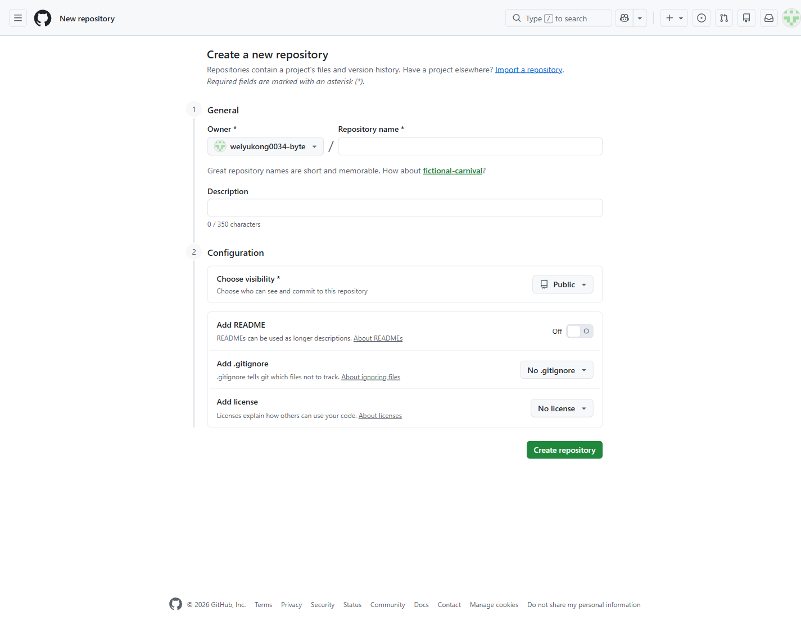

**Type:** ATOMIC
**Dependencies:** REQ-1-1-2

**Scenarios:**

- Create a repository with owner, visibility and initialization options
  - **GIVEN:** Authorized administrator is in the relevant GitHub context, and the user is authenticated and has administrator permission for the target repository.
  - **WHEN:** The user completes the workflow to create a repository with owner, visibility and initialization options.
  - **THEN:** The new object or relationship is saved and appears in the relevant GitHub context.
  - **THEN:** The visible GitHub page or object reflects the final state when it is opened again.

#### REQ-3-2-2 Fork a repository into another namespace

This requirement is performed in the authenticated session, page, or persistent resource context established by REQ-3-3 (View a public repository overview), REQ-1-1-2 (Sign in with an existing account); it must reuse that context and remain consistent when the prerequisite state changes. An authenticated user uses this capability from repository pages. The capability requires that the user is authenticated and has access to the relevant account, repository or organization. The user completes the main choices or confirmation steps for fork a repository into another namespace. The system validates eligibility, shows any required warnings or unavailable states, and prevents unauthorized changes. A new fork is created under the selected owner and links back to the source repository.
Screenshot reference: 

**Type:** ATOMIC
**Dependencies:** REQ-3-3, REQ-1-1-2

**Scenarios:**

- Fork a repository into another namespace
  - **GIVEN:** Authenticated user is in the relevant GitHub context, and the user is authenticated and has access to the relevant account, repository or organization.
  - **WHEN:** The user completes the workflow to fork a repository into another namespace.
  - **THEN:** A new fork is created under the selected owner and links back to the source repository.
  - **THEN:** The visible GitHub page or object reflects the final state when it is opened again.

#### REQ-3-2-3 Copy a repository clone URL

This requirement is performed in the authenticated session, page, or persistent resource context established by REQ-3-3 (View a public repository overview); it must reuse that context and remain consistent when the prerequisite state changes. A visitor or authenticated user uses this capability from repository pages. The capability requires that the target public object is available or the user has permission to view it. The user completes the main choices or confirmation steps for copy a repository clone url. The system validates eligibility, shows any required warnings or unavailable states, and prevents unauthorized changes. The selected repository access value is available for the user to paste into their local tooling.
Screenshot reference: 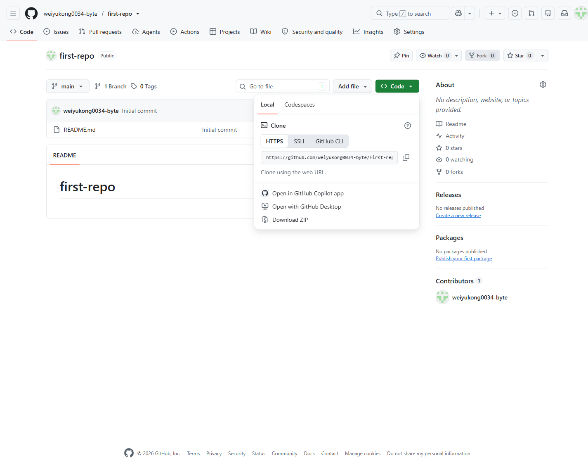

**Type:** ATOMIC
**Dependencies:** REQ-3-3

**Scenarios:**

- Copy a repository clone URL
  - **GIVEN:** Visitor or authenticated user is in the relevant GitHub context, and the target public object is available or the user has permission to view it.
  - **WHEN:** The user completes the workflow to copy a repository clone url.
  - **THEN:** The selected repository access value is available for the user to paste into their local tooling.
  - **THEN:** The visible GitHub page or object reflects the final state when it is opened again.

### REQ-3-3 View a public repository overview

A visitor or authorized user opens a repository overview to confirm the repository identity, visibility, description, primary metadata and available content. The overview provides the main entry point for browsing files, reviewing repository context and beginning collaboration.
Screenshot reference: 

**Type:** ATOMIC
**Dependencies:** None

**Scenarios:**

- View a public repository overview
  - **GIVEN:** The user is in the relevant repository, organization or account context and has the required permission.
  - **WHEN:** The user completes the workflow to view a public repository overview.
  - **THEN:** The overview provides the entry point for browsing files and beginning collaboration.
  - **THEN:** The visible state remains consistent when the object is opened again.

### REQ-3-4 Change repository visibility with permission checks

This requirement is performed in the authenticated session, page, or persistent resource context established by REQ-3-3 (View a public repository overview), REQ-1-1-2 (Sign in with an existing account); it must reuse that context and remain consistent when the prerequisite state changes. A repository administrator changes the repository visibility after reviewing the effect on access. The system blocks unauthorized changes, applies the selected visibility and enforces the updated access rules when users open the repository later.
Screenshot reference: 

**Type:** ATOMIC
**Dependencies:** REQ-3-3, REQ-1-1-2

**Scenarios:**

- Change repository visibility with permission checks
  - **GIVEN:** The user is in the relevant repository, organization or account context and has the required permission.
  - **WHEN:** The user completes the workflow to change repository visibility with permission checks.
  - **THEN:** The system prevents unauthorized changes and applies the updated visibility to later repository access.
  - **THEN:** The visible state remains consistent when the object is opened again.

## REQ-4 Code and Version Control

Core file browsing, branch, commit history and web-based file change capabilities. This requirement is performed in the authenticated session, page, or persistent resource context established by REQ-3-3 (View a public repository overview); it must reuse that context and remain consistent when the prerequisite state changes.

**Type:** FOLDER
**Dependencies:** REQ-3-3

### REQ-4-1 Browse repository files and directories

This requirement is performed in the authenticated session, page, or persistent resource context established by REQ-3-3 (View a public repository overview); it must reuse that context and remain consistent when the prerequisite state changes. A repository participant browses folders and files on a selected branch, opens nested directories and views file content with enough metadata to understand the current repository state.
Screenshot reference: 

**Type:** ATOMIC
**Dependencies:** REQ-3-3

**Scenarios:**

- Browse repository files and directories
  - **GIVEN:** The user is in the relevant repository, organization or account context and has the required permission.
  - **WHEN:** The user completes the workflow to browse repository files and directories.
  - **THEN:** The selected branch shows its folders, files, nested paths and readable file content.
  - **THEN:** The visible state remains consistent when the object is opened again.

### REQ-4-2 Commit History and Code Search

Core commit history and difference review capabilities. This requirement is performed in the authenticated session, page, or persistent resource context established by REQ-4-1 (Browse repository files and directories); it must reuse that context and remain consistent when the prerequisite state changes.

**Type:** FOLDER
**Dependencies:** REQ-4-1

#### REQ-4-2-1 Review repository commit history

This requirement is performed in the authenticated session, page, or persistent resource context established by REQ-4-1 (Browse repository files and directories); it must reuse that context and remain consistent when the prerequisite state changes. A repository participant reviews commit history for a branch or file context to understand recent changes and the people who made them.
Screenshot reference: 

**Type:** ATOMIC
**Dependencies:** REQ-4-1

**Scenarios:**

- Review repository commit history
  - **GIVEN:** The user is in the relevant repository, organization or account context and has the required permission.
  - **WHEN:** The user completes the workflow to review repository commit history.
  - **THEN:** A repository participant reviews commit history for a branch or file context to understand recent changes and the people who made them.
  - **THEN:** The visible state remains consistent when the object is opened again.

#### REQ-4-2-2 Inspect commit and revision differences

This requirement is performed in the authenticated session, page, or persistent resource context established by REQ-4-2-1 (Review repository commit history); it must reuse that context and remain consistent when the prerequisite state changes. A repository participant compares commits or revisions and inspects changed files so that code changes can be reviewed before further work or a pull request.
Screenshot reference: 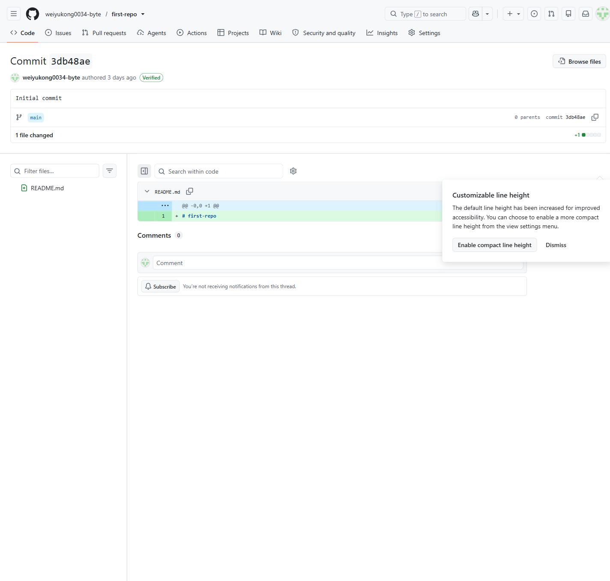

**Type:** ATOMIC
**Dependencies:** REQ-4-2-1

**Scenarios:**

- Inspect commit and revision differences
  - **GIVEN:** The user is in the relevant repository, organization or account context and has the required permission.
  - **WHEN:** The user completes the workflow to inspect commit and revision differences.
  - **THEN:** A repository participant compares commits or revisions and inspects changed files so that code changes can be reviewed before further work or a pull request.
  - **THEN:** The visible state remains consistent when the object is opened again.

#### REQ-4-2-3 Search code within a repository scope

This requirement is performed in the authenticated session, page, or persistent resource context established by REQ-4-1 (Browse repository files and directories); it must reuse that context and remain consistent when the prerequisite state changes. A visitor or authenticated user uses this capability from repository code and version-control pages. The capability requires that the target public object is available or the user has permission to view it. The user completes the main choices or confirmation steps for search code within a repository scope. The system validates eligibility, shows any required warnings or unavailable states, and prevents unauthorized changes. The requested information is displayed with the relevant filters, metadata or status indicators visible to the user.
Screenshot reference: 

**Type:** ATOMIC
**Dependencies:** REQ-4-1

**Scenarios:**

- Search code within a repository scope
  - **GIVEN:** Visitor or authenticated user is in the relevant GitHub context, and the target public object is available or the user has permission to view it.
  - **WHEN:** The user completes the workflow to search code within a repository scope.
  - **THEN:** The requested information is displayed with the relevant filters, metadata or status indicators visible to the user.
  - **THEN:** The visible GitHub page or object reflects the final state when it is opened again.

### REQ-4-3 Branch and Tag Management

Core branch listing, switching and creation capabilities. This requirement is performed in the authenticated session, page, or persistent resource context established by REQ-4-1 (Browse repository files and directories); it must reuse that context and remain consistent when the prerequisite state changes.

**Type:** FOLDER
**Dependencies:** REQ-4-1

#### REQ-4-3-1 List and switch repository branches

This requirement is performed in the authenticated session, page, or persistent resource context established by REQ-4-1 (Browse repository files and directories); it must reuse that context and remain consistent when the prerequisite state changes. A repository participant lists available branches, identifies the active branch and switches repository context to another branch for browsing or editing.
Screenshot reference: 

**Type:** ATOMIC
**Dependencies:** REQ-4-1

**Scenarios:**

- List and switch repository branches
  - **GIVEN:** The user is in the relevant repository, organization or account context and has the required permission.
  - **WHEN:** The user completes the workflow to list and switch repository branches.
  - **THEN:** A repository participant lists available branches, identifies the active branch and switches repository context to another branch for browsing or editing.
  - **THEN:** The visible state remains consistent when the object is opened again.

#### REQ-4-3-2 Create a branch from an existing revision

This requirement is performed in the authenticated session, page, or persistent resource context established by REQ-4-3-1 (List and switch repository branches), REQ-1-1-2 (Sign in with an existing account); it must reuse that context and remain consistent when the prerequisite state changes. An authenticated user uses this capability from repository code and version-control pages. The capability requires that the user is authenticated and has the required repository collaboration permission. The user completes the main choices or confirmation steps for create a branch from an existing revision. The system validates eligibility, shows any required warnings or unavailable states, and prevents unauthorized changes. The new object or relationship is saved and appears in the relevant GitHub context.
Screenshot reference: 

**Type:** ATOMIC
**Dependencies:** REQ-4-3-1, REQ-1-1-2

**Scenarios:**

- Create a branch from an existing revision
  - **GIVEN:** Authenticated user is in the relevant GitHub context, and the user is authenticated and has the required repository collaboration permission.
  - **WHEN:** The user completes the workflow to create a branch from an existing revision.
  - **THEN:** The new object or relationship is saved and appears in the relevant GitHub context.
  - **THEN:** The visible GitHub page or object reflects the final state when it is opened again.

#### REQ-4-3-3 Change the repository default branch

This requirement is performed in the authenticated session, page, or persistent resource context established by REQ-4-3-1 (List and switch repository branches), REQ-1-1-2 (Sign in with an existing account); it must reuse that context and remain consistent when the prerequisite state changes. An authenticated user uses this capability from repository code and version-control pages. The capability requires that the user is authenticated and has the required repository collaboration permission. The user completes the main choices or confirmation steps for change the repository default branch. The system validates eligibility, shows any required warnings or unavailable states, and prevents unauthorized changes. The updated configuration, relationship or state is saved and remains effective when the object is reopened.
Screenshot reference: 

**Type:** ATOMIC
**Dependencies:** REQ-4-3-1, REQ-1-1-2

**Scenarios:**

- Change the repository default branch
  - **GIVEN:** Authenticated user is in the relevant GitHub context, and the user is authenticated and has the required repository collaboration permission.
  - **WHEN:** The user completes the workflow to change the repository default branch.
  - **THEN:** The updated configuration, relationship or state is saved and remains effective when the object is reopened.
  - **THEN:** The visible GitHub page or object reflects the final state when it is opened again.

### REQ-4-4 Manage repository files through the web interface

This requirement is performed in the authenticated session, page, or persistent resource context established by REQ-4-1 (Browse repository files and directories), REQ-1-1-2 (Sign in with an existing account); it must reuse that context and remain consistent when the prerequisite state changes. A repository contributor creates, edits, uploads, renames or removes repository files from the web interface when they have permission to change the selected branch. The system validates the change and saves the resulting file updates as repository commits.
Screenshot reference: 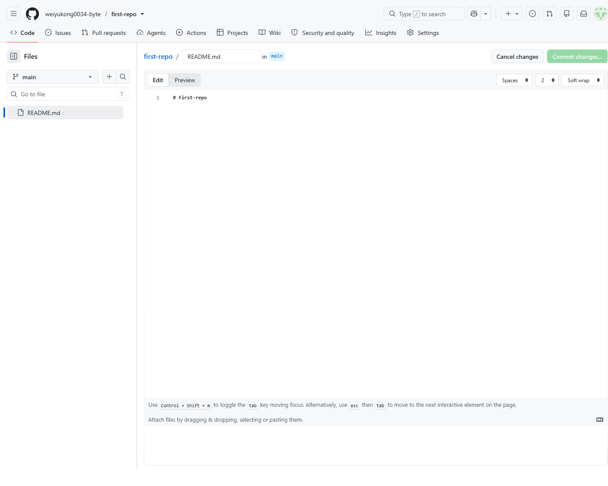

**Type:** ATOMIC
**Dependencies:** REQ-4-1, REQ-1-1-2

**Scenarios:**

- Manage repository files through the web interface
  - **GIVEN:** The user is in the relevant repository, organization or account context and has the required permission.
  - **WHEN:** The user completes the workflow to manage repository files through the web interface.
  - **THEN:** The system saves the resulting file changes as repository commits.
  - **THEN:** The visible state remains consistent when the object is opened again.

## REQ-5 Work Planning and Issue Management

Core issue discovery, discussion, metadata and lifecycle capabilities. This requirement is performed in the authenticated session, page, or persistent resource context established by REQ-3-3 (View a public repository overview); it must reuse that context and remain consistent when the prerequisite state changes.

**Type:** FOLDER
**Dependencies:** REQ-3-3

### REQ-5-1 Issue Discovery and Detail

Capabilities for listing, filtering and reading issues. This requirement is performed in the authenticated session, page, or persistent resource context established by REQ-3-3 (View a public repository overview); it must reuse that context and remain consistent when the prerequisite state changes.

**Type:** FOLDER
**Dependencies:** REQ-3-3

#### REQ-5-1-1 List and filter repository issues

This requirement is performed in the authenticated session, page, or persistent resource context established by REQ-3-3 (View a public repository overview); it must reuse that context and remain consistent when the prerequisite state changes. A repository participant lists issues, filters by open or closed state, searches by issue metadata and opens the relevant work item list for triage.
Screenshot reference: 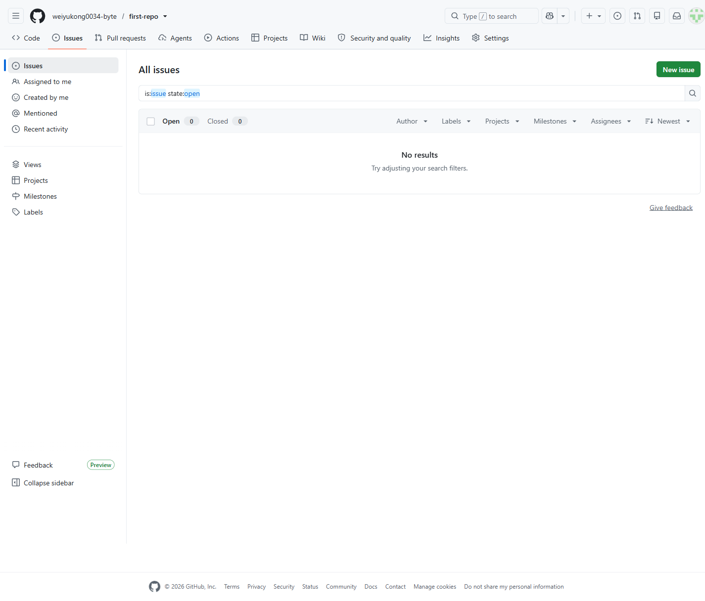

**Type:** ATOMIC
**Dependencies:** REQ-3-3

**Scenarios:**

- List and filter repository issues
  - **GIVEN:** The user is in the relevant repository, organization or account context and has the required permission.
  - **WHEN:** The user completes the workflow to list and filter repository issues.
  - **THEN:** A repository participant lists issues, filters by open or closed state, searches by issue metadata and opens the relevant work item list for triage.
  - **THEN:** The visible state remains consistent when the object is opened again.

#### REQ-5-1-2 View an issue and its discussion

A repository participant opens an issue to read its title, description, status, metadata, comments and activity timeline before deciding what action to take. This requirement is performed in the authenticated session, page, or persistent resource context established by REQ-5-1-1 (List and filter repository issues); it must reuse that context and remain consistent when the prerequisite state changes.

**Type:** ATOMIC
**Dependencies:** REQ-5-1-1

**Scenarios:**

- View an issue and its discussion
  - **GIVEN:** The user is in the relevant repository, organization or account context and has the required permission.
  - **WHEN:** The user completes the workflow to view an issue and its discussion.
  - **THEN:** A repository participant opens an issue to read its title, description, status, metadata, comments and activity timeline before deciding what action to take.
  - **THEN:** The visible state remains consistent when the object is opened again.

### REQ-5-2 Issue Creation and Discussion

Capabilities for creating, editing and discussing issues. This requirement is performed in the authenticated session, page, or persistent resource context established by REQ-5-1-2 (View an issue and its discussion); it must reuse that context and remain consistent when the prerequisite state changes.

**Type:** FOLDER
**Dependencies:** REQ-5-1-2

#### REQ-5-2-1 Create a repository issue

This requirement is performed in the authenticated session, page, or persistent resource context established by REQ-3-3 (View a public repository overview), REQ-1-1-2 (Sign in with an existing account); it must reuse that context and remain consistent when the prerequisite state changes. An authenticated user uses this capability from repository planning and issue management pages. The capability requires that the user is authenticated and has access to the relevant account, repository or organization. The user completes the main choices or confirmation steps for create an issue from repository, comment, code, discussion or project context. The system validates eligibility, shows any required warnings or unavailable states, and prevents unauthorized changes. The new object or relationship is saved and appears in the relevant GitHub context.
Screenshot reference: 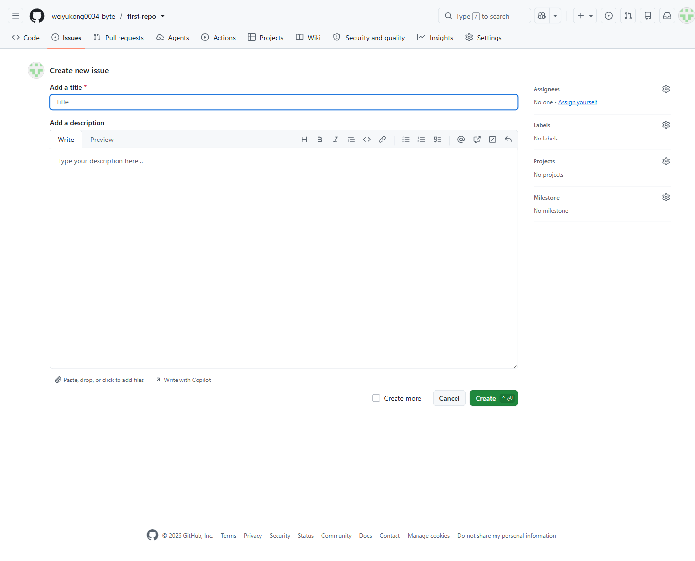

**Type:** ATOMIC
**Dependencies:** REQ-3-3, REQ-1-1-2

**Scenarios:**

- Create an issue from repository, comment, code, discussion or project context
  - **GIVEN:** Authenticated user is in the relevant GitHub context, and the user is authenticated and has access to the relevant account, repository or organization.
  - **WHEN:** The user completes the workflow to create an issue from repository, comment, code, discussion or project context.
  - **THEN:** The new object or relationship is saved and appears in the relevant GitHub context.
  - **THEN:** The visible GitHub page or object reflects the final state when it is opened again.

#### REQ-5-2-2 Edit an issue title and description

An authenticated user uses this capability from repository planning and issue management pages. The capability requires that the user is authenticated and has access to the relevant account, repository or organization. The user completes the main choices or confirmation steps for edit an issue title and description. The system validates eligibility, shows any required warnings or unavailable states, and prevents unauthorized changes. The system shows an observable result and preserves the changed state for later use. This requirement is performed in the authenticated session, page, or persistent resource context established by REQ-5-1-2 (View an issue and its discussion); it must reuse that context and remain consistent when the prerequisite state changes.

**Type:** ATOMIC
**Dependencies:** REQ-5-1-2

**Scenarios:**

- Edit an issue title and description
  - **GIVEN:** Authenticated user is in the relevant GitHub context, and the user is authenticated and has access to the relevant account, repository or organization.
  - **WHEN:** The user completes the workflow to edit an issue title and description.
  - **THEN:** The system shows an observable result and preserves the changed state for later use.
  - **THEN:** The visible GitHub page or object reflects the final state when it is opened again.

#### REQ-5-2-3 Comment on an issue discussion

An authenticated user uses this capability from repository planning and issue management pages. The capability requires that the user is authenticated and has access to the relevant account, repository or organization. The user completes the main choices or confirmation steps for comment on and react to an issue discussion. The system validates eligibility, shows any required warnings or unavailable states, and prevents unauthorized changes. The system shows an observable result and preserves the changed state for later use. This requirement is performed in the authenticated session, page, or persistent resource context established by REQ-5-1-2 (View an issue and its discussion), REQ-1-1-2 (Sign in with an existing account); it must reuse that context and remain consistent when the prerequisite state changes.

**Type:** ATOMIC
**Dependencies:** REQ-5-1-2, REQ-1-1-2

**Scenarios:**

- Comment on and react to an issue discussion
  - **GIVEN:** Authenticated user is in the relevant GitHub context, and the user is authenticated and has access to the relevant account, repository or organization.
  - **WHEN:** The user completes the workflow to comment on and react to an issue discussion.
  - **THEN:** The system shows an observable result and preserves the changed state for later use.
  - **THEN:** The visible GitHub page or object reflects the final state when it is opened again.

### REQ-5-3 Issue Metadata and Classification

Core issue assignment and label categorization capabilities. This requirement is performed in the authenticated session, page, or persistent resource context established by REQ-5-1-2 (View an issue and its discussion); it must reuse that context and remain consistent when the prerequisite state changes.

**Type:** FOLDER
**Dependencies:** REQ-5-1-2

#### REQ-5-3-1 Assign or unassign issue participants

An authenticated user uses this capability from account access pages. The capability requires that the user is authenticated and has access to the relevant account, repository or organization. The user completes the main choices or confirmation steps for assign or unassign issue participants. The system validates eligibility, shows any required warnings or unavailable states, and prevents unauthorized changes. The updated configuration, relationship or state is saved and remains effective when the object is reopened. This requirement is performed in the authenticated session, page, or persistent resource context established by REQ-5-1-2 (View an issue and its discussion); it must reuse that context and remain consistent when the prerequisite state changes.

**Type:** ATOMIC
**Dependencies:** REQ-5-1-2

**Scenarios:**

- Assign or unassign issue participants
  - **GIVEN:** Authenticated user is in the relevant GitHub context, and the user is authenticated and has access to the relevant account, repository or organization.
  - **WHEN:** The user completes the workflow to assign or unassign issue participants.
  - **THEN:** The updated configuration, relationship or state is saved and remains effective when the object is reopened.
  - **THEN:** The visible GitHub page or object reflects the final state when it is opened again.

#### REQ-5-3-2 Apply labels to issues

A repository participant with suitable permission applies or removes labels so that issues can be categorized with the repository's basic label set. This requirement is performed in the authenticated session, page, or persistent resource context established by REQ-5-1-2 (View an issue and its discussion); it must reuse that context and remain consistent when the prerequisite state changes.

**Type:** ATOMIC
**Dependencies:** REQ-5-1-2

**Scenarios:**

- Apply labels to issues
  - **GIVEN:** The user is in the relevant repository, organization or account context and has the required permission.
  - **WHEN:** The user completes the workflow to apply labels to issues.
  - **THEN:** A repository participant with suitable permission applies or removes labels so that issues can be categorized with the repository's basic label set.
  - **THEN:** The visible state remains consistent when the object is opened again.

#### REQ-5-3-3 Group issues and pull requests into milestones

This requirement is performed in the authenticated session, page, or persistent resource context established by REQ-5-1-2 (View an issue and its discussion); it must reuse that context and remain consistent when the prerequisite state changes. A repository collaborator uses this capability from repository planning and issue management pages. The capability requires that the user is authenticated and has the required repository collaboration permission. The user completes the main choices or confirmation steps for group issues and pull requests into milestones. The system validates eligibility, shows any required warnings or unavailable states, and prevents unauthorized changes. The system shows an observable result and preserves the changed state for later use.
Screenshot reference: 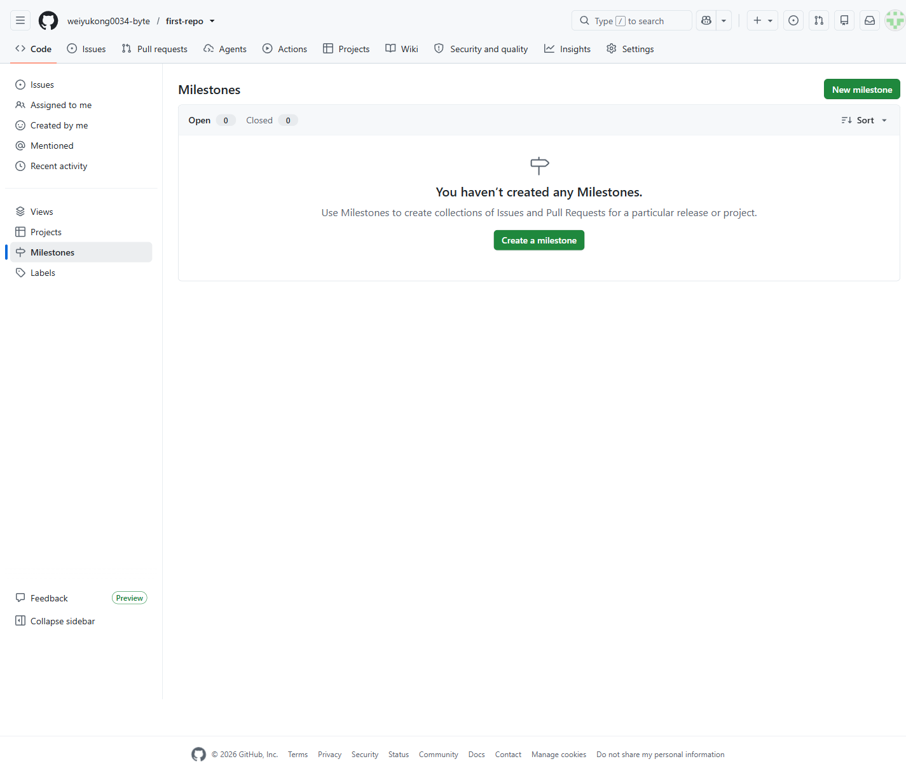

**Type:** ATOMIC
**Dependencies:** REQ-5-1-2

**Scenarios:**

- Group issues and pull requests into milestones
  - **GIVEN:** Repository collaborator is in the relevant GitHub context, and the user is authenticated and has the required repository collaboration permission.
  - **WHEN:** The user completes the workflow to group issues and pull requests into milestones.
  - **THEN:** The system shows an observable result and preserves the changed state for later use.
  - **THEN:** The visible GitHub page or object reflects the final state when it is opened again.

### REQ-5-4 Close or reopen an issue

A repository participant with sufficient permission closes or reopens an issue from the issue detail view. The system validates the requested state change, records the transition in the issue activity history and displays the updated issue state to later viewers. This requirement is performed in the authenticated session, page, or persistent resource context established by REQ-5-1-2 (View an issue and its discussion); it must reuse that context and remain consistent when the prerequisite state changes.

**Type:** ATOMIC
**Dependencies:** REQ-5-1-2

**Scenarios:**

- Close or reopen an issue
  - **GIVEN:** Authenticated user is in the relevant GitHub context, and the user is authenticated and has access to the relevant account, repository or organization.
  - **WHEN:** The user completes the workflow to close or reopen an issue.
  - **THEN:** The issue changes to the selected state and the transition is visible in its activity history.
  - **THEN:** The visible GitHub page or object reflects the final state when it is opened again.

## REQ-6 Change Review and Merge Control

Core pull-request listing, creation, review, merge and closure capabilities. This requirement is performed in the authenticated session, page, or persistent resource context established by REQ-3-3 (View a public repository overview), REQ-4-3 (Branch and Tag Management); it must reuse that context and remain consistent when the prerequisite state changes.

**Type:** FOLDER
**Dependencies:** REQ-3-3, REQ-4-3

### REQ-6-1 Protect branches with review and status-check requirements

This requirement is performed in the authenticated session, page, or persistent resource context established by REQ-4-3-1 (List and switch repository branches), REQ-1-1-2 (Sign in with an existing account); it must reuse that context and remain consistent when the prerequisite state changes. A repository administrator protects important branches by requiring review or status conditions before changes can be integrated. The system saves the protection rule, prevents unauthorized changes to the protected branch and applies the rule during later pull-request merges.
Screenshot reference: 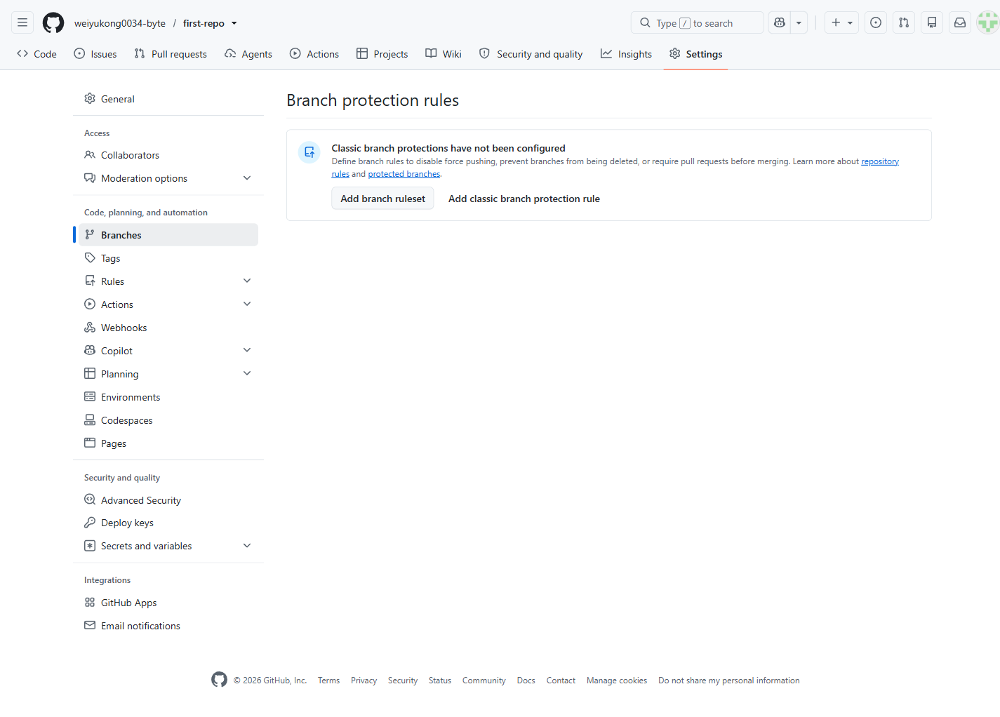

**Type:** ATOMIC
**Dependencies:** REQ-4-3-1, REQ-1-1-2

**Scenarios:**

- Protect branches with review and status-check requirements
  - **GIVEN:** Authenticated user is in the relevant GitHub context, and the target public object is available or the user has permission to view it.
  - **WHEN:** The user completes the workflow to protect branches with review and status-check requirements.
  - **THEN:** The branch protection rule is saved and enforced against later changes to the protected branch.
  - **THEN:** The visible GitHub page or object reflects the final state when it is opened again.

### REQ-6-2 Pull Request Discovery and Creation

Capabilities for finding, comparing and creating pull requests. This requirement is performed in the authenticated session, page, or persistent resource context established by REQ-4-3 (Branch and Tag Management); it must reuse that context and remain consistent when the prerequisite state changes.

**Type:** FOLDER
**Dependencies:** REQ-4-3

#### REQ-6-2-1 List and filter repository pull requests

This requirement is performed in the authenticated session, page, or persistent resource context established by REQ-3-3 (View a public repository overview); it must reuse that context and remain consistent when the prerequisite state changes. A repository participant lists pull requests and filters the list by state or review-relevant metadata to find proposals that need attention.
Screenshot reference: 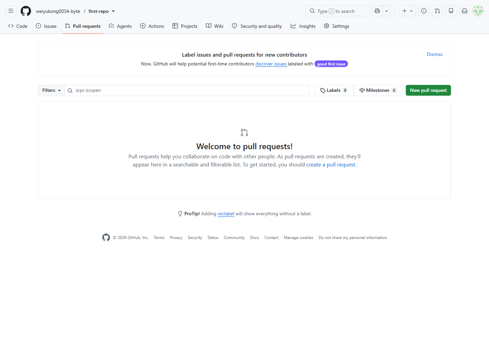

**Type:** ATOMIC
**Dependencies:** REQ-3-3

**Scenarios:**

- List and filter repository pull requests
  - **GIVEN:** The user is in the relevant repository, organization or account context and has the required permission.
  - **WHEN:** The user completes the workflow to list and filter repository pull requests.
  - **THEN:** A repository participant lists pull requests and filters the list by state or review-relevant metadata to find proposals that need attention.
  - **THEN:** The visible state remains consistent when the object is opened again.

#### REQ-6-2-2 Compare branches before opening a pull request

This requirement is performed in the authenticated session, page, or persistent resource context established by REQ-4-3-1 (List and switch repository branches), REQ-1-1-2 (Sign in with an existing account); it must reuse that context and remain consistent when the prerequisite state changes. A repository collaborator uses this capability from repository pull-request pages. The capability requires that the user is authenticated and has the required repository collaboration permission. The user completes the main choices or confirmation steps for compare branches before opening a pull request. The system validates eligibility, shows any required warnings or unavailable states, and prevents unauthorized changes. The system shows an observable result and preserves the changed state for later use.
Screenshot reference: 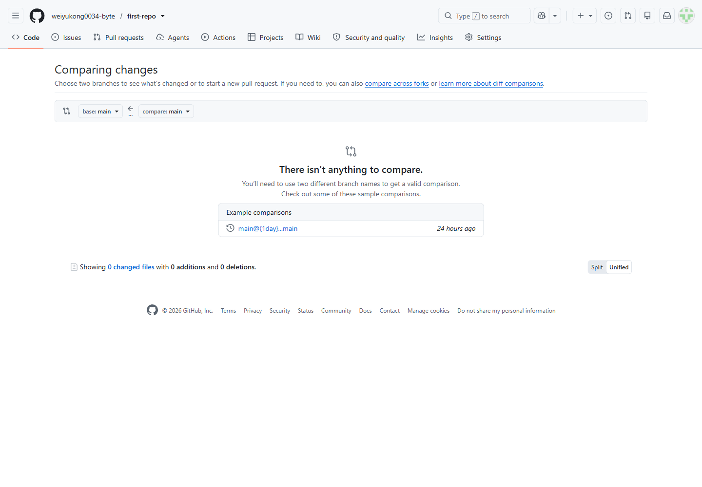

**Type:** ATOMIC
**Dependencies:** REQ-4-3-1, REQ-1-1-2

**Scenarios:**

- Compare branches before opening a pull request
  - **GIVEN:** Repository collaborator is in the relevant GitHub context, and the user is authenticated and has the required repository collaboration permission.
  - **WHEN:** The user completes the workflow to compare branches before opening a pull request.
  - **THEN:** The system shows an observable result and preserves the changed state for later use.
  - **THEN:** The visible GitHub page or object reflects the final state when it is opened again.

#### REQ-6-2-3 Create a pull request from a compare result

A repository collaborator uses this capability from repository pull-request pages. The capability requires that the user is authenticated and has the required repository collaboration permission. The user completes the main choices or confirmation steps for create a pull request from a compare result. The system validates eligibility, shows any required warnings or unavailable states, and prevents unauthorized changes. The new object or relationship is saved and appears in the relevant GitHub context. This requirement is performed in the authenticated session, page, or persistent resource context established by REQ-6-2-2 (Compare branches before opening a pull request); it must reuse that context and remain consistent when the prerequisite state changes.

**Type:** ATOMIC
**Dependencies:** REQ-6-2-2

**Scenarios:**

- Create a pull request from a compare result
  - **GIVEN:** Repository collaborator is in the relevant GitHub context, and the user is authenticated and has the required repository collaboration permission.
  - **WHEN:** The user completes the workflow to create a pull request from a compare result.
  - **THEN:** The new object or relationship is saved and appears in the relevant GitHub context.
  - **THEN:** The visible GitHub page or object reflects the final state when it is opened again.

#### REQ-6-2-4 Create a draft pull request

A repository collaborator uses this capability from repository pull-request pages. The capability requires that the user is authenticated and has the required repository collaboration permission. The user completes the main choices or confirmation steps for create a draft pull request. The system validates eligibility, shows any required warnings or unavailable states, and prevents unauthorized changes. The new object or relationship is saved and appears in the relevant GitHub context. This requirement is performed in the authenticated session, page, or persistent resource context established by REQ-6-2-2 (Compare branches before opening a pull request); it must reuse that context and remain consistent when the prerequisite state changes.

**Type:** ATOMIC
**Dependencies:** REQ-6-2-2

**Scenarios:**

- Create a draft pull request
  - **GIVEN:** Repository collaborator is in the relevant GitHub context, and the user is authenticated and has the required repository collaboration permission.
  - **WHEN:** The user completes the workflow to create a draft pull request.
  - **THEN:** The new object or relationship is saved and appears in the relevant GitHub context.
  - **THEN:** The visible GitHub page or object reflects the final state when it is opened again.

### REQ-6-3 Pull Request Review Workspace

Capabilities for reading, inspecting and reviewing pull requests. This requirement is performed in the authenticated session, page, or persistent resource context established by REQ-6-2-3 (Create a pull request from a compare result); it must reuse that context and remain consistent when the prerequisite state changes.

**Type:** FOLDER
**Dependencies:** REQ-6-2-3

#### REQ-6-3-1 Review a pull request overview and commits

A reviewer opens a pull request to understand its title, branches, conversation, included commits and merge context before reviewing the proposed changes. This requirement is performed in the authenticated session, page, or persistent resource context established by REQ-6-2-3 (Create a pull request from a compare result); it must reuse that context and remain consistent when the prerequisite state changes.

**Type:** ATOMIC
**Dependencies:** REQ-6-2-3

**Scenarios:**

- Review a pull request overview and commits
  - **GIVEN:** The user is in the relevant repository, organization or account context and has the required permission.
  - **WHEN:** The user completes the workflow to review a pull request overview and commits.
  - **THEN:** A reviewer opens a pull request to understand its title, branches, conversation, included commits and merge context before reviewing the proposed changes.
  - **THEN:** The visible state remains consistent when the object is opened again.

#### REQ-6-3-2 Inspect changed files and the aggregate diff

A visitor or authenticated user uses this capability from repository code and version-control pages. The capability requires that the target public object is available or the user has permission to view it. The user completes the main choices or confirmation steps for inspect changed files and the aggregate diff. The system validates eligibility, shows any required warnings or unavailable states, and prevents unauthorized changes. The requested information is displayed with the relevant filters, metadata or status indicators visible to the user. This requirement is performed in the authenticated session, page, or persistent resource context established by REQ-6-3-1 (Review a pull request overview and commits); it must reuse that context and remain consistent when the prerequisite state changes.

**Type:** ATOMIC
**Dependencies:** REQ-6-3-1

**Scenarios:**

- Inspect changed files and the aggregate diff
  - **GIVEN:** Visitor or authenticated user is in the relevant GitHub context, and the target public object is available or the user has permission to view it.
  - **WHEN:** The user completes the workflow to inspect changed files and the aggregate diff.
  - **THEN:** The requested information is displayed with the relevant filters, metadata or status indicators visible to the user.
  - **THEN:** The visible GitHub page or object reflects the final state when it is opened again.

#### REQ-6-3-3 Add review comments to changed lines

An authenticated user uses this capability from repository pull-request pages. The capability requires that the target public object is available or the user has permission to view it. The user completes the main choices or confirmation steps for add review comments to changed lines. The system validates eligibility, shows any required warnings or unavailable states, and prevents unauthorized changes. The system shows an observable result and preserves the changed state for later use. This requirement is performed in the authenticated session, page, or persistent resource context established by REQ-6-3-2 (Inspect changed files and the aggregate diff), REQ-1-1-2 (Sign in with an existing account); it must reuse that context and remain consistent when the prerequisite state changes.

**Type:** ATOMIC
**Dependencies:** REQ-6-3-2, REQ-1-1-2

**Scenarios:**

- Add review comments to changed lines
  - **GIVEN:** Authenticated user is in the relevant GitHub context, and the target public object is available or the user has permission to view it.
  - **WHEN:** The user completes the workflow to add review comments to changed lines.
  - **THEN:** The system shows an observable result and preserves the changed state for later use.
  - **THEN:** The visible GitHub page or object reflects the final state when it is opened again.

#### REQ-6-3-4 Submit a pull-request review

A reviewer requests review, comments on the proposal, approves it or requests changes. The system records the review decision so authors and maintainers can act on it. This requirement is performed in the authenticated session, page, or persistent resource context established by REQ-6-3-1 (Review a pull request overview and commits), REQ-1-1-2 (Sign in with an existing account); it must reuse that context and remain consistent when the prerequisite state changes.

**Type:** ATOMIC
**Dependencies:** REQ-6-3-1, REQ-1-1-2

**Scenarios:**

- Submit a pull-request review
  - **GIVEN:** The user is in the relevant repository, organization or account context and has the required permission.
  - **WHEN:** The user completes the workflow to submit a pull-request review.
  - **THEN:** The system records the review decision so authors and maintainers can act on it.
  - **THEN:** The visible state remains consistent when the object is opened again.

### REQ-6-4 Request or remove pull-request reviewers

A pull-request author or maintainer requests reviewers or removes reviewer requests from a pull request. The system validates repository permissions, updates the review assignment state and shows the current requested reviewers on the pull request. This requirement is performed in the authenticated session, page, or persistent resource context established by REQ-6-2-3 (Create a pull request from a compare result), REQ-1-1-2 (Sign in with an existing account); it must reuse that context and remain consistent when the prerequisite state changes.

**Type:** ATOMIC
**Dependencies:** REQ-6-2-3, REQ-1-1-2

**Scenarios:**

- Request or remove pull-request reviewers
  - **GIVEN:** Authenticated user is in the relevant GitHub context, and the target public object is available or the user has permission to view it.
  - **WHEN:** The user completes the workflow to request or remove pull-request reviewers.
  - **THEN:** The pull request shows the updated reviewer request state.
  - **THEN:** The visible GitHub page or object reflects the final state when it is opened again.

### REQ-6-5 Merge an eligible pull request

An authorized maintainer merges a pull request after the proposal is eligible for integration. The system checks the required permissions and merge conditions, integrates the approved changes into the target branch and updates the pull request to show the merged state. This requirement is performed in the authenticated session, page, or persistent resource context established by REQ-6-3-4 (Submit a pull-request review), REQ-6-1 (Protect branches with review and status-check requirements); it must reuse that context and remain consistent when the prerequisite state changes.

**Type:** ATOMIC
**Dependencies:** REQ-6-3-4, REQ-6-1

**Scenarios:**

- Merge an eligible pull request
  - **GIVEN:** Repository collaborator is in the relevant GitHub context, and the user is authenticated and has the required repository collaboration permission.
  - **WHEN:** The user completes the workflow to merge an eligible pull request.
  - **THEN:** The approved changes are integrated according to the selected merge policy and the pull request shows the resulting state.
  - **THEN:** The visible GitHub page or object reflects the final state when it is opened again.

### REQ-6-6 Close or reopen a pull request without merging

A pull-request author or maintainer closes a pull request without merging when the proposed changes should not proceed, or reopens it when work should continue. The system records the state transition and keeps the pull request discussion and proposed changes available according to repository permissions. This requirement is performed in the authenticated session, page, or persistent resource context established by REQ-6-2-3 (Create a pull request from a compare result), REQ-1-1-2 (Sign in with an existing account); it must reuse that context and remain consistent when the prerequisite state changes.

**Type:** ATOMIC
**Dependencies:** REQ-6-2-3, REQ-1-1-2

**Scenarios:**

- Close or reopen a pull request without merging
  - **GIVEN:** Repository collaborator is in the relevant GitHub context, and the user is authenticated and has the required repository collaboration permission.
  - **WHEN:** The user completes the workflow to close or reopen a pull request without merging.
  - **THEN:** The pull request changes to the selected state and the transition is visible in its activity history.
  - **THEN:** The visible GitHub page or object reflects the final state when it is opened again.
