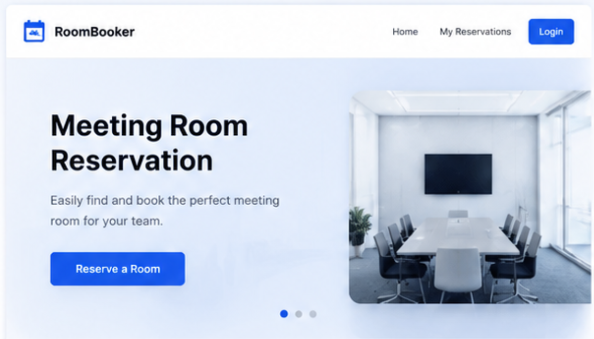
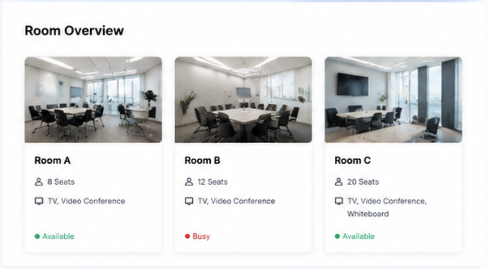
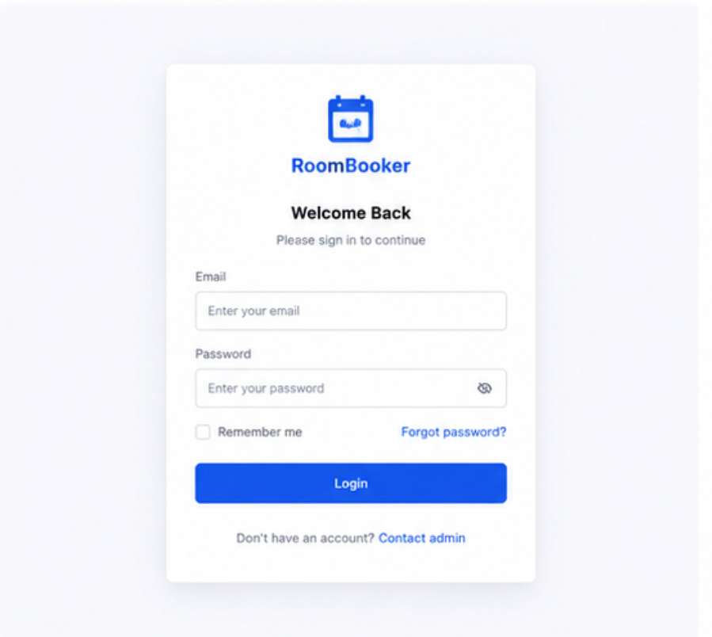
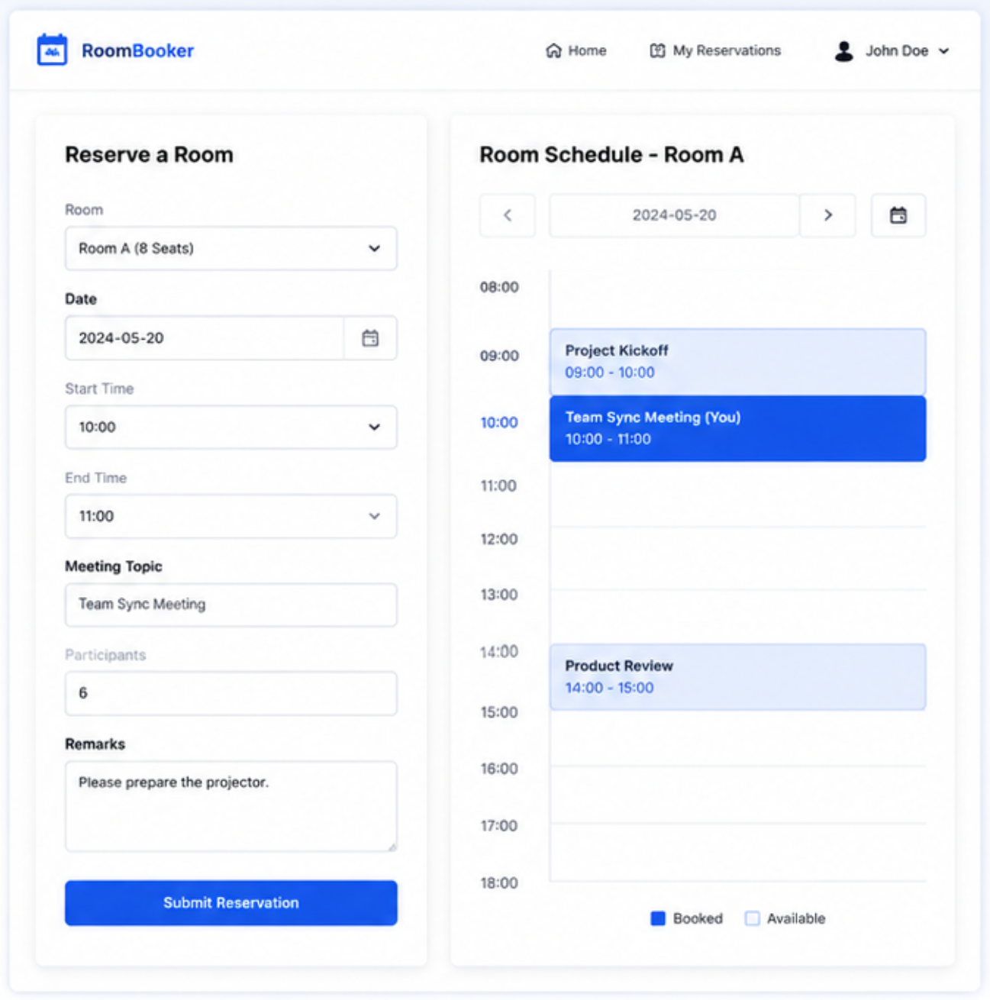
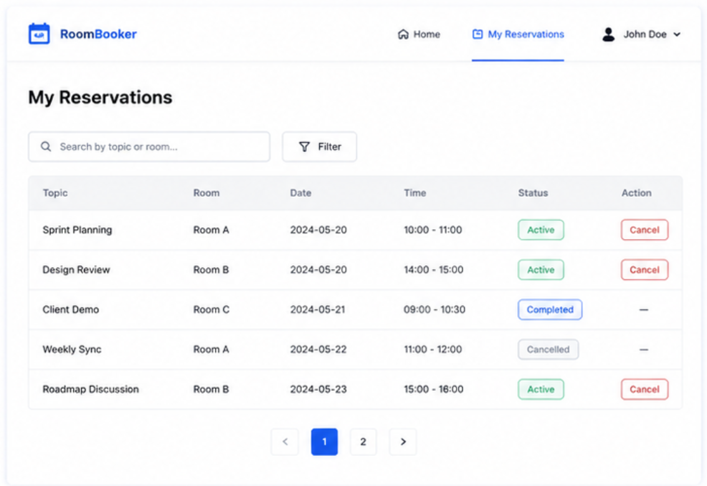

# Meeting Room Reservation System
A small web-based meeting room reservation system that provides home page navigation, user login and logout, meeting room booking, and personal reservation management.

## REQ-1 System Home
The default landing page after the system starts. The top area shows "assets/logo.png" on the left, and "Login" and "My Reservations" on the right. The main area shows a hero banner, a quick room overview section, and a primary action button that leads to the reservation page. 

**Dependencies:** None

### REQ-1.1 Open system home page
Display the home page with the top logo, navigation links, hero banner, room overview section, and the primary "Reserve a room" button. 

**Dependencies:** None

### REQ-1.2 Show room overview cards
Display three room overview cards on the home page for "Room A", "Room B", and "Room C". Each card shows a room image, capacity, equipment summary, and availability status. The room images use "assets/room-a.png", "assets/room-b.png", and "assets/room-c.png". 

**Dependencies:** REQ-1.1

## REQ-2 User Authentication
Allow a user to log in before creating or managing reservations, and allow the user to log out after use.

**Dependencies:** REQ-1

### REQ-2.1 Open login page
Open the login page from the "Login" link in the top-right area of the home page.

**Dependencies:** REQ-1.1

### REQ-2.2 View login form
Display the login form with an input labeled "Email", a password input labeled "Password", and a "LOGIN" button. 

**Dependencies:** REQ-2.1

### REQ-2.3 Submit valid login credentials
Allow the user to log in with a valid email address and password, persist the login state, and navigate back to the home page with the user status updated.

**Dependencies:** REQ-2.2

### REQ-2.4 Block login with invalid credentials
Reject login when the email address does not exist or the password is incorrect, and show the message "Invalid email or password.".

**Dependencies:** REQ-2.2

### REQ-2.5 Log out
Allow the logged-in user to log out from the top-right area, clear the login state, and show the public home page.

**Dependencies:** REQ-2.3

## REQ-3 Meeting Room Reservation
Allow a logged-in user to open the reservation page, inspect room schedule information, and create a reservation for an available room and time slot.

**Dependencies:** REQ-2

### REQ-3.1 Open reservation page
Open the reservation page from the "Reserve a room" button on the home page or from a room overview card.

**Dependencies:** REQ-1.1, REQ-2.3

### REQ-3.2 View reservation form and room schedule
Display the reservation page with a room selector, a date picker, start time and end time selectors, a topic input, a participant count input, a remarks input, a visible schedule panel, and a "Submit Reservation" button. 

**Dependencies:** REQ-3.1

### REQ-3.3 Submit valid reservation information
Allow the user to submit a reservation with a selected room, valid date, valid time range, topic, and participant count, persist the reservation, and show a successful reservation message.

**Dependencies:** REQ-3.2

### REQ-3.4 Block reservation with conflicting time slot
Reject reservation when the selected room already has another reservation that overlaps with the selected time range, and show the message "This room is already reserved for the selected time slot.".

**Dependencies:** REQ-3.2

### REQ-3.5 Block reservation with missing required fields
Reject reservation when the room, date, start time, end time, topic, or participant count is missing, and show the message "Please fill in all required fields.".

**Dependencies:** REQ-3.2

## REQ-4 My Reservations
Allow a logged-in user to view the reservations they created and cancel a future reservation.

**Dependencies:** REQ-2, REQ-3

### REQ-4.1 View my reservation list
Display the "My Reservations" page with a table showing reservation topic, room name, reservation date, time range, status, and operation column. 

**Dependencies:** REQ-2.3, REQ-3.3

### REQ-4.2 Cancel a future reservation
Allow the user to cancel one future reservation from the reservation list, update the reservation status to cancelled, release the time slot, and show a successful cancellation message.

**Dependencies:** REQ-4.1
