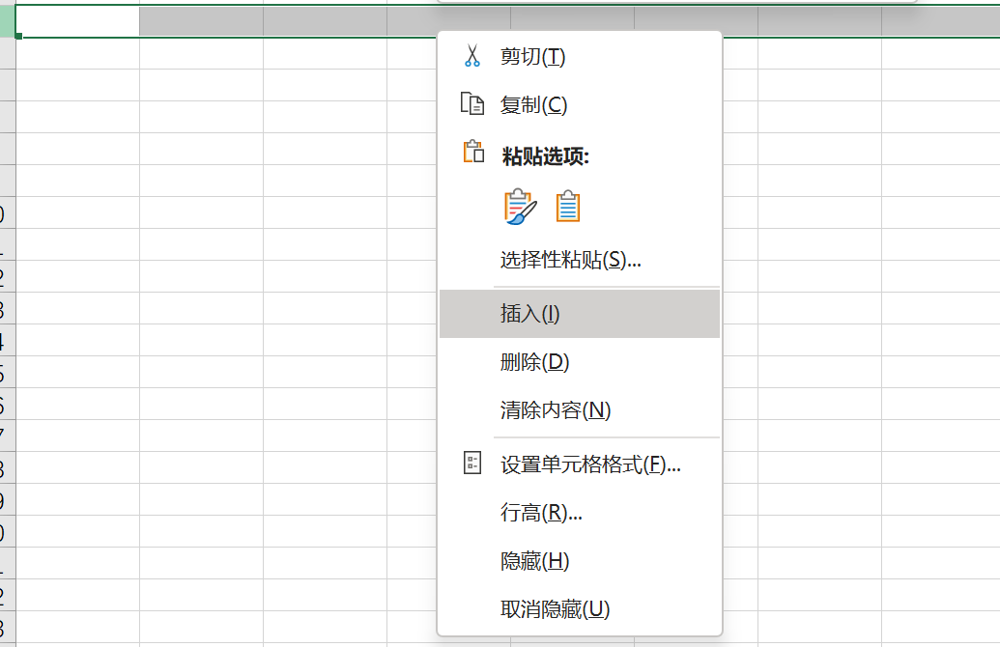
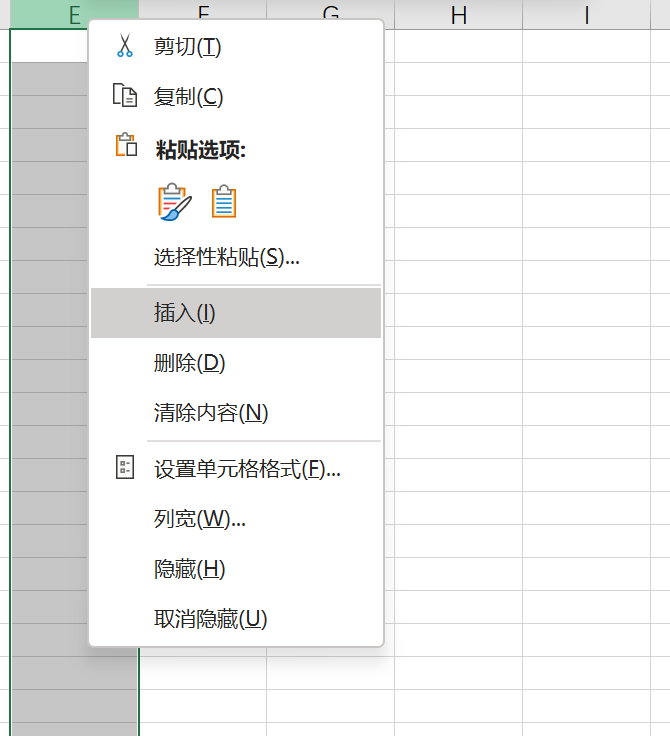
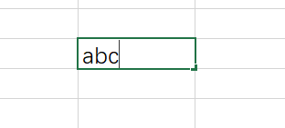

# Online Spreadsheet Data Workspace Core Requirements

A compact online spreadsheet application with an interface inspired by Google Sheets, focused on workbook and worksheet management, grid data editing, formula calculation, sorting and filtering, data validation, and basic pivot analysis. Workbook metadata, worksheet structure, raw cell values and formulas, row and column order, filter configuration, validation rules, and pivot table configuration must be written to persistent storage. When the page is refreshed or a workbook is reopened, the last successfully written data state should be restored. Shared collaboration, historical state restoration, complex visual styling, charts, macro scripts, real-time collaborative cursors, and external office-suite integrations are outside the core scope.

## REQ-1 Workbook Access and Lifecycle

Support managing workbooks in the application, including list viewing, opening, creation, renaming, and CSV import and export. Workbook identifiers, names, last-updated times, and included worksheets must be stored and cannot exist only in the frontend session.

**Type:** FOLDER
**Dependencies:** None

### REQ-1-1 Workbook Navigation

Support viewing and opening available workbooks from the home page.

Screenshot reference:

**Type:** FOLDER
**Dependencies:** None

#### REQ-1-1-1 View and open workbooks

A user views available workbooks on the workbook home page. Each record displays at least the workbook name and last-updated time. After the user selects a record, the system reads workbook metadata, the worksheet list, and the current active worksheet from storage and enters the editing page.

Screenshot reference:

**Type:** ATOMIC
**Dependencies:** None

**Scenarios:**

- Open a workbook
  - **GIVEN:** At least one saved workbook exists.
  - **WHEN:** The user selects the workbook on the home page.
  - **THEN:** The system reads from storage and opens the corresponding editing page and current active worksheet.
  - **THEN:** The workbook name and last-updated time shown on the page match the home-page record.

### REQ-1-2 Workbook Creation and Naming

Support creating blank workbooks and changing workbook names. Creation results and name changes must be written to storage and restored after reopening.

**Type:** FOLDER
**Dependencies:** None

#### REQ-1-2-1 Create a blank workbook

A user creates a blank workbook from the workbook home page. The system generates a workbook identifier, associates it with the application, creates a blank worksheet named Sheet1, records the current active worksheet and A1 selection state, and enters the editing page. The creation operation is complete only after the workbook and default worksheet are successfully written to storage. If the write fails, no incomplete workbook may be left behind.

Screenshot reference:

**Type:** ATOMIC
**Dependencies:** None

**Scenarios:**

- Create and reopen a blank workbook
  - **GIVEN:** The user is on the workbook home page.
  - **WHEN:** The user performs the create blank workbook operation.
  - **THEN:** The system creates a workbook associated with the application and containing Sheet1.
  - **THEN:** The editing page opens Sheet1 and selects A1.
  - **THEN:** After refreshing or reopening, the workbook and default worksheet still exist.

#### REQ-1-2-2 Rename a workbook

A user can change the workbook name on the editing page of the workbook. After trimming leading and trailing spaces, the name must not be empty. The name must be written to storage before the editing page title and workbook home page are updated. If the write fails, the original name is retained and an error is shown. After reopening the workbook, the last successfully saved name should be displayed.

**Type:** ATOMIC
**Dependencies:** None

**Scenarios:**

- Save a valid workbook name
  - **GIVEN:** The user has opened a workbook.
  - **WHEN:** The user enters a non-empty name and confirms.
  - **THEN:** The system writes the new name to storage, and both the editing page and workbook home page display the new name.
  - **THEN:** After reopening the workbook, the new name is still displayed.
- Reject an empty workbook name
  - **GIVEN:** The user has opened the workbook, and the new name is empty after trimming leading and trailing spaces.
  - **WHEN:** The user attempts to save the workbook name.
  - **THEN:** The system rejects the change, displays that the name cannot be empty, and keeps the stored original name.

### REQ-1-3 CSV Data Exchange

Support importing external CSV data completely as a persistent workbook and exporting the current active worksheet as CSV.

**Type:** FOLDER
**Dependencies:** None

#### REQ-1-3-1 Import CSV to create a workbook

A user selects a CSV file from the workbook home page. The system parses data in the original row and column order, preserves empty fields, supports UTF-8 Chinese, English, and numeric text, and creates a new workbook that stores the import result in Sheet1. Workbook metadata, the Sheet1 structure, and all cells should be written to storage as one complete transaction. The first row remains ordinary data and is not automatically removed. If parsing or writing fails, no partially imported workbook may be left behind.

**Type:** ATOMIC
**Dependencies:** None

**Scenarios:**

- Import a valid CSV
  - **GIVEN:** A readable UTF-8 CSV file exists.
  - **WHEN:** The user selects the file and confirms import.
  - **THEN:** The system creates a new workbook, and the cells in Sheet1 correspond to the CSV rows and columns.
  - **THEN:** Empty fields and Chinese content are still preserved after reopening.
- Reject an unparseable CSV
  - **GIVEN:** The selected file cannot be parsed as CSV.
  - **WHEN:** The user confirms import.
  - **THEN:** The system displays an import failure message and does not create a partially populated workbook.

#### REQ-1-3-2 Export the current worksheet as CSV

A user can export the current active worksheet of the workbook. The system generates CSV from the saved worksheet state in the actual row and column order, preserves empty cells, and correctly escapes text containing commas, quotes, or newlines. Formula cells export the current calculated result rather than the formula expression. Export is a read-only operation and must not modify the workbook in storage.

Screenshot reference:

**Type:** ATOMIC
**Dependencies:** None

**Scenarios:**

- Export a saved worksheet
  - **GIVEN:** The workbook is open, and the active worksheet contains text, numbers, empty cells, and formula results.
  - **WHEN:** The user performs the export CSV operation.
  - **THEN:** The system generates a CSV file consistent with the active worksheet’s row and column order.
  - **THEN:** Formula cells write the current results, and the original data remains unchanged after reopening the workbook.

## REQ-2 Worksheets and Grid Structure

Support managing multiple worksheets in one workbook and adjusting row and column structure. Worksheet names, order, active state, row and column structure, and associated data must be persisted as part of the workbook data.

**Type:** FOLDER
**Dependencies:** None

### REQ-2-1 Worksheet Lifecycle

Support creating, switching, renaming, and deleting worksheets, and ensure that data in each worksheet remains independent and is preserved after reopening.

Screenshot reference:

**Type:** FOLDER
**Dependencies:** None

#### REQ-2-1-1 Add a worksheet

A user adds a worksheet from the worksheet tab bar. The system creates a blank worksheet, generates a non-duplicate default name such as Sheet2, updates the worksheet list and current active worksheet, and writes them to storage. Creation is shown as complete only after the write succeeds. Existing worksheets and their data must not change.

**Type:** ATOMIC
**Dependencies:** None

**Scenarios:**

- Create and persist a new worksheet
  - **GIVEN:** The user has opened a workbook.
  - **WHEN:** The user clicks add worksheet.
  - **THEN:** The system adds a blank worksheet with a unique name, writes it to storage, and activates it.
  - **THEN:** After reopening the workbook, the worksheet still exists.

#### REQ-2-1-2 Switch worksheets

After the user clicks another worksheet tab, the system reads the target worksheet's saved grid data, row and column structure, and formulas, then switches the grid, selected cell, and formula bar. The switching process must not modify the data of the previous active worksheet. When returning to the previous worksheet, its last successfully saved state should be restored. The current active worksheet identifier should also be recorded.

**Type:** ATOMIC
**Dependencies:** None

**Scenarios:**

- Preserve each worksheet’s data after switching
  - **GIVEN:** The workbook has at least two worksheets, and the current worksheet has saved data.
  - **WHEN:** The user switches to another worksheet and then returns to the original worksheet.
  - **THEN:** Each tab displays its own data.
  - **THEN:** After returning to the original worksheet, its original data remains unchanged.

#### REQ-2-1-3 Rename a worksheet

A user changes the name from the worksheet tab menu. After trimming leading and trailing spaces, the new name must not be empty and must be unique within the same workbook. The system updates the tab after writing the new name to storage. If writing fails, the name is duplicated, or the name is empty, the original name is retained. After reopening, the last successfully saved name should be displayed.

**Type:** ATOMIC
**Dependencies:** None

**Scenarios:**

- Save a unique worksheet name
  - **GIVEN:** The user has opened a workbook, and the target name is not used by another worksheet.
  - **WHEN:** The user submits the new name.
  - **THEN:** The system saves the name and updates the tab. After reopening the workbook, the name remains.
- Reject a duplicate worksheet name
  - **GIVEN:** Another worksheet in the same workbook already uses the target name.
  - **WHEN:** The user attempts to rename the current worksheet to that name.
  - **THEN:** The system displays a duplicate-name message and keeps the original name.

#### REQ-2-1-4 Delete a worksheet

A user deletes a worksheet after confirmation. The system deletes the worksheet's metadata, row and column structure, cells, formulas, and associated rules from storage, updates the worksheet list, and activates an adjacent worksheet. A workbook must always keep at least one worksheet, so deletion should be rejected when only one worksheet remains. If deletion fails, the page must not pretend that deletion succeeded.

**Type:** ATOMIC
**Dependencies:** None

**Scenarios:**

- Delete the current worksheet from a multi-sheet workbook
  - **GIVEN:** The workbook contains at least two worksheets.
  - **WHEN:** The user confirms deletion of the current worksheet.
  - **THEN:** The system deletes the worksheet and its data from storage and activates another worksheet.
  - **THEN:** After reopening, the deleted worksheet still does not exist.
- Reject deleting the last worksheet
  - **GIVEN:** The workbook has only one worksheet remaining.
  - **WHEN:** The user attempts to delete the worksheet.
  - **THEN:** The system rejects deletion and keeps the worksheet.

### REQ-2-2 Row and Column Structure Management

Support inserting and deleting rows and columns, and consistently write the changed structure, cell positions, formula references, and validation rules to storage.

**Type:** FOLDER
**Dependencies:** None

#### REQ-2-2-1 Insert and delete rows

A user inserts a blank row above or below a target row through the row-number menu, or deletes the target row. On insertion, affected rows shift down as a whole. On deletion, subsequent rows shift up as a whole. The system must save the new row order, cell positions, formula references, and validation rules in one data update. If writing fails, the original structure is restored; the frontend display must not be moved alone.

Screenshot reference:

**Type:** ATOMIC
**Dependencies:** None

**Scenarios:**

- Insert a row and preserve data
  - **GIVEN:** The user is signed in and has opened the target worksheet, and consecutive rows already contain data.
  - **WHEN:** The user inserts a row above the target row.
  - **THEN:** A blank row appears at the target position, existing rows shift down as a whole, and no data is lost.
- Delete a row and reopen
  - **GIVEN:** The user is signed in and has opened the target worksheet.
  - **WHEN:** The user deletes the target row and reopens the workbook.
  - **THEN:** The target row remains deleted, and subsequent rows are displayed in the new order.

#### REQ-2-2-2 Insert and delete columns

A user inserts a blank column to the left or right of a target column through the column-header menu, or deletes the target column. On insertion, affected columns shift right as a whole. On deletion, subsequent columns shift left as a whole. The new column order, cell positions, and formula references must be written to storage consistently. Data outside the deleted column must not be lost. Formulas depending on that column should be updated according to a uniform rule or saved as recognizable reference errors.

Screenshot reference:

**Type:** ATOMIC
**Dependencies:** None

**Scenarios:**

- Insert a column and preserve data
  - **GIVEN:** The user is signed in and has opened the target worksheet, and consecutive columns already contain data.
  - **WHEN:** The user inserts a column next to the target column.
  - **THEN:** A blank column appears at the target position, existing columns shift as a whole, and values are preserved.
- Delete a column referenced by formulas
  - **GIVEN:** The worksheet contains formulas referencing the target column.
  - **WHEN:** The user deletes the target column.
  - **THEN:** The target column is deleted, and related formulas are adjusted according to a uniform rule or display a clear reference error.

## REQ-3 Cell and Range Editing

Support data entry in cells and contiguous ranges, bulk paste, copy and cut, and undo and redo. Every successfully submitted data change must be written atomically to storage. If writing fails, an error should be shown and the most recent successfully saved state should be retained.

**Type:** FOLDER
**Dependencies:** None

### REQ-3-1 Direct Data Entry

Support entering data through the grid, formula bar, or external clipboard, and save the raw cell content and its type.

**Type:** FOLDER
**Dependencies:** None

#### REQ-3-1-1 Edit cells through the grid or formula bar

After selecting a cell, a user can directly change its raw content in the grid or formula bar. Cells support text, numbers, boolean-like values, date text, and formulas beginning with an equals sign. When the user presses Enter or clicks another cell to commit, the system saves the cell coordinate, raw content, and content type. Pressing Escape cancels uncommitted changes. Formula cells display calculated results in the grid and the stored original formula in the formula bar. If storage fails, the previous saved value is retained and an error is shown.

Screenshot reference:

**Type:** ATOMIC
**Dependencies:** None

**Scenarios:**

- Commit a cell edit
  - **GIVEN:** The user is signed in, has opened the target worksheet, and the target cell is selected.
  - **WHEN:** The user enters new content and commits it.
  - **THEN:** The system saves the new content, and the grid and formula bar display the committed result according to the content type.
  - **THEN:** After reopening the workbook, the content still exists.
- Cancel an uncommitted edit
  - **GIVEN:** The cell is being edited and has not yet been committed.
  - **WHEN:** The user presses Escape.
  - **THEN:** The system restores the content from before editing and does not save the new value.

#### REQ-3-1-2 Paste two-dimensional tabular data

A user pastes text containing tab-separated columns and newline-separated rows into a starting cell. The system parses the complete rectangle, preserves empty fields, only overwrites cells inside the target rectangle, and writes all target values to storage as one atomic operation. If the target exceeds the existing grid, the system should expand and save the row and column structure or explicitly reject before writing. It must not silently discard some values.

**Type:** ATOMIC
**Dependencies:** None

**Scenarios:**

- Paste a rectangular data range
  - **GIVEN:** The user is signed in and has opened the target worksheet, and the clipboard contains two-dimensional tabular text.
  - **WHEN:** The user selects the starting cell and pastes.
  - **THEN:** The system saves all target cells at once, with each value written to the corresponding position.
  - **THEN:** Data outside the rectangular range remains unchanged, and the pasted result remains after reopening.

### REQ-3-2 Range Transfer and Operation Recovery

Support transferring data between ranges and changing the current workbook state through undo and redo. The final state must be synchronized to storage.

**Type:** FOLDER
**Dependencies:** None

#### REQ-3-2-1 Copy, cut, and paste cell ranges

A user selects a contiguous rectangular range, performs copy or cut, and then selects a target location to paste. After copying, the source range remains unchanged. For cut, the source range is cleared only after the entire target range is successfully written. Values and formulas preserve their original two-dimensional layout. When formulas are copied, relative references are adjusted according to the target offset. The source range, target range, and adjusted formulas must be saved as one consistent state, and cells outside the ranges must not change.

Screenshot reference:

**Type:** ATOMIC
**Dependencies:** None

**Scenarios:**

- Copy a range and adjust formulas
  - **GIVEN:** The worksheet has a contiguous selection and an available target range.
  - **WHEN:** The user copies the selection and pastes it to the target location.
  - **THEN:** The target range receives content with the same layout, and the source range remains unchanged.
  - **THEN:** Relative references in formulas are adjusted according to the target location.
  - **THEN:** After reopening the workbook, the source and target ranges keep the saved state after copying.
- Cut a range and clear the source range
  - **GIVEN:** The worksheet has a contiguous selection and an available target range.
  - **WHEN:** The user cuts the selection and pastes it successfully.
  - **THEN:** The target range receives the original content, and the system saves the target range and clears the source range.

#### REQ-3-2-2 Undo and redo recent operations

A user can undo recent cell edits, bulk pastes, range moves, and row or column structure changes in the current workbook session. Consecutive undos restore states in reverse order. Redo reapplies the operation that was just undone. The current data state produced after each undo or redo should be written to storage so that it remains after refresh. When a new change is made after undo, the original redo branch is cleared.

**Type:** ATOMIC
**Dependencies:** None

**Scenarios:**

- Undo and redo a change
  - **GIVEN:** The user has just completed a cell, range, or structure change.
  - **WHEN:** The user performs undo and then redo.
  - **THEN:** Undo restores the state before the change.
  - **THEN:** Redo reapplies the same change, saves the result, and preserves it after refresh.
- A new change after undo clears the redo branch
  - **GIVEN:** The user has undone an operation, and a redo record currently exists.
  - **WHEN:** The user performs a different new change.
  - **THEN:** The new change is saved, and the original redo record can no longer restore the old branch.

## REQ-4 Formula Calculation

Support basic formula calculation, relative references, dependency recalculation, and error handling. Raw formula expressions must be persisted. When reopening a workbook, the system should restore or recalculate results based on stored source data and must not rely on results that exist only in frontend memory.

**Type:** FOLDER
**Dependencies:** None

### REQ-4-1 Formula Entry and Functions

Support entering basic expressions and aggregate functions, and save adjusted independent formula expressions when formulas are copied.

**Type:** FOLDER
**Dependencies:** None

#### REQ-4-1-1 Calculate basic expressions and aggregate functions

A user enters a formula beginning with an equals sign. The formula engine supports at least numeric constants, parentheses, addition, subtraction, multiplication, division, cell references, and SUM, AVERAGE, COUNT, MIN, and MAX over contiguous ranges. The system saves the raw formula expression, the grid displays the result calculated from current source data, and the formula bar displays the original expression. Function names are case-insensitive, and empty cells are handled according to a uniform rule.

Screenshot reference:

**Type:** ATOMIC
**Dependencies:** None

**Scenarios:**

- Calculate an arithmetic expression
  - **GIVEN:** A1 and B1 contain numbers.
  - **WHEN:** The user enters =(A1+B1)*2 in another cell.
  - **THEN:** The formula cell displays the correct result, and the formula bar displays the original expression.
  - **THEN:** After reopening the workbook, the formula bar still displays the original expression and the grid result is correct.
- Calculate a SUM range function
  - **GIVEN:** B2 through B10 contain numbers and empty cells.
  - **WHEN:** The user enters =SUM(B2:B10).
  - **THEN:** The formula cell displays the sum of all numbers, and empty cells do not cause calculation failure.

#### REQ-4-1-2 Copy formulas and adjust relative references

When a formula cell is copied to another location, relative row and column references should change according to the offset between the target location and source location. For example, after copying =A1+B1 from C1 to C2, the target formula should be =A2+B2. The system writes the adjusted target formula to storage as an independent expression, keeps the source formula unchanged, and calculates the target result from the new references.

**Type:** ATOMIC
**Dependencies:** None

**Scenarios:**

- Copy a formula to the next row
  - **GIVEN:** C1 is =A1+B1, and A2 and B2 contain numbers.
  - **WHEN:** The user copies C1 and pastes it to C2.
  - **THEN:** C2 saves =A2+B2 and displays the calculation result for the second row.
  - **THEN:** The formula and result in C1 remain unchanged.
  - **THEN:** After reopening the workbook, C1 and C2 still save their respective formula expressions.

### REQ-4-2 Dependency Updates and Error Handling

Support recalculating dependencies after source data changes and isolating formula errors, while ensuring that formulas in storage and redisplayed results remain consistent.

**Type:** FOLDER
**Dependencies:** None

#### REQ-4-2-1 Recalculate dependent formulas after source data changes

The system tracks dependencies between formula cells and referenced cells. After a source value change is committed, all directly and indirectly dependent formulas must be recalculated in dependency order, and the source value, formula expressions, and consistent calculation state must be saved together. When reopening a workbook, results should be restored or recalculated based on the currently stored source values; stale cached results must not be displayed long term.

**Type:** ATOMIC
**Dependencies:** None

**Scenarios:**

- Update chained dependent formulas
  - **GIVEN:** A1 is 10, B1 is =A1*2, and C1 is =B1+5.
  - **WHEN:** The user changes A1 to 20 and commits it.
  - **THEN:** B1 updates to 40, and C1 updates to 45.
  - **THEN:** After reopening the workbook, the updated results are still displayed.

#### REQ-4-2-2 Display and fix formula errors

The formula engine displays stable and recognizable error values for division by zero, invalid references, unsupported functions, malformed expressions, and direct or indirect circular references. The system saves the raw formula submitted by the user and its error state. A single error must not affect other cells. After the user changes the formula to a valid expression, the system saves the new formula, recalculates, and removes the error state.

**Type:** ATOMIC
**Dependencies:** None

**Scenarios:**

- Display formula errors
  - **GIVEN:** The worksheet is editable, and the target cell allows formula input.
  - **WHEN:** The user enters an invalid formula such as division by zero or a circular reference.
  - **THEN:** The target cell displays a recognizable error, and other cells can still be viewed and edited normally.
- Fix an erroneous formula
  - **GIVEN:** The formula cell currently displays an error.
  - **WHEN:** The user changes it to a valid expression.
  - **THEN:** The error state is removed, and the cell displays the new calculated result.

## REQ-5 Data Organization and Analysis

Support data sorting, filtering, validation, and pivot summaries. Sorted row order, filter conditions, validation rules, pivot table source ranges, and configuration must be persisted. After reopening, the same data organization and analysis state should be restored.

**Type:** FOLDER
**Dependencies:** None

### REQ-5-1 Sorting and Filtering

Support sorting by column and filtering by value or condition, and store the sort result and current filter configuration.

**Type:** FOLDER
**Dependencies:** None

#### REQ-5-1-1 Sort a data range by a specified column

A user selects a rectangular data range and specifies one column for ascending or descending sort. The user may declare that the first row is a header. The system compares numbers, dates, and text according to their respective rules and moves complete rows as a whole, avoiding column misalignment within the same record. The sorted row order and cell positions must be written to storage, and data outside the selection must not change.

Screenshot reference:

**Type:** ATOMIC
**Dependencies:** None

**Scenarios:**

- Sort by sales amount descending
  - **GIVEN:** The selection contains a header row and multiple records with numeric sales amounts.
  - **WHEN:** The user selects the sales amount column for descending sort and declares the first row as a header.
  - **THEN:** The header remains in the first row, and complete records are sorted by sales amount from high to low.
  - **THEN:** Data outside the selection remains unchanged.
  - **THEN:** After reopening the workbook, records are still ordered according to the saved order.

#### REQ-5-1-2 Filter rows by value or condition

A user creates filters for a data range that contains headers. Column filters support at least selecting specific values, text contains, numeric comparison, date comparison, blank, and non-blank conditions. Conditions from different columns are combined with AND. Non-matching rows are hidden, not deleted. The system saves the filter range, each column condition, and enabled state. After reopening, the filtered view is restored. Clearing filters only deletes the configuration and does not modify source data.

**Type:** ATOMIC
**Dependencies:** None

**Scenarios:**

- Combine multiple filter conditions
  - **GIVEN:** The data range contains headers such as region, sales amount, and status.
  - **WHEN:** The user filters region to East China and sales amount greater than 1000.
  - **THEN:** The system saves the filter configuration, shows only rows satisfying both conditions, and leaves the total source data unchanged.
  - **THEN:** After reopening the workbook, the same filter conditions are still applied.
  - **THEN:** After clearing filters, all source records are restored and values remain unchanged.

### REQ-5-2 Data Validation

Support configuring dropdown or numeric validation for cell ranges, and persist rules, scopes, and valid cell values.

**Type:** FOLDER
**Dependencies:** None

#### REQ-5-2-1 Set dropdown or numeric validation for a range

A user selects a target range and creates a dropdown-list rule or numeric upper/lower-bound rule. The system saves the rule type, parameters, and scope. Dropdown cells provide a selection entry point and save the selected text. Numeric cells accept only numbers that satisfy the range. Invalid input should be blocked or clearly marked. After reopening, the rule continues to apply. When a rule is modified or deleted, storage is updated, but existing cell values must not be automatically deleted.

**Type:** ATOMIC
**Dependencies:** None

**Scenarios:**

- Save a dropdown validation rule
  - **GIVEN:** The target range is editable, with allowed values Not Started, In Progress, and Completed.
  - **WHEN:** The user selects In Progress in one target cell.
  - **THEN:** The cell saves In Progress, and other target cells still have independent dropdown entry points.
- Handle invalid numeric input
  - **GIVEN:** The target cell is configured with a numeric rule from 0 to 100.
  - **WHEN:** The user attempts to submit 120.
  - **THEN:** The system blocks or marks the value according to a uniform policy and explains the allowed range.

### REQ-5-3 Basic Pivot Summaries

Support creating basic pivot tables and saving the source range, field selections, aggregation method, and generated result.

**Type:** FOLDER
**Dependencies:** None

#### REQ-5-3-1 Create and refresh a basic pivot table

A user selects a source data range with headers and creates a pivot table in a new worksheet. Configuration supports at least one row field, one optional column field, one value field, and SUM, COUNT, or AVERAGE aggregation. The system saves the source range, field configuration, aggregation method, and pivot result. After source data changes, the user can refresh and overwrite the saved result. If the source range is invalid, an error is shown and the source worksheet must not be modified.

**Type:** ATOMIC
**Dependencies:** None

**Scenarios:**

- Summarize sales amount by region
  - **GIVEN:** The source range contains region and sales amount fields and multiple records.
  - **WHEN:** The user uses region as the row field, sales amount as the value field, and selects SUM.
  - **THEN:** The system generates the correct total sales amount for each region in a new worksheet.
  - **THEN:** The source worksheet remains unchanged.
- Refresh an existing pivot table
  - **GIVEN:** The pivot table already exists, and source records have been modified.
  - **WHEN:** The user performs refresh.
  - **THEN:** The system recalculates the summary based on current source data, and the result remains after reopening.
