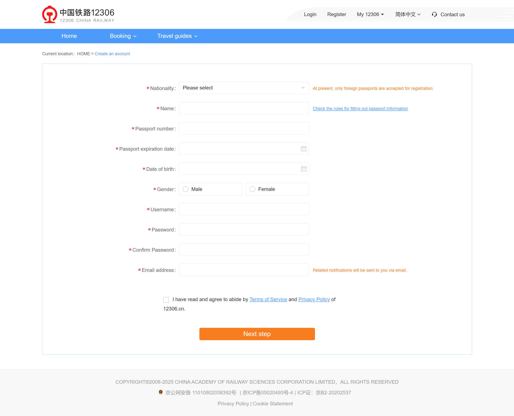
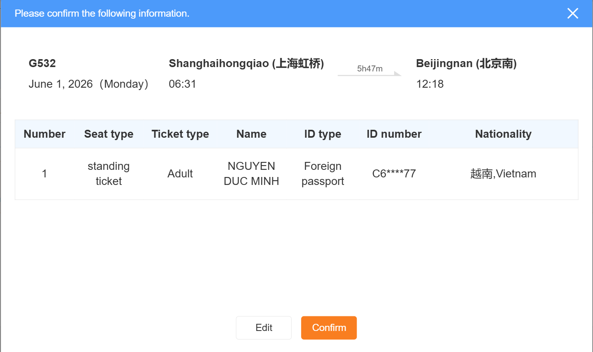

# Train Ticket Booking System
A streamlined train ticket booking demo that focuses on registration, login, ticket search, booking, payment, and basic order viewing.

## REQ-1 System Home
The default landing page after the system starts. The top area shows the system logo on the left, and "Login", "Register", and a "My 12306" entry on the right. The page displays a simple navigation bar and a quick ticket search area. 

**Type:** FOLDER
**Dependencies:** None

### REQ-1.1 Open system home page
Display the home page with the logo, authentication links, navigation bar, and ticket search area.

**Type:** ATOMIC
**Dependencies:** None

**Scenarios:**
- Display the default home page
  - **GIVEN:** The system is accessible.
  - **WHEN:** Open the application entry URL.
  - **THEN:** The page shows the system logo, the "Login" link, the "Register" link, the "My 12306" entry, and the ticket search area.

## REQ-2 User Authentication
Provide user registration, login, and logout for the booking demo. User data is persisted after successful registration and login.

**Type:** FOLDER
**Dependencies:** REQ-1

### REQ-2.1 User Registration
Allow a user to create an account by filling in basic account information and submitting the registration form.

**Type:** FOLDER
**Dependencies:** REQ-1.1

#### REQ-2.1.1 Open registration page
Open the registration page from the "Register" link in the top-right area of the home page.

**Type:** ATOMIC
**Dependencies:** REQ-1.1

**Scenarios:**
- Open the registration page from the home page
  - **GIVEN:** The user is on the home page and is not logged in.
  - **WHEN:** Click the "Register" link in the top-right area.
  - **THEN:** Navigate to the registration page.

#### REQ-2.1.2 View registration form
Display the registration form with input fields labeled "Username", "Email address", "Password", and "Confirm Password", and a "Register" button. 

**Type:** ATOMIC
**Dependencies:** REQ-2.1.1

**Scenarios:**
- Display the registration form layout
  - **GIVEN:** The user is on the registration page.
  - **WHEN:** Observe the form content.
  - **THEN:** The page shows the labeled fields "Username", "Email address", "Password", and "Confirm Password", and the "Register" button.

#### REQ-2.1.3 Submit valid registration information
Allow a new user to submit complete and valid registration information, persist the user data, and show a successful registration message.

**Type:** ATOMIC
**Dependencies:** REQ-2.1.2

**Scenarios:**
- Submit a valid registration form
  - **GIVEN:** The user is on the registration page with a unique username, a valid email address, matching passwords, and all required fields filled.
  - **WHEN:** Click the "Register" button.
  - **THEN:** The system persists the user information and shows a successful registration message.

### REQ-2.2 User Login
Allow a user to log in with an email address or username and a password.

**Type:** FOLDER
**Dependencies:** REQ-1.1

#### REQ-2.2.1 Open login page
Open the login page from the "Login" link in the top-right area of the home page.

**Type:** ATOMIC
**Dependencies:** REQ-1.1

**Scenarios:**
- Open the login page from the home page
  - **GIVEN:** The user is on the home page and is not logged in.
  - **WHEN:** Click the "Login" link in the top-right area.
  - **THEN:** Navigate to the login page.

#### REQ-2.2.2 View login form
Display the login form with an input field whose placeholder is "Email/Username", a password input whose placeholder is "Password", and a "LOGIN" button. 

**Type:** ATOMIC
**Dependencies:** REQ-2.2.1

**Scenarios:**
- Display the login form layout
  - **GIVEN:** The user is on the login page.
  - **WHEN:** Observe the page.
  - **THEN:** The page shows the "Email/Username" input, the password input with the placeholder "Password", and the "LOGIN" button.

#### REQ-2.2.3 Submit valid login credentials
Allow the user to log in with a valid username or email address and the correct password, persist the login state, and show a successful login message.

**Type:** ATOMIC
**Dependencies:** REQ-2.2.2

**Scenarios:**
- Log in with valid credentials
  - **GIVEN:** The user is on the login page with a valid username or email address entered and the correct password entered.
  - **WHEN:** Click the "LOGIN" button.
  - **THEN:** The system persists the login state and shows a successful login message.

#### REQ-2.2.4 Block invalid login
Reject login when the account field or password field is empty, or when the credentials do not match an existing account, and show an error message.

**Type:** ATOMIC
**Dependencies:** REQ-2.2.2

**Scenarios:**
- Submit the login form with invalid credentials
  - **GIVEN:** The user is on the login page with missing credentials or incorrect credentials.
  - **WHEN:** Click the "LOGIN" button.
  - **THEN:** The page shows an error message and does not complete login.

### REQ-2.3 User Logout
Allow a logged-in user to sign out and clear the persisted login state.

**Type:** FOLDER
**Dependencies:** REQ-2.2.3

#### REQ-2.3.1 Sign out
After login, provide a "Sign Out" action. When the user clicks it, clear the login state and show the guest entry state again.

**Type:** ATOMIC
**Dependencies:** REQ-2.2.3

**Scenarios:**
- Sign out from the home page
  - **GIVEN:** The user is logged in and is on the home page.
  - **WHEN:** Click the "Sign Out" action.
  - **THEN:** The system clears the login state and shows the guest entry state again.

## REQ-3 Ticket Search and Display
Provide a simple ticket search flow from the home page and show direct search results.

**Type:** FOLDER
**Dependencies:** REQ-1

### REQ-3.1 Home Quick Search
Allow the user to search tickets by departure place, arrival place, and departure date from the home page.

**Type:** FOLDER
**Dependencies:** REQ-1.1

#### REQ-3.1.1 View home quick search module
Display the quick search module with fields for departure place, arrival place, departure date, and a "Search" button.

**Type:** ATOMIC
**Dependencies:** REQ-1.1

**Scenarios:**
- Display the quick search module
  - **GIVEN:** The user is on the home page.
  - **WHEN:** Observe the search area.
  - **THEN:** The page shows fields for departure place, arrival place, departure date, and a "Search" button.

#### REQ-3.1.2 Search tickets with valid quick search conditions
Allow the user to search tickets after entering a departure place, an arrival place, and a departure date.

**Type:** ATOMIC
**Dependencies:** REQ-3.1.1

**Scenarios:**
- Search tickets with complete conditions
  - **GIVEN:** The user is on the home page with a departure place, an arrival place, and a departure date entered.
  - **WHEN:** Click the "Search" button.
  - **THEN:** Navigate to the ticket search results page.

#### REQ-3.1.3 Block search with incomplete conditions
Reject ticket search when the departure place, arrival place, or departure date is missing and show the message "Please complete departure, arrival, and date.".

**Type:** ATOMIC
**Dependencies:** REQ-3.1.1

**Scenarios:**
- Search tickets with missing conditions
  - **GIVEN:** The user is on the home page with one or more required search fields left empty.
  - **WHEN:** Click the "Search" button.
  - **THEN:** The page shows "Please complete departure, arrival, and date." and does not continue to the results page.

### REQ-3.2 Ticket Search Results
Display the ticket search results page with the search conditions, the result count, the ticket list, and booking actions. 

**Type:** FOLDER
**Dependencies:** REQ-3.1.2

#### REQ-3.2.1 View search results page layout
Display the search results page with the user's departure place, arrival place, and departure date in the search condition inputs, a result count, a table with the headers "Train No.", "Departure Time", "Arrival Time", "Price", and "Action", and one "Book" button for each result row. 

**Type:** ATOMIC
**Dependencies:** REQ-3.1.2

**Scenarios:**
- Display the search results page
  - **GIVEN:** The user has searched tickets with valid conditions and matching trains exist.
  - **WHEN:** The search results page opens.
  - **THEN:** The page shows the search conditions, the result count, the ticket list, and one "Book" button for each result row.

#### REQ-3.2.2 Show empty search results gracefully
Display an empty-state page when no train matches the search conditions while keeping the search condition inputs visible at the top.

**Type:** ATOMIC
**Dependencies:** REQ-3.1.2

**Scenarios:**
- Show no-result state
  - **GIVEN:** The user has searched tickets with valid conditions and no matching train exists.
  - **WHEN:** The search results page opens.
  - **THEN:** The page keeps the search condition inputs visible at the top and shows a no-result message.

## REQ-4 Ticket Booking
Provide a streamlined booking flow with booking form submission, order confirmation, payment, and basic order viewing.

**Type:** FOLDER
**Dependencies:** REQ-3.2.1

### REQ-4.1 Booking and Payment
Allow the user to select one search result, fill in simple passenger information, confirm the order, pay for the order, and view the paid order. 

**Type:** FOLDER
**Dependencies:** REQ-3.2.1

#### REQ-4.1.1 Open booking form from search results
After the user clicks one "Book" button for a valid train result, open the booking form page. 

**Type:** ATOMIC
**Dependencies:** REQ-3.2.1, REQ-2.2.3

**Scenarios:**
- Open the booking form page
  - **GIVEN:** The user is logged in and is viewing search results with at least one available train.
  - **WHEN:** Click one "Book" button.
  - **THEN:** Navigate to the booking form page for the selected train.

#### REQ-4.1.2 Submit booking information
Provide a booking form that shows the selected train information, input fields for passenger name and ID number, a seat type selector, and a "Place order" button. Allow the user to submit valid booking information.

**Type:** ATOMIC
**Dependencies:** REQ-4.1.1

**Scenarios:**
- Submit a valid booking request
  - **GIVEN:** The user is on the booking form page with valid passenger information entered and a seat type selected.
  - **WHEN:** Click the "Place order" button.
  - **THEN:** The system accepts the booking information and opens the order confirmation step.

#### REQ-4.1.3 Confirm order information
After the user submits booking information, open a confirmation dialog with the title "Please confirm the following information.", show the train information and passenger information, and provide the buttons "Confirm" and "Edit". Clicking "Confirm" confirms the order information. Clicking "Edit" returns to the booking information page. 

**Type:** ATOMIC
**Dependencies:** REQ-4.1.2

**Scenarios:**
- Confirm the order information and continue
  - **GIVEN:** The user has successfully submitted valid booking information.
  - **WHEN:** Click the "Confirm" button in the confirmation dialog.
  - **THEN:** The order information is confirmed and the payment step opens.
- Return to edit from the confirmation dialog
  - **GIVEN:** The user is viewing the confirmation dialog after a valid booking submission.
  - **WHEN:** Click the "Edit" button.
  - **THEN:** Return to the booking information page.

#### REQ-4.1.4 Complete payment
After the user confirms the order information, open the payment page. The page shows "Order details", the total price, and a "Pay" button. Clicking "Pay" simulates a successful payment. 

**Type:** ATOMIC
**Dependencies:** REQ-4.1.3

**Scenarios:**
- Complete payment from the payment page
  - **GIVEN:** The user is on the payment page for an unpaid order.
  - **WHEN:** Click the "Pay" button.
  - **THEN:** The system simulates a successful payment and marks the order as paid.

#### REQ-4.1.5 View paid order
Allow the user to open the "Ticket orders" page from the "My 12306" entry after payment and display the paid order in the order list with status "Paid". 

**Type:** ATOMIC
**Dependencies:** REQ-4.1.4

**Scenarios:**
- View the paid order in the order list
  - **GIVEN:** The user has completed payment for one order.
  - **WHEN:** Open the "Ticket orders" page from the "My 12306" entry.
  - **THEN:** The page shows the paid order in the order list with status "Paid".
