# A simulation of chinese railway ticket booking system
A train ticket booking system that provides user authentication, ticket search and booking, order management, and travel information services.

## REQ-1 System Home
The default landing page after the system starts. The top area shows "assets/logo.png" on the left, and "Login", "Register", and a "My 12306" dropdown entry on the right. The navigation bar contains "Home", a "Booking" dropdown entry, and a "Travel guides" dropdown entry. The page also displays a banner carousel with "assets/banner1.jpg", "assets/banner2.jpg", and "assets/banner3.jpg", an empty search box area, and an empty "Quick Guide" area. 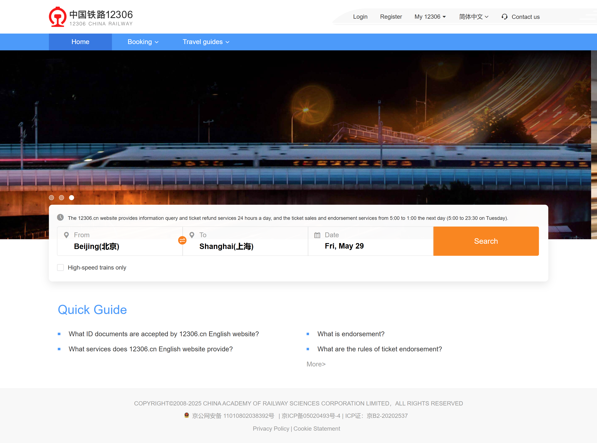

### REQ-1.1 Open system home page
Display the home page with the top logo, authentication links, navigation bar, three banner images, the search area, and the "Quick Guide" area.

**Dependencies:** None

**Scenarios:**
- Display the default home page
  - **GIVEN:** The system is accessible.
  - **WHEN:** Open the application entry URL.
  - **THEN:** The page shows "assets/logo.png" at the top-left, the "Login" link and the "Register" link at the top-right, the "My 12306" dropdown entry, the navigation items "Home", "Booking", and "Travel guides", the three banner images, the search area, and the "Quick Guide" area.

### REQ-1.2 Show quick guide links
Display the "Quick Guide" area on the home page as a dedicated section for quick links.

**Dependencies:** REQ-1.1

**Scenarios:**
- Show the quick guide section on the home page
  - **GIVEN:** The user is on the home page.
  - **WHEN:** Observe the content below the banner area.
  - **THEN:** The page shows a visible "Quick Guide" section reserved for quick links.

## REQ-2 User Authentication
Provide user registration, login, logout, password reset, and agreement browsing. User data is persisted after successful registration, login, and password reset.

**Dependencies:** REQ-1

### REQ-2.1 User Registration
Allow a user to create an account by filling in identity and contact information, agreeing to the service terms, and submitting the registration form.

**Dependencies:** REQ-1.1

#### REQ-2.1.1 Open registration page
Open the registration page from the "Register" link in the top-right area of the home page.

**Dependencies:** REQ-1.1

**Scenarios:**
- Open the registration page from the home page
  - **GIVEN:** The user is on the home page and is not logged in.
  - **WHEN:** Click the "Register" link in the top-right area.
  - **THEN:** Navigate to the registration page.

#### REQ-2.1.2 View registration form
Display the registration form with a dropdown labeled "Nationality" showing the default value "Please select" and country options, input fields labeled "Name", "Passport number", "Username", and "Email address", date pickers labeled "Passport expiration date" and "Date of birth", a radio group labeled "Gender" with "Male" and "Female", password fields labeled "Password" and "Confirm Password", a checkbox followed by "I have read and agree to abide by Terms of Service and Privacy Policy of 12306.cn.", and a "Register" button. 

**Dependencies:** REQ-2.1.1

**Scenarios:**
- Display the registration form layout
  - **GIVEN:** The user is on the registration page.
  - **WHEN:** Observe the form content.
  - **THEN:** The page shows the labeled fields "Nationality", "Name", "Passport number", "Passport expiration date", "Date of birth", "Gender", "Username", "Password", "Confirm Password", and "Email address", the agreement checkbox text, and the "Register" button.

#### REQ-2.1.3 Submit valid registration information
Allow a new user to submit complete and valid registration information, persist the user data, and show a successful registration message.

**Dependencies:** REQ-2.1.2

**Scenarios:**
- Submit a valid registration form
  - **GIVEN:** The user is on the registration page with all required fields filled with valid values, a unique passport number, a unique username, matching passwords, and a valid email address, and the agreement checkbox is selected.
  - **WHEN:** Click the "Register" button.
  - **THEN:** The system persists the user information and shows a successful registration message.

#### REQ-2.1.4 Block registration with missing required fields
Reject registration when any required field is missing and show the message "Please fill in all required fields.".

**Dependencies:** REQ-2.1.2

**Scenarios:**
- Submit the form with missing required information
  - **GIVEN:** The user is on the registration page with one or more required fields left empty.
  - **WHEN:** Click the "Register" button.
  - **THEN:** The page shows "Please fill in all required fields." and does not complete registration.

#### REQ-2.1.5 Block registration with duplicate passport number
Reject registration when the passport number already exists and show the message "Passport number already exists.".

**Dependencies:** REQ-2.1.2

**Scenarios:**
- Submit the form with an existing passport number
  - **GIVEN:** The user is on the registration page with a passport number that already exists in the system and all other required fields are valid.
  - **WHEN:** Click the "Register" button.
  - **THEN:** The page shows "Passport number already exists." and does not complete registration.

#### REQ-2.1.6 Block registration with duplicate username
Reject registration when the username already exists and show the message "Username already exists.".

**Dependencies:** REQ-2.1.2

**Scenarios:**
- Submit the form with an existing username
  - **GIVEN:** The user is on the registration page with a username that already exists in the system and all other required fields are valid.
  - **WHEN:** Click the "Register" button.
  - **THEN:** The page shows "Username already exists." and does not complete registration.

#### REQ-2.1.7 Block registration with mismatched passwords
Reject registration when the values in "Password" and "Confirm Password" do not match and show the message "Passwords do not match.".

**Dependencies:** REQ-2.1.2

**Scenarios:**
- Submit the form with mismatched passwords
  - **GIVEN:** The user is on the registration page with different values entered in the "Password" and "Confirm Password" fields.
  - **WHEN:** Click the "Register" button.
  - **THEN:** The page shows "Passwords do not match." and does not complete registration.

#### REQ-2.1.8 Block registration with invalid email format
Reject registration when the email address format is invalid and show the message "Invalid email address format.".

**Dependencies:** REQ-2.1.2

**Scenarios:**
- Submit the form with an invalid email address
  - **GIVEN:** The user is on the registration page with an invalid value entered in the "Email address" field and all other required fields are valid.
  - **WHEN:** Click the "Register" button.
  - **THEN:** The page shows "Invalid email address format." and does not complete registration.

#### REQ-2.1.9 Block registration without agreement acceptance
Reject registration when the agreement checkbox is not selected and show the message "Please agree to the Terms of Service and Privacy Policy.".

**Dependencies:** REQ-2.1.2

**Scenarios:**
- Submit the form without accepting the agreement
  - **GIVEN:** The user is on the registration page with all required fields valid and the agreement checkbox not selected.
  - **WHEN:** Click the "Register" button.
  - **THEN:** The page shows "Please agree to the Terms of Service and Privacy Policy." and does not complete registration.

### REQ-2.2 User Login
Allow a user to log in with a username, email address, or mobile number and a password.

**Dependencies:** REQ-1.1

#### REQ-2.2.1 Open login page
Open the login page from the "Login" link in the top-right area of the home page.

**Dependencies:** REQ-1.1

**Scenarios:**
- Open the login page from the home page
  - **GIVEN:** The user is on the home page and is not logged in.
  - **WHEN:** Click the "Login" link in the top-right area.
  - **THEN:** Navigate to the login page.

#### REQ-2.2.2 View login form
Display the login form with an input field whose placeholder is "Email/Username/Mobile number", a password input whose placeholder is "Password", and a "LOGIN" button. 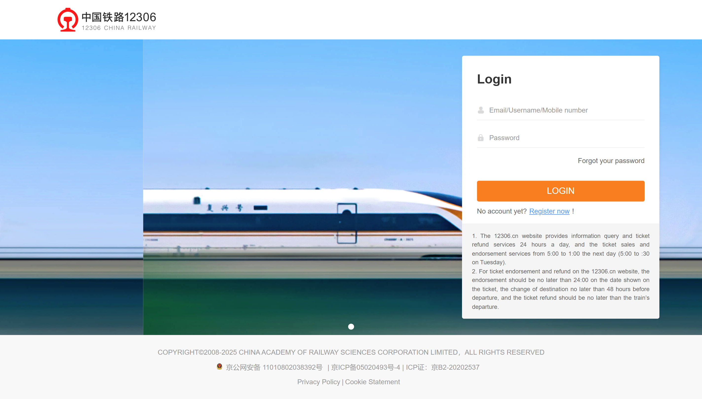

**Dependencies:** REQ-2.2.1

**Scenarios:**
- Display the login form layout
  - **GIVEN:** The user is on the login page.
  - **WHEN:** Observe the page.
  - **THEN:** The page shows the "Email/Username/Mobile number" input, the password input with the placeholder "Password", and the "LOGIN" button.

#### REQ-2.2.3 Submit valid login credentials
Allow the user to log in with a valid username, email address, or mobile number and the correct password, persist the login state, and show a successful login message.

**Dependencies:** REQ-2.2.2

**Scenarios:**
- Log in with valid credentials
  - **GIVEN:** The user is on the login page with a valid username, email address, or mobile number entered and the correct password entered.
  - **WHEN:** Click the "LOGIN" button.
  - **THEN:** The system persists the login state and shows a successful login message.

#### REQ-2.2.4 Block login with missing credentials
Reject login when the account field or password field is empty and show the message "Please enter your username/email/phone number and password.".

**Dependencies:** REQ-2.2.2

**Scenarios:**
- Submit the login form with missing account information or password
  - **GIVEN:** The user is on the login page with the account field empty, the password field empty, or both.
  - **WHEN:** Click the "LOGIN" button.
  - **THEN:** The page shows "Please enter your username/email/phone number and password." and does not complete login.

#### REQ-2.2.5 Block login for unknown account
Reject login when the entered username, email address, or mobile number does not exist and show the message "User not found.".

**Dependencies:** REQ-2.2.2

**Scenarios:**
- Submit the login form with an unknown account
  - **GIVEN:** The user is on the login page with a username, email address, or mobile number that does not exist and a password entered.
  - **WHEN:** Click the "LOGIN" button.
  - **THEN:** The page shows "User not found." and does not complete login.

#### REQ-2.2.6 Block login with incorrect password
Reject login when the password is incorrect and show the message "Incorrect password.".

**Dependencies:** REQ-2.2.2

**Scenarios:**
- Submit the login form with an incorrect password
  - **GIVEN:** The user is on the login page with an existing username, email address, or mobile number entered and an incorrect password entered.
  - **WHEN:** Click the "LOGIN" button.
  - **THEN:** The page shows "Incorrect password." and does not complete login.

#### REQ-2.2.7 Open registration page from login page
Provide a link with the text "No account yet? Register now." on the login page and navigate to the registration page after it is clicked.

**Dependencies:** REQ-2.2.2, REQ-2.1.1

**Scenarios:**
- Open the registration page from the login page
  - **GIVEN:** The user is on the login page.
  - **WHEN:** Click the link "No account yet? Register now.".
  - **THEN:** Navigate to the registration page.

### REQ-2.3 User Logout
Allow a logged-in user to sign out from the home page and clear the persisted login state.

**Dependencies:** REQ-2.2.3

#### REQ-2.3.1 Sign out from home page
After login, replace the top "Register" link with "Sign Out". When the user clicks "Sign Out", clear the login state, show a successful logout message, change "Sign Out" back to "Register", and show "Login" instead of the user name.

**Dependencies:** REQ-2.2.3

**Scenarios:**
- Sign out from the home page
  - **GIVEN:** The user is logged in and is on the home page.
  - **WHEN:** Click the "Sign Out" link in the top-right area.
  - **THEN:** The system clears the login state, shows a successful logout message, changes the top-right link from "Sign Out" to "Register", and shows "Login" instead of the user name.

### REQ-2.4 Forgot Password
Allow a user to reset the password by entering the registered email address and ID number, then entering a new password.

**Dependencies:** REQ-2.2.2

#### REQ-2.4.1 Open forgot password page
Provide a link with the text "Forgot password?" on the login page and navigate to the forgot password page after it is clicked.

**Dependencies:** REQ-2.2.2

**Scenarios:**
- Open the forgot password page from the login page
  - **GIVEN:** The user is on the login page.
  - **WHEN:** Click the link "Forgot password?".
  - **THEN:** Navigate to the forgot password page.

#### REQ-2.4.2 View forgot password flow
Display a two-step forgot password flow. The first step shows a form with an input labeled "Email: ", an input labeled "ID number: ", and a "submit" button. The second step shows a form with password inputs labeled "New password: " and "Confirm new password: ", and a "submit" button. 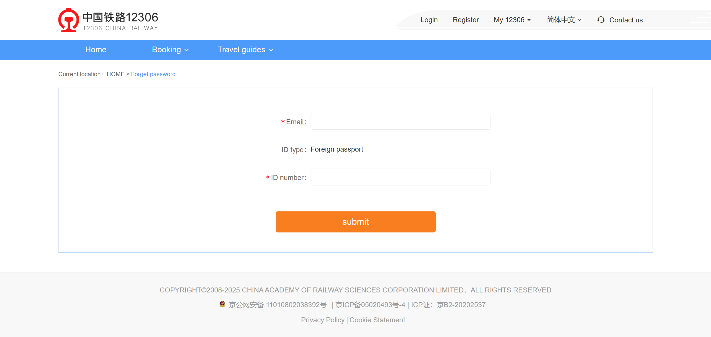

**Dependencies:** REQ-2.4.1

**Scenarios:**
- Display the forgot password forms
  - **GIVEN:** The user is on the forgot password page.
  - **WHEN:** Observe the first step and continue to the second step after the identity check.
  - **THEN:** The first step shows the "Email: " field, the "ID number: " field, and the "submit" button, and the second step shows the "New password: " field, the "Confirm new password: " field, and the "submit" button.

#### REQ-2.4.3 Submit valid password reset information
Allow the user to reset the password when the email address and ID number match the registration record and the new passwords match, persist the new password, and show a successful password reset message.

**Dependencies:** REQ-2.4.2

**Scenarios:**
- Complete a valid password reset
  - **GIVEN:** The user is on the forgot password flow with a matching email address and ID number entered, and matching values entered in "New password: " and "Confirm new password: ".
  - **WHEN:** Click the "submit" button in the final step.
  - **THEN:** The system persists the new password and shows a successful password reset message.

#### REQ-2.4.4 Block password reset with missing identity fields
Reject the identity verification step when the email address or ID number is missing and show the message "Please enter your email and ID number.".

**Dependencies:** REQ-2.4.2

**Scenarios:**
- Submit the identity verification step with missing information
  - **GIVEN:** The user is on the first step of the forgot password flow with the email field empty, the ID number field empty, or both.
  - **WHEN:** Click the "submit" button.
  - **THEN:** The page shows "Please enter your email and ID number." and does not continue to the next step.

#### REQ-2.4.5 Block password reset for unmatched email and ID number
Reject the identity verification step when the email address and ID number do not match the registration record and show the message "Email and ID number do not match our records.".

**Dependencies:** REQ-2.4.2

**Scenarios:**
- Submit the identity verification step with unmatched records
  - **GIVEN:** The user is on the first step of the forgot password flow with an email address and ID number that do not match the registration record.
  - **WHEN:** Click the "submit" button.
  - **THEN:** The page shows "Email and ID number do not match our records." and does not continue to the next step.

#### REQ-2.4.6 Block password reset with mismatched new passwords
Reject the new password step when the values in "New password: " and "Confirm new password: " do not match and show the message "Passwords do not match.".

**Dependencies:** REQ-2.4.2

**Scenarios:**
- Submit the new password step with mismatched passwords
  - **GIVEN:** The user is on the new password step with different values entered in "New password: " and "Confirm new password: ".
  - **WHEN:** Click the "submit" button.
  - **THEN:** The page shows "Passwords do not match." and does not reset the password.

### REQ-2.5 Terms of Service and Privacy Policy
Provide access to the agreement content from the registration page and require acceptance before registration can be completed.

**Dependencies:** REQ-2.1.2

#### REQ-2.5.1 Open terms of service page
Open the terms page from the "Terms of Service" link in the agreement text and display a page containing the title "Terms of Service". 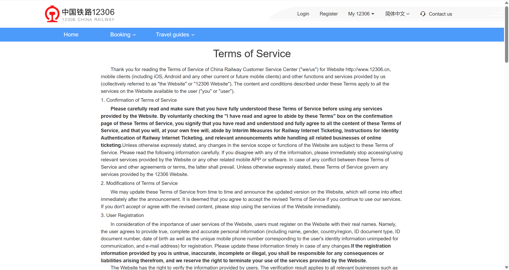

**Dependencies:** REQ-2.1.2

**Scenarios:**
- Open the terms of service page from the registration page
  - **GIVEN:** The user is on the registration page.
  - **WHEN:** Click the "Terms of Service" link in the agreement text.
  - **THEN:** Navigate to the terms page and show the title "Terms of Service".

#### REQ-2.5.2 Open privacy policy page
Open the privacy policy page from the "Privacy Policy" link in the agreement text and display a page containing the title "Privacy Policy". 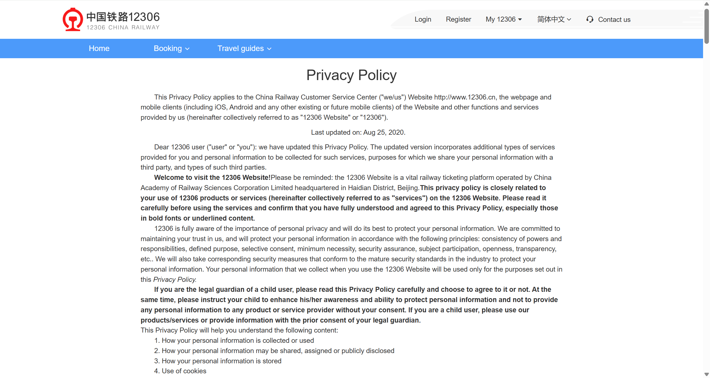

**Dependencies:** REQ-2.1.2

**Scenarios:**
- Open the privacy policy page from the registration page
  - **GIVEN:** The user is on the registration page.
  - **WHEN:** Click the "Privacy Policy" link in the agreement text.
  - **THEN:** Navigate to the privacy policy page and show the title "Privacy Policy".

## REQ-3 Ticket Search and Display
Provide train ticket search from the home page, display search results, support sorting and filtering, and provide entry points from both the search box and the navigation bar.

**Dependencies:** REQ-1

### REQ-3.1 Home Quick Search
Provide a ticket search module on the home page with input placeholders "From", "To", and "Date", and a "Search" button.

**Dependencies:** REQ-1.1

#### REQ-3.1.1 View home quick search module
Display a ticket search module on the home page with input placeholders "From", "To", and "Date", and a "Search" button.

**Dependencies:** REQ-1.1

**Scenarios:**
- Display the quick search module on the home page
  - **GIVEN:** The user is on the home page.
  - **WHEN:** Observe the search area.
  - **THEN:** The page shows inputs with the placeholders "From", "To", and "Date", and a "Search" button.

#### REQ-3.1.2 Choose location by typing
Allow the user to type pinyin or Chinese characters in the departure or arrival field, show a fuzzy-matched list with the title "Top destinations" and matching cities and stations with both pinyin and Chinese names, and fill the input with the selected location after selection. 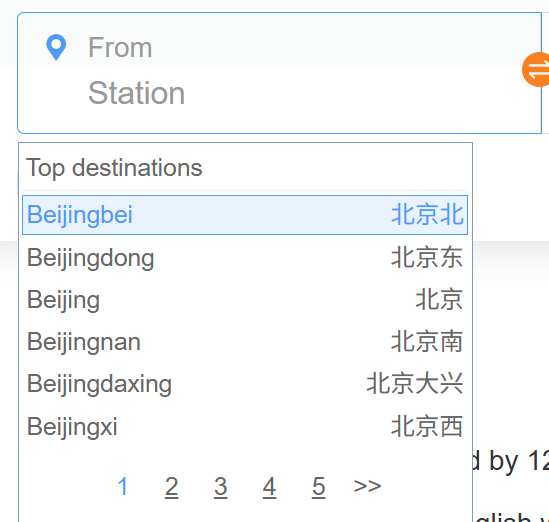

**Dependencies:** REQ-3.1.1

**Scenarios:**
- Select a location from the fuzzy-matched list
  - **GIVEN:** The user is on the home page search module and the departure field or arrival field is focused.
  - **WHEN:** Type pinyin or Chinese characters in the input field and click one location in the matched list.
  - **THEN:** The page shows a matched list with the title "Top destinations" and matching city and station items with pinyin and Chinese names, and the input field is filled with the selected location name.

#### REQ-3.1.3 Choose location by tab list
Allow the user to click the departure or arrival input field, open a tabbed location selector with the tabs "Popular", "ABCDE", "FGHIJ", "KLMNO", "PQRST", and "UVWXYZ", show city and station names with both pinyin and Chinese names, and fill the input with the selected location after selection. 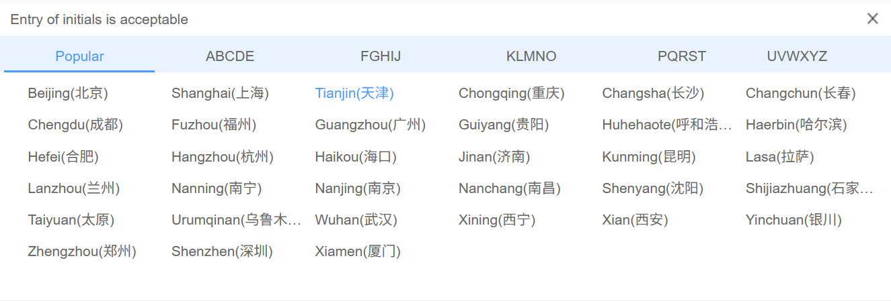

**Dependencies:** REQ-3.1.1

**Scenarios:**
- Select a location from the tabbed selector
  - **GIVEN:** The user is on the home page search module.
  - **WHEN:** Click the departure input field or arrival input field, switch to one tab in the location selector, and click one location item.
  - **THEN:** The page shows the tabs "Popular", "ABCDE", "FGHIJ", "KLMNO", "PQRST", and "UVWXYZ", shows matching city and station names with pinyin and Chinese names, and fills the input field with the selected location name.

#### REQ-3.1.4 Choose departure date
Allow the user to click the departure date input, open a date picker, choose one departure date, and fill the input with the selected date. The date picker only allows dates from the current day through the next two weeks. Expired dates cannot be selected. 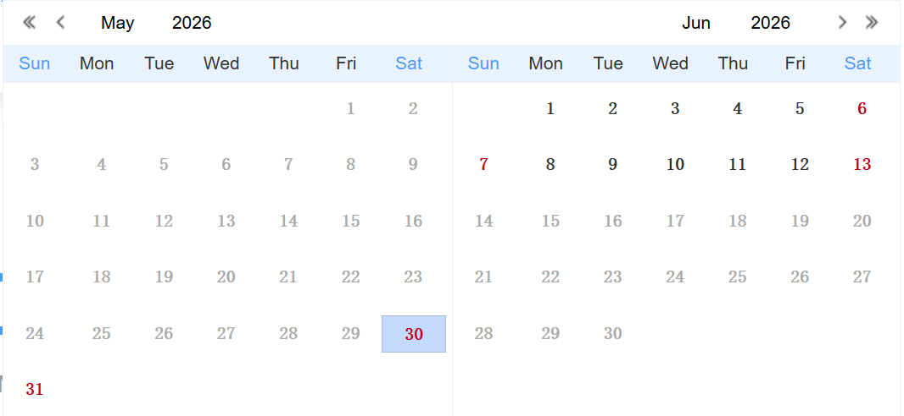

**Dependencies:** REQ-3.1.1

**Scenarios:**
- Select a valid departure date in the allowed range
  - **GIVEN:** The user is on the home page search module.
  - **WHEN:** Click the date input field and click a valid date from the current day through the next two weeks.
  - **THEN:** The date picker opens, the selected date is accepted, and the date input field shows the selected date.
- Prevent selection of an expired date
  - **GIVEN:** The user is on the home page search module with the date picker open.
  - **WHEN:** Try to click a date earlier than the current day or outside the next two weeks.
  - **THEN:** The expired date cannot be selected.

#### REQ-3.1.5 Search tickets with valid quick search conditions
Allow the user to search by departure place, arrival place, and departure date from the home page and navigate to the ticket search results page after clicking "Search".

**Dependencies:** REQ-3.1.2, REQ-3.1.3, REQ-3.1.4

**Scenarios:**
- Search tickets from the home page
  - **GIVEN:** The user is on the home page with a valid departure place, arrival place, and departure date selected.
  - **WHEN:** Click the "Search" button.
  - **THEN:** Navigate to the ticket search results page and show results that match the search conditions.

#### REQ-3.1.6 Block search without valid departure place
Reject ticket search when the departure place is not selected or the input is invalid and show the message "Please select the place of departure.".

**Dependencies:** REQ-3.1.1

**Scenarios:**
- Search without a valid departure place
  - **GIVEN:** The user is on the home page search module with the arrival place and departure date filled, and the departure place missing or invalid.
  - **WHEN:** Click the "Search" button.
  - **THEN:** The page shows "Please select the place of departure." and does not navigate to the search results page.

#### REQ-3.1.7 Block search without valid arrival place
Reject ticket search when the arrival place is not selected or the input is invalid and show the message "Please select the place of arrival.".

**Dependencies:** REQ-3.1.1

**Scenarios:**
- Search without a valid arrival place
  - **GIVEN:** The user is on the home page search module with the departure place and departure date filled, and the arrival place missing or invalid.
  - **WHEN:** Click the "Search" button.
  - **THEN:** The page shows "Please select the place of arrival." and does not navigate to the search results page.

### REQ-3.2 Ticket Search Results
Display the ticket search results page below the home page navigation bar, including the search condition inputs, the date-switching bar, the route summary, the result count, the ticket list table, the "Filter" sidebar, and ticket booking buttons. 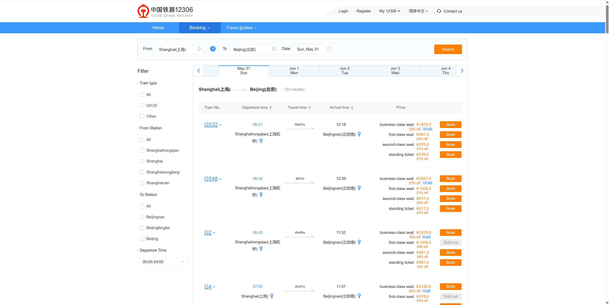

**Dependencies:** REQ-3.1.5

#### REQ-3.2.1 View search results page layout
Display the search results page with the user's departure place, arrival place, and departure date in the search condition inputs, a "Search" button, a date-switching bar that shows dates such as "May 31 Sun", a route summary in the format of pinyin plus Chinese names, a result count in the format "xx results", a table with the headers "Train No.", "Departure Time", "Travel time", "Arrival Time", and "Price", and a left-side "Filter" area. 

**Dependencies:** REQ-3.1.5

**Scenarios:**
- Display the populated ticket search results page
  - **GIVEN:** The user has completed a valid ticket search from the home page.
  - **WHEN:** The search results page finishes loading.
  - **THEN:** The page shows the search condition inputs, the "Search" button, the date-switching bar, the route summary, the result count, the table headers "Train No.", "Departure Time", "Travel time", "Arrival Time", and "Price", and the left-side "Filter" area.

#### REQ-3.2.2 Show seat prices and book buttons in results
Display each train row with one or more price lines in the "Price" column, where each line represents one seat type and price and is followed by a "Book" button.

**Dependencies:** REQ-3.2.1

**Scenarios:**
- Show ticket prices and booking actions in each result row
  - **GIVEN:** The user is on a populated ticket search results page.
  - **WHEN:** Observe the train result rows.
  - **THEN:** Each result row shows one or more seat price lines in the "Price" column, and each price line is followed by a "Book" button.

#### REQ-3.2.3 Show empty search results gracefully
Display an empty-state page when no train matches the search conditions. The page keeps the search condition inputs at the top and shows the icon "assets/empty.png" with the text "sorry, according to your inquiry condition, there is no train at present.".

**Dependencies:** REQ-3.1.5

**Scenarios:**
- Show the empty result state when no train matches
  - **GIVEN:** The user has searched with valid conditions and there is no matching train.
  - **WHEN:** The search results page finishes loading.
  - **THEN:** The page keeps the search condition inputs visible at the top and shows "assets/empty.png" with the text "sorry, according to your inquiry condition, there is no train at present.".

#### REQ-3.2.4 Search again with updated conditions
Allow the user to modify the search condition inputs on the search results page, click "Search", and refresh the page with the new results.

**Dependencies:** REQ-3.2.1

**Scenarios:**
- Search again from the results page
  - **GIVEN:** The user is on the ticket search results page.
  - **WHEN:** Modify one or more search condition inputs and click the "Search" button.
  - **THEN:** The page reloads the ticket list and shows the new matching results.

#### REQ-3.2.5 Search by switching the date bar
Allow the user to click one date in the date-switching bar and refresh the page with results for the new date.

**Dependencies:** REQ-3.2.1

**Scenarios:**
- Search with another date from the date-switching bar
  - **GIVEN:** The user is on the ticket search results page.
  - **WHEN:** Click one date item in the date-switching bar.
  - **THEN:** The page reloads the ticket list and shows results for the newly selected date.

#### REQ-3.2.6 Sort results by departure time
Sort the ticket list by the "Departure Time" header. The first click sorts in ascending order and the second click sorts in descending order.

**Dependencies:** REQ-3.2.1

**Scenarios:**
- Toggle sorting by departure time
  - **GIVEN:** The user is on a populated ticket search results page.
  - **WHEN:** Click the "Departure Time" table header once and then click it again.
  - **THEN:** The list is sorted in ascending order after the first click and in descending order after the second click.

#### REQ-3.2.7 Sort results by travel time
Sort the ticket list by the "Travel time" header. The first click sorts in ascending order and the second click sorts in descending order.

**Dependencies:** REQ-3.2.1

**Scenarios:**
- Toggle sorting by travel time
  - **GIVEN:** The user is on a populated ticket search results page.
  - **WHEN:** Click the "Travel time" table header once and then click it again.
  - **THEN:** The list is sorted in ascending order after the first click and in descending order after the second click.

#### REQ-3.2.8 Sort results by arrival time
Sort the ticket list by the "Arrival Time" header. The first click sorts in ascending order and the second click sorts in descending order.

**Dependencies:** REQ-3.2.1

**Scenarios:**
- Toggle sorting by arrival time
  - **GIVEN:** The user is on a populated ticket search results page.
  - **WHEN:** Click the "Arrival Time" table header once and then click it again.
  - **THEN:** The list is sorted in ascending order after the first click and in descending order after the second click.

#### REQ-3.2.9 Filter results by train type
Provide the filter condition "Train type" in the "Filter" sidebar with the multi-select options "All", "G/C/D", and "Other", and filter the ticket list according to the selected options.

**Dependencies:** REQ-3.2.1

**Scenarios:**
- Filter the result list by train type
  - **GIVEN:** The user is on a populated ticket search results page.
  - **WHEN:** Select one or more options under the "Train type" filter.
  - **THEN:** The ticket list updates to show only the trains that match the selected train type options.

#### REQ-3.2.10 Filter results by departure station
Provide the filter condition "From Station" in the "Filter" sidebar with an "All" option and the departure-related station options, and filter the ticket list according to the selected station.

**Dependencies:** REQ-3.2.1

**Scenarios:**
- Filter the result list by departure station
  - **GIVEN:** The user is on a populated ticket search results page.
  - **WHEN:** Select one option under the "From Station" filter.
  - **THEN:** The ticket list updates to show only the trains that match the selected departure station.

#### REQ-3.2.11 Filter results by arrival station
Provide the filter condition "To Station" in the "Filter" sidebar with an "All" option and the arrival-related station options, and filter the ticket list according to the selected station.

**Dependencies:** REQ-3.2.1

**Scenarios:**
- Filter the result list by arrival station
  - **GIVEN:** The user is on a populated ticket search results page.
  - **WHEN:** Select one option under the "To Station" filter.
  - **THEN:** The ticket list updates to show only the trains that match the selected arrival station.

#### REQ-3.2.12 Filter results by departure time range
Provide the filter condition "Departure time" in the "Filter" sidebar with a dropdown containing "00:00-24:00", "00:00-06:00", "06:00-12:00", "12:00-18:00", and "18:00-24:00", and filter the ticket list according to the selected time range.

**Dependencies:** REQ-3.2.1

**Scenarios:**
- Filter the result list by departure time range
  - **GIVEN:** The user is on a populated ticket search results page.
  - **WHEN:** Choose one option from the "Departure time" dropdown filter.
  - **THEN:** The ticket list updates to show only the trains whose departure times fall within the selected time range.

#### REQ-3.2.13 Open results page from home quick search
Enter the ticket search results page from the home quick search module and show the corresponding search results.

**Dependencies:** REQ-3.1.5

**Scenarios:**
- Enter the results page from the home quick search module
  - **GIVEN:** The user is on the home page with valid quick search conditions selected.
  - **WHEN:** Click the "Search" button in the quick search module.
  - **THEN:** Navigate to the ticket search results page and show the corresponding results.

#### REQ-3.2.14 Open results page from home navigation
Allow the user to hover over "Booking" in the home page navigation bar, open a dropdown containing the "Tickets" option, and navigate to the ticket search results page with the default search conditions of departure place Beijing, arrival place Shanghai, and the current date after clicking "Tickets".

**Dependencies:** REQ-1.1

**Scenarios:**
- Enter the results page from the navigation dropdown
  - **GIVEN:** The user is on the home page.
  - **WHEN:** Hover over "Booking" in the navigation bar and click the "Tickets" option in the dropdown.
  - **THEN:** Navigate to the ticket search results page and show the default results for departure place Beijing, arrival place Shanghai, and the current date.

### REQ-3.3 Transfer Journey
Provide transfer plans when there is no direct train and allow the user to view, sort, and book transfer solutions.

**Dependencies:** REQ-3.2

#### REQ-3.3.1 Show transfer plans when no direct train exists
When no direct train matches the search, calculate transfer plans by finding a transfer station that has train services from the departure place and to the destination, enforce the time connection requirement, calculate the total travel time as the sum of the two train segments and the transfer waiting time, sort the qualified plans by total travel time, and display the first 10 plans.

**Dependencies:** REQ-3.2.1

**Scenarios:**
- Display transfer plans after a no-direct-train search
  - **GIVEN:** The user is on the ticket search results page and there is no direct train for the current search.
  - **WHEN:** The page calculates available transfer plans.
  - **THEN:** The page shows up to 10 qualified transfer plans sorted by total travel time.

#### REQ-3.3.2 View transfer plan details
Display each transfer plan as two train segments, one from the departure place to the transfer station and one from the transfer station to the destination, with the train number, departure time, arrival time, travel time, price, transfer waiting time, and a "Book" button.

**Dependencies:** REQ-3.3.1

**Scenarios:**
- Display detailed information for each transfer plan
  - **GIVEN:** The user is viewing transfer plans on the ticket search results page.
  - **WHEN:** Observe one transfer plan.
  - **THEN:** The plan shows the first train segment, the second train segment, the transfer waiting time, and a "Book" button.

#### REQ-3.3.3 Sort transfer plans by departure time
Sort the transfer plan list by the first train segment's "Departure Time" header. The first click sorts in ascending order and the second click sorts in descending order.

**Dependencies:** REQ-3.3.2

**Scenarios:**
- Toggle transfer plan sorting by first-segment departure time
  - **GIVEN:** The user is viewing a populated transfer plan list.
  - **WHEN:** Click the "Departure Time" header once and then click it again.
  - **THEN:** The transfer plan list is sorted in ascending order after the first click and in descending order after the second click.

#### REQ-3.3.4 Sort transfer plans by total travel time
Sort the transfer plan list by the "Travel time" header based on the total travel time. The first click sorts in ascending order and the second click sorts in descending order.

**Dependencies:** REQ-3.3.2

**Scenarios:**
- Toggle transfer plan sorting by total travel time
  - **GIVEN:** The user is viewing a populated transfer plan list.
  - **WHEN:** Click the "Travel time" header once and then click it again.
  - **THEN:** The transfer plan list is sorted in ascending order after the first click and in descending order after the second click.

#### REQ-3.3.5 Sort transfer plans by arrival time
Sort the transfer plan list by the second train segment's "Arrival Time" header. The first click sorts in ascending order and the second click sorts in descending order.

**Dependencies:** REQ-3.3.2

**Scenarios:**
- Toggle transfer plan sorting by second-segment arrival time
  - **GIVEN:** The user is viewing a populated transfer plan list.
  - **WHEN:** Click the "Arrival Time" header once and then click it again.
  - **THEN:** The transfer plan list is sorted in ascending order after the first click and in descending order after the second click.

## REQ-4 Personal Center and Frequent Information Management
Provide the personal center home page, order center, personal information pages, account security pages, mobile verification page, passenger management, and quick-entry dropdown navigation.

**Dependencies:** REQ-2.2.3

### REQ-4.1 Personal Center Entry
Control access to the personal center from the top "My 12306" entry and route the user either to the login page or to the personal center home page.

**Dependencies:** REQ-1.1

#### REQ-4.1.1 Redirect unauthenticated user to login page
When the user clicks the top "My 12306" entry without being logged in, check the login state and navigate to the login page.

**Dependencies:** REQ-1.1

**Scenarios:**
- Block personal center access for an unauthenticated user
  - **GIVEN:** The user is not logged in and is on the home page.
  - **WHEN:** Click the top "My 12306" entry.
  - **THEN:** Navigate to the login page.

#### REQ-4.1.2 Open personal center home page
After login, open the personal center home page from the top "My 12306" entry. The left side shows the items "Personal Center", "Order center", "Personal", and "Information management". The default right-side content shows the icon "assets/noticepic.png", the user name, and a notice box containing "Welcome to 12306.cn.", "If your password is also used in other websites, it is recommended that you modify the password of this website.", "Please verify your e-mail address to receive service e-mails from 12306.", and "Please click “ticket booking” to book your tickets.". 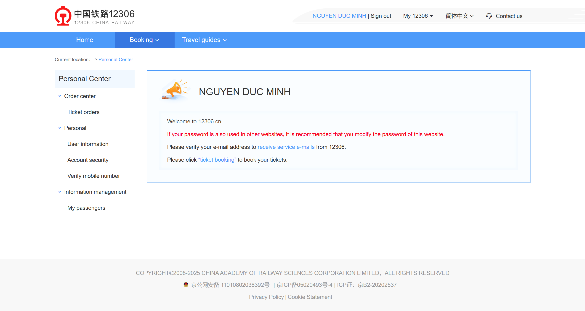

**Dependencies:** REQ-2.2.3

**Scenarios:**
- Open the personal center home page after login
  - **GIVEN:** The user is logged in and is on the home page.
  - **WHEN:** Click the top "My 12306" entry.
  - **THEN:** Navigate to the personal center home page and show the left menu items "Personal Center", "Order center", "Personal", and "Information management", the icon "assets/noticepic.png", the user name, and the notice box text.

#### REQ-4.1.3 Open default ticket search from personal center home page
Provide a link with the text "ticket booking" on the personal center home page and navigate to the ticket search results page with the default search conditions of departure place Beijing, arrival place Shanghai, and the current date after it is clicked.

**Dependencies:** REQ-4.1.2, REQ-3.2.14

**Scenarios:**
- Open the default ticket search from the personal center notice link
  - **GIVEN:** The user is on the personal center home page.
  - **WHEN:** Click the link "ticket booking" in the notice box.
  - **THEN:** Navigate to the ticket search results page and show the default results for departure place Beijing, arrival place Shanghai, and the current date.

### REQ-4.2 Order Center
Provide a "Ticket orders" page under "Order center" with the tabs "Uncompleted orders", "Upcoming trips", and "History orders". 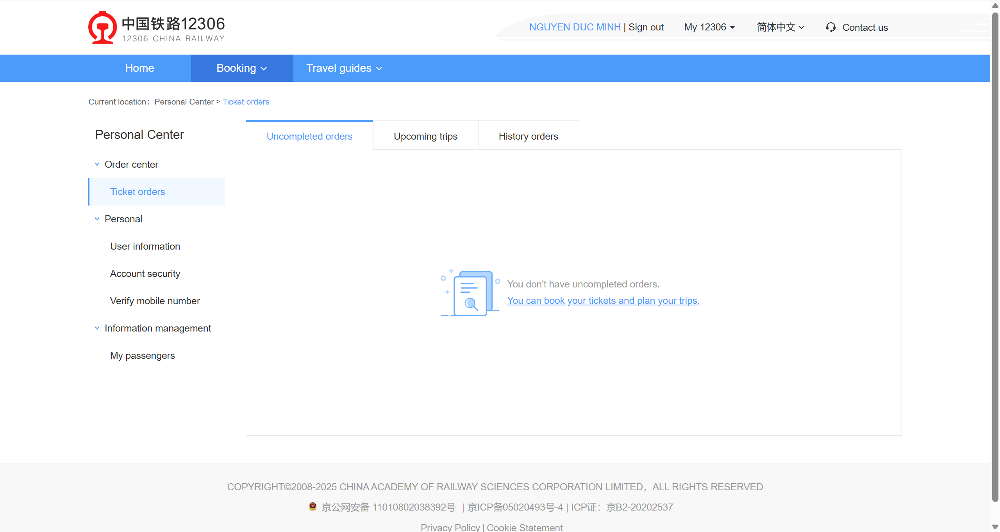

**Dependencies:** REQ-4.1.2

#### REQ-4.2.1 Open ticket orders page
Allow the user to click "Order center", expand the submenu, click "Ticket orders", and show the order page with the tabs "Uncompleted orders", "Upcoming trips", and "History orders". 

**Dependencies:** REQ-4.1.2

**Scenarios:**
- Open the ticket orders page from the order center menu
  - **GIVEN:** The user is on the personal center home page.
  - **WHEN:** Click "Order center" and then click "Ticket orders".
  - **THEN:** The page shows the ticket orders view with the tabs "Uncompleted orders", "Upcoming trips", and "History orders".

#### REQ-4.2.2 Show empty uncompleted orders state
When the "Uncompleted orders" tab has no order, show "assets/empty.png" and the text "You don't have uncompleted orders.". 

**Dependencies:** REQ-4.2.1

**Scenarios:**
- Display the empty state in uncompleted orders
  - **GIVEN:** The user is on the "Uncompleted orders" tab and there is no uncompleted order.
  - **WHEN:** Observe the tab content.
  - **THEN:** The page shows "assets/empty.png" and the text "You don't have uncompleted orders.".

#### REQ-4.2.3 Open default ticket search from empty uncompleted orders state
When the "Uncompleted orders" tab is empty, provide the link "You can book your tickets and plan your trips." and navigate to the default ticket search results page after it is clicked.

**Dependencies:** REQ-4.2.2, REQ-3.2.14

**Scenarios:**
- Open the default ticket search from the empty uncompleted orders state
  - **GIVEN:** The user is on the empty "Uncompleted orders" tab.
  - **WHEN:** Click the link "You can book your tickets and plan your trips.".
  - **THEN:** Navigate to the ticket search results page and show the default results for departure place Beijing, arrival place Shanghai, and the current date.

#### REQ-4.2.4 View uncompleted orders table
Display a table in "Uncompleted orders" where each row represents one passenger order, and transfer tickets are grouped together. The table columns are "Train Information", "Passenger Information", "Seat Information", "Price", "Status", and "Total Price". Each order group is followed by a "Pay" button. 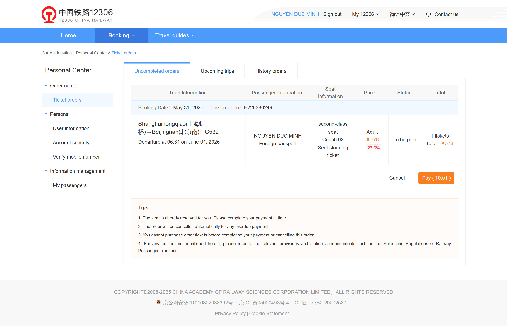

**Dependencies:** REQ-4.2.1

**Scenarios:**
- Display uncompleted orders in a table
  - **GIVEN:** The user is on the "Uncompleted orders" tab and there is at least one uncompleted order.
  - **WHEN:** Observe the order table.
  - **THEN:** The page shows the columns "Train Information", "Passenger Information", "Seat Information", "Price", "Status", and "Total Price", and each order group is followed by a "Pay" button.

#### REQ-4.2.5 Open payment page from uncompleted orders
Allow the user to click the "Pay" button for one uncompleted order and enter the order payment page that shows the order information and payment information.

**Dependencies:** REQ-4.2.4, REQ-5.3.5

**Scenarios:**
- Continue payment from the uncompleted orders tab
  - **GIVEN:** The user is on the "Uncompleted orders" tab with at least one displayed order group.
  - **WHEN:** Click the "Pay" button for one order group.
  - **THEN:** Navigate to the order payment page and show the order information and payment information.

#### REQ-4.2.6 Show empty upcoming trips state
When the "Upcoming trips" tab has no order, show "assets/empty.png" and the text "You don't have any bookings or we can't access your bookings at this time.".

**Dependencies:** REQ-4.2.1

**Scenarios:**
- Display the empty state in upcoming trips
  - **GIVEN:** The user is on the "Upcoming trips" tab and there is no upcoming trip.
  - **WHEN:** Observe the tab content.
  - **THEN:** The page shows "assets/empty.png" and the text "You don't have any bookings or we can't access your bookings at this time.".

#### REQ-4.2.7 Open default ticket search from empty upcoming trips state
When the "Upcoming trips" tab is empty, provide the link "You can make travel plans through the ticket reservation function." and navigate to the default ticket search results page after it is clicked.

**Dependencies:** REQ-4.2.6, REQ-3.2.14

**Scenarios:**
- Open the default ticket search from the empty upcoming trips state
  - **GIVEN:** The user is on the empty "Upcoming trips" tab.
  - **WHEN:** Click the link "You can make travel plans through the ticket reservation function.".
  - **THEN:** Navigate to the ticket search results page and show the default results for departure place Beijing, arrival place Shanghai, and the current date.

#### REQ-4.2.8 Filter upcoming trips by date range
Provide a filter in the "Upcoming trips" tab with a dropdown containing "Search by booking date" and "Search by departure date", two date pickers for the range, and a "Search" button that shows the matching upcoming orders.

**Dependencies:** REQ-4.2.1

**Scenarios:**
- Filter upcoming trips by a selected date type and range
  - **GIVEN:** The user is on the "Upcoming trips" tab.
  - **WHEN:** Choose one option from the date type dropdown, choose a start date and end date, and click the "Search" button.
  - **THEN:** The page shows the upcoming orders that match the selected date type and date range.

#### REQ-4.2.9 Search upcoming trips by keyword
Provide a search input in the "Upcoming trips" tab with the placeholder "Order number/train number/name" and a "Search" button. The search uses both the date filter and the fuzzy search keyword. If the input is invalid, show the message "Please enter a valid search condition.".

**Dependencies:** REQ-4.2.8

**Scenarios:**
- Search upcoming trips with a valid keyword
  - **GIVEN:** The user is on the "Upcoming trips" tab with valid date filter settings.
  - **WHEN:** Enter a valid value in the input with the placeholder "Order number/train number/name" and click the "Search" button.
  - **THEN:** The page shows the upcoming orders that match both the date filter and the keyword.
- Reject an invalid upcoming trips search condition
  - **GIVEN:** The user is on the "Upcoming trips" tab.
  - **WHEN:** Enter an invalid search condition and click the "Search" button.
  - **THEN:** The page shows "Please enter a valid search condition.".

#### REQ-4.2.10 View upcoming trips table
Display the "Upcoming trips" orders in a table with the columns "Train Information", "Passenger Information", "Seat Information", "Price", "Status", and "Total Price". Transfer tickets are grouped together. 

**Dependencies:** REQ-4.2.1

**Scenarios:**
- Display upcoming trips in a table
  - **GIVEN:** The user is on the "Upcoming trips" tab and there is at least one upcoming order.
  - **WHEN:** Observe the order table.
  - **THEN:** The page shows the columns "Train Information", "Passenger Information", "Seat Information", "Price", "Status", and "Total Price" for the upcoming trips.

#### REQ-4.2.11 Refund an upcoming trip
Allow the user to click the "Refund" button for one upcoming order, submit a refund request before the refund deadline, open the refund page that shows the order and refund information, update the order status to "refunded", and add the refunded order to the history orders.

**Dependencies:** REQ-4.2.10

**Scenarios:**
- Refund one eligible upcoming trip
  - **GIVEN:** The user is on the "Upcoming trips" tab with at least one order that is still within the refund deadline.
  - **WHEN:** Click the "Refund" button for one order.
  - **THEN:** The page opens the refund flow, the refund succeeds, the order status becomes "refunded", and the order is added to "History orders".

#### REQ-4.2.12 Open upcoming trips from booking navigation dropdown
Allow the user to open the personal center order center directly to the "Upcoming trips" page from the "Refund" option in the "Booking" dropdown in the home page navigation bar.

**Dependencies:** REQ-4.2.1

**Scenarios:**
- Open upcoming trips from the booking dropdown
  - **GIVEN:** The user is on the home page.
  - **WHEN:** Open the "Booking" dropdown in the navigation bar and click the "Refund" option.
  - **THEN:** Navigate directly to the personal center order center and show the "Upcoming trips" page.

#### REQ-4.2.13 Show empty history orders state
When the "History orders" tab has no order, show "assets/empty.png" and the text "You don't have any bookings or we can't access your bookings at this time.".

**Dependencies:** REQ-4.2.1

**Scenarios:**
- Display the empty state in history orders
  - **GIVEN:** The user is on the "History orders" tab and there is no historical order.
  - **WHEN:** Observe the tab content.
  - **THEN:** The page shows "assets/empty.png" and the text "You don't have any bookings or we can't access your bookings at this time.".

#### REQ-4.2.14 Open default ticket search from empty history orders state
When the "History orders" tab is empty, provide the link "You can make travel plans through the ticket reservation function." and navigate to the default ticket search results page after it is clicked.

**Dependencies:** REQ-4.2.13, REQ-3.2.14

**Scenarios:**
- Open the default ticket search from the empty history orders state
  - **GIVEN:** The user is on the empty "History orders" tab.
  - **WHEN:** Click the link "You can make travel plans through the ticket reservation function.".
  - **THEN:** Navigate to the ticket search results page and show the default results for departure place Beijing, arrival place Shanghai, and the current date.

#### REQ-4.2.15 Filter history orders by date range
Provide a filter in the "History orders" tab with the label "Date of ride", two date pickers for the range, and a "Search" button that shows the matching historical orders.

**Dependencies:** REQ-4.2.1

**Scenarios:**
- Filter history orders by ride date range
  - **GIVEN:** The user is on the "History orders" tab.
  - **WHEN:** Choose a start date and end date under "Date of ride" and click the "Search" button.
  - **THEN:** The page shows the historical orders that match the selected ride date range.

#### REQ-4.2.16 Search history orders by keyword
Provide a search input in the "History orders" tab with the placeholder "Order number/train number/name" and a "Search" button. The search uses both the date filter and the fuzzy search keyword. If the input is invalid, show the message "Please enter a valid search condition.".

**Dependencies:** REQ-4.2.15

**Scenarios:**
- Search history orders with a valid keyword
  - **GIVEN:** The user is on the "History orders" tab with a valid date range selected.
  - **WHEN:** Enter a valid value in the input with the placeholder "Order number/train number/name" and click the "Search" button.
  - **THEN:** The page shows the history orders that match both the selected date range and the keyword.
- Reject an invalid history orders search condition
  - **GIVEN:** The user is on the "History orders" tab.
  - **WHEN:** Enter an invalid search condition and click the "Search" button.
  - **THEN:** The page shows "Please enter a valid search condition.".

#### REQ-4.2.17 View history orders table
Display the "History orders" table with the columns "Train Information", "Passenger Information", "Seat Information", "Price", "Status", and "Total Price". Transfer tickets are grouped together. 

**Dependencies:** REQ-4.2.1

**Scenarios:**
- Display historical orders in a table
  - **GIVEN:** The user is on the "History orders" tab and there is at least one historical order.
  - **WHEN:** Observe the order table.
  - **THEN:** The page shows the columns "Train Information", "Passenger Information", "Seat Information", "Price", "Status", and "Total Price" for the history orders.

### REQ-4.3 Personal Information
Provide the "Personal" submenu with the entries "User information", "Account security", and "Verify mobile number".

**Dependencies:** REQ-4.1.2

#### REQ-4.3.1 View user information page
Open the "User information" page and display the sections "Essential information", "Contact information", and "Additional information". The "Essential information" section shows "Account number", "Name", "Gender", "Nationality", "ID type", and "ID number". The default "ID type" is "Foreign passport". The "Contact information" section shows "Email". The "Additional information" section shows "Passenger type" with the default value "Adult". 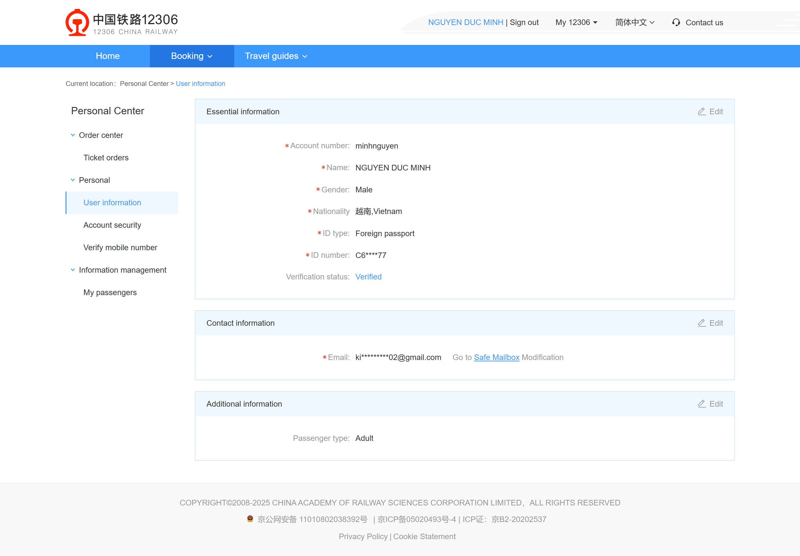

**Dependencies:** REQ-4.1.2

**Scenarios:**
- Open and view the user information page
  - **GIVEN:** The user is on the personal center.
  - **WHEN:** Click "Personal" and then click "User information".
  - **THEN:** The page shows the sections "Essential information", "Contact information", and "Additional information" with the corresponding fields.

#### REQ-4.3.2 Edit essential information
Allow the user to click the "Edit" button in the "Essential information" section, switch the section to an editable state with the button text changed to "Save", edit "Gender" through the options "Male" and "Female", edit the password through a password input, reject an invalid new password with the message "Please enter a valid password.", and keep the other essential information fields read-only.

**Dependencies:** REQ-4.3.1

**Scenarios:**
- Save valid edits in the essential information section
  - **GIVEN:** The user is on the "User information" page.
  - **WHEN:** Click the "Edit" button in the "Essential information" section, update the editable fields, and click the "Save" button.
  - **THEN:** The section returns to display mode and shows the saved values for the editable fields.
- Reject an invalid password in the essential information section
  - **GIVEN:** The user is on the "User information" page with the "Essential information" section in edit mode.
  - **WHEN:** Enter an invalid new password and click the "Save" button.
  - **THEN:** The page shows "Please enter a valid password." and does not save the invalid password.

#### REQ-4.3.3 Edit contact information
Allow the user to click the "Edit" button in the "Contact information" section, switch the section to an editable state with the button text changed to "Save", edit the "Email" field, and save the updated contact information.

**Dependencies:** REQ-4.3.1

**Scenarios:**
- Save a new email address in the contact information section
  - **GIVEN:** The user is on the "User information" page.
  - **WHEN:** Click the "Edit" button in the "Contact information" section, enter a new email address, and click the "Save" button.
  - **THEN:** The section returns to display mode and shows the saved email address.

#### REQ-4.3.4 Edit additional information
Allow the user to click the "Edit" button in the "Additional information" section, switch the section to an editable state with the button text changed to "Save", edit "Passenger type" through a dropdown with the options "Adult" and "Child", and save the updated value.

**Dependencies:** REQ-4.3.1

**Scenarios:**
- Save a new passenger type in the additional information section
  - **GIVEN:** The user is on the "User information" page.
  - **WHEN:** Click the "Edit" button in the "Additional information" section, choose one option from the "Passenger type" dropdown, and click the "Save" button.
  - **THEN:** The section returns to display mode and shows the saved passenger type.

#### REQ-4.3.5 View account security page
Open the "Account security" page and show the entries "Login password" and "Security mailbox". 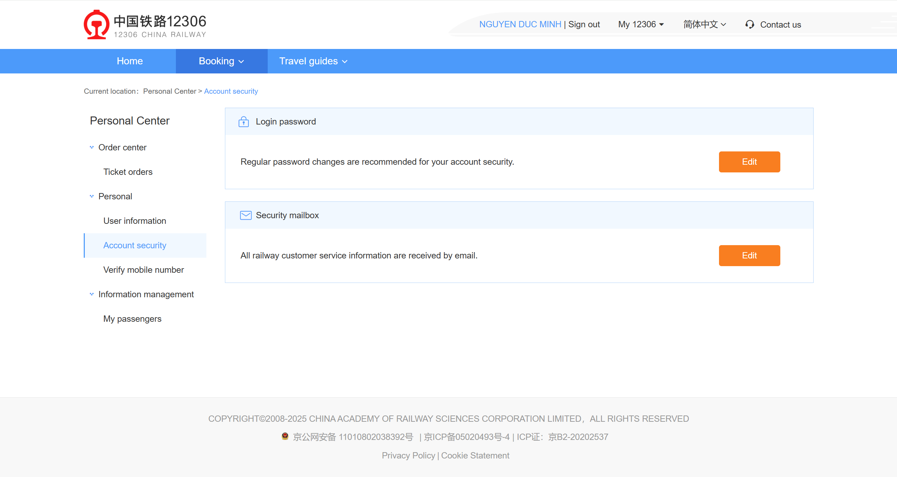

**Dependencies:** REQ-4.1.2

**Scenarios:**
- Open and view the account security page
  - **GIVEN:** The user is on the personal center.
  - **WHEN:** Click "Personal" and then click "Account security".
  - **THEN:** The page shows the entries "Login password" and "Security mailbox".

#### REQ-4.3.6 Edit login password from account security page
Allow the user to click the "Edit" button in the "Login password" section, open a password change form with the fields "Current password: ", "New password: ", and "Confirm your password: ", and the buttons "Cancel" and "Determine". Reject missing fields with "Please fill in all password fields.", reject an incorrect current password with "Incorrect current password.", reject mismatched new passwords with "New passwords do not match.", and persist the new password and show a successful password change message after valid submission. 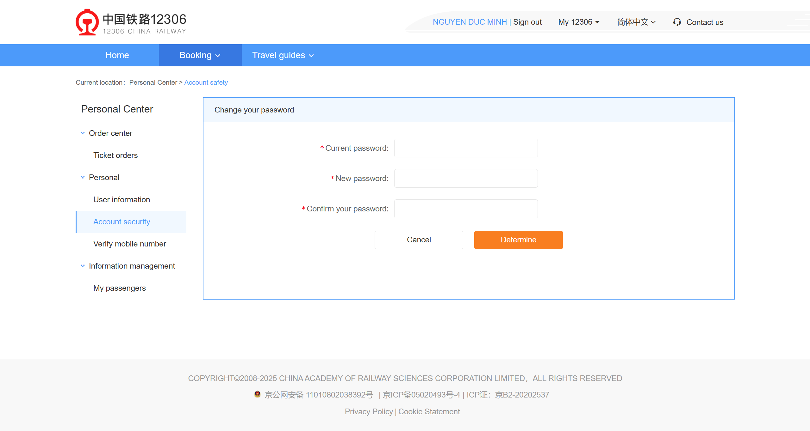

**Dependencies:** REQ-4.3.5

**Scenarios:**
- Save a valid password change from the account security page
  - **GIVEN:** The user is on the password change form with the correct current password entered and matching valid values entered in "New password: " and "Confirm your password: ".
  - **WHEN:** Click the "Determine" button.
  - **THEN:** The system persists the new password and shows a successful password change message.
- Reject a password change with missing fields
  - **GIVEN:** The user is on the password change form with one or more password fields left empty.
  - **WHEN:** Click the "Determine" button.
  - **THEN:** The page shows "Please fill in all password fields.".
- Reject a password change with an incorrect current password
  - **GIVEN:** The user is on the password change form with an incorrect value entered in "Current password: ".
  - **WHEN:** Click the "Determine" button.
  - **THEN:** The page shows "Incorrect current password.".
- Reject a password change with mismatched new passwords
  - **GIVEN:** The user is on the password change form with different values entered in "New password: " and "Confirm your password: ".
  - **WHEN:** Click the "Determine" button.
  - **THEN:** The page shows "New passwords do not match.".

#### REQ-4.3.7 Edit security mailbox
Allow the user to click the "Edit" button in the "Security mailbox" section, open a form showing "Current email address: ", a "New e-mail: " input with the placeholder "Please enter a new email address.", a "Confirm your password: " input with the placeholder "Correct password input to modify personal information.", and the buttons "Cancel" and "Determine". Reject missing fields with "Please fill in the new email and password.", reject an incorrect password with "Incorrect password.", reject an invalid email address with "Invalid email address format.", and persist the new email address and show a successful update message after valid submission. 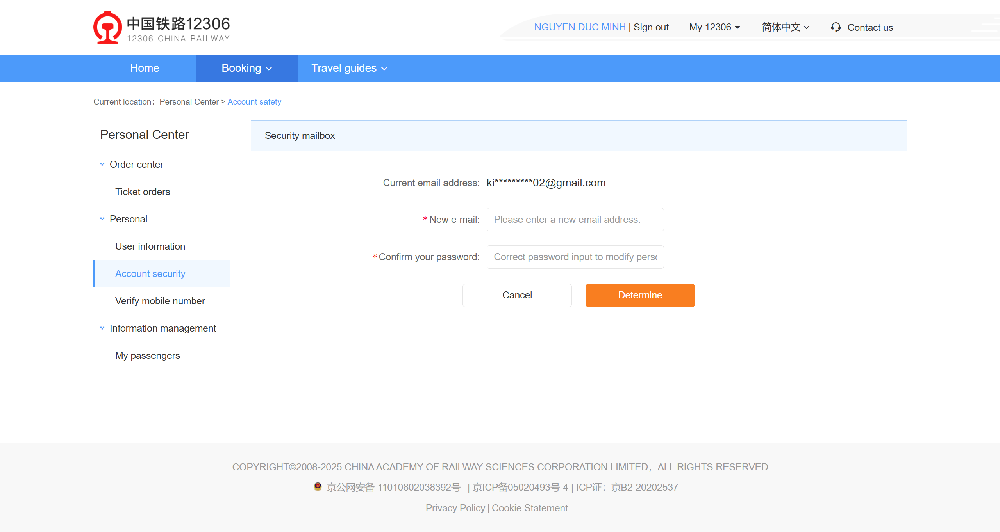

**Dependencies:** REQ-4.3.5

**Scenarios:**
- Save a valid security mailbox update
  - **GIVEN:** The user is on the security mailbox form with a valid new email address and the correct password entered.
  - **WHEN:** Click the "Determine" button.
  - **THEN:** The system persists the new email address and shows a successful security mailbox update message.
- Reject a security mailbox update with missing fields
  - **GIVEN:** The user is on the security mailbox form with the new email field empty, the password field empty, or both.
  - **WHEN:** Click the "Determine" button.
  - **THEN:** The page shows "Please fill in the new email and password.".
- Reject a security mailbox update with an incorrect password
  - **GIVEN:** The user is on the security mailbox form with an incorrect password entered.
  - **WHEN:** Click the "Determine" button.
  - **THEN:** The page shows "Incorrect password.".
- Reject a security mailbox update with an invalid email address
  - **GIVEN:** The user is on the security mailbox form with an invalid value entered in "New e-mail: ".
  - **WHEN:** Click the "Determine" button.
  - **THEN:** The page shows "Invalid email address format.".

#### REQ-4.3.8 Verify mobile number
Open the "Verify mobile number" page and show the current mobile number under "old mobile number: " with the area code in parentheses and the middle four digits hidden, a region-code dropdown and input under "new mobile number: " with the default region code "(+86)" and the placeholder "new mobile number.", an input under "Confirm your password: " with the placeholder "Please enter the login password.", and the buttons "Cancel" and "Determine". Reject missing fields with "Please fill in the new mobile number and password.", reject an incorrect password with "Incorrect password.", reject an invalid mobile number with "Invalid mobile number format.", and persist the new mobile number and show a successful update message after valid submission. 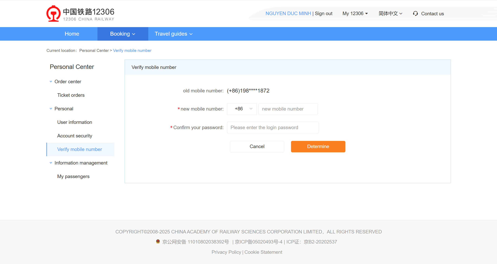

**Dependencies:** REQ-4.1.2

**Scenarios:**
- Save a valid mobile number update
  - **GIVEN:** The user is on the "Verify mobile number" page with a valid new mobile number and the correct password entered.
  - **WHEN:** Click the "Determine" button.
  - **THEN:** The system persists the new mobile number and shows a successful mobile number update message.
- Reject a mobile number update with missing fields
  - **GIVEN:** The user is on the "Verify mobile number" page with the new mobile number field empty, the password field empty, or both.
  - **WHEN:** Click the "Determine" button.
  - **THEN:** The page shows "Please fill in the new mobile number and password.".
- Reject a mobile number update with an incorrect password
  - **GIVEN:** The user is on the "Verify mobile number" page with an incorrect password entered.
  - **WHEN:** Click the "Determine" button.
  - **THEN:** The page shows "Incorrect password.".
- Reject a mobile number update with an invalid mobile number
  - **GIVEN:** The user is on the "Verify mobile number" page with an invalid new mobile number entered.
  - **WHEN:** Click the "Determine" button.
  - **THEN:** The page shows "Invalid mobile number format.".

### REQ-4.4 Information Management
Provide the "Information management" submenu with the "My Passengers" page and passenger maintenance actions.

**Dependencies:** REQ-4.1.2

#### REQ-4.4.1 View my passengers page
Open the "My Passengers" page and display a table with the checkbox header "All" and the columns "Name", "ID type", "ID number", "Mobile number", and "Operation". The current user is shown in the table by default as a frequent passenger who cannot be deleted. 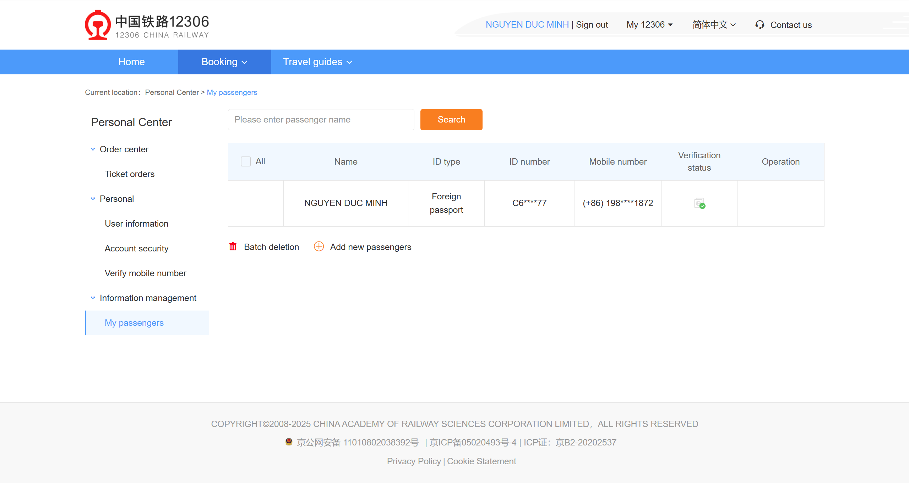

**Dependencies:** REQ-4.1.2

**Scenarios:**
- Open and view the my passengers page
  - **GIVEN:** The user is on the personal center.
  - **WHEN:** Click "Information management" and then click "My Passengers".
  - **THEN:** The page shows a table with the checkbox header "All" and the columns "Name", "ID type", "ID number", "Mobile number", and "Operation", and the current user appears as a passenger entry that cannot be deleted.

#### REQ-4.4.2 Open add passenger form
Allow the user to click the "Add new passengers" button below the table on the "My Passengers" page and open a passenger form with the fields "Nationality", "Name", "Passport number", "Passport expiration date", "Date of birth", "Gender", "Email address", "Mobile number", and "Passenger type", and the buttons "Cancel" and "Determine". The "Passenger type" dropdown contains "Adult" and "Child". 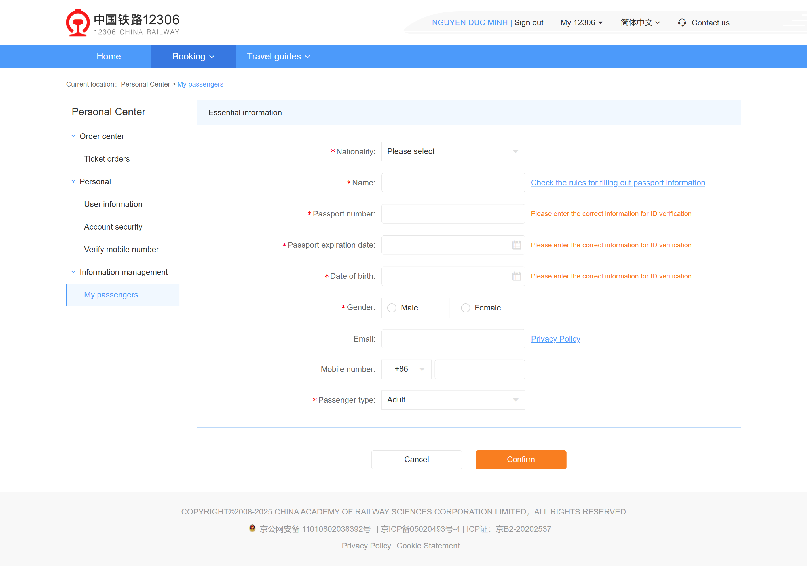

**Dependencies:** REQ-4.4.1

**Scenarios:**
- Open the add passenger form from the passenger list page
  - **GIVEN:** The user is on the "My Passengers" page.
  - **WHEN:** Click the "Add new passengers" button.
  - **THEN:** The page shows the passenger form with the required labeled fields and the buttons "Cancel" and "Determine".

#### REQ-4.4.3 Add a passenger with valid information
Allow the user to add a frequent passenger with valid information, persist the passenger information, and show a successful add message.

**Dependencies:** REQ-4.4.2

**Scenarios:**
- Add a frequent passenger successfully
  - **GIVEN:** The user is on the add passenger form with all required fields filled with valid values, a unique passport number, a valid email address, and a valid mobile number.
  - **WHEN:** Click the "Determine" button.
  - **THEN:** The system persists the passenger information and shows a successful add message.

#### REQ-4.4.4 Block passenger creation with missing required fields
Reject adding a passenger when any required field is missing and show the message "Please fill in all required fields.".

**Dependencies:** REQ-4.4.2

**Scenarios:**
- Submit the add passenger form with missing required information
  - **GIVEN:** The user is on the add passenger form with one or more required fields left empty.
  - **WHEN:** Click the "Determine" button.
  - **THEN:** The page shows "Please fill in all required fields." and does not add the passenger.

#### REQ-4.4.5 Block passenger creation with duplicate passport number
Reject adding a passenger when the passport number already exists and show the message "Passport number already exists.".

**Dependencies:** REQ-4.4.2

**Scenarios:**
- Submit the add passenger form with an existing passport number
  - **GIVEN:** The user is on the add passenger form with a passport number that already exists and all other required fields are valid.
  - **WHEN:** Click the "Determine" button.
  - **THEN:** The page shows "Passport number already exists." and does not add the passenger.

#### REQ-4.4.6 Block passenger creation with invalid email format
Reject adding a passenger when the email address format is invalid and show the message "Invalid email address format.".

**Dependencies:** REQ-4.4.2

**Scenarios:**
- Submit the add passenger form with an invalid email address
  - **GIVEN:** The user is on the add passenger form with an invalid value entered in the "Email address" field and all other required fields are valid.
  - **WHEN:** Click the "Determine" button.
  - **THEN:** The page shows "Invalid email address format." and does not add the passenger.

#### REQ-4.4.7 Block passenger creation with invalid mobile number format
Reject adding a passenger when the mobile number format is invalid and show the message "Invalid mobile number format.".

**Dependencies:** REQ-4.4.2

**Scenarios:**
- Submit the add passenger form with an invalid mobile number
  - **GIVEN:** The user is on the add passenger form with an invalid mobile number entered and all other required fields are valid.
  - **WHEN:** Click the "Determine" button.
  - **THEN:** The page shows "Invalid mobile number format." and does not add the passenger.

#### REQ-4.4.8 Delete one passenger
Allow the user to click the "Delete" button in the "Operation" column for one passenger row other than the current account, open a confirmation dialog with the text "Are you sure you want to delete this passenger?" and the buttons "Cancel" and "Confirm", delete the passenger and show a successful delete message after clicking "Confirm", or cancel the operation after clicking "Cancel".

**Dependencies:** REQ-4.4.1

**Scenarios:**
- Confirm deletion of one passenger
  - **GIVEN:** The user is on the "My Passengers" page and there is at least one deletable passenger row.
  - **WHEN:** Click the "Delete" button for one passenger row and then click the "Confirm" button in the dialog.
  - **THEN:** The passenger is deleted and the page shows a successful delete message.
- Cancel deletion of one passenger
  - **GIVEN:** The user is on the "My Passengers" page with the delete confirmation dialog open.
  - **WHEN:** Click the "Cancel" button in the dialog.
  - **THEN:** The dialog closes and the passenger is not deleted.

#### REQ-4.4.9 Delete multiple passengers in batch
Allow the user to select multiple passenger rows through row checkboxes and the header checkbox "All", click the "Batch deletion" button, open a confirmation dialog with the text "Are you sure you want to delete the selected passengers?" and the buttons "Cancel" and "Confirm", delete the selected passengers and show a successful delete message after clicking "Confirm", or cancel the operation after clicking "Cancel".

**Dependencies:** REQ-4.4.1

**Scenarios:**
- Confirm batch deletion of selected passengers
  - **GIVEN:** The user is on the "My Passengers" page with at least two deletable passenger rows selected.
  - **WHEN:** Click the "Batch deletion" button and then click the "Confirm" button in the dialog.
  - **THEN:** The selected passengers are deleted and the page shows a successful delete message.
- Cancel batch deletion of selected passengers
  - **GIVEN:** The user is on the "My Passengers" page with the batch deletion confirmation dialog open.
  - **WHEN:** Click the "Cancel" button in the dialog.
  - **THEN:** The dialog closes and the selected passengers are not deleted.

#### REQ-4.4.10 Search passengers by name or ID number
Provide a search input above the passenger table with the placeholder "Please enter passenger name" and a "Search" button, allow the user to search by passenger name or ID number, and show the matching passenger information.

**Dependencies:** REQ-4.4.1

**Scenarios:**
- Search the passenger list by a fuzzy condition
  - **GIVEN:** The user is on the "My Passengers" page.
  - **WHEN:** Enter a passenger name or ID number in the input with the placeholder "Please enter passenger name" and click the "Search" button.
  - **THEN:** The table shows the passenger rows that match the search condition.

#### REQ-4.4.11 Clear passenger search and show all passengers
Provide a "×" button in the search input area above the passenger table, clear the search input after clicking it, and show the full passenger list again.

**Dependencies:** REQ-4.4.10

**Scenarios:**
- Clear the passenger search results
  - **GIVEN:** The user is on the "My Passengers" page with a filtered passenger list shown after a search.
  - **WHEN:** Click the "×" button in the search input area.
  - **THEN:** The search input is cleared and the page shows the full passenger list again.

### REQ-4.5 Personal Center Quick Entry
Provide a quick-entry dropdown under the top "My 12306" button with the options "Order center", "User information", "Account security", and "My passengers".

**Dependencies:** REQ-4.1.2

#### REQ-4.5.1 Open pages from my 12306 dropdown
When the user hovers over the top "My 12306" button, show a dropdown that contains "Order center", "User information", "Account security", and "My passengers", and navigate to the personal center with the corresponding tab selected after one option is clicked.

**Dependencies:** REQ-4.1.2

**Scenarios:**
- Open a personal center page from the my 12306 dropdown
  - **GIVEN:** The user is logged in and is on a page where the top "My 12306" button is visible.
  - **WHEN:** Hover over the "My 12306" button and click one option in the dropdown.
  - **THEN:** Navigate to the personal center and show the page that corresponds to the clicked option.

## REQ-5 Ticket Booking
Provide the booking flow from the search results page, including unauthenticated interception, quick login, passenger selection, booking submission, order confirmation, payment, and payment entry from the order center.

**Dependencies:** REQ-3.2.2

### REQ-5.1 Login Interception and Quick Authentication
Require login before booking. When the user clicks one "Book" button without being logged in, show a quick login form instead of continuing directly.

**Dependencies:** REQ-3.2.2

#### REQ-5.1.1 Show quick login form before booking
When the user clicks one "Book" button on the ticket search results page without being logged in, show a quick login form with the title area containing the icon "assets/logo-icon.png" and the text "Login", an input with the placeholder "Email/Username/Mobile number", a password input with the placeholder "Password", and a "LOGIN" button. 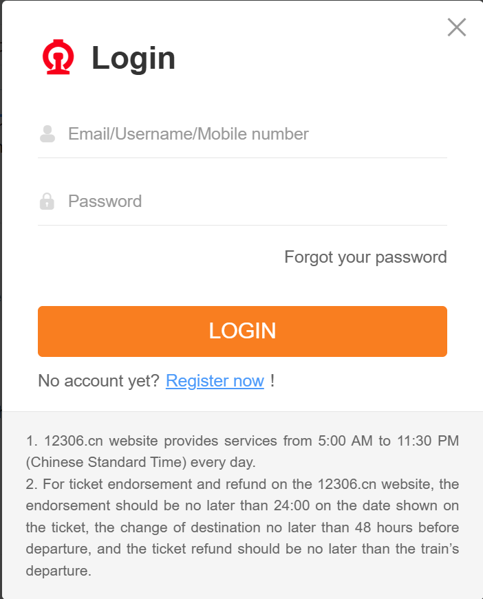

**Dependencies:** REQ-3.2.2

**Scenarios:**
- Show the quick login form for an unauthenticated booking attempt
  - **GIVEN:** The user is not logged in and is on a populated ticket search results page.
  - **WHEN:** Click one "Book" button.
  - **THEN:** The page shows the quick login form with the icon "assets/logo-icon.png", the text "Login", the account input, the password input, and the "LOGIN" button.

#### REQ-5.1.2 Open forgot password page from quick login form
Provide a link with the text "Forgot your password" in the quick login form and navigate to the forgot password page after it is clicked.

**Dependencies:** REQ-5.1.1, REQ-2.4.1

**Scenarios:**
- Open the forgot password page from the quick login form
  - **GIVEN:** The user is viewing the quick login form.
  - **WHEN:** Click the link "Forgot your password".
  - **THEN:** Navigate to the forgot password page.

#### REQ-5.1.3 Open registration page from quick login form
Provide a link with the text "No account yet? Register now." in the quick login form and navigate to the registration page after it is clicked.

**Dependencies:** REQ-5.1.1, REQ-2.1.1

**Scenarios:**
- Open the registration page from the quick login form
  - **GIVEN:** The user is viewing the quick login form.
  - **WHEN:** Click the link "No account yet? Register now.".
  - **THEN:** Navigate to the registration page.

### REQ-5.2 Booking Form
Provide a booking form after the user clicks one "Book" button on the search results page. 

**Dependencies:** REQ-3.2.2

#### REQ-5.2.1 Open booking form from search results
After the user clicks one "Book" button for a valid train result, open the booking form page. 

**Dependencies:** REQ-3.2.2

**Scenarios:**
- Open the booking form from one search result row
  - **GIVEN:** The user is logged in and is on a populated ticket search results page.
  - **WHEN:** Click one "Book" button in the result list.
  - **THEN:** Navigate to the booking form page.

#### REQ-5.2.2 View booking information
Display the booking information section with the title "Train Information:" and the selected train details, including departure place, destination, departure date, train number, seat type, price, and current remaining ticket information such as "business-class seat ( ￥1870.0 ) 32% off 1 left", "first-class seat ( ￥967.0 ) 24% off None left", "second-class seat ( ￥576.0 ) 27% off None left", and "standing ticket ( ￥576.0 ) 27% off Enough left".

**Dependencies:** REQ-5.2.1

**Scenarios:**
- Display the booking information section for the selected train
  - **GIVEN:** The user is on the booking form page.
  - **WHEN:** Observe the "Train Information:" section.
  - **THEN:** The section shows the selected train details, the seat types, the prices, and the current remaining ticket information.

#### REQ-5.2.3 Select passengers for booking
Display the passenger section with the title "Passenger Information:" and the user's frequent passengers. When the user selects one or more passengers, add one row per selected passenger to the table. The table columns are "Ticket class", "Ticket type", "Name", "ID type", "ID number", "Nationality", and "Operation". The "Ticket class" dropdown contains "Business-class seat", "First-class seat", "Second-class seat", and "Standing ticket". The "Ticket type" dropdown contains "Adult" and "Child". The "Operation" column contains a "Delete" button.

**Dependencies:** REQ-5.2.1, REQ-4.4.1

**Scenarios:**
- Add selected passengers to the booking table
  - **GIVEN:** The user is on the booking form page and has at least one frequent passenger available.
  - **WHEN:** Select one or more passengers from the frequent passenger list.
  - **THEN:** The passenger table shows one row for each selected passenger with the columns "Ticket class", "Ticket type", "Name", "ID type", "ID number", "Nationality", and "Operation".

#### REQ-5.2.4 Open terms of service page from booking form
Provide a link with the text "I have read and agree to the Terms of Service" on the booking form page and navigate to the terms page that contains the title "Terms of Service" after it is clicked.

**Dependencies:** REQ-5.2.1, REQ-2.5.1

**Scenarios:**
- Open the terms of service page from the booking form
  - **GIVEN:** The user is on the booking form page.
  - **WHEN:** Click the link "I have read and agree to the Terms of Service".
  - **THEN:** Navigate to the terms page and show the title "Terms of Service".

#### REQ-5.2.5 Submit valid booking information
Provide the buttons "Previous step" and "Place order" on the booking form page. When the user clicks "Place order" with at least one selected passenger and all selected ticket classes still having available tickets, persist the booking information and show a successful booking message.

**Dependencies:** REQ-5.2.3

**Scenarios:**
- Submit a valid booking request
  - **GIVEN:** The user is on the booking form page with at least one passenger selected and each selected ticket class still having available tickets.
  - **WHEN:** Click the "Place order" button.
  - **THEN:** The system persists the booking information and shows a successful booking message.

#### REQ-5.2.6 Block booking submission without selected passengers
Reject booking submission when no passenger is selected and show the message "Please select at least one passenger.".

**Dependencies:** REQ-5.2.1

**Scenarios:**
- Submit the booking form without selecting any passenger
  - **GIVEN:** The user is on the booking form page with no passenger selected.
  - **WHEN:** Click the "Place order" button.
  - **THEN:** The page shows "Please select at least one passenger." and does not continue to the confirmation step.

#### REQ-5.2.7 Block booking submission without ticket availability
Reject booking submission when one selected passenger has a ticket class with no remaining tickets and show the message "Sorry, there are no tickets available for the selected ticket class.".

**Dependencies:** REQ-5.2.3

**Scenarios:**
- Submit the booking form with an unavailable ticket class
  - **GIVEN:** The user is on the booking form page with at least one passenger selected and one selected ticket class having no remaining tickets.
  - **WHEN:** Click the "Place order" button.
  - **THEN:** The page shows "Sorry, there are no tickets available for the selected ticket class." and does not continue to the confirmation step.

### REQ-5.3 Order Confirmation and Payment
Provide order confirmation, order payment, order status transitions, and order-center payment and cancellation entry points.

**Dependencies:** REQ-5.2.5

#### REQ-5.3.1 Confirm submitted booking information
After the user submits booking information, open a confirmation dialog with the title "Please confirm the following information.", show the train information and passenger information, and provide the buttons "Confirm" and "Edit". Clicking "Confirm" confirms the order information and shows a successful submission message. Clicking "Edit" returns to the booking information page. 

**Dependencies:** REQ-5.2.5

**Scenarios:**
- Confirm the order information and continue
  - **GIVEN:** The user has successfully submitted valid booking information.
  - **WHEN:** Click the "Confirm" button in the confirmation dialog.
  - **THEN:** The order information is confirmed and the system shows a successful order submission message.
- Return to edit from the confirmation dialog
  - **GIVEN:** The user is viewing the confirmation dialog after a valid booking submission.
  - **WHEN:** Click the "Edit" button.
  - **THEN:** Return to the booking information page.

#### REQ-5.3.2 View payment page
After the user confirms the order information, open the payment page. The top of the page shows "Seats are locked, Time remained to complete your payment:" with a live 20-minute countdown in the format "MM:SS". The page also shows "Order details" with the same order information as the confirmation page, and the total price in the format "Total: ￥xxxx.xx". 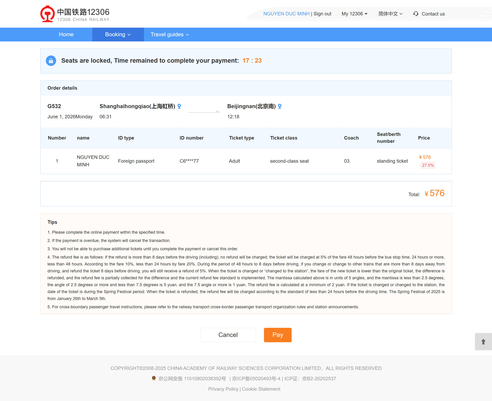

**Dependencies:** REQ-5.3.1

**Scenarios:**
- Open the payment page after confirming the order
  - **GIVEN:** The user has confirmed the order information.
  - **WHEN:** The payment step opens.
  - **THEN:** The page shows "Seats are locked, Time remained to complete your payment:", a live countdown in the format "MM:SS", "Order details", and the total price in the format "Total: ￥xxxx.xx".

#### REQ-5.3.3 Cancel order from payment page
Provide a "Cancel" button on the payment page. Clicking it cancels the order, releases the locked seats, and shows a successful cancellation message.

**Dependencies:** REQ-5.3.2

**Scenarios:**
- Cancel the order from the payment page
  - **GIVEN:** The user is on the payment page for an unpaid order.
  - **WHEN:** Click the "Cancel" button.
  - **THEN:** The order is cancelled, the locked seats are released, and the page shows a successful cancellation message.

#### REQ-5.3.4 Pay for order from payment page
Provide a "Pay" button on the payment page. Clicking it simulates a successful payment.

**Dependencies:** REQ-5.3.2

**Scenarios:**
- Complete payment from the payment page
  - **GIVEN:** The user is on the payment page for an unpaid order.
  - **WHEN:** Click the "Pay" button.
  - **THEN:** The system simulates a successful payment.

#### REQ-5.3.5 Show unpaid order in uncompleted orders tab
When the user reaches the payment page after confirming the order but does not complete payment, set the order status as unpaid and show the order in the "Uncompleted orders" tab of the order center.

**Dependencies:** REQ-5.3.2

**Scenarios:**
- Show an unpaid order in the uncompleted orders tab
  - **GIVEN:** The user has confirmed the order information and is on the payment page without completing payment.
  - **WHEN:** Leave the order unpaid.
  - **THEN:** The order status is set as unpaid and the order appears in the "Uncompleted orders" tab.

#### REQ-5.3.6 Show paid order in upcoming trips tab
When the user completes payment and the travel time has not yet arrived, set the order status as paid and upcoming, and show the order in the "Upcoming trips" tab of the order center.

**Dependencies:** REQ-5.3.4

**Scenarios:**
- Show a paid upcoming order in the upcoming trips tab
  - **GIVEN:** The user has an unpaid order on the payment page and the travel time has not yet arrived.
  - **WHEN:** Click the "Pay" button and complete the simulated payment.
  - **THEN:** The order status is set as paid and upcoming, and the order appears in the "Upcoming trips" tab.

#### REQ-5.3.7 Show cancelled order in uncompleted orders tab
When the user cancels the order from the payment page, set the order status as cancelled and show the order in the "Uncompleted orders" tab of the order center.

**Dependencies:** REQ-5.3.3

**Scenarios:**
- Show a cancelled order in the uncompleted orders tab
  - **GIVEN:** The user is on the payment page for an unpaid order.
  - **WHEN:** Click the "Cancel" button and complete the cancellation.
  - **THEN:** The order status is set as cancelled and the order appears in the "Uncompleted orders" tab.

#### REQ-5.3.8 Continue payment from order center
Allow the user to click the "Pay" button for one unpaid order in the "Uncompleted orders" tab and open the order payment page.

**Dependencies:** REQ-4.2.4, REQ-5.3.2

**Scenarios:**
- Open the payment page from the uncompleted orders tab
  - **GIVEN:** The user is on the "Uncompleted orders" tab with at least one unpaid order.
  - **WHEN:** Click the "Pay" button for one unpaid order.
  - **THEN:** Navigate to the order payment page.

#### REQ-5.3.9 Cancel order from order center
Allow the user to click the "Cancel" button for one unpaid order in the "Uncompleted orders" tab, open a confirmation dialog with the text "Are you sure you want to cancel this order?" and the buttons "Cancel" and "Confirm", cancel the order and release the locked seats after clicking "Confirm", or close the dialog without cancelling after clicking "Cancel".

**Dependencies:** REQ-4.2.4

**Scenarios:**
- Confirm cancellation of an unpaid order from the order center
  - **GIVEN:** The user is on the "Uncompleted orders" tab with at least one unpaid order.
  - **WHEN:** Click the "Cancel" button for one order and then click the "Confirm" button in the dialog.
  - **THEN:** The order is cancelled, the locked seats are released, and the page shows a successful cancellation message.
- Cancel the cancellation action from the order center dialog
  - **GIVEN:** The user is on the "Uncompleted orders" tab with the cancellation confirmation dialog open.
  - **WHEN:** Click the "Cancel" button in the dialog.
  - **THEN:** The dialog closes and the order remains unchanged.

## REQ-6 Travel Guide
Provide one unified travel guide page with the content categories "Ticketing", "Endorsement and refund", and "Miscellaneous", along with multiple quick-entry routes from the navigation dropdown and the home page "Quick Guide" section.

**Dependencies:** REQ-1

### REQ-6.1 Travel Guide Page
Allow the user to open the travel guide page from the home page navigation bar. The page shows three tabs: "Ticketing", "Endorsement and refund", and "Miscellaneous". Each tab shows the corresponding travel guidance content. 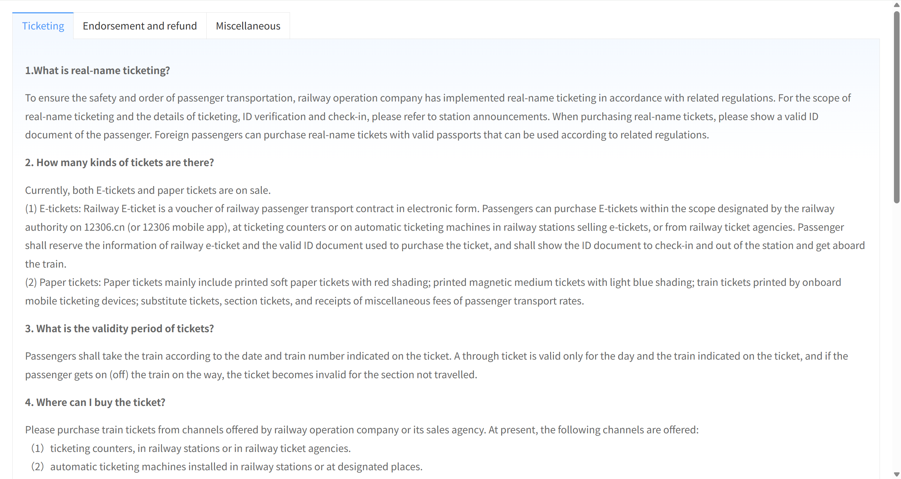

**Dependencies:** REQ-1.1

#### REQ-6.1.1 Open travel guide page from navigation bar
Open the travel guide page from the "Travel guide" link in the home page navigation bar and display the three guide tabs and their corresponding content. 

**Dependencies:** REQ-1.1

**Scenarios:**
- Open the travel guide page from the navigation bar
  - **GIVEN:** The user is on the home page.
  - **WHEN:** Click the "Travel guide" link in the navigation bar.
  - **THEN:** Navigate to the travel guide page and show the tabs "Ticketing", "Endorsement and refund", and "Miscellaneous".

### REQ-6.2 Travel Guide Dropdown Navigation
Allow the user to hover over the "Travel guide" navigation item, open a dropdown that contains the three guide categories and direct links to category tabs and question anchors. 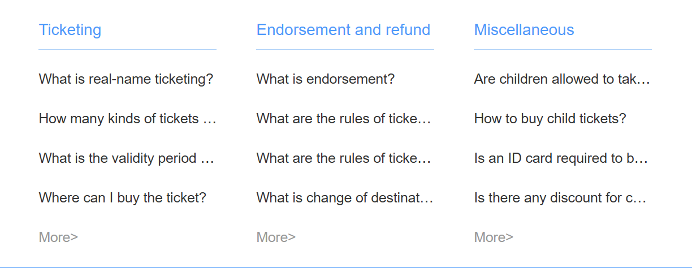

**Dependencies:** REQ-1.1

#### REQ-6.2.1 Open travel guide tab from dropdown more link
When the user hovers over "Travel guide" in the navigation bar, show a dropdown containing the categories "Ticketing", "Endorsement and refund", and "Miscellaneous". Under each category, provide one "More" link that navigates to the travel guide page and positions the page on the corresponding category tab. 

**Dependencies:** REQ-1.1, REQ-6.1.1

**Scenarios:**
- Open one guide category tab from the dropdown more link
  - **GIVEN:** The user is on the home page.
  - **WHEN:** Hover over "Travel guide" in the navigation bar and click one "More" link in the dropdown.
  - **THEN:** Navigate to the travel guide page and position the page on the corresponding category tab.

#### REQ-6.2.2 Open travel guide question from dropdown question link
When the user hovers over "Travel guide" in the navigation bar, show a dropdown containing four question links under each of the categories "Ticketing", "Endorsement and refund", and "Miscellaneous". Clicking one question link navigates to the travel guide page, positions the page on the corresponding category tab, and positions the page on the corresponding question.

**Dependencies:** REQ-1.1, REQ-6.1.1

**Scenarios:**
- Open one guide question from the navigation dropdown
  - **GIVEN:** The user is on the home page.
  - **WHEN:** Hover over "Travel guide" in the navigation bar and click one question link in the dropdown.
  - **THEN:** Navigate to the travel guide page, position the page on the correct category tab, and position the page on the selected question.

### REQ-6.3 Home Quick Guide Navigation
Use the home page "Quick Guide" section to navigate directly to common questions or to the travel guide page.

**Dependencies:** REQ-1.2, REQ-6.1.1

#### REQ-6.3.1 Open common question from quick guide
Display four common-question links in the home page "Quick Guide" section: "How to book tickets online?", "How to change or refund tickets?", "How to check train status?", and "How to use 12306 mobile app?". Clicking one link navigates to the travel guide page and positions the page on the corresponding question.

**Dependencies:** REQ-1.2, REQ-6.1.1

**Scenarios:**
- Open one common question from the home page quick guide section
  - **GIVEN:** The user is on the home page.
  - **WHEN:** Click one common-question link in the "Quick Guide" section.
  - **THEN:** Navigate to the travel guide page and position the page on the corresponding question.

#### REQ-6.3.2 Open travel guide page from quick guide more link
Display a link with the text "More" in the home page "Quick Guide" section and navigate to the travel guide page positioned on the "Ticketing" tab after it is clicked.

**Dependencies:** REQ-1.2, REQ-6.1.1

**Scenarios:**
- Open the travel guide page from the quick guide more link
  - **GIVEN:** The user is on the home page.
  - **WHEN:** Click the "More" link in the "Quick Guide" section.
  - **THEN:** Navigate to the travel guide page and position the page on the "Ticketing" tab.
