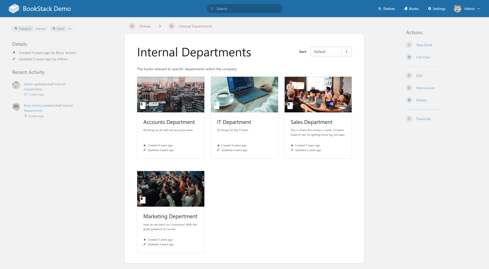
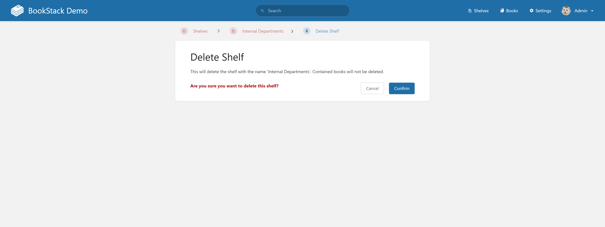
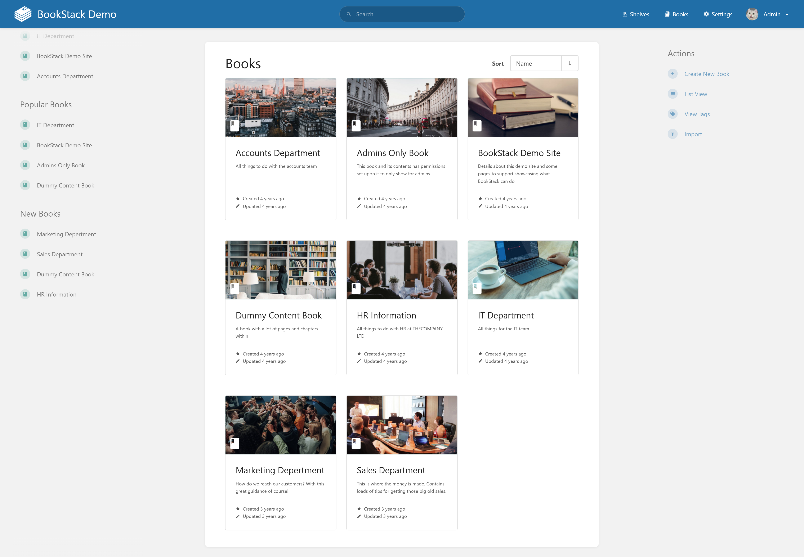
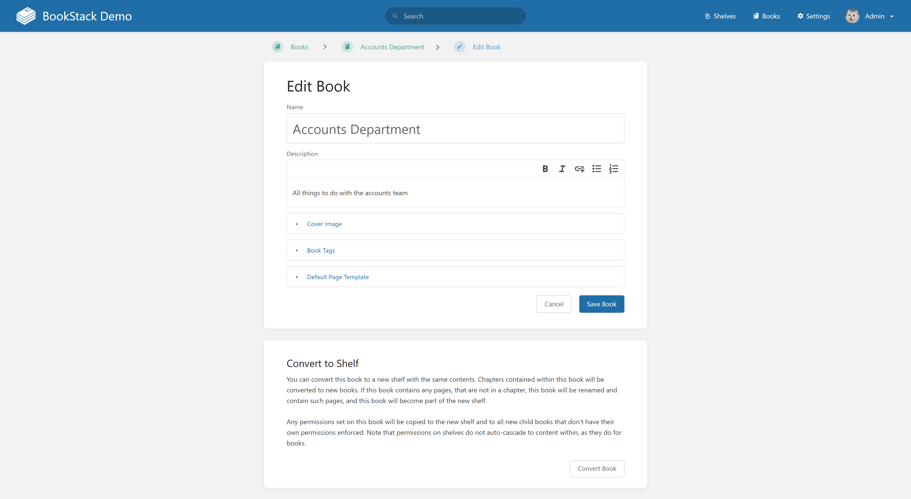
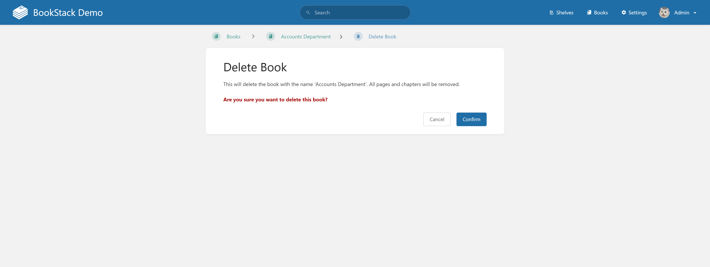
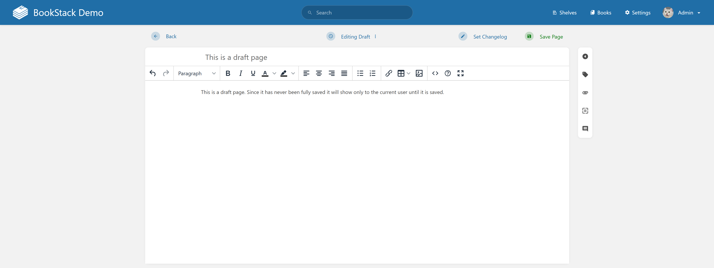
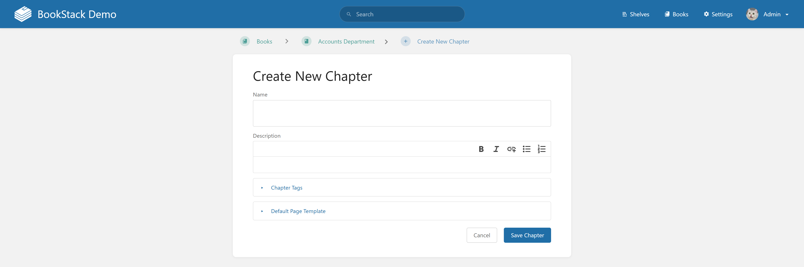
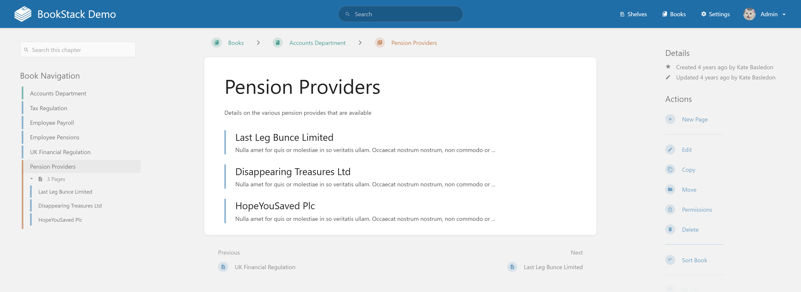
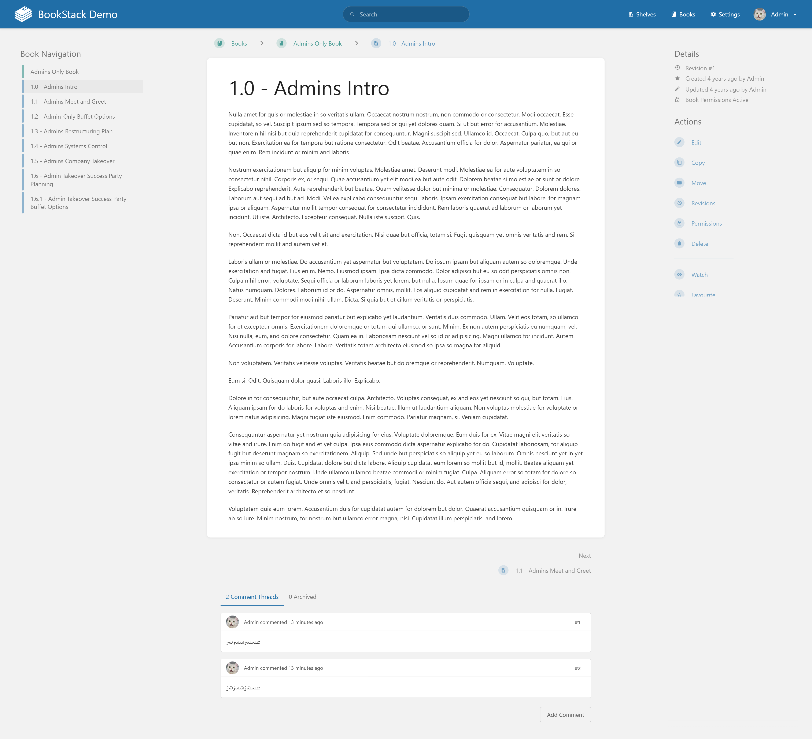
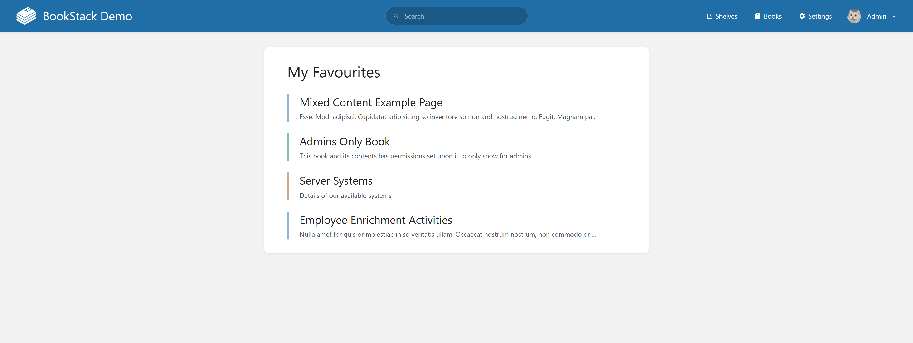

# BookStack Knowledge Base System
Web-based knowledge base/document management system, completing the construction of front-end and back-end infrastructure.

## REQ-1 BookStack Homepage
Defaults to the homepage, including the top navigation bar, search box, and other activities and quick entry points that need to be displayed. Reference image 

**Dependencies:** None

### REQ-1.1 Open Homepage
Open the system and enter the homepage.

**Dependencies:** None

**Scenarios:**
- Open Homepage
  - **GIVEN:** System is accessible.
  - **WHEN:** Open the system
  - **THEN:** Defaults to the homepage

### REQ-1.2 Back to homepage from other pages
Click the logo to return to the homepage.

**Dependencies:** REQ-1.1

**Scenarios:**
- Back to homepage from other pages
  - **GIVEN:** User is on a non-homepage page and the top navigation bar is visible.
  - **WHEN:** Click the 'BookStack' logo on the top left of the navigation bar from other pages
  - **THEN:** Redirect to the homepage

## REQ-2 User Authentication and Session Module
Provides login entry and session state, recording the login status. Login page  Homepage after login 

**Dependencies:** REQ-1

### REQ-2.1 Enter Login Page
Navigate to the login form.

**Dependencies:** REQ-1.1

**Scenarios:**
- Enter Login Page
  - **GIVEN:** User is on the homepage and is not logged in.
  - **WHEN:** Click 'Login' on the right side of the homepage navigation bar
  - **THEN:** Redirect to the login form page.

### REQ-2.2 Login successful and enter homepage after login
Fill in credentials and log in.

**Dependencies:** REQ-2.1

**Scenarios:**
- Login successful and enter homepage after login
  - **GIVEN:** User is on the login form page.
  - **WHEN:** Enter valid email and password, check 'Remember Me', and click Login
  - **THEN:** Redirect to the homepage, with the user nickname displayed in the upper right corner

## REQ-3 Homepage after login (Dashboard) module
Displays overview information after login, including recent drafts, recent views, most viewed favorites, recently updated pages, and recent activity stream, and provides a dark mode switch (placeholder implementation). Reference image 

**Dependencies:** REQ-2

### REQ-3.1 Enter homepage after login
View the dashboard layout after login.

**Dependencies:** REQ-2.2

**Scenarios:**
- Enter homepage after login
  - **GIVEN:** User has logged in successfully.
  - **WHEN:** Redirect after successful login
  - **THEN:** Display dashboard layout and multiple information cards.

## REQ-4 Shelves Module
Shelves serve as the top-level container for content organization, including name, description, books, and tag attributes; support viewing shelf lists, entering shelf details, editing shelves, and deleting shelves (with confirmation page/box). Shelf list page 

**Dependencies:** REQ-1

### REQ-4.1 View Shelf List
Navigate to the shelf list page.

**Dependencies:** REQ-1.1

**Scenarios:**
- View Shelf List
  - **GIVEN:** User is on a page with the top navigation bar visible.
  - **WHEN:** Click Shelves at the top
  - **THEN:** Enter the shelf list page.

### REQ-4.2 Shelf Details Page
Displays detailed information for a shelf, including book lists and related Actions. Reference image 

**Dependencies:** REQ-4.1

#### REQ-4.2.1 Enter Shelf Details Page
Click a shelf to view its details.

**Dependencies:** REQ-4.1

**Scenarios:**
- Enter Shelf Details Page
  - **GIVEN:** User is on the shelf list page and at least one shelf is displayed.
  - **WHEN:** Click on any shelf on the shelf list page
  - **THEN:** Enter the shelf details page

### REQ-4.3 Create New Shelf
Create a new shelf. Type in name, description, and tags. Reference image 

**Dependencies:** REQ-4.2

#### REQ-4.3.1 Create Shelf
Fill out the form and save the shelf.

**Dependencies:** REQ-4.2.1

**Scenarios:**
- Create Shelf
  - **GIVEN:** User is on the shelf details page and can see the Actions list.
  - **WHEN:** Click 'new shelf', enter name, description, add tags, and click 'Save Shelf'
  - **THEN:** Save the shelf and display it on the shelf list page

#### REQ-4.3.2 Cancel Creation
Cancel the shelf creation process.

**Dependencies:** REQ-4.2.1

**Scenarios:**
- Cancel Creation
  - **GIVEN:** User is on the create shelf page.
  - **WHEN:** On the create shelf page, click the 'Cancel' button below
  - **THEN:** Cancel shelf creation and return to the shelf list page

### REQ-4.4 Delete Shelf
The current shelf can be deleted from the shelf details page. Double confirmation is required. Confirmation page 

**Dependencies:** REQ-4.2

#### REQ-4.4.1 Confirm Delete Shelf
Confirm the deletion of a shelf.

**Dependencies:** REQ-4.2.1

**Scenarios:**
- Confirm Delete Shelf
  - **GIVEN:** User is on the shelf details page and can see the Actions list.
  - **WHEN:** Click 'Delete' in Actions, then click 'Confirm' on the Delete Shelf confirmation page
  - **THEN:** Delete the shelf and redirect to the shelf list page

#### REQ-4.4.2 Cancel Delete Shelf
Cancel the deletion of a shelf.

**Dependencies:** REQ-4.2.1

**Scenarios:**
- Cancel Delete Shelf
  - **GIVEN:** User is on the Delete Shelf confirmation page.
  - **WHEN:** Click 'Cancel'
  - **THEN:** Cancel deletion and return to the shelf details page

### REQ-4.5 Edit Shelf
Edit shelf, enter new name and description, add or remove books and tags. Shelf edit page 

**Dependencies:** REQ-4.2

#### REQ-4.5.1 Save Shelf Edits
Modify shelf information and save.

**Dependencies:** REQ-4.2.1

**Scenarios:**
- Save Shelf Edits
  - **GIVEN:** User is on the shelf details page and can see the Actions list.
  - **WHEN:** Click 'Edit', enter new information on the shelf edit page, and click 'Save Shelf'
  - **THEN:** Modify shelf information and return to the shelf details page

#### REQ-4.5.2 Cancel Shelf Edits
Cancel editing the shelf.

**Dependencies:** REQ-4.2.1

**Scenarios:**
- Cancel Shelf Edits
  - **GIVEN:** User is on the shelf edit page.
  - **WHEN:** Click 'Cancel'
  - **THEN:** Cancel modifications and return to the shelf details page

## REQ-5 Books Module
Books contain attributes such as name, description, chapters, and pages. Book list page: 

**Dependencies:** REQ-1

### REQ-5.1 View Books List
Navigate to the Books list page.

**Dependencies:** REQ-1.1

**Scenarios:**
- View Books List
  - **GIVEN:** User is on a page with the top navigation bar visible.
  - **WHEN:** Click Books at the top
  - **THEN:** Enter the Books list page, displaying a grid of book cards and Actions on the right.

### REQ-5.2 Book Details Page
Enter the book details page through the book list, homepage books, shelves, etc., to display detailed book information. Book details page 

**Dependencies:** REQ-5.1

#### REQ-5.2.1 Enter Book Details Page through Book List Page
Click a book from the book list.

**Dependencies:** REQ-5.1

**Scenarios:**
- Enter Book Details Page through Book List Page
  - **GIVEN:** User is on the book list page and at least one book card is displayed.
  - **WHEN:** Click on any book on the book list page
  - **THEN:** Enter the details page of the corresponding book

#### REQ-5.2.2 Enter Book Details Page through Shelf Details Page
Click a book from the shelf details.

**Dependencies:** REQ-4.2.1

**Scenarios:**
- Enter Book Details Page through Shelf Details Page
  - **GIVEN:** User is on the shelf details page and at least one book is listed.
  - **WHEN:** Click on any book in the shelf details page
  - **THEN:** Enter the details page of the corresponding book

### REQ-5.3 Create Book in Book List Page
Create a book on the book list page, providing a Create Book form: Name, Description (rich text), with expandable Cover image / Book Tags / Default Page Template. Reference image 

**Dependencies:** REQ-5.1

#### REQ-5.3.1 Fill out and Save Book
Create a book from the list page.

**Dependencies:** REQ-5.1

**Scenarios:**
- Fill out and Save Book
  - **GIVEN:** User is on the book list page and can see the Actions panel on the right.
  - **WHEN:** Click 'Create New Book', fill in required fields, optionally set cover/tags/template, and click Save Book
  - **THEN:** Success prompt; redirect to the new Book details page or Books list.

#### REQ-5.3.2 Cancel Creating Book
Cancel the book creation process.

**Dependencies:** REQ-5.1

**Scenarios:**
- Cancel Creating Book
  - **GIVEN:** User is on the Create New Book page.
  - **WHEN:** Click Cancel
  - **THEN:** Return to the previous page; do not create a new Book.

### REQ-5.4 Edit Book
Books can be edited on the book details page to modify various attributes. Reference image 

**Dependencies:** REQ-5.2

#### REQ-5.4.1 Save Book Edits
Edit book details and save.

**Dependencies:** REQ-5.2.1

**Scenarios:**
- Save Book Edits
  - **GIVEN:** User is on the book details page and can see the Actions list.
  - **WHEN:** Click 'Edit', modify book attributes on the edit page, and click 'Save Book'
  - **THEN:** Save book attributes and return to the book details page

#### REQ-5.4.2 Cancel Book Edits
Cancel book edits.

**Dependencies:** REQ-5.2.1

**Scenarios:**
- Cancel Book Edits
  - **GIVEN:** User is on the book edit page.
  - **WHEN:** Click 'Cancel'
  - **THEN:** Cancel editing and return to the book details page

### REQ-5.5 Delete Book
The current book can be deleted on the book details page. Double confirmation is required. Confirmation page 

**Dependencies:** REQ-5.2

#### REQ-5.5.1 Confirm Delete Book
Delete the book.

**Dependencies:** REQ-5.2.1

**Scenarios:**
- Confirm Delete Book
  - **GIVEN:** User is on the book details page and can see the Actions list.
  - **WHEN:** Click 'Delete', then click 'Confirm' on the confirmation page
  - **THEN:** Delete book and return to the book list page

#### REQ-5.5.2 Cancel Delete Book
Cancel deleting the book.

**Dependencies:** REQ-5.2.1

**Scenarios:**
- Cancel Delete Book
  - **GIVEN:** User is on the confirmation delete page.
  - **WHEN:** Click 'Cancel'
  - **THEN:** Cancel deletion and return to the book details page

### REQ-5.6 Create Book from Shelf Details Page
On the shelf details page, create a book directly within the shelf. The created book is automatically associated with the shelf.

**Dependencies:** REQ-4.2

#### REQ-5.6.1 Fill out and Save Book with Shelf
Create a book associated with a shelf.

**Dependencies:** REQ-4.2.1

**Scenarios:**
- Fill out and Save Book with Shelf
  - **GIVEN:** User is on the shelf details page and can see the Actions list.
  - **WHEN:** Click 'Create New Book', fill in required fields, and click Save Book
  - **THEN:** Success prompt; redirect to Books list, with the new Book associated with the current shelf.

## REQ-6 Pages and Chapters Module
Pages are the basic units of a book; chapters can combine multiple pages, and chapters can also be added within chapters.

**Dependencies:** REQ-5

### REQ-6.1 Page Edit Page
Create a new page on the book details page. Page edit page  Delete draft confirmation page 

**Dependencies:** REQ-5.2

#### REQ-6.1.1 Save Page
Create and save a new page.

**Dependencies:** REQ-5.2.1

**Scenarios:**
- Save Page
  - **GIVEN:** User is on the book details page.
  - **WHEN:** Click 'New Page', enter page name and content, and click 'Save Page'
  - **THEN:** Save the page, add it to the book, and return to the book details page

#### REQ-6.1.2 Save Draft
Save a page as draft.

**Dependencies:** REQ-5.2.1

**Scenarios:**
- Save Draft
  - **GIVEN:** User is on the page draft page.
  - **WHEN:** Enter content, press Ctrl+S, click 'Draft saved at', and click 'Save Draft'
  - **THEN:** Save draft and display it in the 'My Recent Drafts' list on the homepage

#### REQ-6.1.3 Delete Draft
Delete an existing draft.

**Dependencies:** REQ-6.1.2

**Scenarios:**
- Delete Draft
  - **GIVEN:** User is on the page edit page and a draft exists.
  - **WHEN:** Click 'Draft saved at', click 'Delete Draft', and click 'Confirm' on the confirmation page
  - **THEN:** Delete draft and redirect to the book details page

### REQ-6.2 Create New Chapter
Chapters can be added on the book details page; clicking a chapter redirects to the pages or chapter list within that chapter. Add chapter page  Inside chapter page 

**Dependencies:** REQ-5.2

#### REQ-6.2.1 Create Chapter
Add a new chapter to a book.

**Dependencies:** REQ-5.2.1

**Scenarios:**
- Create Chapter
  - **GIVEN:** User is on the book details page.
  - **WHEN:** Click 'New Chapter', fill in the name and description, and click 'Save Chapter'
  - **THEN:** Create the chapter and add it to the book

### REQ-6.3 Page Reading Page
Click a page from the book or chapter details page to enter the page reading page. Reference image 

**Dependencies:** REQ-6.1, REQ-6.2

#### REQ-6.3.1 Enter Page Reading Page
Read a page.

**Dependencies:** REQ-6.1.1

**Scenarios:**
- Enter Page Reading Page
  - **GIVEN:** User is viewing a list of pages within a book or chapter.
  - **WHEN:** Click some page
  - **THEN:** Enter the page reading page

#### REQ-6.3.2 Redirect to Page Edit Page
Edit a page while reading.

**Dependencies:** REQ-6.3.1

**Scenarios:**
- Redirect to Page Edit Page
  - **GIVEN:** User is on the page reading page and can see the Actions area.
  - **WHEN:** Click 'Edit' on the page reading page
  - **THEN:** Redirect to the edit page for that page.

## REQ-7 Recently Viewed
The homepage displays recently viewed shelves, books, chapters, and pages in the 'My Recently Viewed' list, showing up to ten records.

**Dependencies:** REQ-4, REQ-5, REQ-6

### REQ-7.1 Add to Recently Viewed
Viewing content adds it to the list.

**Dependencies:** REQ-4.2.1, REQ-5.2.1, REQ-6.3.1

**Scenarios:**
- Add to Recently Viewed
  - **GIVEN:** User is browsing content pages in the system.
  - **WHEN:** Open and enter shelf details page, book details page, page reading page, or chapter details page
  - **THEN:** Add to recently viewed and update the 'My Recently Viewed' list on the homepage

### REQ-7.2 Quick Navigation from Recently Viewed
Clicking a recently viewed item navigates to it.

**Dependencies:** REQ-7.1

**Scenarios:**
- Quick Navigation from Recently Viewed
  - **GIVEN:** The homepage shows a 'My Recently Viewed' list with at least one item.
  - **WHEN:** Click an item in the 'My Recently Viewed' list
  - **THEN:** Quickly enter the corresponding content details page

## REQ-8 Favorites
Shelves, books, chapters, and pages can be favorited and displayed in the 'My Most Viewed Favorites' list on the homepage, showing up to 4 items. A favorites page is provided to view all favorites. Favorites page 

**Dependencies:** REQ-4, REQ-5, REQ-6

### REQ-8.1 Favorite Items
Favorite shelves, books, chapters, and pages.

**Dependencies:** REQ-4.2.1, REQ-5.2.1, REQ-6.3.1, REQ-6.2.1

**Scenarios:**
- Favorite Items
  - **GIVEN:** User is on a shelf details page, book details page, chapter details page, or page reading page.
  - **WHEN:** Click 'Favorite' on the shelf details page, book details page, chapter details page, or page reading page
  - **THEN:** Add to the favorites list, and the corresponding button changes to 'Unfavorite'

### REQ-8.2 Quick Navigation from Favorites
Navigate via the favorites list.

**Dependencies:** REQ-8.1

**Scenarios:**
- Quick Navigation from Favorites
  - **GIVEN:** The homepage or favorites page shows a favorites list with at least one item.
  - **WHEN:** Click a list item in 'My Most Viewed Favorites' on the homepage or favorites page
  - **THEN:** Enter the corresponding content details page

## REQ-9 Recently Updated Pages
Add recently created or edited pages to the homepage, showing up to 5 items.

**Dependencies:** REQ-6.1

### REQ-9.1 Quick Navigation from Recently Updated
Navigate via the recently updated pages list.

**Dependencies:** REQ-6.1.1

**Scenarios:**
- Quick Navigation from Recently Updated
  - **GIVEN:** The homepage shows a 'Recently Updated Pages' list with at least one item.
  - **WHEN:** Click an item in the 'Recently Updated Pages' list on the homepage
  - **THEN:** Enter the reading page of the corresponding page
