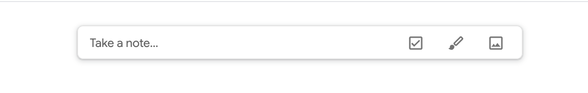
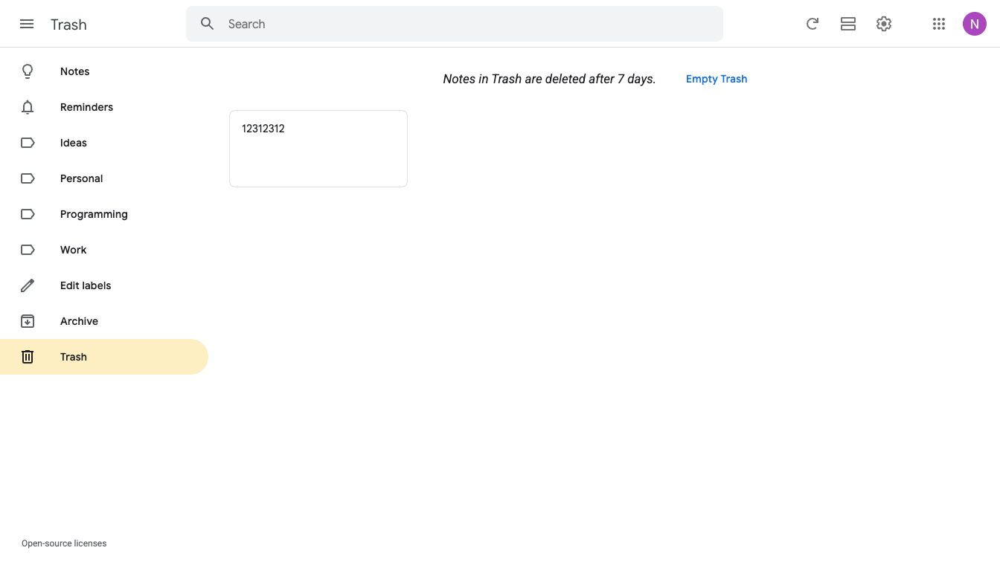
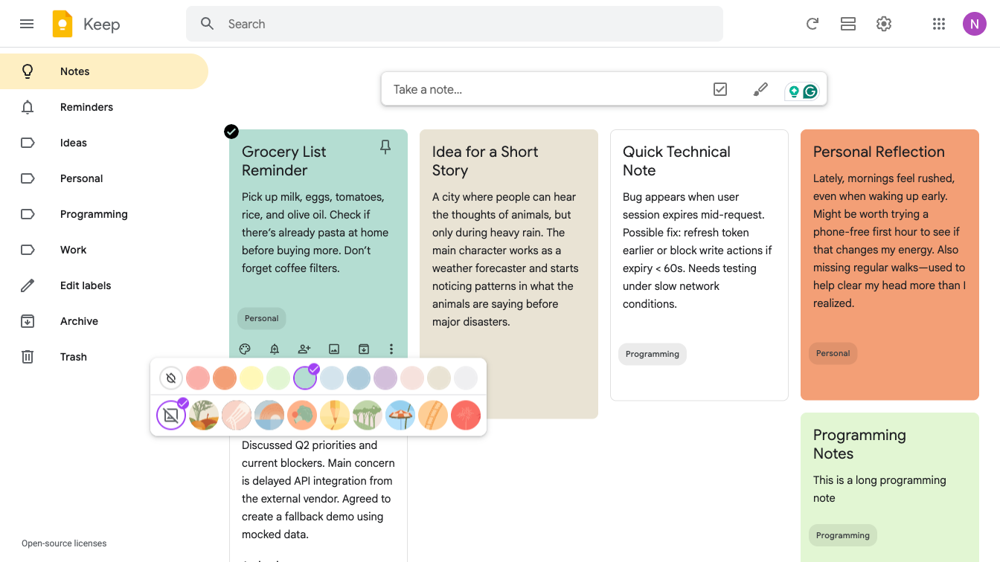
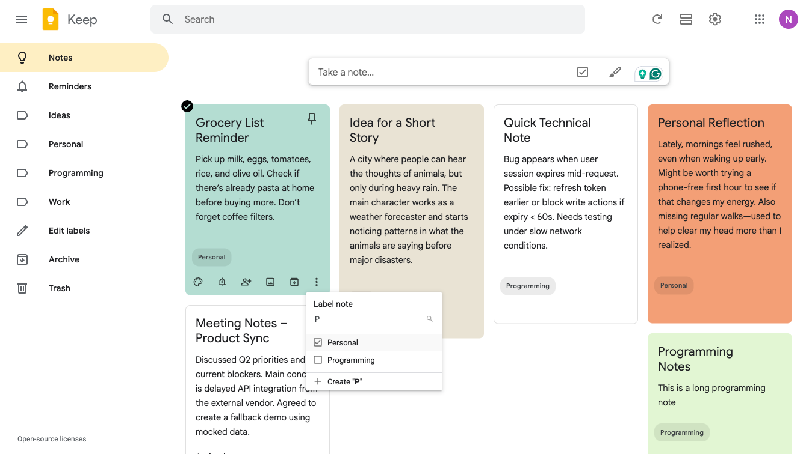
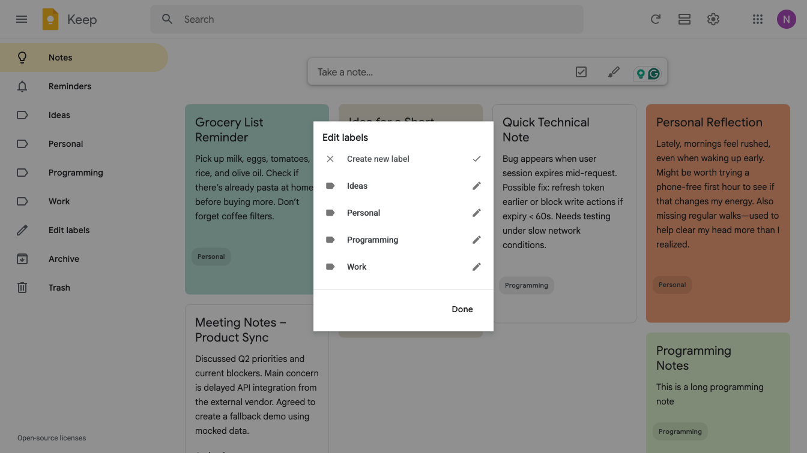
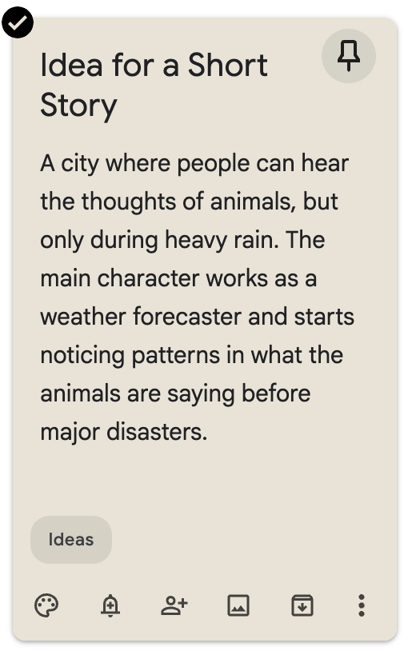
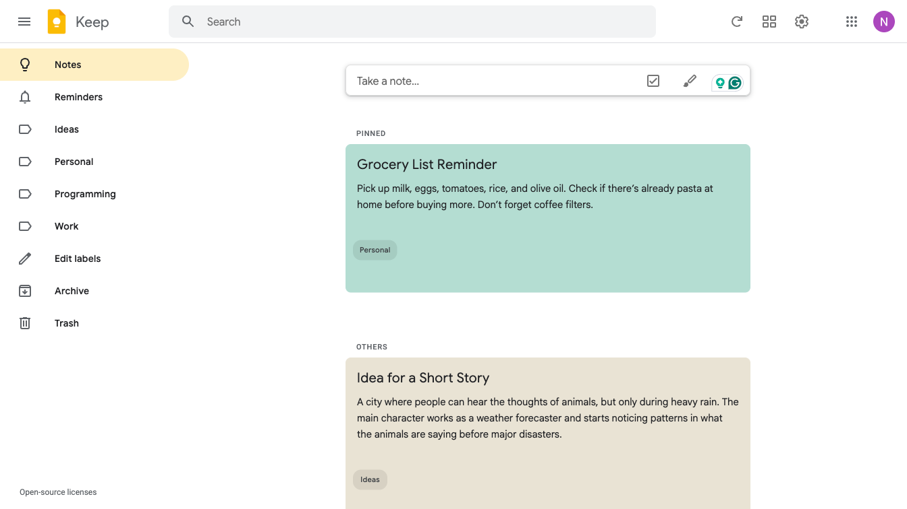
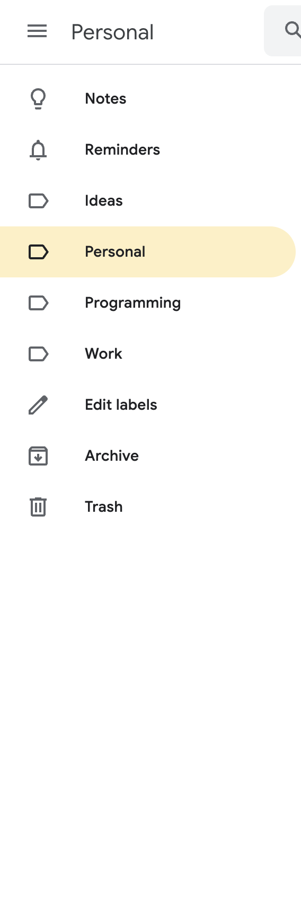
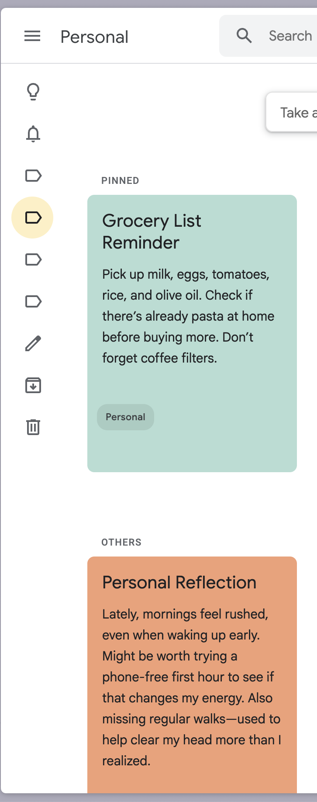

# Keep
A notes management system. Allows user to manage and organize notes.

## REQ-1 Google Keep Home Page
This page is the main working area of the app. It contains all the notes (scrollable), there are notes pinned to the top and notes that aren't. It will also have header with search and settings. Sidebar with common used functionalities and tags for quick filtering.

Reference image: 

**Dependencies:** None

### REQ-1.1 Enter Website
Open the system and verify the home page shows up.

**Dependencies:** None

**Scenarios:**
- Enter Website
  - **GIVEN:** User has a browser (or the app) and network access.
  - **WHEN:** Enter the website / app
  - **THEN:** The home page should show up

## REQ-2 Notes Management
This is the core feature of the Keep app. It manages CRUD functionalities of notes. Able to read listing notes, create new notes, update existing note or delete notes.

Reference image: 

**Dependencies:** REQ-1

### REQ-2.1 Note Listing
Make sure notes listing have proper spacing and matches with reference image.

Reference image: 

**Dependencies:** None

**Scenarios:**
- Note Listing
  - **GIVEN:** User has opened the app and the system is accessible.
  - **WHEN:** Open the app
  - **THEN:** Note list shows up

### REQ-2.2 Create Note
This feature allow users to create a note. There is a 'Take a note' form. When the form is clicked will animate zoom up a form for user to enter the title and content of the note, the note autosaves. User can click Close or click outside of the form to exit.

'Take a note' form from homepage image: 
Note form image: 

**Dependencies:** REQ-2.1

**Scenarios:**
- Create Note
  - **GIVEN:** User is on the home page.
  - **WHEN:** From homepage, clicks the 'Enter a note' form, enters title and content, and clicks 'Close'
  - **THEN:** The note is autosaved, the note form closes and note is placed to the list.

### REQ-2.3 Delete Note
This allows users to delete and undo the delete of notes.

**Dependencies:** REQ-2.2

#### REQ-2.3.1 Delete
To delete the note, user clicks the three dot at the end and choose 'Delete Note' from the dropdown. No confirmation is needed.

Dropdown image: 

**Dependencies:** None

**Scenarios:**
- Delete
  - **GIVEN:** User is on the home page and can see at least one note.
  - **WHEN:** Hover a note, click more options, and choose 'Delete Note' option
  - **THEN:** Shows notification indicating it's deleted

#### REQ-2.3.2 Notification and Undo
After the note is deleted successfully, a message is shown at the bottom left corner. Saying 'Note trashed' with undo button. When the undo button is clicked, the note will be recovered. When undo is clicked, notification saying 'Action undone' shows. The notification should be closable and automatically closed if not actioned after sometimes.

Reference image for notification: 

**Dependencies:** REQ-2.3.1

**Scenarios:**
- Notification and Undo
  - **GIVEN:** User is on the home page and can see at least one note.
  - **WHEN:** Choose 'Delete Note' option, then click Undo button in the visible delete notification
  - **THEN:** Shows a pop up saying Action undone and note is recovered

#### REQ-2.3.3 Trash list
On left side bar, when click on 'Trash' shows the list of all deleted notes. User can also empty trash that will delete immediately other wise trash is automatically deleted in 7 days.

Reference image: 

**Dependencies:** REQ-2.3.1

**Scenarios:**
- Trash list
  - **GIVEN:** User can see the sidebar.
  - **WHEN:** Click on Trash icon
  - **THEN:** List of deleted items show up

### REQ-2.4 Update Note
This feature is to edit an existing content of a note.

Reference image: 

**Dependencies:** REQ-2.2

**Scenarios:**
- Update Note
  - **GIVEN:** User is on the home page and can see a note.
  - **WHEN:** Click on a note, edit the content, and click close note
  - **THEN:** Note is closed and content is updated

### REQ-2.5 Archive Note
This feature allows archive and unarchive notes, they are not deleted. User can also see list of archived notes.

**Dependencies:** REQ-2.2

#### REQ-2.5.1 Archive
User clicks the archive button on a note. Notification with message and 'Undo' button is shown. Clicking undo will un-archive the note.

Reference image: 

**Dependencies:** None

**Scenarios:**
- Archive
  - **GIVEN:** User is on the home page and can see a note.
  - **WHEN:** Click archive on a note
  - **THEN:** The note goes to archive list and notification show with undo option

#### REQ-2.5.2 Archive Undo
Undo an archived note.

**Dependencies:** REQ-2.5.1

**Scenarios:**
- Archive Undo
  - **GIVEN:** The archive notification is visible after archiving a note.
  - **WHEN:** Click undo option
  - **THEN:** Note goes back to main list

#### REQ-2.5.3 Show archived notes
On left side bar, when click on 'Archived' shows the list of all archived notes.

Reference image: 

**Dependencies:** REQ-2.5.1

**Scenarios:**
- Show archived notes
  - **GIVEN:** User can see the sidebar.
  - **WHEN:** On side bar, click Archived list
  - **THEN:** Shows archived notes

#### REQ-2.5.4 Unarchive
When a note is archived, the restore icon should be shown and when clicked it will restore the archived note back to main list.

Reference image: 

**Dependencies:** REQ-2.5.3

**Scenarios:**
- Unarchive
  - **GIVEN:** User is viewing the archived notes list.
  - **WHEN:** Click Unarchive on a note
  - **THEN:** The note disappears in the archived list and shows up in main list

### REQ-2.6 Note Coloring
User can add colors or background of a note and user can choose from many different colors.

Reference image: 

**Dependencies:** REQ-2.2

#### REQ-2.6.1 Change note color
Change the color of an existing note.

**Dependencies:** None

**Scenarios:**
- Change note color
  - **GIVEN:** User is on the home page and can see a note.
  - **WHEN:** Choose the colorboard of a note and choose light green color
  - **THEN:** Note background should be light green

#### REQ-2.6.2 Choose note color when created
Set note color during creation.

**Dependencies:** None

**Scenarios:**
- Choose note color when created
  - **GIVEN:** User has opened the 'Take a note' form.
  - **WHEN:** Click color board, choose color, enter title and content
  - **THEN:** Note is created with chosen color

### REQ-2.7 Labels Management
User can tag notes by different labels and manage those labels

**Dependencies:** REQ-2.2

#### REQ-2.7.1 Assign label to a note
Users can assign multiple labels to a note.

Reference image: 

**Dependencies:** None

**Scenarios:**
- Assign label to a note
  - **GIVEN:** User is on the home page and can see a note.
  - **WHEN:** Click 'More options', choose 'Change labels', and tick on a label
  - **THEN:** Label is assigned and shown in note

#### REQ-2.7.2 Remove label from a note
Remove an assigned label.

**Dependencies:** REQ-2.7.1

**Scenarios:**
- Remove label from a note
  - **GIVEN:** User is on the home page and can see a note with a label.
  - **WHEN:** Click 'More options', choose 'Change labels', and untick on a label
  - **THEN:** Label is removed from the note

#### REQ-2.7.3 Default label
Reminders is a default label.

**Dependencies:** None

**Scenarios:**
- Default label
  - **GIVEN:** System is initialized.
  - **WHEN:** View the labels list
  - **THEN:** Reminders is a default label with unique icon

#### REQ-2.7.4 Assign default label when creating note
Assign 'Reminders' label when creating a note.

**Dependencies:** REQ-2.7.3

**Scenarios:**
- Assign default label when creating note
  - **GIVEN:** User is on the home page and 'Take a note' form is open.
  - **WHEN:** Click 'Reminders' icon, enter title and content
  - **THEN:** Note is created with Reminders label

#### REQ-2.7.5 Edit labels
User can manage list of labels. User can delete, add, edit labels from the list.

Reference image: 

**Dependencies:** REQ-2.7.1

**Scenarios:**
- Edit labels
  - **GIVEN:** User can see the sidebar.
  - **WHEN:** Click 'Edit Labels', edit a label name, and save the changes
  - **THEN:** Label changes are reflected

#### REQ-2.7.6 View by labels
Sidebar will show all labels and user can select to show list of notes with chosen label.

Reference image: 

**Dependencies:** REQ-2.7.1

##### REQ-2.7.6.1 View list filtered by label
Filter notes by label.

**Dependencies:** None

**Scenarios:**
- View list filtered by label
  - **GIVEN:** User can see the sidebar.
  - **WHEN:** Click a specific label on side bar
  - **THEN:** Only notes with that label show up

##### REQ-2.7.6.2 View all notes
View all notes.

**Dependencies:** None

**Scenarios:**
- View all notes
  - **GIVEN:** User can see the sidebar.
  - **WHEN:** Click 'notes' on side bar
  - **THEN:** All notes show up

##### REQ-2.7.6.3 View Reminders
View Reminders.

**Dependencies:** None

**Scenarios:**
- View Reminders
  - **GIVEN:** User can see the sidebar.
  - **WHEN:** Click 'Reminders' on side bar
  - **THEN:** Only notes with Reminders label show up

### REQ-2.8 Pinned Notes
Users can pin frequently used notes to the top or unpin it as needed

**Dependencies:** REQ-2.2

#### REQ-2.8.1 Pin note
User can pin note by clicking the pin button.

Reference image: 

**Dependencies:** None

**Scenarios:**
- Pin note
  - **GIVEN:** User is on the home page and can see a note.
  - **WHEN:** Click pin button in a note
  - **THEN:** Icon indicates the note is pinned and note appears in the pinned section at the top

#### REQ-2.8.2 Unpin note
User can unpin note.

**Dependencies:** REQ-2.8.1

**Scenarios:**
- Unpin note
  - **GIVEN:** User is on the home page and the note is pinned.
  - **WHEN:** Click unpin button in the pinned note
  - **THEN:** Note is unpinned and moved back with the rest

#### REQ-2.8.3 Pin note when creating it
Pin a note during creation.

**Dependencies:** None

**Scenarios:**
- Pin note when creating it
  - **GIVEN:** User is on the home page and 'Take a note' form is open.
  - **WHEN:** Enter title and content, and click pin button
  - **THEN:** Note is created and pinned to top

## REQ-3 Search
Users can search based on keywords and filters within notes.

**Dependencies:** REQ-2

### REQ-3.1 Initial suggested filters
When clicked on the search bar up top, a list of filters will show up to choose from, by colors, tags, ... When choose the suggested filters page will show only matching ones.

Image reference: 

**Dependencies:** None

**Scenarios:**
- Initial suggested filters
  - **GIVEN:** User is on the home page.
  - **WHEN:** Click on the search bar at the top and choose a filter from the suggested list
  - **THEN:** List only displays matching items

### REQ-3.2 Search by keyword
User can search by keywords and show matching with highlighted matches.

Image reference: 

**Dependencies:** REQ-3.1

**Scenarios:**
- Search by keyword
  - **GIVEN:** User is on the home page.
  - **WHEN:** Click search bar and enter keyword 'st'
  - **THEN:** List of matching notes with 'st' highlighted

## REQ-4 Settings
User can manage common settings for the app

**Dependencies:** REQ-2

### REQ-4.1 Setting options list
A list of different setting options as shown in reference image: 

**Dependencies:** None

**Scenarios:**
- Setting options list
  - **GIVEN:** User is on the home page.
  - **WHEN:** User clicks on settings icon
  - **THEN:** Shows a list of setting options

### REQ-4.2 Detailed settings
User can manage overall app settings such as moving new notes to bottom or checked items to the bottom.

**Dependencies:** REQ-4.1

**Scenarios:**
- Detailed settings
  - **GIVEN:** User is on the home page and settings options list is visible.
  - **WHEN:** Click on 'Settings'
  - **THEN:** Focus on a list of configurable options with save or cancel button.

## REQ-5 List View & Grid View
User can toggle between list and grid view of notes

Reference image for list view: 

**Dependencies:** REQ-2

### REQ-5.1 Toggle between list and grid views
Switching back and forth between views.

**Dependencies:** None

**Scenarios:**
- Toggle between list and grid views
  - **GIVEN:** User is on the home page.
  - **WHEN:** User click on list icon, then click grid icon
  - **THEN:** Page changes to list view and then changes back to grid view

### REQ-5.2 Grid View by default
Check the default view.

**Dependencies:** None

**Scenarios:**
- Grid View by default
  - **GIVEN:** User has a browser (or the app) and network access.
  - **WHEN:** Enters the website
  - **THEN:** Notes are in grid view and icon shows List view

## REQ-6 Sidebar
The sidebar has commonly used functionalities such as filter by tags or trash, archive buttons, ...

**Dependencies:** REQ-2

### REQ-6.1 Items and styling
Make sure the styling, icons and alignment of sidebar items is consistent, with hover and selected item highlight.

Reference image: 

**Dependencies:** None

**Scenarios:**
- Items and styling
  - **GIVEN:** User has opened the app.
  - **WHEN:** Enters the webpage
  - **THEN:** There is a sidebar opened with consistent styling

### REQ-6.2 Collapsible Sidebar
The sidebar is collapsible, when collapsed only icons will be shown for more spacious layout.

Reference image: 

**Dependencies:** REQ-6.1

**Scenarios:**
- Collapsible Sidebar
  - **GIVEN:** The sidebar is expanded.
  - **WHEN:** Click on close sidebar button, then click again
  - **THEN:** The sidebar collapses showing only icons, then opens up with both icon and item texts
