# GitHub Collaboration Platform

A compact GitHub-style collaboration platform focused on account access, organizations and members, repositories and Git content, issues, pull requests, and basic access control. Users enter as visitors or through authenticated sessions; every write runs in a specific account, organization, repository, branch, or work-item context. Persist accounts and sessions, organization members and teams, repositories with visibility and access roles, branches and commits, file content, issues and comments, and pull requests with review and merge state. On reopen, restore the last successfully saved state. Every write must verify the current identity and resource permission, report failures, and avoid partial objects or partial state changes. Real-time collaboration, Actions, Packages, Wiki, project boards, notification delivery, and external Git remote protocols are outside the core scope.

## REQ-1 Identity and Access

Manages the lifecycle from visitor to authenticated user. Accounts have a unique login name and a verified email identifier; full passwords must never be shown in the interface, recovery flow, or visible logs. A successful sign-in creates a revocable web session used for later authorization. Unless a child requirement states otherwise, a username is 1–39 lowercase ASCII letters, digits, or single hyphens and cannot start or end with a hyphen; a password is 12–128 characters, contains at least one uppercase letter, lowercase letter, digit, and non-alphanumeric special character, and contains no whitespace.

**Type:** FOLDER
**Dependencies:** None

### REQ-1-1 Account Onboarding and Recovery

Capabilities required for visitors to create, recover and access accounts. Registration, sign-in, and recovery use visibly labelled fields and actions; failures retain non-sensitive input but never echo submitted password values.

**Type:** FOLDER
**Dependencies:** None

#### REQ-1-1-1 Register a new GitHub account

The visitor clicks “Sign up”, enters a unique username, email, password, and password confirmation, accepts the terms, and clicks “Create account”. The username follows the REQ-1 format rule. After surrounding whitespace is removed, email contains exactly one `@`, is at most 254 characters, and has a non-empty domain containing a dot with non-empty labels. Password follows the REQ-1 password rule and confirmation matches character-for-character. The system creates a pending-verification account and shows the email-verification prompt. Duplicate usernames/emails, missing fields, malformed email, missing terms acceptance, invalid password, or mismatched confirmation retain username and email, show a field-level reason, and neither create an account nor start verification. A visitor uses this capability from account access pages. The capability requires that the visitor can provide the required account information. The user completes the main choices or confirmation steps for register a new github account. The system validates eligibility, shows any required warnings or unavailable states, and prevents unauthorized changes. The system creates or begins verification for the new account and makes the account available after required checks are complete.
Screenshot reference: 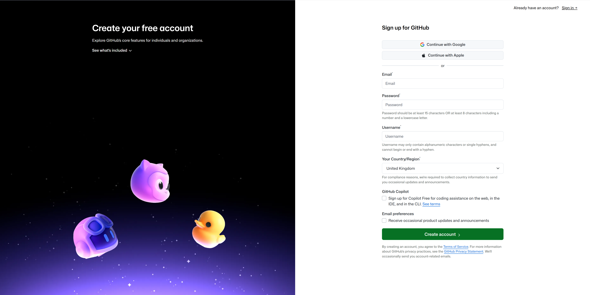

**Type:** ATOMIC
**Dependencies:** None

**Scenarios:**

- Register a new GitHub account
  - **GIVEN:** Visitor is in the relevant GitHub context, and the visitor can provide the required account information.
  - **WHEN:** The visitor clicks “Sign up”, enters a unique username, email, password, and password confirmation, accepts the terms, and clicks “Create account”.
  - **THEN:** The system creates a pending-verification account and shows the email-verification prompt; duplicate usernames/emails or invalid passwords keep the form and show field errors.
  - **THEN:** The visible GitHub page or object reflects the final state when it is opened again.

#### REQ-1-1-2 Sign in with an existing account

This requirement is performed in the authenticated session, page, or persistent resource context established by REQ-1-1-1 (Register a new GitHub account); it must reuse that context and remain consistent when the prerequisite state changes. A visitor signs in from an account access page with either a login name or verified email and a password. Unknown login/email, wrong password, unverified account, and unavailable account display exactly the same generic failure message and create no session. Success creates an authenticated session, opens the user's workspace, and remains authenticated after refresh or reopening the workspace.
Screenshot reference: 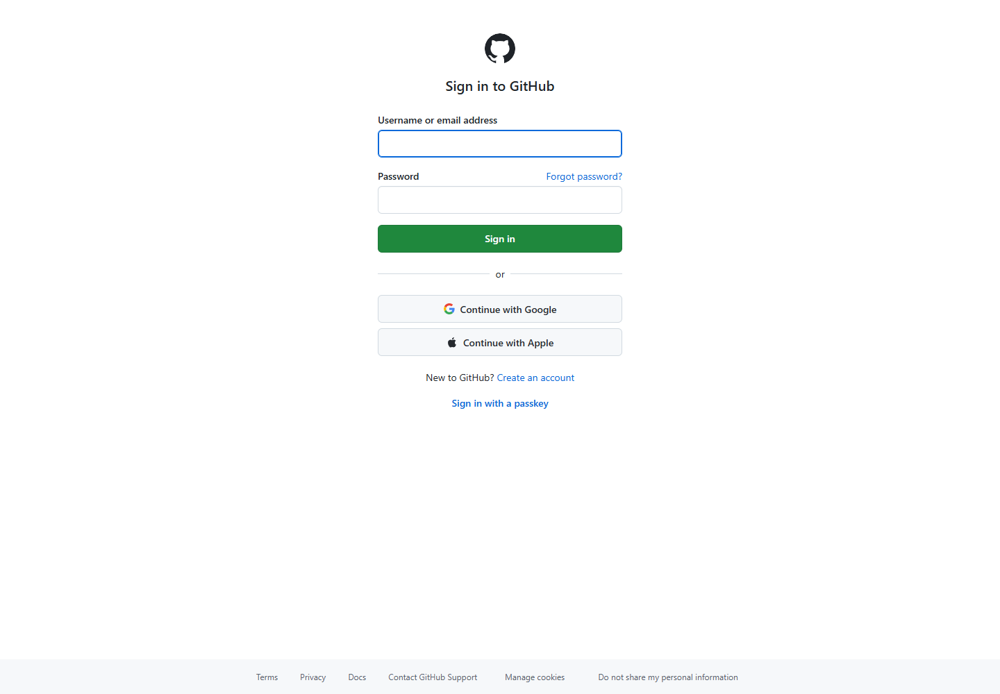

**Type:** ATOMIC
**Dependencies:** REQ-1-1-1

**Scenarios:**

- Sign in with an existing account
  - **GIVEN:** Visitor is in the relevant GitHub context, and the visitor has an existing account and valid credentials.
  - **WHEN:** The user completes the workflow to sign in with an existing account.
  - **THEN:** The system starts an authenticated session and shows the signed-in user's workspace.
  - **THEN:** The visible GitHub page or object reflects the final state when it is opened again.

#### REQ-1-1-3 Recover account access by verified email

The visitor clicks “Forgot password”, enters an email, clicks “Send reset link”, and uses a delivered reset link to enter and confirm a new password. Known and unknown email addresses show exactly the same generic delivery result. A link is created only for a verified email, is bound to that account, expires 30 minutes after issue, and can succeed only once. Credentials update only when the link is valid, unexpired, unused, and the new password follows REQ-1 and matches its confirmation; every other outcome leaves credentials unchanged. This requirement is performed in the authenticated session, page, or persistent resource context established by REQ-1-1-1 (Register a new GitHub account); it must reuse that context and remain consistent when the prerequisite state changes. A visitor uses this capability from account access pages. The capability requires that the visitor can identify a verified account email address. The user completes the main choices or confirmation steps for recover account access by verified email. The system validates eligibility, shows any required warnings or unavailable states, and prevents unauthorized changes. The system accepts the recovery request and provides the next account-recovery step without exposing account secrets.
Screenshot reference: 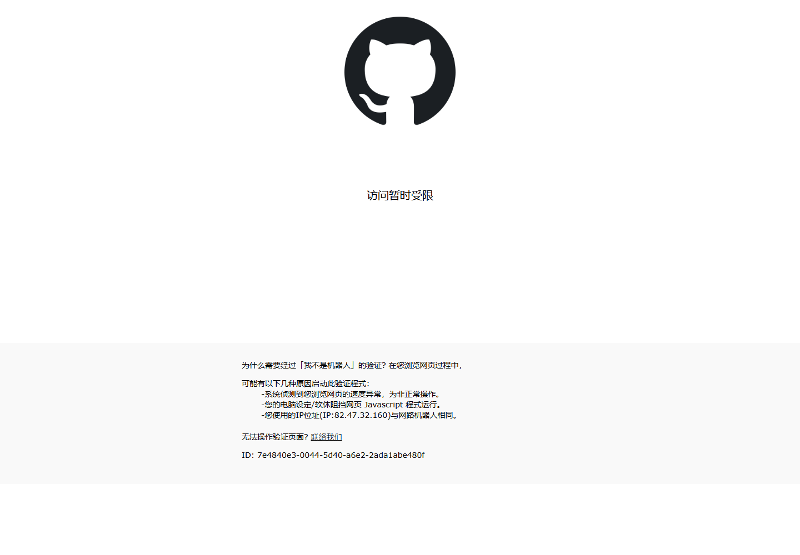

**Type:** ATOMIC
**Dependencies:** REQ-1-1-1

**Scenarios:**

- Recover account access by verified email
  - **GIVEN:** Visitor is in the relevant GitHub context, and the visitor can identify a verified account email address.
  - **WHEN:** The visitor clicks “Forgot password”, enters a verified email, clicks “Send reset link”, and uses the delivered reset link to enter and confirm a new password.
  - **THEN:** The system shows only a generic delivery result; it updates credentials only when the link is valid and the new password is valid.
  - **THEN:** The visible GitHub page or object reflects the final state when it is opened again.

### REQ-1-2 Sign out and end the current web session

This requirement is performed in the authenticated session, page, or persistent resource context established by REQ-1-1-2 (Sign in with an existing account); it must reuse that context and remain consistent when the prerequisite state changes. An authenticated user ends the current web session from the account access area. When a confirmation dialog is shown, only confirmation signs out; cancellation or dismissal preserves the session. Confirmed sign-out immediately invalidates the active session, and refresh, browser back, or direct navigation to a previously accessible protected account, repository, or organization URL requires authentication again.
Screenshot reference: 

**Type:** ATOMIC
**Dependencies:** REQ-1-1-2

**Scenarios:**

- Sign out and end the current web session
  - **GIVEN:** Authenticated user is in the relevant GitHub context, and the user is authenticated and has access to the relevant account, repository or organization.
  - **WHEN:** The user completes the workflow to sign out and end the current web session.
  - **THEN:** The active session ends, and protected account pages require authentication again.
  - **THEN:** The visible GitHub page or object reflects the final state when it is opened again.

### REQ-1-3 Change the account password

This requirement is performed in the authenticated session, page, or persistent resource context established by REQ-1-1-2 (Sign in with an existing account); it must reuse that context and remain consistent when the prerequisite state changes. An authenticated user changes the account password from account security settings. Current password, a REQ-1-conforming new password, and an exactly matching confirmation are required. Wrong current password, nonconforming new password, mismatched confirmation, or any missing field shows a field-level reason and changes nothing: the old password remains valid and the candidate password cannot sign in. On success, the new password immediately applies to future password sign-ins and the old password no longer can sign in.
Screenshot reference: 

**Type:** ATOMIC
**Dependencies:** REQ-1-1-2

**Scenarios:**

- Change the account password
  - **GIVEN:** Authenticated user is in the relevant GitHub context, and the user is authenticated and has access to the relevant account, repository or organization.
  - **WHEN:** The user completes the workflow to change the account password.
  - **THEN:** The new password is saved and required for later password-based sign-in.
  - **THEN:** The visible GitHub page or object reflects the final state when it is opened again.

## REQ-2 Organization and Governance

Basic organization membership, team and repository access management. This requirement is performed in the authenticated session, page, or persistent resource context established by REQ-1-1-2 (Sign in with an existing account); it must reuse that context and remain consistent when the prerequisite state changes.

**Type:** FOLDER
**Dependencies:** REQ-1-1-2

### REQ-2-1 Organization Identity and Discovery

Supports public organization repository discovery and authenticated organization creation. An organization unique name follows the REQ-1 username rule and is globally unique; its display name is 1–100 non-whitespace-only characters after trimming. This requirement is performed in the authenticated session, page, or persistent resource context established by REQ-1-1-2 (Sign in with an existing account); it must reuse that context and remain consistent when the prerequisite state changes.

**Type:** FOLDER
**Dependencies:** REQ-1-1-2

#### REQ-2-1-1 Browse organization repositories

From the organization page, the user clicks “Repositories”, enters a repository name in the filter, optionally chooses a visibility filter, and clicks a repository name. The system shows only repositories visible to the user with name, description, visibility, and updated time, then opens the selected repository overview. A visitor or organization member uses this capability from organization administration or public organization pages. The capability requires that the target public object is available or the user has permission to view it. The user completes the main choices or confirmation steps for browse organization repositories. The system validates eligibility, shows any required warnings or unavailable states, and prevents unauthorized changes. The requested information is displayed with the relevant filters, metadata or status indicators visible to the user.
Screenshot reference: 

**Type:** ATOMIC
**Dependencies:** None

**Scenarios:**

- Browse organization repositories
  - **GIVEN:** Visitor or organization member is in the relevant GitHub context, and the target public object is available or the user has permission to view it.
  - **WHEN:** From the organization page, the user clicks “Repositories”, enters a repository name in the filter, optionally chooses a visibility filter, and clicks a repository name.
  - **THEN:** The system shows only repositories visible to the user with name, description, visibility, and updated time, then opens the selected repository overview.
  - **THEN:** The visible GitHub page or object reflects the final state when it is opened again.

#### REQ-2-1-2 Create an organization after authentication

An authenticated user enters a globally unique organization name following the REQ-1 username rule and a trimmed 1–100-character non-empty display name, then confirms. Invalid or duplicate names, invalid display names, and write failures retain non-sensitive input, show a field-level reason, and create no organization. Success saves the identifier, display name, creation time, and current user as initial owner and member, opens the overview, and lists it for the user. This requirement is performed in the authenticated session, page, or persistent resource context established by REQ-1-1-2 (Sign in with an existing account); it must reuse that context and remain consistent when the prerequisite state changes.

**Type:** ATOMIC
**Dependencies:** REQ-1-1-2

**Scenarios:**

- Create an organization after authentication
  - **GIVEN:** Organization owner is in the relevant GitHub context, and the user is authenticated and has the required organization permission.
  - **WHEN:** The user completes the workflow to create an organization after authentication.
  - **THEN:** The new object or relationship is saved and appears in the relevant GitHub context.
  - **THEN:** The visible GitHub page or object reflects the final state when it is opened again.

### REQ-2-2 Team and Membership Management

Capabilities for creating teams, inviting members, removing members and organizing access. A team name is 1–50 lowercase ASCII letters, digits, or hyphens, cannot start or end with a hyphen, and is unique within its organization. Parent teams belong to the same organization and cannot form direct or indirect cycles. Existing members and pending invitees cannot receive duplicate invites. This requirement is performed in the authenticated session, page, or persistent resource context established by REQ-2-1-2 (Create an organization after authentication); it must reuse that context and remain consistent when the prerequisite state changes.

**Type:** FOLDER
**Dependencies:** REQ-2-1-2

#### REQ-2-2-1 Create an organization team

An organization owner creates a team with a name following the REQ-2-2 rule, optional description, and optional parent in the same organization. Missing, invalid, duplicate names, out-of-organization parents, and failures create no team. Success creates a team in the current organization and opens its page. This requirement is performed in the authenticated session, page, or persistent resource context established by REQ-2-1-2 (Create an organization after authentication); it must reuse that context and remain consistent when the prerequisite state changes.

**Type:** ATOMIC
**Dependencies:** REQ-2-1-2

**Scenarios:**

- Create an organization team
  - **GIVEN:** Organization owner is in the relevant GitHub context, and the user is authenticated and has the required organization permission.
  - **WHEN:** The owner clicks “Teams” → “New team”, enters a team name, optional description, and parent team, then clicks “Create team”.
  - **THEN:** The system creates a team in the current organization and opens its page; duplicate names or write failures create no team.
  - **THEN:** The visible GitHub page or object reflects the final state when it is opened again.

#### REQ-2-2-2 Manage organization team membership and hierarchy

A visitor or organization member uses this capability from organization administration or public organization pages. The capability requires that the user is authenticated and has access to the relevant account, repository or organization. The user completes the main choices or confirmation steps for manage organization team membership and hierarchy. The system validates eligibility, shows any required warnings or unavailable states, and prevents unauthorized changes. The system shows an observable result and preserves the changed state for later use. This requirement is performed in the authenticated session, page, or persistent resource context established by REQ-2-2-1 (Create an organization team); it must reuse that context and remain consistent when the prerequisite state changes. On the team page, the maintainer uses “Members” to add or remove members, or uses “Settings” to select and save a new parent team. The system updates membership or hierarchy in the team tree and member list, and rejects cyclic team hierarchies.

**Type:** ATOMIC
**Dependencies:** REQ-2-2-1

**Scenarios:**

- Manage organization team membership and hierarchy
  - **GIVEN:** Visitor or organization member is in the relevant GitHub context, and the user is authenticated and has access to the relevant account, repository or organization.
  - **WHEN:** On the team page, the maintainer uses “Members” to add or remove members, or uses “Settings” to select and save a new parent team.
  - **THEN:** The system updates membership or hierarchy in the team tree and member list, and rejects cyclic team hierarchies.
  - **THEN:** The visible GitHub page or object reflects the final state when it is opened again.
- Reject a cyclic team hierarchy change
  - **GIVEN:** A team maintainer opens an existing team that already has a parent team.
  - **WHEN:** The maintainer selects one of the team's descendants as the new parent team and saves the change.
  - **THEN:** The system rejects the cycle, keeps the original parent team unchanged, and shows the saved hierarchy again after reload.

#### REQ-2-2-3 Invite a user to an organization

An organization owner invites an existing account by username or verified email, selects Member or Owner, and sends the invitation. The system saves one pending invitation and shows recipient and status; the invitee has no member permissions before acceptance. Existing members, pending invitees, unknown accounts, and unsupported roles show a reason and create no second invitation. This requirement is performed in the authenticated session, page, or persistent resource context established by REQ-2-1-2 (Create an organization after authentication); it must reuse that context and remain consistent when the prerequisite state changes.

**Type:** ATOMIC
**Dependencies:** REQ-2-1-2

**Scenarios:**

- Invite a user to an organization
  - **GIVEN:** Organization owner is in the relevant GitHub context, and the user is authenticated and has the required organization permission.
  - **WHEN:** On the “People” page, the owner clicks “Invite member”, enters a username or email, selects an organization role, and clicks “Send invitation”.
  - **THEN:** The system stores a pending invitation and shows its recipient and status; the recipient receives no member permissions before acceptance.
  - **THEN:** The visible GitHub page or object reflects the final state when it is opened again.

#### REQ-2-2-4 Remove a member from an organization

An organization owner uses this capability from organization administration or public organization pages. The capability requires that the user is authenticated and has the required organization permission. The user completes the main choices or confirmation steps for remove a member from an organization. The system validates eligibility, shows any required warnings or unavailable states, and prevents unauthorized changes. The selected object or permission is removed after confirmation, and later views reflect the removal. This requirement is performed in the authenticated session, page, or persistent resource context established by REQ-2-1-2 (Create an organization after authentication); it must reuse that context and remain consistent when the prerequisite state changes. On the “People” page, the owner locates a member, selects “Remove from organization” in the member menu, and confirms “Remove”. The system removes organization membership and direct organization access while preserving the account, personal repositories, and other organization memberships.

**Type:** ATOMIC
**Dependencies:** REQ-2-1-2

**Scenarios:**

- Remove a member from an organization
  - **GIVEN:** Organization owner is in the relevant GitHub context, and the user is authenticated and has the required organization permission.
  - **WHEN:** On the “People” page, the owner locates a member, selects “Remove from organization” in the member menu, and confirms “Remove”.
  - **THEN:** The system removes organization membership and direct organization access while preserving the account, personal repositories, and other organization memberships.
  - **THEN:** The visible GitHub page or object reflects the final state when it is opened again.
- Prevent non-owners from removing organization members
  - **GIVEN:** A signed-in user who is not an organization owner opens the organization People page for a member they can view.
  - **WHEN:** The user opens the member actions menu and attempts to remove that member from the organization.
  - **THEN:** The remove action is unavailable or rejected for the non-owner, and the member remains in the organization after reload.

### REQ-2-3 Grant repository access to people and teams

An organization owner or repository administrator grants repository access only to current organization members or teams, selecting Read, Triage, Write, Maintain, or Admin. Each subject has one active grant per repository: repeating the same role creates no second record and changing role replaces the original. The system prevents unauthorized changes and lets members access according to the saved role. This requirement is performed in the authenticated session, page, or persistent resource context established by REQ-2-1-2 (Create an organization after authentication), REQ-2-2-1 (Create an organization team); it must reuse that context and remain consistent when the prerequisite state changes.

**Type:** ATOMIC
**Dependencies:** REQ-2-1-2, REQ-2-2-1

**Scenarios:**

- Grant repository access to people and teams
  - **GIVEN:** The user is in the relevant repository, organization or account context and has the required permission.
  - **WHEN:** The user completes the workflow to grant repository access to people and teams.
  - **THEN:** The system applies the permission assignment, and members can access the repository according to the granted role.
  - **THEN:** The visible state remains consistent when the object is opened again.
- Replace an existing repository grant instead of duplicating it
  - **GIVEN:** An administrator opens repository access management for a team that already has a saved grant.
  - **WHEN:** The administrator changes that team's role to a different level and saves the update.
  - **THEN:** The system keeps one active grant for the team, replaces the previous role with the new role, and shows the updated grant after reload.

## REQ-3 Repository Asset Management

Capabilities for locating, creating, opening and configuring repositories.

**Type:** FOLDER
**Dependencies:** None

### REQ-3-1 Search and locate repositories

A visitor or authenticated user searches for repositories they are allowed to view. The system accepts a search query, applies repository-oriented filtering or scoping, and displays matching repositories with enough metadata for the user to open the intended repository.
Screenshot reference: 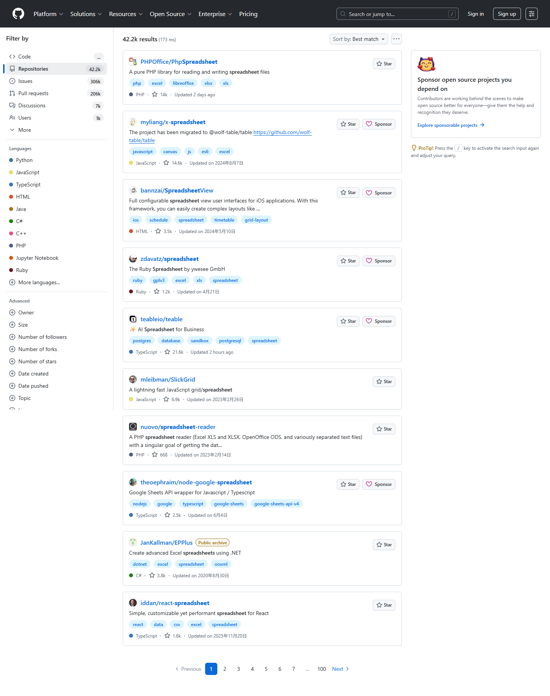

**Type:** ATOMIC
**Dependencies:** None

**Scenarios:**

- Search repositories, code, issues, pull requests and users
  - **GIVEN:** Repository collaborator is in the relevant GitHub context, and the target public object is available or the user has permission to view it.
  - **WHEN:** The user completes the workflow to search repositories, code, issues, pull requests and users.
  - **THEN:** Matching repositories are displayed with enough metadata for the user to choose and open the intended repository.
  - **THEN:** The visible GitHub page or object reflects the final state when it is opened again.

### REQ-3-2 Repository Creation and Distribution

Core repository creation capability. This requirement is performed in the authenticated session, page, or persistent resource context established by REQ-1-1-2 (Sign in with an existing account); it must reuse that context and remain consistent when the prerequisite state changes.

**Type:** FOLDER
**Dependencies:** REQ-1-1-2

#### REQ-3-2-1 Create a repository with owner, visibility and initialization options

This requirement is performed in the authenticated session, page, or persistent resource context established by REQ-1-1-2 (Sign in with an existing account); it must reuse that context and remain consistent when the prerequisite state changes. An authorized administrator uses this capability from repository pages. The capability requires that the user is authenticated and has administrator permission for the target repository. The user completes the main choices or confirmation steps for create a repository with owner, visibility and initialization options. The system validates eligibility, shows any required warnings or unavailable states, and prevents unauthorized changes. The new object or relationship is saved and appears in the relevant GitHub context.
Screenshot reference: 

**Type:** ATOMIC
**Dependencies:** REQ-1-1-2

**Scenarios:**

- Create a repository with owner, visibility and initialization options
  - **GIVEN:** Authorized administrator is in the relevant GitHub context, and the user is authenticated and has administrator permission for the target repository.
  - **WHEN:** The user completes the workflow to create a repository with owner, visibility and initialization options.
  - **THEN:** The new object or relationship is saved and appears in the relevant GitHub context.
  - **THEN:** The visible GitHub page or object reflects the final state when it is opened again.

#### REQ-3-2-2 Fork a repository into another namespace

On the source repository page, the user clicks “Fork”, selects a target account or organization, optionally enters a new name and visibility, and clicks “Create fork”. The system creates an independent fork, copies accessible default-branch history, records the source link, and opens the new fork overview. This requirement is performed in the authenticated session, page, or persistent resource context established by REQ-3-3 (View a public repository overview), REQ-1-1-2 (Sign in with an existing account); it must reuse that context and remain consistent when the prerequisite state changes. An authenticated user uses this capability from repository pages. The capability requires that the user is authenticated and has access to the relevant account, repository or organization. The user completes the main choices or confirmation steps for fork a repository into another namespace. The system validates eligibility, shows any required warnings or unavailable states, and prevents unauthorized changes. A new fork is created under the selected owner and links back to the source repository.
Screenshot reference: 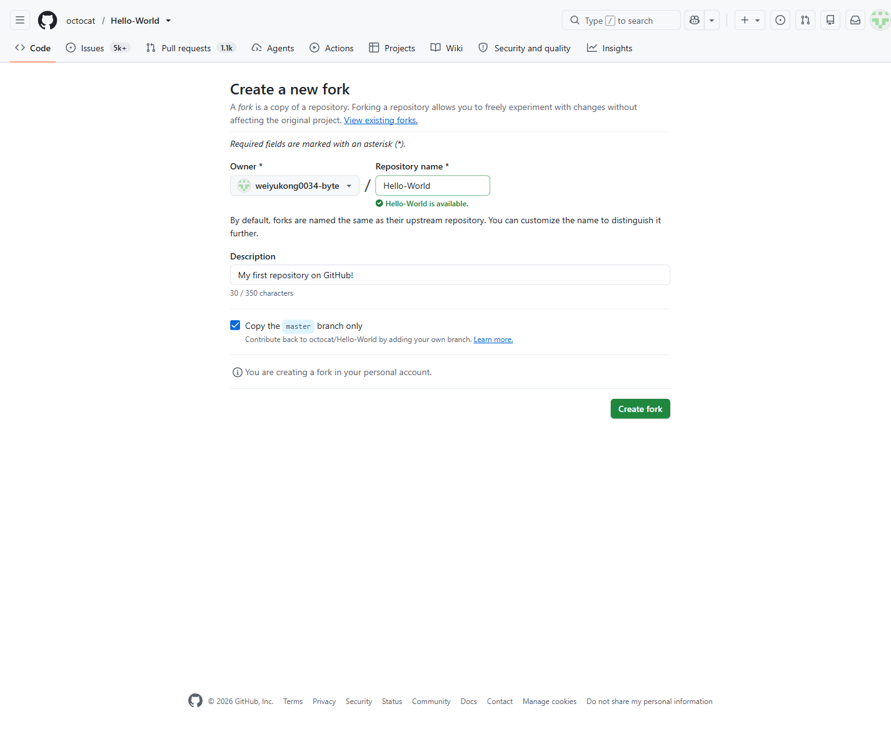

**Type:** ATOMIC
**Dependencies:** REQ-3-3, REQ-1-1-2

**Scenarios:**

- Fork a repository into another namespace
  - **GIVEN:** Authenticated user is in the relevant GitHub context, and the user is authenticated and has access to the relevant account, repository or organization.
  - **WHEN:** On the source repository page, the user clicks “Fork”, selects a target account or organization, optionally enters a new name and visibility, and clicks “Create fork”.
  - **THEN:** The system creates an independent fork, copies accessible default-branch history, records the source link, and opens the new fork overview.
  - **THEN:** The visible GitHub page or object reflects the final state when it is opened again.

#### REQ-3-2-3 Copy a repository clone URL

On the repository overview, the user clicks “Code”, selects HTTPS or SSH, then clicks the copy icon beside the clone URL. The system writes the selected clone URL to the browser clipboard and shows a brief “Copied” confirmation without changing the repository. This requirement is performed in the authenticated session, page, or persistent resource context established by REQ-3-3 (View a public repository overview); it must reuse that context and remain consistent when the prerequisite state changes. A visitor or authenticated user uses this capability from repository pages. The capability requires that the target public object is available or the user has permission to view it. The user completes the main choices or confirmation steps for copy a repository clone url. The system validates eligibility, shows any required warnings or unavailable states, and prevents unauthorized changes. The selected repository access value is available for the user to paste into their local tooling.
Screenshot reference: 

**Type:** ATOMIC
**Dependencies:** REQ-3-3

**Scenarios:**

- Copy a repository clone URL
  - **GIVEN:** Visitor or authenticated user is in the relevant GitHub context, and the target public object is available or the user has permission to view it.
  - **WHEN:** On the repository overview, the user clicks “Code”, selects HTTPS or SSH, then clicks the copy icon beside the clone URL.
  - **THEN:** The system writes the selected clone URL to the browser clipboard and shows a brief “Copied” confirmation without changing the repository.
  - **THEN:** The visible GitHub page or object reflects the final state when it is opened again.

### REQ-3-3 View a public repository overview

A visitor or authorized user opens a repository overview to confirm the repository identity, visibility, description, primary metadata and available content. The overview provides the main entry point for browsing files, reviewing repository context and beginning collaboration.
Screenshot reference: 

**Type:** ATOMIC
**Dependencies:** None

**Scenarios:**

- View a public repository overview
  - **GIVEN:** The user is in the relevant repository, organization or account context and has the required permission.
  - **WHEN:** The user completes the workflow to view a public repository overview.
  - **THEN:** The overview provides the entry point for browsing files and beginning collaboration.
  - **THEN:** The visible state remains consistent when the object is opened again.

### REQ-3-4 Change repository visibility with permission checks

This requirement is performed in the authenticated session, page, or persistent resource context established by REQ-3-3 (View a public repository overview), REQ-1-1-2 (Sign in with an existing account); it must reuse that context and remain consistent when the prerequisite state changes. A repository administrator changes the repository visibility after reviewing the effect on access. The system blocks unauthorized changes, applies the selected visibility and enforces the updated access rules when users open the repository later.
Screenshot reference: 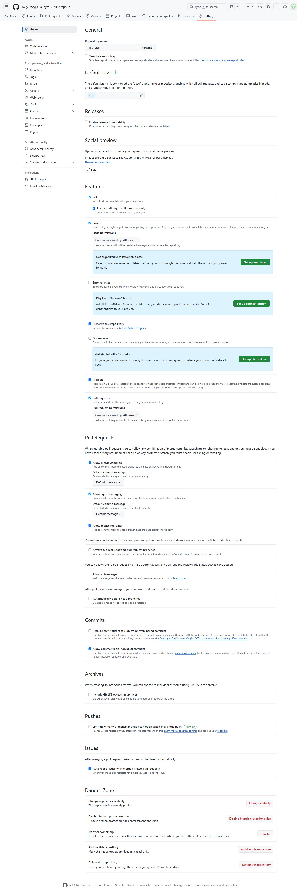

**Type:** ATOMIC
**Dependencies:** REQ-3-3, REQ-1-1-2

**Scenarios:**

- Change repository visibility with permission checks
  - **GIVEN:** The user is in the relevant repository, organization or account context and has the required permission.
  - **WHEN:** The user completes the workflow to change repository visibility with permission checks.
  - **THEN:** The system prevents unauthorized changes and applies the updated visibility to later repository access.
  - **THEN:** The visible state remains consistent when the object is opened again.

## REQ-4 Code and Version Control

Core file browsing, branch, commit history and web-based file change capabilities. This requirement is performed in the authenticated session, page, or persistent resource context established by REQ-3-3 (View a public repository overview); it must reuse that context and remain consistent when the prerequisite state changes.

**Type:** FOLDER
**Dependencies:** REQ-3-3

### REQ-4-1 Browse repository files and directories

This requirement is performed in the authenticated session, page, or persistent resource context established by REQ-3-3 (View a public repository overview); it must reuse that context and remain consistent when the prerequisite state changes. A repository participant browses folders and files on a selected branch, opens nested directories and views file content with enough metadata to understand the current repository state.
Screenshot reference: 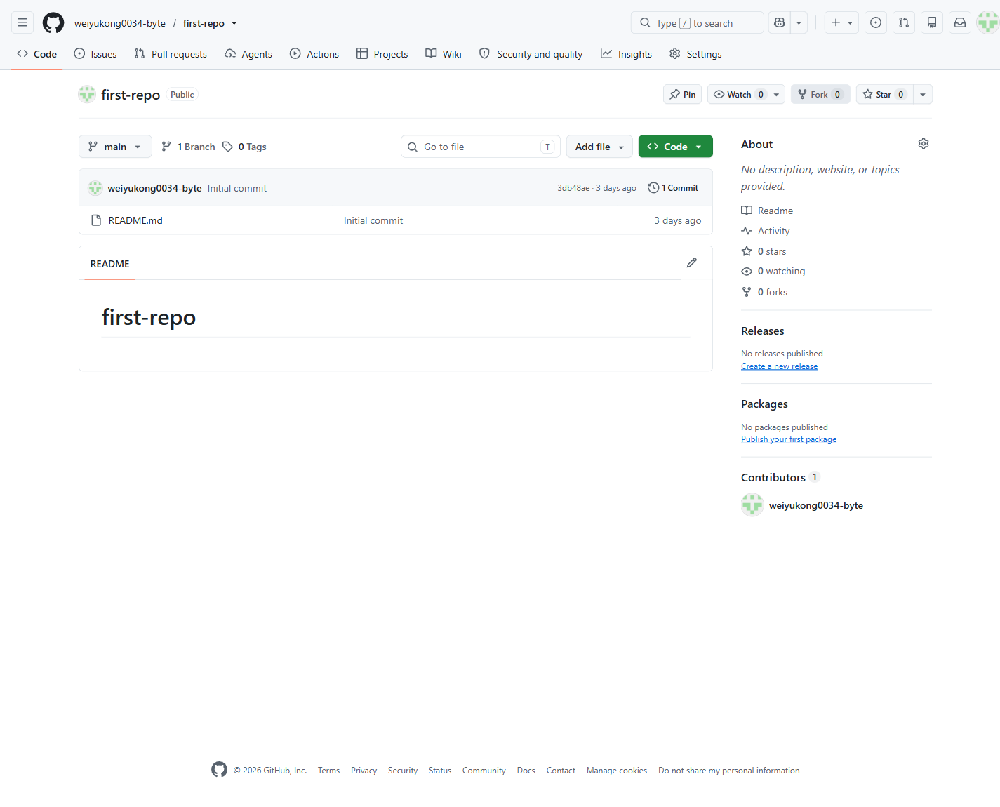

**Type:** ATOMIC
**Dependencies:** REQ-3-3

**Scenarios:**

- Browse repository files and directories
  - **GIVEN:** The user is in the relevant repository, organization or account context and has the required permission.
  - **WHEN:** The user completes the workflow to browse repository files and directories.
  - **THEN:** The selected branch shows its folders, files, nested paths and readable file content.
  - **THEN:** The visible state remains consistent when the object is opened again.

### REQ-4-2 Commit History and Code Search

Core commit history and difference review capabilities. This requirement is performed in the authenticated session, page, or persistent resource context established by REQ-4-1 (Browse repository files and directories); it must reuse that context and remain consistent when the prerequisite state changes.

**Type:** FOLDER
**Dependencies:** REQ-4-1

#### REQ-4-2-1 Review repository commit history

This requirement is performed in the authenticated session, page, or persistent resource context established by REQ-4-1 (Browse repository files and directories); it must reuse that context and remain consistent when the prerequisite state changes. A repository participant reviews commit history for a branch or file context to understand recent changes and the people who made them.
Screenshot reference: 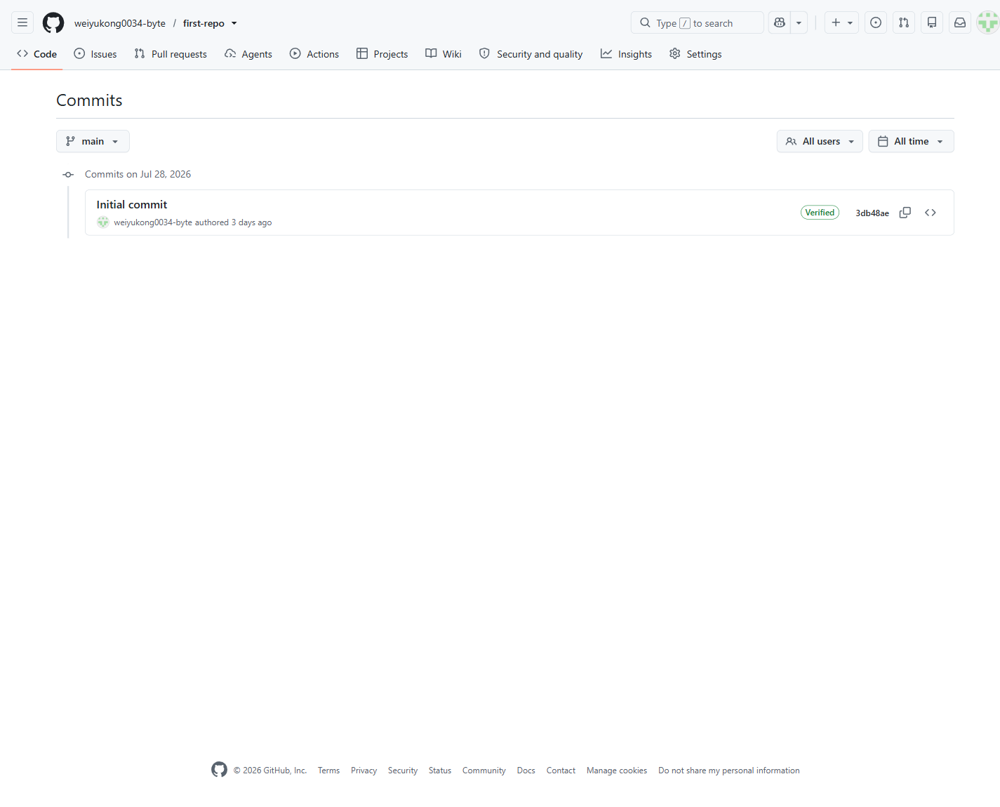

**Type:** ATOMIC
**Dependencies:** REQ-4-1

**Scenarios:**

- Review repository commit history
  - **GIVEN:** The user is in the relevant repository, organization or account context and has the required permission.
  - **WHEN:** The user completes the workflow to review repository commit history.
  - **THEN:** A repository participant reviews commit history for a branch or file context to understand recent changes and the people who made them.
  - **THEN:** The visible state remains consistent when the object is opened again.

#### REQ-4-2-2 Inspect commit and revision differences

This requirement is performed in the authenticated session, page, or persistent resource context established by REQ-4-2-1 (Review repository commit history); it must reuse that context and remain consistent when the prerequisite state changes. A repository participant compares commits or revisions and inspects changed files so that code changes can be reviewed before further work or a pull request.
Screenshot reference: 

**Type:** ATOMIC
**Dependencies:** REQ-4-2-1

**Scenarios:**

- Inspect commit and revision differences
  - **GIVEN:** The user is in the relevant repository, organization or account context and has the required permission.
  - **WHEN:** The user completes the workflow to inspect commit and revision differences.
  - **THEN:** A repository participant compares commits or revisions and inspects changed files so that code changes can be reviewed before further work or a pull request.
  - **THEN:** The visible state remains consistent when the object is opened again.

#### REQ-4-2-3 Search code within a repository scope

The user enters a code keyword in the repository search box, presses Enter, selects the “Code” result page, optionally filters by path or language, and clicks a match. The system shows matching snippets, paths, and branch/revision context within code visible in the current repository, then opens the selected file location. This requirement is performed in the authenticated session, page, or persistent resource context established by REQ-4-1 (Browse repository files and directories); it must reuse that context and remain consistent when the prerequisite state changes. A visitor or authenticated user uses this capability from repository code and version-control pages. The capability requires that the target public object is available or the user has permission to view it. The user completes the main choices or confirmation steps for search code within a repository scope. The system validates eligibility, shows any required warnings or unavailable states, and prevents unauthorized changes. The requested information is displayed with the relevant filters, metadata or status indicators visible to the user.
Screenshot reference: 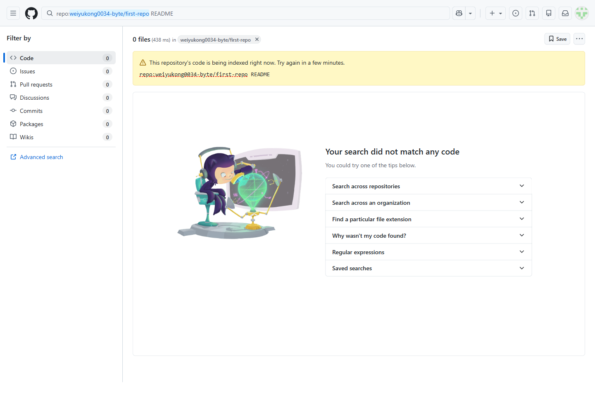

**Type:** ATOMIC
**Dependencies:** REQ-4-1

**Scenarios:**

- Search code within a repository scope
  - **GIVEN:** Visitor or authenticated user is in the relevant GitHub context, and the target public object is available or the user has permission to view it.
  - **WHEN:** The user enters a code keyword in the repository search box, presses Enter, selects the “Code” result page, optionally filters by path or language, and clicks a match.
  - **THEN:** The system shows matching snippets, paths, and branch/revision context within code visible in the current repository, then opens the selected file location.
  - **THEN:** The visible GitHub page or object reflects the final state when it is opened again.
- Show an empty state when code search has no matches
  - **GIVEN:** A user is on a repository code search page with repository scope already selected.
  - **WHEN:** The user enters a code query that returns no matches and opens the Code results view.
  - **THEN:** The system shows an empty result state, keeps the repository scope and filters unchanged, and does not open a file.

### REQ-4-3 Branch and Tag Management

Core branch listing, switching and creation capabilities. This requirement is performed in the authenticated session, page, or persistent resource context established by REQ-4-1 (Browse repository files and directories); it must reuse that context and remain consistent when the prerequisite state changes.

**Type:** FOLDER
**Dependencies:** REQ-4-1

#### REQ-4-3-1 List and switch repository branches

This requirement is performed in the authenticated session, page, or persistent resource context established by REQ-4-1 (Browse repository files and directories); it must reuse that context and remain consistent when the prerequisite state changes. A repository participant lists available branches, identifies the active branch and switches repository context to another branch for browsing or editing.
Screenshot reference: 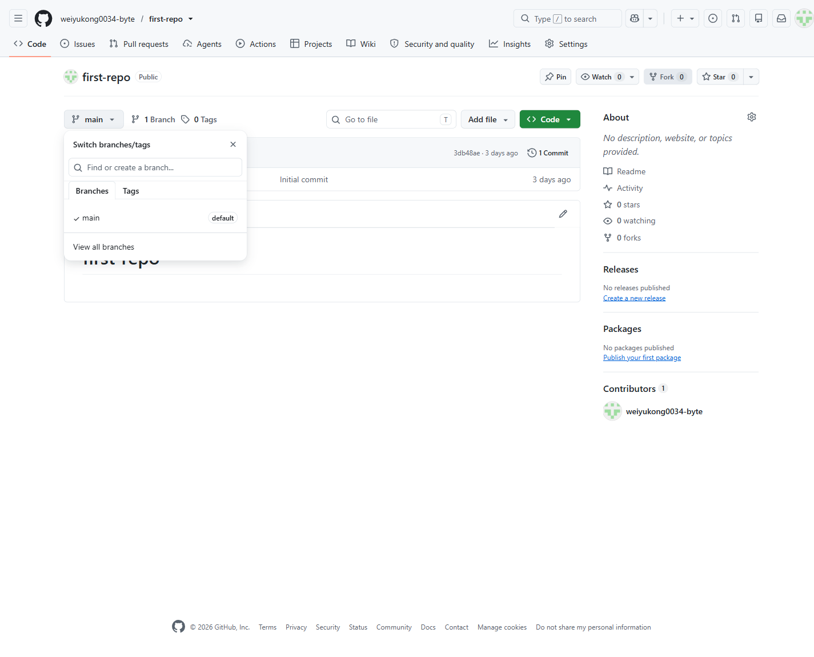

**Type:** ATOMIC
**Dependencies:** REQ-4-1

**Scenarios:**

- List and switch repository branches
  - **GIVEN:** The user is in the relevant repository, organization or account context and has the required permission.
  - **WHEN:** The user completes the workflow to list and switch repository branches.
  - **THEN:** A repository participant lists available branches, identifies the active branch and switches repository context to another branch for browsing or editing.
  - **THEN:** The visible state remains consistent when the object is opened again.
- Keep the current branch when no search result matches
  - **GIVEN:** A repository participant opens the branch selector on a repository page with an active branch already selected.
  - **WHEN:** The participant types a branch query that has no matches.
  - **THEN:** The system shows an empty branch search state and keeps the current active branch selected after the selector is closed or the page is reloaded.

#### REQ-4-3-2 Create a branch from an existing revision

The user opens the branch selector, enters a new branch name, confirms the displayed base branch or commit, and clicks “Create branch: <name>”. The system creates a branch pointing to that base commit and switches the selector to it; existing names or missing permission create nothing. This requirement is performed in the authenticated session, page, or persistent resource context established by REQ-4-3-1 (List and switch repository branches), REQ-1-1-2 (Sign in with an existing account); it must reuse that context and remain consistent when the prerequisite state changes. An authenticated user uses this capability from repository code and version-control pages. The capability requires that the user is authenticated and has the required repository collaboration permission. The user completes the main choices or confirmation steps for create a branch from an existing revision. The system validates eligibility, shows any required warnings or unavailable states, and prevents unauthorized changes. The new object or relationship is saved and appears in the relevant GitHub context.
Screenshot reference: 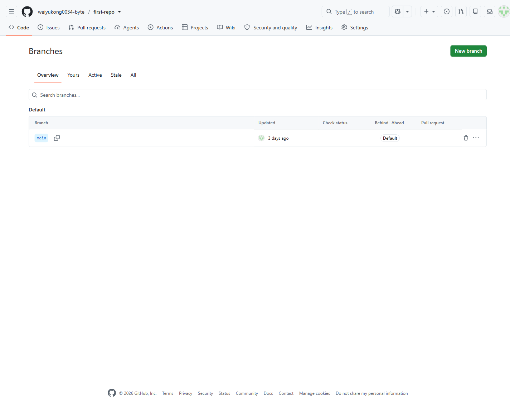

**Type:** ATOMIC
**Dependencies:** REQ-4-3-1, REQ-1-1-2

**Scenarios:**

- Create a branch from an existing revision
  - **GIVEN:** Authenticated user is in the relevant GitHub context, and the user is authenticated and has the required repository collaboration permission.
  - **WHEN:** The user opens the branch selector, enters a new branch name, confirms the displayed base branch or commit, and clicks the create-branch button.
  - **THEN:** The system creates a branch pointing to that base commit and switches the selector to it; existing names or missing permission create nothing.
  - **THEN:** The visible GitHub page or object reflects the final state when it is opened again.

#### REQ-4-3-3 Change the repository default branch

The administrator opens “Settings” → “Branches”, chooses an existing branch in “Default branch”, clicks “Update”, and confirms the change. The system saves the new default branch for new repository visits without deleting or rewriting the former default branch. This requirement is performed in the authenticated session, page, or persistent resource context established by REQ-4-3-1 (List and switch repository branches), REQ-1-1-2 (Sign in with an existing account); it must reuse that context and remain consistent when the prerequisite state changes. An authenticated user uses this capability from repository code and version-control pages. The capability requires that the user is authenticated and has the required repository collaboration permission. The user completes the main choices or confirmation steps for change the repository default branch. The system validates eligibility, shows any required warnings or unavailable states, and prevents unauthorized changes. The updated configuration, relationship or state is saved and remains effective when the object is reopened.
Screenshot reference: 

**Type:** ATOMIC
**Dependencies:** REQ-4-3-1, REQ-1-1-2

**Scenarios:**

- Change the repository default branch
  - **GIVEN:** Authenticated user is in the relevant GitHub context, and the user is authenticated and has the required repository collaboration permission.
  - **WHEN:** The administrator opens “Settings” → “Branches”, chooses an existing branch in “Default branch”, clicks “Update”, and confirms the change.
  - **THEN:** The system saves the new default branch for new repository visits without deleting or rewriting the former default branch.
  - **THEN:** The visible GitHub page or object reflects the final state when it is opened again.
- Block non-admin changes to the default branch
  - **GIVEN:** A signed-in user without repository administration permission opens the repository settings branch page.
  - **WHEN:** The user inspects the default branch controls or attempts to update the setting.
  - **THEN:** The default branch update action is unavailable or rejected for the non-admin, and the saved default branch remains unchanged.

### REQ-4-4 Manage repository files through the web interface

This requirement is performed in the authenticated session, page, or persistent resource context established by REQ-4-1 (Browse repository files and directories), REQ-1-1-2 (Sign in with an existing account); it must reuse that context and remain consistent when the prerequisite state changes. A repository contributor creates, edits, uploads, renames or removes repository files from the web interface when they have permission to change the selected branch. The system validates the change and saves the resulting file updates as repository commits.
Screenshot reference: 

**Type:** ATOMIC
**Dependencies:** REQ-4-1, REQ-1-1-2

**Scenarios:**

- Manage repository files through the web interface
  - **GIVEN:** The user is in the relevant repository, organization or account context and has the required permission.
  - **WHEN:** The user completes the workflow to manage repository files through the web interface.
  - **THEN:** The system saves the resulting file changes as repository commits.
  - **THEN:** The visible state remains consistent when the object is opened again.

## REQ-5 Work Planning and Issue Management

Core issue discovery, discussion, metadata and lifecycle capabilities. This requirement is performed in the authenticated session, page, or persistent resource context established by REQ-3-3 (View a public repository overview); it must reuse that context and remain consistent when the prerequisite state changes.

**Type:** FOLDER
**Dependencies:** REQ-3-3

### REQ-5-1 Issue Discovery and Detail

Capabilities for listing, filtering and reading issues. This requirement is performed in the authenticated session, page, or persistent resource context established by REQ-3-3 (View a public repository overview); it must reuse that context and remain consistent when the prerequisite state changes.

**Type:** FOLDER
**Dependencies:** REQ-3-3

#### REQ-5-1-1 List and filter repository issues

This requirement is performed in the authenticated session, page, or persistent resource context established by REQ-3-3 (View a public repository overview); it must reuse that context and remain consistent when the prerequisite state changes. A repository participant lists issues, filters by open or closed state, searches by issue metadata and opens the relevant work item list for triage.
Screenshot reference: 

**Type:** ATOMIC
**Dependencies:** REQ-3-3

**Scenarios:**

- List and filter repository issues
  - **GIVEN:** The user is in the relevant repository, organization or account context and has the required permission.
  - **WHEN:** The user completes the workflow to list and filter repository issues.
  - **THEN:** A repository participant lists issues, filters by open or closed state, searches by issue metadata and opens the relevant work item list for triage.
  - **THEN:** The visible state remains consistent when the object is opened again.
- Filter issues to the closed state
  - **GIVEN:** A repository participant is viewing an issue list that contains both open and closed issues.
  - **WHEN:** The participant switches to the closed-state filter and searches for a known closed issue title.
  - **THEN:** The system shows only matching closed issues and keeps the issue data unchanged after reload.

#### REQ-5-1-2 View an issue and its discussion

A repository participant opens an issue to read its title, description, status, metadata, comments and activity timeline before deciding what action to take. This requirement is performed in the authenticated session, page, or persistent resource context established by REQ-5-1-1 (List and filter repository issues); it must reuse that context and remain consistent when the prerequisite state changes.

**Type:** ATOMIC
**Dependencies:** REQ-5-1-1

**Scenarios:**

- View an issue and its discussion
  - **GIVEN:** The user is in the relevant repository, organization or account context and has the required permission.
  - **WHEN:** The user completes the workflow to view an issue and its discussion.
  - **THEN:** A repository participant opens an issue to read its title, description, status, metadata, comments and activity timeline before deciding what action to take.
  - **THEN:** The visible state remains consistent when the object is opened again.

### REQ-5-2 Issue Creation and Discussion

Capabilities for creating, editing and discussing issues. This requirement is performed in the authenticated session, page, or persistent resource context established by REQ-5-1-2 (View an issue and its discussion); it must reuse that context and remain consistent when the prerequisite state changes.

**Type:** FOLDER
**Dependencies:** REQ-5-1-2

#### REQ-5-2-1 Create a repository issue

This requirement is performed in the authenticated session, page, or persistent resource context established by REQ-3-3 (View a public repository overview), REQ-1-1-2 (Sign in with an existing account); it must reuse that context and remain consistent when the prerequisite state changes. An authenticated user uses this capability from repository planning and issue management pages. The capability requires that the user is authenticated and has access to the relevant account, repository or organization. The user completes the main choices or confirmation steps for create an issue from repository, comment, code, discussion or project context. The system validates eligibility, shows any required warnings or unavailable states, and prevents unauthorized changes. The new object or relationship is saved and appears in the relevant GitHub context.
Screenshot reference: 

**Type:** ATOMIC
**Dependencies:** REQ-3-3, REQ-1-1-2

**Scenarios:**

- Create an issue from repository, comment, code, discussion or project context
  - **GIVEN:** Authenticated user is in the relevant GitHub context, and the user is authenticated and has access to the relevant account, repository or organization.
  - **WHEN:** The user completes the workflow to create an issue from repository, comment, code, discussion or project context.
  - **THEN:** The new object or relationship is saved and appears in the relevant GitHub context.
  - **THEN:** The visible GitHub page or object reflects the final state when it is opened again.

#### REQ-5-2-2 Edit an issue title and description

An authenticated user uses this capability from repository planning and issue management pages. The capability requires that the user is authenticated and has access to the relevant account, repository or organization. The user completes the main choices or confirmation steps for edit an issue title and description. The system validates eligibility, shows any required warnings or unavailable states, and prevents unauthorized changes. The system shows an observable result and preserves the changed state for later use. This requirement is performed in the authenticated session, page, or persistent resource context established by REQ-5-1-2 (View an issue and its discussion); it must reuse that context and remain consistent when the prerequisite state changes. A user with edit permission clicks “Edit” beside the title or description on the issue page, changes the text, and clicks “Save”. The system updates only the target title or description and reflects it in details, list summaries, and the activity timeline; an empty title or save failure keeps the prior value.

**Type:** ATOMIC
**Dependencies:** REQ-5-1-2

**Scenarios:**

- Edit an issue title and description
  - **GIVEN:** Authenticated user is in the relevant GitHub context, and the user is authenticated and has access to the relevant account, repository or organization.
  - **WHEN:** A user with edit permission clicks “Edit” beside the title or description on the issue page, changes the text, and clicks “Save”.
  - **THEN:** The system updates only the target title or description and reflects it in details, list summaries, and the activity timeline; an empty title or save failure keeps the prior value.
  - **THEN:** The visible GitHub page or object reflects the final state when it is opened again.
- Reject a blank issue title update
  - **GIVEN:** A user with edit permission opens an issue detail page with the title editor available.
  - **WHEN:** The user clears the title input to a blank value and tries to save the change.
  - **THEN:** The system rejects the save, keeps the original title, and shows the original title again after reload.

#### REQ-5-2-3 Comment on an issue discussion

An authenticated user uses this capability from repository planning and issue management pages. The capability requires that the user is authenticated and has access to the relevant account, repository or organization. The user completes the main choices or confirmation steps for comment on and react to an issue discussion. The system validates eligibility, shows any required warnings or unavailable states, and prevents unauthorized changes. The system shows an observable result and preserves the changed state for later use. This requirement is performed in the authenticated session, page, or persistent resource context established by REQ-5-1-2 (View an issue and its discussion), REQ-1-1-2 (Sign in with an existing account); it must reuse that context and remain consistent when the prerequisite state changes.

**Type:** ATOMIC
**Dependencies:** REQ-5-1-2, REQ-1-1-2

**Scenarios:**

- Comment on and react to an issue discussion
  - **GIVEN:** Authenticated user is in the relevant GitHub context, and the user is authenticated and has access to the relevant account, repository or organization.
  - **WHEN:** The user completes the workflow to comment on and react to an issue discussion.
  - **THEN:** The system shows an observable result and preserves the changed state for later use.
  - **THEN:** The visible GitHub page or object reflects the final state when it is opened again.
- Reject blank issue comments
  - **GIVEN:** A user opens an issue discussion with a visible comment box and submit button.
  - **WHEN:** The user enters only whitespace into the comment box and submits the form or tries to post it.
  - **THEN:** The system does not create a new comment or timeline entry, and the discussion count stays the same after reload.

### REQ-5-3 Issue Metadata and Classification

Core issue assignment and label categorization capabilities. This requirement is performed in the authenticated session, page, or persistent resource context established by REQ-5-1-2 (View an issue and its discussion); it must reuse that context and remain consistent when the prerequisite state changes.

**Type:** FOLDER
**Dependencies:** REQ-5-1-2

#### REQ-5-3-1 Assign or unassign issue participants

An authenticated user uses this capability from account access pages. The capability requires that the user is authenticated and has access to the relevant account, repository or organization. The user completes the main choices or confirmation steps for assign or unassign issue participants. The system validates eligibility, shows any required warnings or unavailable states, and prevents unauthorized changes. The updated configuration, relationship or state is saved and remains effective when the object is reopened. This requirement is performed in the authenticated session, page, or persistent resource context established by REQ-5-1-2 (View an issue and its discussion); it must reuse that context and remain consistent when the prerequisite state changes. In the issue sidebar, the user opens “Assignees”, searches for and checks eligible members, or unchecks existing assignees, then closes the menu. The system saves the assignee set and records activity; ineligible users are not selectable and unassignment does not delete accounts.

**Type:** ATOMIC
**Dependencies:** REQ-5-1-2

**Scenarios:**

- Assign or unassign issue participants
  - **GIVEN:** Authenticated user is in the relevant GitHub context, and the user is authenticated and has access to the relevant account, repository or organization.
  - **WHEN:** In the issue sidebar, the user opens “Assignees”, searches for and checks eligible members, or unchecks existing assignees, then closes the menu.
  - **THEN:** The system saves the assignee set and records activity; ineligible users are not selectable and unassignment does not delete accounts.
  - **THEN:** The visible GitHub page or object reflects the final state when it is opened again.

#### REQ-5-3-2 Apply labels to issues

A repository participant with suitable permission applies or removes labels so that issues can be categorized with the repository's basic label set. This requirement is performed in the authenticated session, page, or persistent resource context established by REQ-5-1-2 (View an issue and its discussion); it must reuse that context and remain consistent when the prerequisite state changes.

**Type:** ATOMIC
**Dependencies:** REQ-5-1-2

**Scenarios:**

- Apply labels to issues
  - **GIVEN:** The user is in the relevant repository, organization or account context and has the required permission.
  - **WHEN:** The user completes the workflow to apply labels to issues.
  - **THEN:** A repository participant with suitable permission applies or removes labels so that issues can be categorized with the repository's basic label set.
  - **THEN:** The visible state remains consistent when the object is opened again.

#### REQ-5-3-3 Group issues and pull requests into milestones

In the issue or pull-request sidebar, the user opens “Milestone”, selects an item from the current repository list, or selects “None” to remove it. The system saves the work-item-to-milestone relation and updates metadata without creating a cross-repository milestone. This requirement is performed in the authenticated session, page, or persistent resource context established by REQ-5-1-2 (View an issue and its discussion); it must reuse that context and remain consistent when the prerequisite state changes. A repository collaborator uses this capability from repository planning and issue management pages. The capability requires that the user is authenticated and has the required repository collaboration permission. The user completes the main choices or confirmation steps for group issues and pull requests into milestones. The system validates eligibility, shows any required warnings or unavailable states, and prevents unauthorized changes. The system shows an observable result and preserves the changed state for later use.
Screenshot reference: 

**Type:** ATOMIC
**Dependencies:** REQ-5-1-2

**Scenarios:**

- Group issues and pull requests into milestones
  - **GIVEN:** Repository collaborator is in the relevant GitHub context, and the user is authenticated and has the required repository collaboration permission.
  - **WHEN:** In the issue or pull-request sidebar, the user opens “Milestone”, selects an item from the current repository list, or selects “None” to remove it.
  - **THEN:** The system saves the work-item-to-milestone relation and updates metadata without creating a cross-repository milestone.
  - **THEN:** The visible GitHub page or object reflects the final state when it is opened again.

### REQ-5-4 Close or reopen an issue

A repository participant with sufficient permission closes or reopens an issue from the issue detail view. The system validates the requested state change, records the transition in the issue activity history and displays the updated issue state to later viewers. This requirement is performed in the authenticated session, page, or persistent resource context established by REQ-5-1-2 (View an issue and its discussion); it must reuse that context and remain consistent when the prerequisite state changes.

**Type:** ATOMIC
**Dependencies:** REQ-5-1-2

**Scenarios:**

- Close or reopen an issue
  - **GIVEN:** Authenticated user is in the relevant GitHub context, and the user is authenticated and has access to the relevant account, repository or organization.
  - **WHEN:** The user completes the workflow to close or reopen an issue.
  - **THEN:** The issue changes to the selected state and the transition is visible in its activity history.
  - **THEN:** The visible GitHub page or object reflects the final state when it is opened again.
- Prevent users without issue-management permission from closing an issue
  - **GIVEN:** A signed-in user who can view the issue but lacks issue management permission opens the issue detail page.
  - **WHEN:** The user tries to close or reopen the issue.
  - **THEN:** The close and reopen actions are unavailable or rejected, and the issue state remains unchanged.

## REQ-6 Change Review and Merge Control

Core pull-request listing, creation, review, merge and closure capabilities. This requirement is performed in the authenticated session, page, or persistent resource context established by REQ-3-3 (View a public repository overview), REQ-4-3 (Branch and Tag Management); it must reuse that context and remain consistent when the prerequisite state changes.

**Type:** FOLDER
**Dependencies:** REQ-3-3, REQ-4-3

### REQ-6-1 Protect branches with review and status-check requirements

This requirement is performed in the authenticated session, page, or persistent resource context established by REQ-4-3-1 (List and switch repository branches), REQ-1-1-2 (Sign in with an existing account); it must reuse that context and remain consistent when the prerequisite state changes. A repository administrator protects important branches by requiring review or status conditions before changes can be integrated. The system saves the protection rule, prevents unauthorized changes to the protected branch and applies the rule during later pull-request merges.
Screenshot reference: 

**Type:** ATOMIC
**Dependencies:** REQ-4-3-1, REQ-1-1-2

**Scenarios:**

- Protect branches with review and status-check requirements
  - **GIVEN:** Authenticated user is in the relevant GitHub context, and the target public object is available or the user has permission to view it.
  - **WHEN:** The user completes the workflow to protect branches with review and status-check requirements.
  - **THEN:** The branch protection rule is saved and enforced against later changes to the protected branch.
  - **THEN:** The visible GitHub page or object reflects the final state when it is opened again.
- Block non-admin branch protection changes
  - **GIVEN:** A signed-in user without repository administration permission opens the branch protection settings page.
  - **WHEN:** The user attempts to create or modify a branch protection rule.
  - **THEN:** The branch protection controls are unavailable or rejected for the non-admin, and no protection rule is saved.

### REQ-6-2 Pull Request Discovery and Creation

Capabilities for finding, comparing and creating pull requests. This requirement is performed in the authenticated session, page, or persistent resource context established by REQ-4-3 (Branch and Tag Management); it must reuse that context and remain consistent when the prerequisite state changes.

**Type:** FOLDER
**Dependencies:** REQ-4-3

#### REQ-6-2-1 List and filter repository pull requests

This requirement is performed in the authenticated session, page, or persistent resource context established by REQ-3-3 (View a public repository overview); it must reuse that context and remain consistent when the prerequisite state changes. A repository participant lists pull requests and filters the list by state or review-relevant metadata to find proposals that need attention.
Screenshot reference: 

**Type:** ATOMIC
**Dependencies:** REQ-3-3

**Scenarios:**

- List and filter repository pull requests
  - **GIVEN:** The user is in the relevant repository, organization or account context and has the required permission.
  - **WHEN:** The user completes the workflow to list and filter repository pull requests.
  - **THEN:** A repository participant lists pull requests and filters the list by state or review-relevant metadata to find proposals that need attention.
  - **THEN:** The visible state remains consistent when the object is opened again.

#### REQ-6-2-2 Compare branches before opening a pull request

On “Pull requests”, the collaborator clicks “New pull request”, selects base and compare branches, then clicks “Compare changes”. The system shows comparable commit count, changed files, and a diff summary; identical branches or no differences disable creation and explain why. This requirement is performed in the authenticated session, page, or persistent resource context established by REQ-4-3-1 (List and switch repository branches), REQ-1-1-2 (Sign in with an existing account); it must reuse that context and remain consistent when the prerequisite state changes. A repository collaborator uses this capability from repository pull-request pages. The capability requires that the user is authenticated and has the required repository collaboration permission. The user completes the main choices or confirmation steps for compare branches before opening a pull request. The system validates eligibility, shows any required warnings or unavailable states, and prevents unauthorized changes. The system shows an observable result and preserves the changed state for later use.
Screenshot reference: 

**Type:** ATOMIC
**Dependencies:** REQ-4-3-1, REQ-1-1-2

**Scenarios:**

- Compare branches before opening a pull request
  - **GIVEN:** Repository collaborator is in the relevant GitHub context, and the user is authenticated and has the required repository collaboration permission.
  - **WHEN:** On “Pull requests”, the collaborator clicks “New pull request”, selects base and compare branches, then clicks “Compare changes”.
  - **THEN:** The system shows comparable commit count, changed files, and a diff summary; identical branches or no differences disable creation and explain why.
  - **THEN:** The visible GitHub page or object reflects the final state when it is opened again.
- Disable pull request creation when base and compare branches are identical
  - **GIVEN:** A collaborator opens the compare view for a repository with a selectable base branch and compare branch.
  - **WHEN:** The collaborator selects the same branch for both base and compare and clicks Compare changes.
  - **THEN:** The system explains that the branches are identical or have no differences and keeps pull request creation disabled.

#### REQ-6-2-3 Create a pull request from a compare result

A repository collaborator uses this capability from repository pull-request pages. The capability requires that the user is authenticated and has the required repository collaboration permission. The user completes the main choices or confirmation steps for create a pull request from a compare result. The system validates eligibility, shows any required warnings or unavailable states, and prevents unauthorized changes. The new object or relationship is saved and appears in the relevant GitHub context. This requirement is performed in the authenticated session, page, or persistent resource context established by REQ-6-2-2 (Compare branches before opening a pull request); it must reuse that context and remain consistent when the prerequisite state changes. From a valid comparison, the user clicks “Create pull request”, enters a non-empty title and optional description, confirms the branches, and clicks “Create pull request”. The system creates an open pull request with a repository-local number and opens its details; no differences, empty title, or failure creates no record.

**Type:** ATOMIC
**Dependencies:** REQ-6-2-2

**Scenarios:**

- Create a pull request from a compare result
  - **GIVEN:** Repository collaborator is in the relevant GitHub context, and the user is authenticated and has the required repository collaboration permission.
  - **WHEN:** From a valid comparison, the user clicks “Create pull request”, enters a non-empty title and optional description, confirms the branches, and clicks “Create pull request”.
  - **THEN:** The system creates an open pull request with a repository-local number and opens its details; no differences, empty title, or failure creates no record.
  - **THEN:** The visible GitHub page or object reflects the final state when it is opened again.

#### REQ-6-2-4 Create a draft pull request

A repository collaborator uses this capability from repository pull-request pages. The capability requires that the user is authenticated and has the required repository collaboration permission. The user completes the main choices or confirmation steps for create a draft pull request. The system validates eligibility, shows any required warnings or unavailable states, and prevents unauthorized changes. The new object or relationship is saved and appears in the relevant GitHub context. This requirement is performed in the authenticated session, page, or persistent resource context established by REQ-6-2-2 (Compare branches before opening a pull request); it must reuse that context and remain consistent when the prerequisite state changes. After selecting base and compare branches, the user clicks “Create draft pull request”, enters a title and optional description, and confirms creation. The system creates a pull request with Draft status and displays its “Draft” badge; it cannot merge until it is ready and all merge conditions are met.

**Type:** ATOMIC
**Dependencies:** REQ-6-2-2

**Scenarios:**

- Create a draft pull request
  - **GIVEN:** Repository collaborator is in the relevant GitHub context, and the user is authenticated and has the required repository collaboration permission.
  - **WHEN:** After selecting base and compare branches, the user clicks “Create draft pull request”, enters a title and optional description, and confirms creation.
  - **THEN:** The system creates a pull request with Draft status and displays its “Draft” badge; it cannot merge until it is ready and all merge conditions are met.
  - **THEN:** The visible GitHub page or object reflects the final state when it is opened again.

### REQ-6-3 Pull Request Review Workspace

Capabilities for reading, inspecting and reviewing pull requests. This requirement is performed in the authenticated session, page, or persistent resource context established by REQ-6-2-3 (Create a pull request from a compare result); it must reuse that context and remain consistent when the prerequisite state changes.

**Type:** FOLDER
**Dependencies:** REQ-6-2-3

#### REQ-6-3-1 Review a pull request overview and commits

A reviewer opens a pull request to understand its title, branches, conversation, included commits and merge context before reviewing the proposed changes. This requirement is performed in the authenticated session, page, or persistent resource context established by REQ-6-2-3 (Create a pull request from a compare result); it must reuse that context and remain consistent when the prerequisite state changes.

**Type:** ATOMIC
**Dependencies:** REQ-6-2-3

**Scenarios:**

- Review a pull request overview and commits
  - **GIVEN:** The user is in the relevant repository, organization or account context and has the required permission.
  - **WHEN:** The user completes the workflow to review a pull request overview and commits.
  - **THEN:** A reviewer opens a pull request to understand its title, branches, conversation, included commits and merge context before reviewing the proposed changes.
  - **THEN:** The visible state remains consistent when the object is opened again.

#### REQ-6-3-2 Inspect changed files and the aggregate diff

A visitor or authenticated user uses this capability from repository code and version-control pages. The capability requires that the target public object is available or the user has permission to view it. The user completes the main choices or confirmation steps for inspect changed files and the aggregate diff. The system validates eligibility, shows any required warnings or unavailable states, and prevents unauthorized changes. The requested information is displayed with the relevant filters, metadata or status indicators visible to the user. This requirement is performed in the authenticated session, page, or persistent resource context established by REQ-6-3-1 (Review a pull request overview and commits); it must reuse that context and remain consistent when the prerequisite state changes. On the pull-request page, the reviewer clicks “Files changed”, selects a file, expands its diff, and uses file navigation to inspect added and deleted lines. The system shows paths, additions, deletions, and totals for the pull request’s current source and target commits; viewing changes no file or review state.

**Type:** ATOMIC
**Dependencies:** REQ-6-3-1

**Scenarios:**

- Inspect changed files and the aggregate diff
  - **GIVEN:** Visitor or authenticated user is in the relevant GitHub context, and the target public object is available or the user has permission to view it.
  - **WHEN:** On the pull-request page, the reviewer clicks “Files changed”, selects a file, expands its diff, and uses file navigation to inspect added and deleted lines.
  - **THEN:** The system shows paths, additions, deletions, and totals for the pull request’s current source and target commits; viewing changes no file or review state.
  - **THEN:** The visible GitHub page or object reflects the final state when it is opened again.

#### REQ-6-3-3 Add review comments to changed lines

An authenticated user uses this capability from repository pull-request pages. The capability requires that the target public object is available or the user has permission to view it. The user completes the main choices or confirmation steps for add review comments to changed lines. The system validates eligibility, shows any required warnings or unavailable states, and prevents unauthorized changes. The system shows an observable result and preserves the changed state for later use. This requirement is performed in the authenticated session, page, or persistent resource context established by REQ-6-3-2 (Inspect changed files and the aggregate diff), REQ-1-1-2 (Sign in with an existing account); it must reuse that context and remain consistent when the prerequisite state changes. In “Files changed”, the reviewer hovers a target added or deleted line, clicks “+”, enters a comment, then chooses “Add single comment” or “Start a review”. The system associates the comment with the pull request, file path, diff commit, and line; review-started comments remain pending, while a single comment appears immediately.

**Type:** ATOMIC
**Dependencies:** REQ-6-3-2, REQ-1-1-2

**Scenarios:**

- Add review comments to changed lines
  - **GIVEN:** Authenticated user is in the relevant GitHub context, and the target public object is available or the user has permission to view it.
  - **WHEN:** In “Files changed”, the reviewer hovers a target added or deleted line, clicks “+”, enters a comment, then chooses “Add single comment” or “Start a review”.
  - **THEN:** The system associates the comment with the pull request, file path, diff commit, and line; review-started comments remain pending, while a single comment appears immediately.
  - **THEN:** The visible GitHub page or object reflects the final state when it is opened again.
- Keep review-started inline comments pending until submission
  - **GIVEN:** A reviewer opens the Files changed view for a pull request and targets a changed line.
  - **WHEN:** The reviewer enters an inline comment and chooses Start a review instead of Add single comment.
  - **THEN:** The system keeps the comment pending, does not publish it immediately, and shows it only after the review is submitted.

#### REQ-6-3-4 Submit a pull-request review

A reviewer requests review, comments on the proposal, approves it or requests changes. The system records the review decision so authors and maintainers can act on it. This requirement is performed in the authenticated session, page, or persistent resource context established by REQ-6-3-1 (Review a pull request overview and commits), REQ-1-1-2 (Sign in with an existing account); it must reuse that context and remain consistent when the prerequisite state changes.

**Type:** ATOMIC
**Dependencies:** REQ-6-3-1, REQ-1-1-2

**Scenarios:**

- Submit a pull-request review
  - **GIVEN:** The user is in the relevant repository, organization or account context and has the required permission.
  - **WHEN:** The user completes the workflow to submit a pull-request review.
  - **THEN:** The system records the review decision so authors and maintainers can act on it.
  - **THEN:** The visible state remains consistent when the object is opened again.
- Record a request-changes review decision
  - **GIVEN:** A reviewer opens a pull request that is ready for review.
  - **WHEN:** The reviewer enters review feedback, selects Request changes, and submits the review.
  - **THEN:** The system stores the review comment and changes-requested state, and the pull request shows that decision after reload.

### REQ-6-4 Request or remove pull-request reviewers

A pull-request author or maintainer requests reviewers or removes reviewer requests from a pull request. The system validates repository permissions, updates the review assignment state and shows the current requested reviewers on the pull request. This requirement is performed in the authenticated session, page, or persistent resource context established by REQ-6-2-3 (Create a pull request from a compare result), REQ-1-1-2 (Sign in with an existing account); it must reuse that context and remain consistent when the prerequisite state changes.

**Type:** ATOMIC
**Dependencies:** REQ-6-2-3, REQ-1-1-2

**Scenarios:**

- Request or remove pull-request reviewers
  - **GIVEN:** Authenticated user is in the relevant GitHub context, and the target public object is available or the user has permission to view it.
  - **WHEN:** The user completes the workflow to request or remove pull-request reviewers.
  - **THEN:** The pull request shows the updated reviewer request state.
  - **THEN:** The visible GitHub page or object reflects the final state when it is opened again.

### REQ-6-5 Merge an eligible pull request

An authorized maintainer merges a pull request after the proposal is eligible for integration. The system checks the required permissions and merge conditions, integrates the approved changes into the target branch and updates the pull request to show the merged state. This requirement is performed in the authenticated session, page, or persistent resource context established by REQ-6-3-4 (Submit a pull-request review), REQ-6-1 (Protect branches with review and status-check requirements); it must reuse that context and remain consistent when the prerequisite state changes.

**Type:** ATOMIC
**Dependencies:** REQ-6-3-4, REQ-6-1

**Scenarios:**

- Merge an eligible pull request
  - **GIVEN:** Repository collaborator is in the relevant GitHub context, and the user is authenticated and has the required repository collaboration permission.
  - **WHEN:** The user completes the workflow to merge an eligible pull request.
  - **THEN:** The approved changes are integrated according to the selected merge policy and the pull request shows the resulting state.
  - **THEN:** The visible GitHub page or object reflects the final state when it is opened again.

### REQ-6-6 Close or reopen a pull request without merging

A pull-request author or maintainer closes a pull request without merging when the proposed changes should not proceed, or reopens it when work should continue. The system records the state transition and keeps the pull request discussion and proposed changes available according to repository permissions. This requirement is performed in the authenticated session, page, or persistent resource context established by REQ-6-2-3 (Create a pull request from a compare result), REQ-1-1-2 (Sign in with an existing account); it must reuse that context and remain consistent when the prerequisite state changes.

**Type:** ATOMIC
**Dependencies:** REQ-6-2-3, REQ-1-1-2

**Scenarios:**

- Close or reopen a pull request without merging
  - **GIVEN:** Repository collaborator is in the relevant GitHub context, and the user is authenticated and has the required repository collaboration permission.
  - **WHEN:** The user completes the workflow to close or reopen a pull request without merging.
  - **THEN:** The pull request changes to the selected state and the transition is visible in its activity history.
  - **THEN:** The visible GitHub page or object reflects the final state when it is opened again.
- Prevent non-authors and non-maintainers from closing a pull request
  - **GIVEN:** A signed-in viewer who is neither the pull request author nor a maintainer opens a protected pull request.
  - **WHEN:** The viewer looks for close or reopen actions or tries to change the pull request state.
  - **THEN:** The close and reopen actions are unavailable or rejected, and the pull request state stays unchanged.
