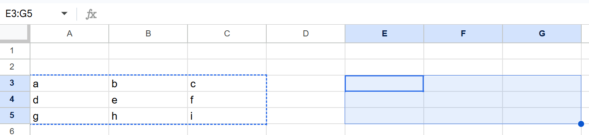
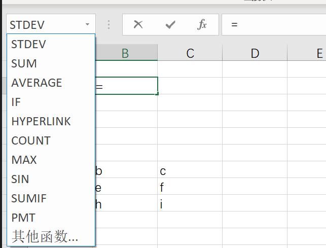

# Online Spreadsheet Data Workspace

A compact online spreadsheet application with an interface inspired by Google Sheets, focused on workbook and worksheet management, grid data editing, formula calculation, sorting and filtering, data validation, and basic pivot analysis. Users enter an editor from the workbook home page; grid, formula-bar, row/column, filter, validation, and pivot actions affect only the target worksheet in the open workbook. Refreshing or reopening restores the workbook name, worksheet tabs and order, active worksheet, each worksheet’s last selected cell, row and column structure, cell values and formulas, filtered view, validation behavior, and pivot results. A change either completes in full and remains after reopening, or shows an error while the current and reopened pages retain the last successful state; partial changes are not allowed. Shared collaboration, version history restoration, complex visual styling, charts, macro scripts, real-time collaborative cursors, and external office-suite integrations are outside the core scope.

## REQ-1 Workbook Access and Lifecycle

Support viewing, opening, creating, renaming, importing, and exporting workbooks. The home page is the workbook entry point; opening, creating, or importing enters the same editor, and later actions affect only the open workbook. Returning home or reopening preserves the workbook name, last-updated time, worksheet order, and last active worksheet. Worksheet tabs expose the ARIA tab role and the active tab exposes aria-selected="true". Grid cells expose the ARIA gridcell role, use their coordinate as the accessible name (for example, A1), and the current cell exposes aria-selected="true".

**Type:** FOLDER
**Dependencies:** None

### REQ-1-1 Workbook Navigation

Support viewing and opening available workbooks from the home page. After creation, renaming, or CSV import succeeds, returning to or refreshing the home page shows the updated record.

Screenshot reference:

**Type:** FOLDER
**Dependencies:** None

#### REQ-1-1-1 View and open workbooks

A user views available workbooks on the workbook home page. Each record displays its last-updated time and provides a link whose accessible name is the workbook name. Activating the link opens an editor showing that workbook’s name, worksheet tabs and order, active worksheet, row and column structure, grid values, formula-bar content, filtered view, validation controls, and pivot results without showing data from another workbook.

Screenshot reference:

**Type:** ATOMIC
**Dependencies:** None

**Scenarios:**

- Open a workbook
  - **GIVEN:** At least one saved workbook exists.
  - **WHEN:** The user clicks the workbook-name link in the workbook list on the home page.
  - **THEN:** The system opens the corresponding editing page and shows the last active worksheet.
  - **THEN:** The workbook name and last-updated time shown on the page match the home-page record.

### REQ-1-2 Workbook Creation and Naming

Support creating blank workbooks and changing workbook names through visible home-page and editor controls. Successful changes appear in both the editor and home page and remain after refreshing or reopening.

**Type:** FOLDER
**Dependencies:** None

#### REQ-1-2-1 Create a blank workbook

A user creates a blank workbook from the workbook home page. The home page provides a button named “New blank workbook”; activating it opens the creation page, whose submit button is named “Create”. Success opens the editor with one blank worksheet named Sheet1, makes Sheet1 the active tab, and selects A1; refreshing or reopening shows the same state. Failure shows an error, leaves the user able to retry, and does not add an incomplete workbook record to the home page.

Screenshot reference:

**Type:** ATOMIC
**Dependencies:** None

**Scenarios:**

- Create and reopen a blank workbook
  - **GIVEN:** The user is on the workbook home page.
  - **WHEN:** The user clicks “New blank workbook” on the home page and clicks “Create” on the creation page.
  - **THEN:** The system creates a workbook associated with the application and containing Sheet1.
  - **THEN:** The editing page opens Sheet1 and selects A1.
  - **THEN:** After refreshing or reopening, the workbook and default worksheet still exist.

#### REQ-1-2-2 Rename a workbook

A user can change the workbook name on its editing page. A button beside the editor title is named “Rename workbook”. Activating it displays a textbox labeled “Workbook name”, prefilled with the last successful name, and a button named “Save”. After trimming leading and trailing spaces, the name must not be empty; an empty name is rejected with “Workbook name cannot be empty”. Success updates both the editor title and home-page link. Failure shows an error and both locations keep the original name. Reopening displays the last successfully saved name.

**Type:** ATOMIC
**Dependencies:** REQ-1-1-1

**Scenarios:**

- Save a valid workbook name
  - **GIVEN:** The user has opened a workbook containing only Sheet1, whose A1 cell contains Existing data.
  - **WHEN:** The user clicks “Rename workbook”, enters a non-empty name in “Workbook name”, then clicks “Save” or presses Enter.
  - **THEN:** Both the editing page and workbook home page display the new name.
  - **THEN:** After reopening the workbook, the new name is still displayed.
- Reject an empty workbook name
  - **GIVEN:** The user has opened the workbook, and the new name is empty after trimming leading and trailing spaces.
  - **WHEN:** The user leaves “Workbook name” empty or enters only spaces, then clicks “Save”.
  - **THEN:** The system rejects the change, displays that the name cannot be empty, and keeps showing the original name after refresh.

### REQ-1-3 CSV Data Exchange

Support importing external CSV data as a workbook and exporting the current active worksheet as CSV. A successful import remains complete after reopening; export does not change workbook content or the current editor state.

**Type:** FOLDER
**Dependencies:** None

#### REQ-1-3-1 Import CSV to create a workbook

A user starts import with the “Import CSV” button on the workbook home page. A dialog named “Import CSV” provides a file control labeled “CSV file” and a button named “Confirm import”. The system parses the original row and column order, preserves empty fields, supports UTF-8 Chinese, English, and numeric text, and handles quoted commas, doubled quotes, and newlines inside quoted fields. A quoted field without a closing quote is rejected with “Invalid CSV file format. Import failed.” Success creates a workbook named from the selected file without its final .csv extension and opens Sheet1 with every CSV row, column, empty field, and original text visible; the first row remains ordinary data. Refreshing or reopening preserves the complete grid. Failure adds no link with that name to the home page and leaves no partial import visible or reopenable.

**Type:** ATOMIC
**Dependencies:** None

**Scenarios:**

- Import a valid CSV
  - **GIVEN:** A readable UTF-8 CSV file exists with ordinary fields, an empty field, Chinese text, numeric text, a quoted comma, a doubled quote, and a newline inside a quoted field.
  - **WHEN:** The user clicks “Import CSV” on the home page, selects the file in the file picker, then clicks “Confirm import”.
  - **THEN:** The system creates a new workbook, and the cells in Sheet1 correspond to the CSV rows and columns.
  - **THEN:** Empty fields and Chinese content are still preserved after reopening.
- Reject an unparseable CSV
  - **GIVEN:** The selected CSV file contains a quoted field without a closing quote and therefore cannot be parsed.
  - **WHEN:** The user selects the unparsable file in the import dialog and clicks “Confirm import”.
  - **THEN:** The system displays an import failure message and does not create a partially populated workbook.

#### REQ-1-3-2 Export the current worksheet as CSV

A user can export the current active worksheet with the editor-toolbar button named “Export CSV”. The CSV follows the grid’s row and column order, preserves empty cells in the used range, and escapes text containing commas, quotes, or newlines. Ordinary cells export displayed values; formula cells export calculated results rather than expressions. Before and after export, the active worksheet, filtered view, grid values, and formula-bar content remain unchanged and still match after refresh.

**Type:** ATOMIC
**Dependencies:** REQ-1-1-1

**Scenarios:**

- Export a saved worksheet
  - **GIVEN:** The workbook is open with a saved active worksheet containing the headers 地区, 说明, 数量, 空列, and 公式结果; its data includes 华东 / “含,逗号” / 2 / empty / formula result 4 and 华北 / Chinese text containing a quote and newline / 3 / empty / formula result 5.
  - **WHEN:** The user clicks “Export CSV” in the toolbar of the open workbook.
  - **THEN:** The system generates a CSV file consistent with the active worksheet’s row and column order.
  - **THEN:** Formula cells write the current results, and the original data remains unchanged after reopening the workbook.

## REQ-2 Worksheets and Grid Structure

Support managing multiple worksheets in one workbook and adjusting row and column structure. Each worksheet’s name, order, grid values, formulas, validation behavior, filtered view, and pivot results remain independent. Switching worksheets or reopening the workbook must never display data from another worksheet.
Screenshot reference:

**Type:** FOLDER
**Dependencies:** None

### REQ-2-1 Worksheet Lifecycle

Support creating, switching, renaming, and deleting worksheets, and ensure that each worksheet's grid, formulas, validation behavior, filtered view, and pivot field choices and results remain independent after reopening. The worksheet tab bar shows the last successful worksheet order and active state and provides a button named “Add sheet”. Each worksheet tab has a button named “Worksheet options for <worksheet name>”; activating it opens a menu whose commands use the ARIA menuitem role.

Screenshot reference:

**Type:** FOLDER
**Dependencies:** None

#### REQ-2-1-1 Add a worksheet

A user adds a worksheet with the button named “Add sheet” in the worksheet tab bar. The new tab uses the first unused SheetN name in positive-integer order; a workbook containing only Sheet1 creates Sheet2. The new worksheet is blank, inherits no filter, validation, or pivot result from another worksheet, becomes the active tab, and selects A1. Existing worksheets remain unchanged, and the new tab remains after refresh or reopen. Failure shows an error, adds no tab, and leaves existing worksheets unchanged.

**Type:** ATOMIC
**Dependencies:** REQ-1-1-1

**Scenarios:**

- Create a worksheet that remains after refresh
  - **GIVEN:** The user has opened a workbook.
  - **WHEN:** The user clicks “Add sheet” in the worksheet tab bar at the bottom of the editor.
  - **THEN:** The system adds and activates blank Sheet2 with A1 selected and leaves Sheet1 A1 as Existing data.
  - **THEN:** After reopening the workbook, the worksheet still exists.

#### REQ-2-1-2 Switch worksheets

After the user clicks another ARIA tab, the grid, row and column structure, selected cell, textbox labeled “Formula bar”, filter buttons, validation controls, and pivot results switch to the target worksheet. The formula bar displays the selected cell’s ordinary value or original formula; a worksheet without a previous selection selects A1. Switching does not modify the previous worksheet, and returning restores its last successful state. Reopening shows the last active tab and restores each worksheet’s last confirmed selected cell.

**Type:** ATOMIC
**Dependencies:** REQ-2-1-1

**Scenarios:**

- Preserve each worksheet’s data after switching
  - **GIVEN:** The workbook has at least two worksheets, and the current worksheet has saved data.
  - **WHEN:** The user clicks another worksheet tab and then clicks the original worksheet tab.
  - **THEN:** Each tab displays its own data.
  - **THEN:** After returning to the original worksheet, its original data remains unchanged.
- Keep filter and validation controls isolated while switching
  - **GIVEN:** Sheet1 has a filter whose Region header exposes “Filter Region” and C2 has a dropdown button named “Open dropdown for C2”; Sheet2 has neither control.
  - **WHEN:** The user switches from Sheet1 to Sheet2, then returns to Sheet1 and switches back to Sheet2.
  - **THEN:** “Filter Region” and “Open dropdown for C2” are visible only while Sheet1 is active, and each worksheet continues to show its own grid values.
  - **THEN:** After refreshing with Sheet2 active, Sheet2 remains active and neither Sheet1-only control is present.

#### REQ-2-1-3 Rename a worksheet

A user changes the name from the worksheet tab menu. The “Rename” menu item opens a dialog named “Rename worksheet” with a textbox labeled “Worksheet name”, prefilled with the current name, and a “Save” button. After trimming, the new name must be non-empty and unique within the workbook. An empty name shows “Worksheet name cannot be empty”; a duplicate shows “Worksheet name already exists”. Success updates the tab. Failure, duplicate, or empty input shows an error and keeps the original name. Refreshing or reopening shows the last successful name.

**Type:** ATOMIC
**Dependencies:** REQ-1-1-1

**Scenarios:**

- Save a unique worksheet name
  - **GIVEN:** The user has opened a workbook, and the target name is not used by another worksheet.
  - **WHEN:** The user opens the current worksheet tab menu, clicks “Rename”, enters the new name, and presses Enter or clicks “Save”.
  - **THEN:** The system saves the name and updates the tab. After reopening the workbook, the name remains.
- Reject a duplicate worksheet name
  - **GIVEN:** Another worksheet in the same workbook already uses the target name.
  - **WHEN:** The user enters a name already used in the workbook in the worksheet rename input and clicks “Save”.
  - **THEN:** The system displays “Worksheet name already exists” and keeps the original name after reopening.
- Reject an empty worksheet name
  - **GIVEN:** The user has opened a workbook and the current worksheet has a saved non-empty name.
  - **WHEN:** The user opens the current worksheet tab menu, clicks “Rename”, leaves “Worksheet name” empty or enters only spaces, and clicks “Save”.
  - **THEN:** The system displays “Worksheet name cannot be empty” and keeps the original saved name after reopening.

#### REQ-2-1-4 Delete a worksheet

A user deletes a worksheet through the “Delete” worksheet-menu item. When allowed, a dialog named “Delete worksheet” identifies the target and provides a “Delete worksheet” confirmation button. Success removes the target tab and its data, formulas, filters, validation controls, and pivot results, activates an adjacent worksheet, and remains deleted after refresh. Deleting a pivot-result worksheet removes that relationship so its former source is no longer blocked by the pivot. Deleting a worksheet still used as a pivot source is rejected with “Delete or rebuild dependent pivot tables first”; the dialog closes and both source data and pivot result remain unchanged. Deleting the only worksheet is rejected before confirmation with “A workbook must contain at least one worksheet”. Any other failure shows an error and leaves the target tab and grid visible immediately and after refresh.

**Type:** ATOMIC
**Dependencies:** REQ-2-1-1

**Scenarios:**

- Delete the current worksheet from a multi-sheet workbook
  - **GIVEN:** The workbook contains at least two worksheets.
  - **WHEN:** The user opens the current worksheet tab menu, clicks “Delete”, and clicks “Delete worksheet” in the confirmation dialog.
  - **THEN:** The worksheet tab and its data disappear, and another worksheet becomes active.
  - **THEN:** After reopening, the deleted worksheet still does not exist.
- Reject deleting the last worksheet
  - **GIVEN:** The workbook has only one worksheet remaining.
  - **WHEN:** With only one worksheet remaining, the user opens its tab menu and clicks “Delete”.
  - **THEN:** The system displays “A workbook must contain at least one worksheet”, rejects deletion, and keeps the worksheet.
- Reject deleting a pivot-table source worksheet
  - **GIVEN:** The current workbook contains a pivot table whose source is the worksheet to be deleted.
  - **WHEN:** The user clicks “Delete” in the referenced source worksheet's menu and confirms with “Delete worksheet”.
  - **THEN:** The system rejects deletion with “Delete or rebuild dependent pivot tables first”, and the source worksheet, pivot field choices, and pivot result remain unchanged.

### REQ-2-2 Row and Column Structure Management

Support inserting and deleting rows and columns in the active worksheet. After an operation, grid values, formula-bar content, filtered view, validation behavior, and refreshed pivot results remain consistent; other worksheets do not change, and refresh preserves the structure. Row numbers expose the ARIA rowheader role with their decimal number as the accessible name. Column letters expose the ARIA columnheader role with their letters as the accessible name. Right-clicking either header opens a menu whose commands use the ARIA menuitem role.

**Type:** FOLDER
**Dependencies:** None

#### REQ-2-2-1 Insert and delete rows

A user inserts a blank row above or below a target row through the row-number menu, or deletes the target row. The menu exposes “Insert 1 row above”, “Insert 1 row below”, and “Delete row”. Insertion shifts complete records, validation rules, and formula references down; deletion shifts later rows up and removes the target row’s rules. Affected formula bars show adjusted expressions and grids show correct results; references that cannot be retained show a recognizable error, while filters continue to cover the original data range. If the change overlaps a pivot source range, the existing pivot result remains unchanged until “Refresh pivot table” is clicked, then uses the adjusted source range. Failure shows an error and leaves the complete pre-operation structure visible immediately and after refresh.

Screenshot reference:

**Type:** ATOMIC
**Dependencies:** REQ-1-1-1

**Scenarios:**

- Insert a row and preserve data
  - **GIVEN:** The target worksheet is open with A1/B1 = Item/Amount, A2/B2 = Alpha/10, and A3/B3 = Beta/20.
  - **WHEN:** The user right-clicks row number 3 and chooses “Insert 1 row above”.
  - **THEN:** Row 3 is blank, Beta/20 moves together to A4/B4, Alpha/10 remains at A2/B2, and the same state remains after refreshing.
- Delete a row and reopen
  - **GIVEN:** The target worksheet is open with A2 = Alpha, A3 = Remove me, and A4 = Beta.
  - **WHEN:** The user right-clicks row number 3, chooses “Delete row”, then closes and reopens the workbook after the updated grid is visible.
  - **THEN:** A3 displays Beta, A4 is blank, and the same order remains after reopening.

#### REQ-2-2-2 Insert and delete columns

A user inserts a blank column to the left or right of a target column through the column-header menu, or deletes the target column. The menu exposes “Insert 1 column left”, “Insert 1 column right”, and “Delete column”. Insertion shifts complete data, validation rules, and formula references right; deletion shifts later columns left and removes the target column’s rules. Data outside the deleted column remains. Affected formula bars show adjusted expressions and grids show correct results; a direct reference that cannot be retained displays #REF!, while filters continue over the adjusted range. Moving a pivot source column leaves the old result unchanged until refresh, which uses the moved field. Deleting a selected header makes refresh or the pivot editor show a visible error requiring a new field selection while preserving the last successful result. Failure shows an error and leaves the pre-operation structure visible immediately and after refresh.

Screenshot reference:

**Type:** ATOMIC
**Dependencies:** REQ-1-1-1

**Scenarios:**

- Insert a column and preserve data
  - **GIVEN:** The target worksheet is open with A1/B1/C1 = Alpha/Beta/Gamma.
  - **WHEN:** The user right-clicks column header B and chooses “Insert 1 column left”.
  - **THEN:** After inserting left of B, A1 remains Alpha, B1 is blank, C1 displays Beta, D1 displays Gamma, and the same state remains after refreshing.
- Delete a column referenced by formulas
  - **GIVEN:** The worksheet contains A1/B1/C1 = Unit price/Quantity/Total, A2/B2 = 10/2, and C2 is the saved formula =A2*B2 with result 20.
  - **WHEN:** The user right-clicks column header B and chooses “Delete column”.
  - **THEN:** Column B is deleted, Total moves to B1, the direct reference to the deleted column becomes #REF! in B2, A1/A2 remain unchanged, and the same state remains after reopening.

## REQ-3 Cell and Range Editing

Support data entry in cells and contiguous ranges, bulk paste, copy and cut, and undo and redo within the active worksheet. Each action either fully updates the target grid, formula results, and related validation behavior and remains after refresh, or shows an error while this and every other worksheet retain the pre-operation state.

**Type:** FOLDER
**Dependencies:** None

### REQ-3-1 Direct Data Entry

Support entering data through the grid, the textbox labeled “Formula bar”, or the external clipboard. After an edit is committed, the grid and formula bar show the same cell content, and the result remains after refresh. Double-clicking a grid cell opens an inline textbox named “Edit <cell coordinate>”.

**Type:** FOLDER
**Dependencies:** None

#### REQ-3-1-1 Edit cells through the grid or formula bar

After selecting a cell, a user can change its content in the grid or formula bar. Cells support text, numbers, boolean-like values, date text, and formulas beginning with an equals sign. Pressing Enter or clicking another cell commits the edit; pressing Escape cancels it. Formula cells display calculated results in the grid and the original formula in the formula bar, while ordinary cells display the same value in both. A committed source-cell change recalculates dependent formulas as defined by REQ-4-2-1 and remains after refresh. If the edit cannot be completed, the previous value, formula, and result remain visible and an error is shown.

**Type:** ATOMIC
**Dependencies:** REQ-1-1-1

**Scenarios:**

- Commit a cell edit
  - **GIVEN:** A fresh prepared worksheet is open with A1 selected and saved as 2, while B1 contains the formula =A1*2 with result 4.
  - **WHEN:** The user clicks the formula bar, replaces A1 with 3, and presses Enter.
  - **THEN:** A1 displays 3 in the grid and formula bar; B1 recalculates to 6 in the grid and displays =A1*2 in the formula bar when selected.
  - **THEN:** After reopening the workbook, the content still exists.
- Cancel an uncommitted edit
  - **GIVEN:** A fresh prepared worksheet is open with A1 saved as Saved value.
  - **WHEN:** The user double-clicks A1, enters Unsaved value in “Edit A1”, and presses Escape before committing.
  - **THEN:** A1 and the formula bar display Saved value, the inline editor closes, and refreshing does not reveal Unsaved value.

#### REQ-3-1-2 Paste two-dimensional tabular data

A user pastes text containing tab-separated columns and newline-separated rows into a starting cell. The complete rectangle is applied, including empty fields, and only cells inside the target rectangle are overwritten. Overwritten formulas are replaced by the pasted content and affected formulas are recalculated. The paste either updates every cell in the rectangle and remains after refresh or shows an error without changing any target cell; values must not be silently discarded. The grid context menu exposes a “Paste” menu item, while Ctrl+V pastes the same external clipboard content.

**Type:** ATOMIC
**Dependencies:** REQ-3-1-1

**Scenarios:**

- Paste a rectangular data range
  - **GIVEN:** A fresh prepared worksheet is open with A1 = Outside, E4 = Keep, and the clipboard text Alpha<TAB><TAB>3<NEWLINE>Beta<TAB>二<TAB>4.
  - **WHEN:** The user clicks B2 and uses Ctrl+V.
  - **THEN:** B2/C2/D2 become Alpha/empty/3 and B3/C3/D3 become Beta/二/4 in one saved operation.
  - **THEN:** A1 remains Outside, E4 remains Keep, and the complete pasted rectangle remains after reopening.

### REQ-3-2 Range Transfer and Operation Recovery

Support transferring data between ranges in the current active worksheet and using undo and redo for cell edits, pastes, range transfers, and row or column changes. Undo and redo restore the corresponding grid content, formulas, validation behavior, and row or column layout, and the resulting state remains after refresh.

**Type:** FOLDER
**Dependencies:** None

#### REQ-3-2-1 Copy, cut, and paste cell ranges

A user selects a contiguous rectangular range by dragging between its corner cells, performs copy or cut, and then selects a target location to paste. After copying, the source range remains unchanged. For cut, the source is cleared only when the entire target range has been filled successfully. Values and formulas preserve their original two-dimensional layout. Copied formulas adjust relative references for the target offset and keep absolute references unchanged, which is visible in the target cell's formula bar. Source and target must be in the same worksheet. The action either completes in full and remains after refresh or shows an error while the source, target, and cells outside both ranges retain their previous values.

Screenshot reference:

**Type:** ATOMIC
**Dependencies:** REQ-3-1-1

**Scenarios:**

- Copy a range and adjust formulas
  - **GIVEN:** A fresh prepared worksheet contains A1/B1 = 1/2, A2 = 3, B2 is the formula =A1+$B$1 with result 3, D1:E2 is blank, and G1 = Keep.
  - **WHEN:** The user drags from A1 to B2, uses Ctrl+C, clicks D1, then uses Ctrl+V.
  - **THEN:** D1/E1/D2/E2 display 1/2/3/3, A1:B2 remains unchanged, and G1 remains Keep.
  - **THEN:** Selecting E2 shows =D1+$B$1 in the formula bar; the relative reference moves and the absolute reference remains unchanged.
  - **THEN:** After reopening the workbook, the source and target ranges still show the same values and formulas as immediately after copying.
- Cut a range and clear the source range
  - **GIVEN:** A fresh prepared worksheet contains A1/B1/A2/B2 = A/B/C/D, D1:E2 is blank, and G1 = Keep.
  - **WHEN:** The user drags from A1 to B2, uses Ctrl+X, clicks D1, then uses Ctrl+V.
  - **THEN:** D1/E1/D2/E2 become A/B/C/D, A1:B2 is cleared, G1 remains Keep, and the same state remains after reopening.

#### REQ-3-2-2 Undo and redo recent operations

A user can undo recent cell edits, bulk pastes, range moves, and row or column changes in the current workbook session. The toolbar exposes buttons named “Undo” and “Redo”; Ctrl+Z and Ctrl+Y perform the same actions. Consecutive undos restore the visible worksheet states in reverse order, including cell values and formulas, row or column layout, and affected validation behavior. Redo reapplies the operation that was just undone. Undo and redo affect only the current workbook, and the resulting state remains after refresh. The undo/redo list may start empty after reopening. When a new change is made after undo, the old redo branch is discarded and the “Redo” button is disabled.

**Type:** ATOMIC
**Dependencies:** REQ-2-2-1, REQ-2-2-2, REQ-3-1-1, REQ-3-1-2, REQ-3-2-1

**Scenarios:**

- Undo and redo a change
  - **GIVEN:** In a newly created workbook, the user has just committed a unique value to previously blank A1.
  - **WHEN:** The user clicks “Undo” and then “Redo” in the toolbar, or uses Ctrl+Z and Ctrl+Y respectively.
  - **THEN:** Undo restores blank A1.
  - **THEN:** Redo restores the unique value, saves it, and preserves it after refresh.
- A new change after undo clears the redo branch
  - **GIVEN:** In a newly created workbook, the user committed a unique old-branch value to A1 and then undid it, so A1 is blank and a redo record exists.
  - **WHEN:** The user enters and commits a different unique new-branch value in A1.
  - **THEN:** The new value is saved, “Redo” is disabled, Ctrl+Y cannot restore the old branch, and the new value remains after refresh.
- Undo and redo a source edit with dependent formulas
  - **GIVEN:** A1 was changed from 2 to 3, while B1 contains =A1*2 and now displays 6.
  - **WHEN:** The user clicks “Undo” and then “Redo”.
  - **THEN:** Undo restores A1 to 2 and B1 to 4 while B1's formula bar remains =A1*2; Redo restores A1 to 3 and B1 to 6.
  - **THEN:** After refresh, A1 remains 3 and B1 remains 6 with formula =A1*2.
- Undo and redo structure changes with validation
  - **GIVEN:** A1 contains Keep and has a dropdown button named “Open dropdown for A1”.
  - **WHEN:** The user inserts a row above row 1 and a column left of column A, then undoes both operations and redoes both operations.
  - **THEN:** The value and dropdown button move together through B2, A2, A1, A2, and B2 as the two operations are undone and redone.
  - **THEN:** After refresh, B2 still contains Keep and exposes “Open dropdown for B2”.

## REQ-4 Formula Calculation

Support basic formula calculation, relative and absolute references, dependent-formula recalculation, and error handling in the current active worksheet. The grid displays a formula's result or error while the formula bar displays the submitted expression. Copy, paste, row or column changes, and source-value edits use the same reference-adjustment and recalculation rules. Formula expressions and correct results remain visible after reopening the workbook.

**Type:** FOLDER
**Dependencies:** None

### REQ-4-1 Formula Entry and Functions

Support entering basic expressions and aggregate functions through the REQ-3-1-1 cell-editing entry and copying formulas through REQ-3-2-1. The grid shows each formula's result, the formula bar shows that cell's expression, and both remain correct after refresh.

**Type:** FOLDER
**Dependencies:** None

#### REQ-4-1-1 Calculate basic expressions and aggregate functions

A user enters a formula beginning with an equals sign through the REQ-3-1-1 grid or formula bar. Formulas support numeric constants, parentheses, addition, subtraction, multiplication, division, same-worksheet A1 cell references, and SUM, AVERAGE, COUNT, MIN, and MAX over contiguous ranges; cross-worksheet references are outside this requirement. The grid displays the result calculated from current source cells and the formula bar displays the original expression. Function names are case-insensitive. Empty cells are ignored: COUNT counts numeric cells, and SUM, AVERAGE, MIN, and MAX use numeric cells without treating an empty cell as zero. The submitted expression and correct result remain after reopening.

Screenshot reference:

**Type:** ATOMIC
**Dependencies:** REQ-3-1-1

**Scenarios:**

- Calculate an arithmetic expression
  - **GIVEN:** A fresh prepared worksheet contains A1 = 3, B1 = 4, and blank C1.
  - **WHEN:** The user selects C1, enters =(A1+B1)*2 in the formula bar, and presses Enter.
  - **THEN:** C1 displays 14, and selecting C1 shows =(A1+B1)*2 in the formula bar.
  - **THEN:** After reopening the workbook, the formula bar still displays the original expression and the grid result is correct.
- Calculate aggregate range functions
  - **GIVEN:** A fresh prepared worksheet contains B2 = 2, B4 = 4, B6 = 6, all other cells in B2:B10 empty, and D2:D6 blank.
  - **WHEN:** The user enters =sum(B2:B10), =AVERAGE(B2:B10), =COUNT(B2:B10), =MIN(B2:B10), and =MAX(B2:B10) in D2 through D6.
  - **THEN:** D2:D6 displays 12, 4, 3, 2, and 6; the lowercase SUM works and empty cells neither fail calculation nor count as numeric values.

#### REQ-4-1-2 Copy formulas and adjust relative references

When REQ-3-2-1 copies a formula cell to another location in the same worksheet, relative row and column references change according to the target offset while absolute references remain unchanged. The target formula bar displays the adjusted expression and the target grid cell displays its result, while the source formula and result remain unchanged. Both formulas remain correct after reopening. If an offset moves a relative reference outside the worksheet, the target formula bar displays =#REF! and its grid cell displays the REQ-4-2-2 #REF! error.

**Type:** ATOMIC
**Dependencies:** REQ-4-1-1, REQ-3-2-1, REQ-4-2-2

**Scenarios:**

- Copy a formula to the next row
  - **GIVEN:** A fresh prepared worksheet contains A1 = 1, B1 = 2, A2 = 10, C1 =A1+$B$1 with result 3, and blank C2.
  - **WHEN:** The user selects C1, uses Ctrl+C, selects C2, then uses Ctrl+V.
  - **THEN:** C2 saves =A2+$B$1 and displays 12; the relative row changes and the absolute reference remains unchanged.
  - **THEN:** The formula and result in C1 remain unchanged.
  - **THEN:** After reopening the workbook, C1 and C2 still save their respective formula expressions.

### REQ-4-2 Dependency Updates and Error Handling

Support updating every directly or indirectly dependent formula after source data changes while keeping formula errors isolated. REQ-3 value edits, pastes, and moves and REQ-2 row or column changes invoke this behavior; unrelated cells and worksheets remain unchanged.

**Type:** FOLDER
**Dependencies:** None

#### REQ-4-2-1 Recalculate dependent formulas after source data changes

After a REQ-3 source edit, bulk paste, or range move, or a REQ-2 row or column change is committed, every directly and indirectly dependent formula displays its updated result or error. The formula bar continues to show each formula's expression. After reopening, the same formulas display results calculated from the current source values, while unrelated cells and formulas in other worksheets remain unchanged.

**Type:** ATOMIC
**Dependencies:** REQ-2-2-1, REQ-2-2-2, REQ-3-1-1, REQ-3-1-2, REQ-3-2-1, REQ-4-1-1

**Scenarios:**

- Update chained dependent formulas
  - **GIVEN:** A fresh prepared workbook has active Sheet1 with A1 = 10, B1 =A1*2 displaying 20, and C1 =B1+5 displaying 25; Sheet2 has A1 = Other and B1 =1+1 displaying 2.
  - **WHEN:** The user edits Sheet1 A1 in the formula bar, changes the value to 20, and presses Enter.
  - **THEN:** Sheet1 B1 updates to 40 and C1 updates to 45, while Sheet2 A1 remains Other and B1 remains 2 with formula =1+1.
  - **THEN:** After reopening the workbook, the updated results are still displayed.
- Recalculate dependencies after moving a source value
  - **GIVEN:** A1 is 2, B1 is 3, C1 is =B1*2 displaying 6, and D1 is =C1+1 displaying 7.
  - **WHEN:** The user cuts A1 and pastes it into B1, replacing the previous B1 value.
  - **THEN:** A1 is blank, B1 displays 2, C1 displays 4 with formula =B1*2, and D1 displays 5 with formula =C1+1.
  - **THEN:** The same values, formulas, and results remain after refresh.

#### REQ-4-2-2 Display and fix formula errors

Formula cells display stable, recognizable errors: division by zero uses #DIV/0!, an invalid reference uses #REF!, an unsupported function uses #NAME?, a malformed expression uses #ERROR!, and a direct or indirect circular reference uses #REF!. Selecting an error cell shows the submitted formula in the formula bar, and the same error remains after refresh. One error does not block unrelated cells from being viewed, edited, or recalculated. Replacing the error formula through REQ-3-1-1 with a valid expression removes the error, displays the new result, updates dependent formulas, and remains correct after reopening.

**Type:** ATOMIC
**Dependencies:** REQ-4-1-1

**Scenarios:**

- Display formula errors
  - **GIVEN:** A fresh prepared worksheet is editable with A1 = Keep and blank B1:B5.
  - **WHEN:** The user enters =1/0, =A0, =UNSUPPORTED(1), =1+, and =B5 in B1 through B5.
  - **THEN:** B1:B5 displays #DIV/0!, #REF!, #NAME?, #ERROR!, and #REF! respectively; selecting each cell shows its submitted formula in the formula bar, and A1 can still be changed and saved independently.
- Fix an erroneous formula
  - **GIVEN:** A fresh prepared worksheet contains A1 = 2 and B1 =1/0 displaying #DIV/0!.
  - **WHEN:** The user selects B1, replaces the formula with =A1*3, and presses Enter.
  - **THEN:** B1 displays 6, its formula bar displays =A1*3, and the corrected formula/result remain after reopening.

## REQ-5 Data Organization and Analysis

Support sorting, filtering, validation, and pivot summaries in the current active worksheet. Sorting changes row order, filtering changes only row visibility, validation constrains later edits, and pivot tables summarize a source range without modifying it. The same sorted order, filtered view, validation behavior, and pivot configuration and results return after reopening. The editor toolbar provides a button named “Data”; activating it opens a menu whose commands use the ARIA menuitem role. Options opened from every named combobox in this requirement use the ARIA option role and their visible names.

**Type:** FOLDER
**Dependencies:** None

### REQ-5-1 Sorting and Filtering

Support sorting a selected rectangular range by a column and filtering a selected range by value or condition. Sorting and filtering apply only to the explicitly selected range, never expand implicitly into adjacent data or another worksheet, and remain in effect after reopening.

**Type:** FOLDER
**Dependencies:** None

#### REQ-5-1-1 Sort a data range by a specified column

A user selects a rectangular data range and chooses “Sort range” from the Data menu. A dialog named “Sort range” provides comboboxes labeled “Sort by” and “Order”, a checkbox named “Data has header row”, and a “Sort” button. “Sort by” options use the selected range's header text as their accessible names; “Order” provides options named “Ascending” and “Descending”. The user may declare the first row as a header, which is not sorted. Numbers, parseable dates, and text are compared with consistent type-specific rules; records with equal keys retain their previous relative order. Complete rows move together to avoid column misalignment. Formulas continue to show correct results, filters and validation continue to apply to their corresponding data, and data outside the selected range does not change. The action either completes in full and remains after reopening or shows an error while the original row order and related behavior remain unchanged.

Screenshot reference:

**Type:** ATOMIC
**Dependencies:** REQ-3-1-1, REQ-4-2-1

**Scenarios:**

- Sort by sales amount descending
  - **GIVEN:** A fresh prepared worksheet contains A1:C5 as Region/Sales/Status; rows 2-5 are East/1200/Open, North/800/Closed, South/1200/Pending, and West/500/Open; E1 = Outside.
  - **WHEN:** The user drags from A1 to C5, chooses “Sort range” from the Data menu, selects Sales in “Sort by”, Descending in “Order”, checks “Data has header row”, then clicks “Sort”.
  - **THEN:** The header remains in row 1; rows become East/1200/Open, South/1200/Pending, North/800/Closed, and West/500/Open, preserving the original order of equal 1200 values.
  - **THEN:** E1 remains Outside.
  - **THEN:** After reopening the workbook, records are still ordered according to the saved order.
- Keep formulas and validation aligned after sorting
  - **GIVEN:** A1:C4 contains Item/Score/Double with Alpha/3/=B2*2, Bravo/1/=B3*2, and Charlie/2/=B4*2; B2:B4 accepts only numbers from 0 to 10.
  - **WHEN:** The user sorts A1:C4 by Score in ascending order with the header option enabled.
  - **THEN:** The rows become Bravo/1/2, Charlie/2/4, and Alpha/3/6; each Double formula references the Score cell on its current row.
  - **THEN:** Entering 11 in B2 shows “Enter a number from 0 to 10”, keeps B2 as 1 and C2 as 2, and the sorted state remains after refresh.
- Keep an existing filter active after sorting
  - **GIVEN:** A1:B4 contains Item/Score with Alpha/3, Bravo/1, and Charlie/2; the Score filter is set to Greater than 1, so Bravo is hidden.
  - **WHEN:** The user sorts A1:B4 by Score in ascending order with the header option enabled.
  - **THEN:** “Filter Score” remains visible; hidden Bravo moves to row 2, while visible Charlie and Alpha move to rows 3 and 4.
  - **THEN:** After refresh, the same filter remains active and the same rows are visible and hidden.

#### REQ-5-1-2 Filter rows by value or condition

A user creates a filter for a header-containing data range with “Create filter” in the Data menu. Each header exposes a button named “Filter <header text>”. Its dialog is named the same and supports selecting specific values plus condition options named “Text contains”, “Greater than”, “Date is before”, “Is empty”, and “Is not empty”. A value dialog provides “Clear selection”, one checkbox whose accessible name is the displayed source value for each distinct value, and “Apply”; a condition dialog provides a “Condition” combobox, a “Value” textbox, and “Apply”. “Text contains”, “Greater than”, and “Date is before” use the Value textbox; empty/non-empty conditions do not require a value. Conditions across columns are combined with AND. Non-matching rows are hidden without deletion or reordering, and reopening restores the filtered view. CSV export and REQ-5-3 pivot summaries include all rows in the selected source range, including hidden rows. “Clear filter” makes all source rows visible again and remains cleared after reopening without changing source data, formulas, or validation behavior.

**Type:** ATOMIC
**Dependencies:** REQ-3-1-1

**Scenarios:**

- Combine multiple filter conditions
  - **GIVEN:** A fresh prepared worksheet contains A1:C6 as Region/Sales/Status; rows 2-6 are East/1200/Open, East/900/Closed, North/2000/Open, East/1500/Closed, and South/700/Open.
  - **WHEN:** The user selects A1:C6, enables “Create filter”, clears Region value selection and checks only East, applies it, then selects Greater than with value 1000 in the Sales filter and applies it.
  - **THEN:** The header and rows 2 and 5 are visible; rows 3, 4, and 6 are hidden, so only records satisfying both conditions are shown while all five source records remain saved.
  - **THEN:** After reopening the workbook, the same filter conditions are still applied.
  - **THEN:** After choosing “Clear filter”, rows 2-6 are all visible in their original order and values remain unchanged.

### REQ-5-2 Data Validation

Support dropdown or numeric validation for ranges in the current active worksheet. The same rule applies to REQ-3-1-1 direct edits, REQ-3-1-2 pastes, and REQ-3-2-1 range writes. When rows or columns move or are inserted or deleted, the rule continues to apply to the corresponding visible cells, and the behavior remains after reopening.

**Type:** FOLDER
**Dependencies:** None

#### REQ-5-2-1 Set dropdown or numeric validation for a range

A user selects a target range and chooses “Data validation” from the Data menu. A dialog named “Data validation” provides a “Rule type” combobox. “Dropdown” uses a textbox labeled “Allowed values” whose comma-separated entries are trimmed; “Number range” uses textboxes labeled “Minimum” and “Maximum”; a “Save” button applies the inclusive rule to the selected range. A dropdown cell provides a button named “Open dropdown for <cell coordinate>”; each choice uses the ARIA option role and its trimmed allowed value as the accessible name. Numeric cells accept only numbers within the inclusive range. Grid, formula-bar, paste, or range-move input that violates a rule is rejected in full and the previous value remains. An invalid dropdown value displays “Choose one of: <comma-separated allowed values>”; an invalid number displays “Enter a number from <minimum> to <maximum>”. A batch with any invalid target changes no target cell. Reopening preserves the rule. Selecting a range with one existing rule and reopening “Data validation” prefills its rule type and parameters and shows a “Delete rule” button. Saving changed parameters changes the rule's visible behavior; “Delete rule” removes that behavior. Neither operation deletes an existing cell value or replaces it with a default.

**Type:** ATOMIC
**Dependencies:** REQ-3-1-1, REQ-3-1-2, REQ-3-2-1

**Scenarios:**

- Save a dropdown validation rule
  - **GIVEN:** A newly created workbook has blank editable A1:A2.
  - **WHEN:** The user selects A1:A2, creates a Dropdown rule with allowed values Not Started, In Progress, and Completed, saves it, opens the dropdown for A1, and chooses In Progress.
  - **THEN:** A1 saves In Progress, A2 still has its own dropdown button, and both the value and rule remain after reopening.
- Handle invalid numeric input
  - **GIVEN:** A newly created workbook has A1 saved as 50.
  - **WHEN:** The user creates an inclusive Number range rule from 0 to 100 for A1, enters 120 in the formula bar, and presses Enter.
  - **THEN:** The system rejects 120, displays “Enter a number from 0 to 100”, and keeps A1 as 50; after reopening the rule still rejects 101 and accepts boundary value 100.
- Reject a value outside a dropdown rule
  - **GIVEN:** A1 contains Open and has a dropdown rule allowing Open and Closed.
  - **WHEN:** The user enters Pending in A1 through the formula bar and presses Enter.
  - **THEN:** The page displays “Choose one of: Open, Closed”, A1 remains Open, and the formula bar still displays Open.
  - **THEN:** After refresh, entering Pending is still rejected and A1 remains Open.

### REQ-5-3 Basic Pivot Summaries

Support creating a basic pivot table from a worksheet range in a dedicated worksheet created through REQ-2-1-1. The pivot result, selected source range, field choices, and aggregation return after reopening, while the source worksheet remains unchanged.

**Type:** FOLDER
**Dependencies:** None

#### REQ-5-3-1 Create and refresh a basic pivot table

A user selects a header-containing source range and chooses “Create pivot table” from the Data menu. A dialog named “Create pivot table” displays the source range, provides a “New worksheet” radio option, and a “Create” button. The first pivot result worksheet uses the first unused PivotN name, so a workbook without another pivot result creates Pivot1. A region named “Pivot table editor” provides comboboxes labeled “Rows”, “Columns”, “Values”, and “Summarize by”, plus an “Apply” button. Options in “Rows”, “Columns”, and “Values” use source header text as their accessible names; “Summarize by” provides options named SUM, COUNT, and AVERAGE. Configuration supports one row field, an optional column field, and one value field. SUM/AVERAGE aggregate parseable numbers; COUNT counts non-empty value-field records without failing on nonnumeric values.
Without a column field, A1 contains the row-field name, B1 contains “<AGGREGATION> of <value field>”, distinct row values follow their first appearance in the source, and a final Grand Total row aggregates all eligible source records. With a column field, A1 contains the row-field name, distinct column values fill B1 onward in first-appearance order, the last column is Grand Total, distinct row values fill subsequent rows in first-appearance order, and the last row is Grand Total. A COUNT intersection with no non-empty value-field record displays 0.
After a successful Apply, reopening shows the same pivot worksheet, field choices, aggregation, and result. A button named “Refresh pivot table” on the result worksheet replaces the previous summary with values from the current source range after source data or REQ-2-2 row or column changes. If a selected source header is deleted, Refresh displays “Pivot field is no longer available. Select a new field.”, preserves the last successful pivot result, and does not modify the source worksheet. Any other invalid source range or field choice also displays a visible error and preserves both worksheets. If SUM or AVERAGE is applied to a value field with no parseable numeric records, the system displays “Value field requires numeric values”, keeps the last successful result, and leaves the source worksheet unchanged.

**Type:** ATOMIC
**Dependencies:** REQ-2-1-1, REQ-3-1-1

**Scenarios:**

- Summarize sales amount by region
  - **GIVEN:** A fresh prepared Sheet1 contains A1:B6 as Region/Sales; rows 2-6 are East/1200, North/800, East/600, South/1000, and North/700.
  - **WHEN:** The user selects A1:B6, chooses “Create pivot table”, selects New worksheet and Create, then selects Region in Rows, Sales in Values, SUM in Summarize by, and clicks Apply.
  - **THEN:** Pivot1 contains Region/SUM of Sales headers, East/1800, North/1500, South/1000, and Grand Total/4300.
  - **THEN:** Sheet1 A1:B6 remains unchanged, and Pivot1 and its result remain after reopening.
- Refresh an existing pivot table
  - **GIVEN:** A fresh prepared workbook has Sheet1 with Region/Sales rows East/1500, North/800, and East/600; Pivot1 still shows stale East/1800, North/800, Grand Total/2600.
  - **WHEN:** The user opens Pivot1 and clicks “Refresh pivot table”.
  - **THEN:** Pivot1 updates to East/2100, North/800, Grand Total/2900; Sheet1 remains unchanged and the refreshed result remains after reopening.
- Refresh after inserting rows and columns in the source range
  - **GIVEN:** Sheet1 A1:B4 contains Region/Sales with East/100, North/200, and East/300; Pivot1 summarizes SUM of Sales as East/400, North/200, and Grand Total/600.
  - **WHEN:** The user inserts a row inside the source range, enters East/50, refreshes Pivot1, then inserts a column before Sales and refreshes again.
  - **THEN:** Pivot1 displays East/450, North/200, and Grand Total/650 after each refresh, while Sheet1 shows the inserted row and the Sales column in its new position.
  - **THEN:** The refreshed result remains after reopening.
- Preserve the last pivot result when a selected source field is deleted
  - **GIVEN:** Sheet1 has Region and Sales source columns, and Pivot1 successfully displays East/400, North/200, and Grand Total/600 using Sales.
  - **WHEN:** The user deletes the Sales column and clicks “Refresh pivot table” in Pivot1.
  - **THEN:** The page displays “Pivot field is no longer available. Select a new field.” and Pivot1 keeps East/400, North/200, and Grand Total/600.
  - **THEN:** Sheet1 keeps its remaining Region data, and reopening preserves the last successful pivot result.
