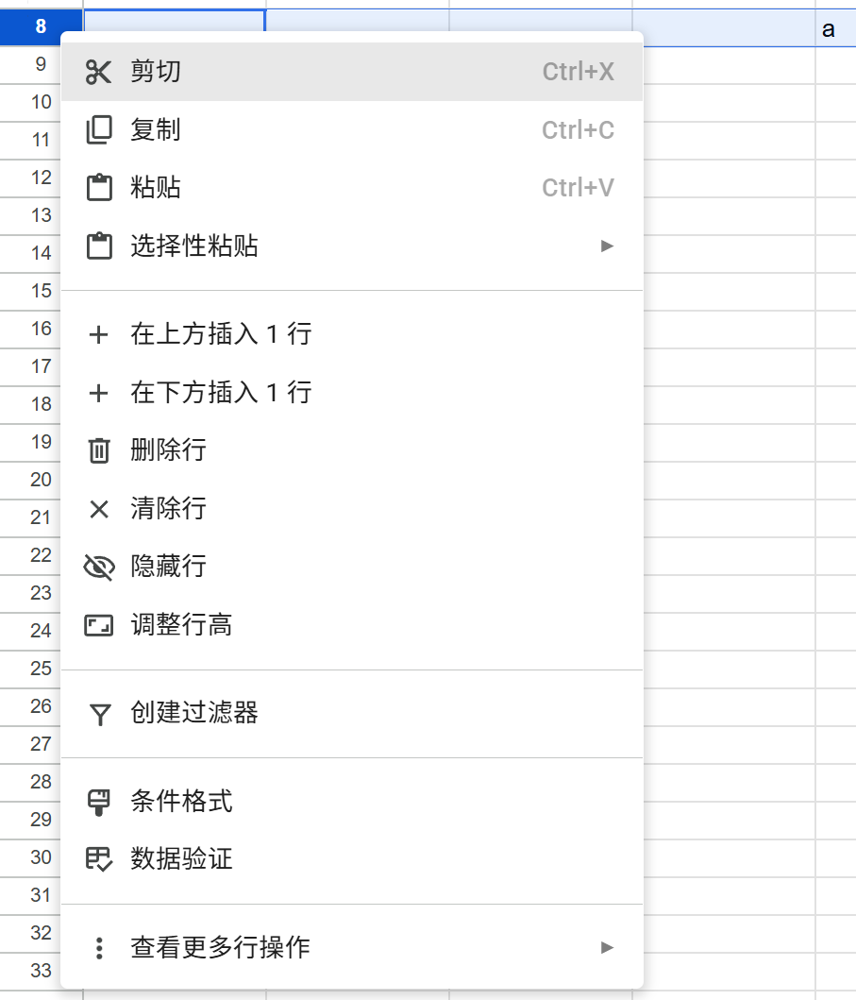

# Core Requirements for an Online Spreadsheet Data Workspace

A streamlined online spreadsheet application with an interface modeled after Google Sheets, focusing on workbook and worksheet management, spreadsheet data editing, formula calculation, sorting and filtering, data validation, and basic pivot analysis. Users enter the editor from the workbook home page; the editor operates in the context of the currently active worksheet, and all grid, formula bar, row/column menu, filter, and pivot table operations affect only the target worksheet in the current workbook. After refreshing the page or reopening a workbook from the home page, the application restores the workbook name, worksheets and their order, active worksheet, the complete rectangular region most recently selected successfully on each worksheet (a single cell is treated as a 1×1 region), row and column structure, cell values and formulas, filter views, validation rules, and pivot table results. Any modification must either take effect completely and persist after reopening, or display an error while both the current page and the reopened page continue to show the most recent successfully saved state; partial modifications are not allowed. Sharing and collaboration, version-history restoration, advanced visual styling, charts, macros, real-time collaborative cursors, and integrations with external office suites are outside the core scope.

## REQ-1 Workbook Access and Lifecycle

Supports viewing, opening, creating, renaming, importing, and exporting workbooks within the application. The home page is the entry point for workbooks; successful open, create, and import operations all enter the same editor page, and subsequent operations may modify only the currently opened workbook. After a workbook is opened, created, or imported, the editor URL shown in the browser must be a stable, directly accessible workbook URL: visiting or refreshing that exact URL must open the same workbook rather than another workbook or a temporary blank page, and successful workbook modifications must remain available through that URL. After returning to the home page or reopening, the workbook name, last-updated time, worksheet order, and last active worksheet remain consistent. Worksheet tabs on the same editor page use the ARIA tab role, with the active tab indicated by aria-selected="true"; the active worksheet grid uses the ARIA grid role, has the accessible name “Worksheet grid”, and exposes aria-multiselectable="true". Grid cells use the ARIA gridcell role with their cell coordinates as accessible names (for example, A1); the current cell and every cell within the currently selected rectangular region expose aria-selected="true", while cells outside the region expose aria-selected="false".

**Type:** FOLDER
**Dependencies:** None

### REQ-1-1 Workbook Navigation

Supports viewing and opening available workbooks from the home page. After a workbook is successfully created, renamed, or imported from CSV, returning to or refreshing the home page must show the updated record in the list.

Page reference:

**Type:** FOLDER
**Dependencies:** None

#### REQ-1-1-1 View and Open a Workbook

Users view available workbooks on the workbook home page. Each record displays “Last updated: <last updated value>” and provides a link whose accessible name is the workbook name. After the user clicks the link, the editor displays the same “Last updated: <last updated value>”, the corresponding workbook name, worksheet tabs and order, current active worksheet, row and column structure, grid values, formula bar content, filter views, validation entry points, and pivot table results; data from another workbook must not appear in the current grid. The current editor URL in the browser must be directly accessible and continue to identify the same workbook after refresh; visiting that exact URL in the same or a later browser session must restore the workbook’s most recent successful state without requiring navigation through the home page. The URL shape and internal identifier format are implementation-defined.

Page reference:

**Type:** ATOMIC
**Dependencies:** None

**Scenarios:**

- Open a workbook
  - **GIVEN:** At least one saved workbook exists.
  - **WHEN:** The user clicks the link whose accessible name is the workbook name in the list on the workbook home page.
  - **THEN:** The system opens the corresponding editor page and displays the last active worksheet.
  - **THEN:** The workbook name and last-updated time displayed on the page match the home-page record.
  - **THEN:** When the user directly visits or refreshes the browser’s current editor URL, the system opens the same workbook at the same URL and restores its most recent successful state.

### REQ-1-2 Workbook Creation and Naming

Supports creating a blank workbook and changing the workbook name; both operations are initiated from visible entry points on the home page or editor page. After success, the workbook record on the home page and the editor title are updated consistently and remain so after refresh or reopening.

**Type:** FOLDER
**Dependencies:** None

#### REQ-1-2-1 Create a Blank Workbook

Users create a blank workbook from the workbook home page. The home page provides a button with the accessible name “New blank workbook”; clicking it opens the creation page, whose submit button is named “Create”. After creation succeeds, the editor opens and shows only a blank worksheet named Sheet1, with Sheet1 active and A1 selected; refreshing or returning to the home page and reopening produces the same state. If creation fails, an error is displayed, the user remains in a retryable state, and no incomplete workbook record may appear on the home page.

Page reference:

**Type:** ATOMIC
**Dependencies:** None

**Scenarios:**

- Create and reopen a blank workbook
  - **GIVEN:** The user is on the workbook home page.
  - **WHEN:** The user clicks the “New blank workbook” button on the workbook home page and then clicks “Create” on the creation page.
  - **THEN:** The system creates a workbook associated with the application and containing Sheet1.
  - **THEN:** The editor opens Sheet1 and selects A1.
  - **THEN:** After refresh or reopening, the workbook and its default worksheet still exist.

#### REQ-1-2-2 Rename a Workbook

Users can change the workbook name on the workbook editor page. Next to the editor title is a button with the accessible name “Rename workbook”; clicking it displays a text box labeled “Workbook name”, prefilled with the last saved name, and a “Save” button. After leading and trailing spaces are trimmed, the name must not be empty; an empty name must be rejected with “Workbook name cannot be empty”. After a successful save, both the editor title and the home-page link display the new name; if saving fails, an error is shown and the original name remains displayed. Reopening the workbook shows the most recently saved name.

**Type:** ATOMIC
**Dependencies:** REQ-1-1-1

**Scenarios:**

- Save a valid new name
  - **GIVEN:** The user has opened a workbook containing only Sheet1, and A1 on Sheet1 contains Existing data.
  - **WHEN:** The user clicks “Rename workbook”, enters a non-empty name in “Workbook name”, and then clicks “Save” or presses Enter.
  - **THEN:** Both the editor page and the workbook home page display the new name.
  - **THEN:** The new name is still displayed after reopening the workbook.
- Reject an empty name
  - **GIVEN:** The user has opened a workbook, and the new name is empty after trimming leading and trailing spaces.
  - **WHEN:** The user enters only spaces or leaves “Workbook name” empty, then clicks “Save”.
  - **THEN:** The system rejects the change and reports that the name cannot be empty; the list continues to show the original name, and no empty name appears after refresh.

### REQ-1-3 CSV Data Exchange

Supports importing external CSV data completely as a workbook and exporting the current active worksheet as CSV. After a successful import, the Sheet1 editor page opens and continues to show the complete imported result after refresh or reopening; export reads only the current active worksheet and must not change workbook content or the current interface state.

**Type:** FOLDER
**Dependencies:** None

#### REQ-1-3-1 Import CSV to Create a Workbook

Users start an import by clicking the “Import CSV” button on the workbook home page. A dialog named “Import CSV” provides a file control labeled “CSV file” and a “Confirm import” button. The system parses data in the original row and column order, preserves empty fields, supports UTF-8 Chinese text, English text, and numeric text, and correctly handles commas enclosed in double quotes, escaped pairs of double quotes, and line breaks within fields; a field that begins with a double quote but has no closing double quote is invalid CSV and must be rejected with “Invalid CSV file format; import failed”. After a successful import, a new workbook is created whose name is the file name with its final .csv extension removed, and Sheet1 opens with the complete CSV rows, columns, and original text; the first row remains ordinary data. After refresh or reopening, grid content and row/column order remain unchanged. If parsing or import fails, no workbook link with that name may appear on the home page, and no partial import result may be displayed or retained.

**Type:** ATOMIC
**Dependencies:** None

**Scenarios:**

- Import a valid CSV
  - **GIVEN:** A readable UTF-8 CSV file exists containing ordinary fields, empty fields, Chinese text, numeric text, fields containing commas, escaped pairs of double quotes, and line breaks within fields.
  - **WHEN:** The user clicks “Import CSV” on the home page, selects the file in the file picker, and then clicks “Confirm import”.
  - **THEN:** The system creates a new workbook whose Sheet1 cells correspond to the rows and columns of the CSV.
  - **THEN:** Empty fields and Chinese content are preserved after reopening.
- Reject an unparseable CSV
  - **GIVEN:** The selected CSV file contains a field with an unclosed double quote and cannot be parsed as CSV.
  - **WHEN:** The user selects the unparseable file in the import dialog and clicks “Confirm import”.
  - **THEN:** The system displays an import-failure message and does not create a partially populated workbook.

#### REQ-1-3-2 Export the Current Worksheet as CSV

Users can export the current active worksheet using the button with the accessible name “Export CSV” on the workbook editor toolbar. Clicking it starts a browser download; the suggested filename ends with “.csv”, and the downloaded UTF-8 text is the exported CSV. The exported CSV preserves empty cells within the used range according to the grid’s actual row and column order and correctly escapes text containing commas, quotes, or line breaks. Ordinary cells export their displayed values; formula cells export their current calculated results rather than formula expressions. Before and after export, the active worksheet, filter view, grid values, and formula bar content remain unchanged, and the same state remains after refresh.

**Type:** ATOMIC
**Dependencies:** REQ-1-1-1, REQ-1-3-1

**Scenarios:**

- Export a worksheet containing formulas
  - **GIVEN:** The workbook is open, and the saved active worksheet has headers Region, Description, Quantity, Empty column, and Formula result; the data contains East China/“contains,comma”/2/empty/formula result 4, and North China/Chinese text containing a quote and a line break/3/empty/formula result 5.
  - **WHEN:** The user clicks “Export CSV” on the toolbar of the open workbook.
  - **THEN:** The browser starts a download, the suggested filename ends with .csv, and the CSV text follows the row and column order of the active worksheet.
  - **THEN:** Formula cells contain their current results in the export, and the original workbook data remains unchanged after reopening.

## REQ-2 Worksheets and Table Structure

Supports managing multiple worksheets within one workbook and adjusting row and column structure. Each worksheet’s name, order, grid values, formulas, validation rules, filter views, and pivot table results are independent; switching worksheets or reopening the workbook must not display data from another worksheet.
Page reference:

**Type:** FOLDER
**Dependencies:** None

### REQ-2-1 Worksheet Lifecycle

Supports creating, switching, renaming, and deleting worksheets while ensuring that each worksheet’s grid, formulas, validation behavior, filter views, pivot-table field selections, and results remain independent and persist after reopening. The worksheet tab bar displays worksheet order and active state after the most recent successful operation and provides a button with the accessible name “Add worksheet”. Each worksheet tab provides a button with the accessible name “Worksheet options for <worksheet name>”; clicking it opens a menu whose commands use the ARIA menuitem role.

Page reference:

**Type:** FOLDER
**Dependencies:** None

#### REQ-2-1-1 Add a Worksheet

Users add a worksheet using the button with the accessible name “Add worksheet” in the tab bar of the workbook editor page. The new tab uses the first unused SheetN name in positive-integer order; when only Sheet1 exists, Sheet2 is created. The new worksheet is blank and does not inherit filters, validation, or pivot results from other worksheets; after creation it becomes the active tab and A1 is selected. Existing worksheets and their data remain unchanged. The new tab still exists after refresh or reopening. If addition fails, an error is shown, no new tab appears, and existing worksheets remain unchanged.

**Type:** ATOMIC
**Dependencies:** REQ-1-1-1, REQ-2-1-3

**Scenarios:**

- Add a worksheet and preserve it after refresh
  - **GIVEN:** The user has opened a workbook.
  - **WHEN:** The user clicks “Add worksheet” in the worksheet tab bar at the bottom of the editor page.
  - **THEN:** The system adds and activates a blank Sheet2 and selects A1, while A1 on Sheet1 remains Existing data.
  - **THEN:** The worksheet still exists after reopening the workbook.

#### REQ-2-1-2 Switch Worksheets

After the user clicks another ARIA tab, the grid, row and column structure, selected cell, text box labeled “Formula bar”, filter buttons, validation entry points, and pivot table results all switch to the state of the target worksheet; the formula bar displays either the ordinary value or the original formula of the selected cell. A worksheet opened for the first time with no selection history selects A1. Switching must not modify the source worksheet; returning to it restores its most recent successful state. Reopening the workbook directly displays the last active tab and restores the last confirmed selected cell for each worksheet.

**Type:** ATOMIC
**Dependencies:** REQ-2-1-1, REQ-5-1-2, REQ-5-2-1

**Scenarios:**

- Keep worksheet data independent when switching
  - **GIVEN:** The workbook has at least two worksheets, and the current worksheet already contains saved data.
  - **WHEN:** The user clicks another worksheet tab and then the original worksheet tab.
  - **THEN:** Each tab displays its own data.
  - **THEN:** After returning to the original worksheet, its original data remains unchanged.
- Keep Filter and Validation Entry Points Isolated When Switching
  - **GIVEN:** The Region header on Sheet1 provides “Filter Region”, and C2 provides “Open dropdown for C2”; Sheet2 has neither entry point.
  - **WHEN:** The user switches from Sheet1 to Sheet2, returns to Sheet1, and then switches to Sheet2 again.
  - **THEN:** “Filter Region” and “Open dropdown for C2” are shown only while Sheet1 is active, and the two worksheets always display their own grid values.
  - **THEN:** The user refreshes the page while Sheet2 is active; Sheet2 remains the active worksheet, and neither of the two entry points specific to Sheet1 appears on the page.

#### REQ-2-1-3 Rename a Worksheet

Users change a worksheet name from the worksheet tab menu. The “Rename” menu item opens a dialog named “Rename worksheet”, containing a text box labeled “Worksheet name” prefilled with the current name and a “Save” button. After trimming leading and trailing spaces, the new name must not be empty and must be unique within the same workbook; an empty name displays “Worksheet name cannot be empty”, and a duplicate name displays “Worksheet name already exists”. After a successful save, the tab displays the new name; if saving fails, the name is duplicate, or the name is empty, an error is displayed and the original name remains. Refreshing or reopening shows the most recently saved successful name.

**Type:** ATOMIC
**Dependencies:** REQ-1-1-1

**Scenarios:**

- Save a unique worksheet name
  - **GIVEN:** The user has opened a workbook, and the target name is not used by any other worksheet.
  - **WHEN:** The user opens the current worksheet tab menu, clicks “Rename”, enters a new name, and presses Enter or clicks “Save”.
  - **THEN:** The system saves the name and updates the tab; the name remains after reopening the workbook.
- Reject a duplicate name
  - **GIVEN:** Another worksheet in the same workbook already uses the target name.
  - **WHEN:** The user enters a name already used in the same workbook in the worksheet rename input and clicks “Save”.
  - **THEN:** The system displays a duplicate-name message and preserves the original name.
- Reject an empty worksheet name
  - **GIVEN:** The user has opened a workbook, and the current worksheet has a saved non-empty name.
  - **WHEN:** The user opens the current worksheet tab menu, clicks “Rename”, leaves “Worksheet name” empty or enters only spaces, and then clicks “Save”.
  - **THEN:** The system displays “Worksheet name cannot be empty”, and the original name is still preserved after reopening.

#### REQ-2-1-4 Delete a Worksheet

Users delete a worksheet through the “Delete” command in the worksheet tab menu. When deletion is allowed, the system displays a dialog named “Delete worksheet” describing the target worksheet and providing a “Delete worksheet” confirmation button. After a successful deletion, the target tab and its data, formulas, filters, validation, and pivot results no longer appear, and an adjacent worksheet becomes active; the target tab remains absent after refresh. After a pivot-result worksheet is deleted, its corresponding source worksheet is no longer constrained by that pivot table. If the target is still a pivot table source worksheet, confirmation is rejected with “Please delete or rebuild dependent pivot tables first”; the dialog closes and both source data and pivot results remain unchanged. If only one worksheet remains, clicking “Delete” does not open a confirmation dialog and instead displays “A workbook must contain at least one worksheet”. Other deletion failures display an error; the target tab and grid remain visible and unchanged after refresh.

**Type:** ATOMIC
**Dependencies:** REQ-2-1-1, REQ-5-3-1

**Scenarios:**

- Delete one of multiple worksheets
  - **GIVEN:** The workbook contains at least two worksheets.
  - **WHEN:** The user opens the current worksheet tab menu, clicks “Delete”, and then clicks “Delete worksheet” in the confirmation dialog.
  - **THEN:** The target worksheet tab and its data disappear, and another worksheet becomes active.
  - **THEN:** After reopening, the deleted worksheet is still absent.
- Preserve the last worksheet
  - **GIVEN:** Only one worksheet remains in the workbook.
  - **WHEN:** The user opens the tab menu of the only remaining worksheet and clicks “Delete”.
  - **THEN:** The system displays “A workbook must contain at least one worksheet”, rejects the deletion, and preserves the worksheet.
- Reject deletion of a pivot table source worksheet
  - **GIVEN:** The current workbook contains a pivot table whose source worksheet is the worksheet to be deleted.
  - **WHEN:** The user clicks “Delete” in the tab menu of the source worksheet referenced by the pivot table and confirms.
  - **THEN:** The system displays “Please delete or rebuild dependent pivot tables first”, rejects the deletion, and leaves the source worksheet, pivot-table field selections, and results unchanged.

### REQ-2-2 Row and Column Structure Management

Supports inserting and deleting rows and columns in the current active worksheet. After an operation, grid values, formula bar, filter views, validation behavior, and pivot refresh results remain consistent while other worksheets remain unchanged; the structure persists after refresh or reopening. Row numbers use the ARIA rowheader role with the decimal row number as the accessible name; column headers use the ARIA columnheader role with the column letter as the accessible name. Right-clicking a row number or column header opens a menu whose commands use the ARIA menuitem role.

**Type:** FOLDER
**Dependencies:** None

#### REQ-2-2-1 Insert and Delete Rows

Users insert blank rows above or below a target row, or delete the target row, through the row-number menu in the current active worksheet. The row-number menu provides “Insert 1 row above”, “Insert 1 row below”, and “Delete row”. On insertion, the target row and all subsequent complete records, validation rules, and formula references shift downward together; on deletion, subsequent rows shift upward and rules on the target row are removed. Affected formulas display the adjusted original formulas and correct results, and references that cannot be preserved display an explicit error; filters continue to apply to the original data region. If the change overlaps a pivot-table source range, the existing pivot result remains unchanged until “Refresh pivot table” is clicked, after which it is recomputed using the adjusted range. If the operation fails, an error is displayed and the grid immediately and after refresh retains the pre-operation structure; partial row movement is not allowed.

Page reference:

**Type:** ATOMIC
**Dependencies:** REQ-1-1-1

**Scenarios:**

- Insert a row into existing data
  - **GIVEN:** The target worksheet is open; A1/B1 are Item/Amount, A2/B2 are Alpha/10, and A3/B3 are Beta/20.
  - **WHEN:** The user right-clicks row number 3 and selects “Insert 1 row above” from the menu.
  - **THEN:** Row 3 is blank, Beta/20 moves together to A4/B4, Alpha/10 remains at A2/B2, and the same state remains after refresh.
- Delete a row and reopen
  - **GIVEN:** The target worksheet is open; A2 is Alpha, A3 is Remove me, and A4 is Beta.
  - **WHEN:** The user right-clicks row number 3 and selects “Delete row”, then closes and reopens the workbook after seeing the updated grid.
  - **THEN:** A3 displays Beta, A4 is empty, and the same order remains after reopening.

#### REQ-2-2-2 Insert and Delete Columns

Users insert a blank column to the left or right of a target column, or delete the target column, through the column-header menu in the current active worksheet. The column-header menu provides “Insert 1 column left”, “Insert 1 column right”, and “Delete column”. On insertion, all complete data, validation rules, and formula references in the target column and subsequent columns shift right together; on deletion, subsequent columns shift left and rules on the target column are removed. Data outside the deleted column is preserved; affected formulas display the adjusted original formulas and correct results, while direct references that cannot be preserved display #REF!; filters continue to apply to the adjusted region. After pivot-table source columns move, existing results remain unchanged until “Refresh pivot table” is clicked, after which the moved fields are used. If a selected header is deleted, refreshing or opening the pivot table editor displays a visible error requiring the field to be reselected and preserves the last successful result. If the operation fails, an error is shown and the grid retains the pre-operation structure immediately and after refresh.

Page reference:

**Type:** ATOMIC
**Dependencies:** REQ-1-1-1

**Scenarios:**

- Insert a column beside existing data
  - **GIVEN:** The target worksheet is open; A1/B1/C1 are Alpha/Beta/Gamma.
  - **WHEN:** The user right-clicks column header B and selects “Insert 1 column left” from the menu.
  - **THEN:** After insertion to the left of B, A1 remains Alpha, B1 is empty, C1 displays Beta, D1 displays Gamma, and the same state remains after refresh.
- Delete a column referenced by a formula
  - **GIVEN:** In the worksheet, A1/B1/C1 are Unit price/Quantity/Total, A2/B2 are 10/2, and C2 contains the saved formula =A2*B2 with result 20.
  - **WHEN:** The user right-clicks column header B and selects “Delete column” from the menu.
  - **THEN:** Column B is deleted, Total moves to B1, direct references to the deleted column cause B2 to display #REF!, A1/A2 remain unchanged, and the same state remains after reopening.

## REQ-3 Cell and Range Editing

Supports data entry, bulk paste, copy and cut, and undo and redo for cells and contiguous ranges in the current active worksheet. Each operation either completely updates the target grid, formula results, and related validation behavior and persists after refresh, or displays an error while the current and other worksheets continue to show the pre-operation state.

**Type:** FOLDER
**Dependencies:** None

### REQ-3-1 Direct Data Entry

Supports entering data through the current worksheet grid, the text box labeled “Formula bar”, or the external clipboard. The grid, formula bar, and selection state must show consistent content for the same cell; ordinary values and original formulas persist after refresh. Double-clicking a grid cell displays an inline text box with the accessible name “Edit <cell coordinate>”.

**Type:** FOLDER
**Dependencies:** None

#### REQ-3-1-1 Edit a Cell Through the Grid or Formula Bar

After selecting a cell in the current active worksheet, users can modify its content directly in the grid or formula bar. Cells support text, numbers, boolean-like values, date text, and formulas beginning with an equals sign. Pressing Enter or clicking another cell commits the change; pressing Escape cancels an uncommitted change. Ordinary cells show the same input in the grid and formula bar; formula cells show the calculated result in the grid and the original submitted formula in the formula bar. After a source value is committed, directly and indirectly dependent formulas update their results. Values, original formulas, and results persist after refresh. If a commit fails, an error is displayed, the grid and formula bar continue to show the last successful value or formula, and dependent results remain unchanged.

**Type:** ATOMIC
**Dependencies:** REQ-1-1-1

**Scenarios:**

- Edit a cell and preserve it after refresh
  - **GIVEN:** A fresh preconfigured worksheet is open, A1 is selected with saved value 2, and B1 contains formula =A1*2 with result 4.
  - **WHEN:** The user clicks the formula bar, replaces A1 with 3, and presses Enter.
  - **THEN:** A1 displays 3 in both the grid and formula bar; B1 recalculates to 6 in the grid, and after B1 is selected the formula bar displays =A1*2.
  - **THEN:** The content still exists after reopening the workbook.
- Cancel an uncommitted edit
  - **GIVEN:** A fresh preconfigured worksheet is open, and A1 has saved value Saved value.
  - **WHEN:** The user double-clicks A1, enters Unsaved value in “Edit A1”, and presses Escape before committing.
  - **THEN:** A1 and the formula bar display Saved value, the inline editor closes, and Unsaved value does not appear after refresh.

#### REQ-3-1-2 Paste Two-Dimensional Table Data

Users paste text containing tab-separated columns and newline-separated rows into a starting cell in the current active worksheet. The system applies the entire rectangle, preserves empty fields, and overwrites only the target rectangle; formulas within the target are replaced by the new content and related formulas display recalculated results. The full paste either updates every cell in the rectangle and persists after refresh, or displays an error while all target cells retain their original values; silently dropping only some values is not allowed. The grid context menu provides a command using the ARIA menuitem role with the accessible name “Paste”, and Ctrl+V pastes the same external clipboard content.

**Type:** ATOMIC
**Dependencies:** REQ-3-1-1

**Scenarios:**

- Paste multi-row, multi-column data
  - **GIVEN:** A fresh preconfigured worksheet is open; A1 is Outside, E4 is Keep, and the clipboard text is Alpha<TAB><TAB>3<NEWLINE>Beta<TAB>Two<TAB>4.
  - **WHEN:** The user clicks B2 and presses Ctrl+V.
  - **THEN:** B2/C2/D2 become Alpha/empty/3 in one operation, and B3/C3/D3 become Beta/Two/4 in one operation.
  - **THEN:** A1 remains Outside, E4 remains Keep, and the complete pasted rectangle persists after reopening.

#### REQ-3-1-3 Select a Rectangular Cell Range

Users can click to select a single cell or drag from one corner of a rectangular region to the diagonally opposite cell to select a contiguous rectangle. The active worksheet must visibly indicate the complete selection; the grid exposes aria-multiselectable="true"; every gridcell inside the rectangle exposes aria-selected="true", while every gridcell outside it exposes aria-selected="false". Subsequent range operations use exactly this rectangle and must not implicitly expand to adjacent existing data. Selecting another cell or range replaces the previous selection and updates the ARIA state accordingly. Each worksheet must persist the complete rectangle from its most recent successful selection, not just its top-left corner: after refreshing or reopening the workbook and returning to that active worksheet, aria-selected states inside and outside the rectangle must exactly match the saved state; switching to another worksheet must not overwrite the original worksheet’s selection.

**Type:** ATOMIC
**Dependencies:** REQ-1-1-1

**Scenarios:**

- Select an exact rectangular range
  - **GIVEN:** A fresh worksheet contains data in A1:B3 and also has adjacent data outside the rectangle.
  - **WHEN:** The user drags from A1 to B3 and opens a range operation.
  - **THEN:** The page visibly indicates A1:B3 as the selected rectangle, and the range operation reports and uses only A1:B3 without including adjacent cells.
  - **THEN:** After the user refreshes the page or reopens the workbook, A1:B3 remains the only rectangular region with aria-selected="true"; after clicking C1, only C1 is selected, and a subsequent refresh preserves C1.

### REQ-3-2 Range Transfer and Operation Recovery

Supports transferring data between ranges in the current active worksheet and using undo and redo to restore grid values, formulas, rule ranges, and row/column structure. The visible state after each undo or redo persists after refresh.

**Type:** FOLDER
**Dependencies:** None

#### REQ-3-2-1 Copy, Cut, and Paste Cell Ranges

Users select a rectangular range by dragging from one corner to another in the current active worksheet, then copy or cut it and select a target location to paste; only operations within the same worksheet are supported. After copy, the source range remains unchanged; after cut, the source range is cleared only after the target range has been displayed completely. Values and formulas preserve their two-dimensional layout; when formulas are copied, relative references adjust according to the target offset while absolute references remain unchanged, and the formula bar displays the adjusted original formula. The source range, target range, and affected formulas must either all update and persist after refresh or all remain in their original state; cells outside these ranges must not change.

Page reference:

**Type:** ATOMIC
**Dependencies:** REQ-3-1-1, REQ-3-1-3

**Scenarios:**

- Copy a range to a new location
  - **GIVEN:** In a fresh preconfigured worksheet, A1/B1 are 1/2, A2 is 3, B2 contains formula =A1+$B$1 with result 3, D1:E2 are empty, and G1 is Keep.
  - **WHEN:** The user drags from A1 to B2, presses Ctrl+C, clicks D1, and then presses Ctrl+V.
  - **THEN:** D1/E1/D2/E2 display 1/2/3/3, A1:B2 remain unchanged, and G1 remains Keep.
  - **THEN:** After E2 is selected, the formula bar displays =D1+$B$1; the relative reference moves while the absolute reference remains unchanged.
  - **THEN:** After reopening the workbook, the source and target ranges remain in their saved post-copy state.
- Cut and move a range
  - **GIVEN:** In a fresh preconfigured worksheet, A1/B1/A2/B2 are A/B/C/D, D1:E2 are empty, and G1 is Keep.
  - **WHEN:** The user drags from A1 to B2, presses Ctrl+X, clicks D1, and then presses Ctrl+V.
  - **THEN:** D1/E1/D2/E2 become A/B/C/D, A1:B2 are cleared, G1 remains Keep, and the same state remains after reopening.

#### REQ-3-2-2 Undo and Redo Recent Operations

Users can undo recent cell edits, bulk pastes, range moves, and row/column structure changes in the current workbook session. The toolbar provides buttons with the accessible names “Undo” and “Redo”; Ctrl+Z and Ctrl+Y perform the same operations. Undo restores the grid values, original formulas, row/column structure, rule ranges, pivot-result validity, and calculation results from before the operation; consecutive undo operations restore changes in reverse order, and redo reapplies the complete operation that was just undone. Undo in one workbook must not modify another workbook. The state after each undo or redo persists after refresh; the history itself only needs to exist within the current session and may be empty after reopening. If a new modification is made after an undo, the “Redo” button becomes disabled and Ctrl+Y cannot restore the old branch.

**Type:** ATOMIC
**Dependencies:** REQ-2-2-1, REQ-2-2-2, REQ-3-1-1, REQ-3-1-2, REQ-3-2-1

**Scenarios:**

- Undo and redo one modification
  - **GIVEN:** In a new workbook, the user has just committed a unique value to A1, which was previously empty.
  - **WHEN:** The user clicks “Undo” and then “Redo” on the toolbar, or uses Ctrl+Z and Ctrl+Y respectively.
  - **THEN:** Undo restores A1 to empty.
  - **THEN:** Redo restores the unique value, saves the result, and preserves it after refresh.
- A new modification clears the redo branch
  - **GIVEN:** In a new workbook, the user committed a unique old-branch value to A1 and then undid it; A1 is empty and a redo record currently exists.
  - **WHEN:** The user enters and commits a different unique new-branch value in A1.
  - **THEN:** The new value is saved, “Redo” is disabled, Ctrl+Y cannot restore the old branch, and the new value is still displayed after refresh.
- Undo and redo a source-value edit with dependent formulas
  - **GIVEN:** A1 has been changed from 2 to 3, and B1 contains =A1*2 and displays 6.
  - **WHEN:** The user clicks “Undo” and then “Redo”.
  - **THEN:** Undo restores A1 to 2 and B1 to 4 while the formula bar for B1 remains =A1*2; redo restores A1 to 3 and B1 to 6.
  - **THEN:** After refresh, A1 is still 3, B1 is still 6, and its formula is still =A1*2.
- Undo and redo row/column changes with validation
  - **GIVEN:** A1 is Keep and provides a button with the accessible name “Open dropdown for A1”.
  - **WHEN:** The user inserts one row above row 1 and one column to the left of column A, then undoes the two operations in order and redoes them in order.
  - **THEN:** As the two operations are undone and redone, the value and dropdown button move together through B2, A2, A1, A2, and B2 in sequence.
  - **THEN:** After refresh, B2 is still Keep and provides “Open dropdown for B2”.

## REQ-4 Formula Calculation

Supports basic formula calculation, relative and absolute references, dependency recalculation, and error handling within the current active worksheet. The grid displays formula results or errors, while the formula bar displays the expression submitted by the user; copy, paste, row/column changes, and source-value edits follow the same reference-adjustment and recalculation rules. After reopening the workbook, formula expressions and correct results calculated from the current source values remain visible.

**Type:** FOLDER
**Dependencies:** None

### REQ-4-1 Formula Input and Functions

Supports entering basic expressions and aggregate functions through the grid and “Formula bar” from REQ-3-1-1 and copying formulas through REQ-3-2-1. The formula bar always displays the original formula, the grid displays results consistent with the current source data, and both persist after refresh.

**Type:** FOLDER
**Dependencies:** None

#### REQ-4-1-1 Calculate Basic Expressions and Aggregate Functions

Users enter formulas beginning with an equals sign through the grid or formula bar in REQ-3-1-1. Formulas must support at least numeric constants, parentheses, addition, subtraction, multiplication, division, A1-style references within the same worksheet, and SUM, AVERAGE, COUNT, MIN, and MAX over contiguous ranges; cross-worksheet references are not required. The grid displays results calculated from the current source data, and when a formula cell is selected the formula bar displays the original expression entered by the user; both persist after refresh. Function names are case-insensitive; aggregate functions ignore empty cells, COUNT counts only numeric cells, and SUM/AVERAGE/MIN/MAX use only numeric cells and do not treat blanks as zero.
Page reference:

**Type:** ATOMIC
**Dependencies:** REQ-3-1-1

**Scenarios:**

- Perform arithmetic using referenced cells
  - **GIVEN:** In a fresh preconfigured worksheet, A1 is 3, B1 is 4, and C1 is empty.
  - **WHEN:** The user selects C1, enters =(A1+B1)*2 in the formula bar, and presses Enter.
  - **THEN:** C1 displays 14, and after C1 is selected the formula bar displays =(A1+B1)*2.
  - **THEN:** After reopening the workbook, the formula bar still displays the original expression and the grid result remains correct.
- Calculate aggregate functions over a contiguous range
  - **GIVEN:** In a fresh preconfigured worksheet, B2 is 2, B4 is 4, B6 is 6, all other cells in B2:B10 are empty, and D2:D6 are empty.
  - **WHEN:** The user enters =sum(B2:B10), =AVERAGE(B2:B10), =COUNT(B2:B10), =MIN(B2:B10), and =MAX(B2:B10) in D2 through D6 respectively.
  - **THEN:** D2:D6 display 12, 4, 3, 2, and 6 respectively; lowercase SUM works correctly, and empty cells neither cause failure nor count as numeric values.

#### REQ-4-1-2 Copy Formulas and Adjust Relative References

When a formula cell is copied through REQ-3-2-1 to another location in the same worksheet, relative row and column references in the target formula bar change according to the target offset while absolute references remain unchanged; the source formula and result remain unchanged, the target grid displays the result based on the new references, and the state persists after refresh. If the offset moves a relative reference outside the worksheet bounds, the target formula bar displays =#REF! and the grid displays #REF!.

**Type:** ATOMIC
**Dependencies:** REQ-4-1-1, REQ-3-2-1, REQ-4-2-2

**Scenarios:**

- Copy a formula downward
  - **GIVEN:** In a fresh preconfigured worksheet, A1 is 1, B1 is 2, A2 is 10, C1 is =A1+$B$1 with result 3, and C2 is empty.
  - **WHEN:** The user selects C1, presses Ctrl+C, then selects C2 and presses Ctrl+V.
  - **THEN:** C2 saves =A2+$B$1 and displays 12; the relative row reference changes while the absolute reference remains unchanged.
  - **THEN:** The formula and result in C1 remain unchanged.
  - **THEN:** After reopening the workbook, C1 and C2 still retain their respective formula expressions.

### REQ-4-2 Dependency Updates and Error Handling

Supports dependency recalculation after source data changes and isolation of formula errors. After REQ-3 value edits, pastes, and moves or REQ-2 row/column changes, all affected formulas display results consistent with the current source data; one erroneous formula does not affect unrelated cells.

**Type:** FOLDER
**Dependencies:** None

#### REQ-4-2-1 Recalculate Dependent Formulas After Source Data Changes

After a source-value edit, bulk paste, range move, or row/column structure change succeeds, all directly and indirectly dependent formulas update in dependency order; each formula bar continues to display its original formula while the grid displays the new result or error. After refresh or reopening, results remain consistent with the current source values and must not show pre-change results; formulas in other worksheets that do not reference these source cells remain unchanged.

**Type:** ATOMIC
**Dependencies:** REQ-2-2-1, REQ-2-2-2, REQ-3-1-1, REQ-3-1-2, REQ-3-2-1, REQ-4-1-1

**Scenarios:**

- Update multi-level formula dependencies
  - **GIVEN:** In the active Sheet1 of a fresh preconfigured workbook, A1 is 10, B1 is =A1*2 and displays 20, and C1 is =B1+5 and displays 25; on Sheet2, A1 is Other and B1 is =1+1 and displays 2.
  - **WHEN:** The user changes A1 on Sheet1 to 20 in the formula bar and presses Enter to commit.
  - **THEN:** On Sheet1, B1 updates to 40 and C1 updates to 45; on Sheet2, A1 remains Other, B1 remains 2, and its formula remains =1+1.
  - **THEN:** The updated results are still displayed after reopening the workbook.
- Recalculate dependent formulas after moving a source value
  - **GIVEN:** A1 is 2, B1 is 3, C1 is =B1*2 and displays 6, and D1 is =C1+1 and displays 7.
  - **WHEN:** The user cuts A1 and pastes it into B1, replacing the original value in B1.
  - **THEN:** A1 is empty, B1 displays 2, C1 displays 4 with formula =B1*2, and D1 displays 5 with formula =C1+1.
  - **THEN:** The same values, formulas, and results are still displayed after refresh.

#### REQ-4-2-2 Display and Fix Formula Errors

Formula errors use stable visible values: division by zero displays #DIV/0!, an invalid reference displays #REF!, an unsupported function displays #NAME?, a malformed expression displays #ERROR!, and a direct or indirect circular reference displays #REF!. When an error cell is selected, the formula bar displays the original formula submitted by the user; after refresh, both the error value and original formula persist. An error cell does not block viewing, editing, or recalculating other cells. After the user changes it to a valid formula through REQ-3-1-1, the grid displays the new result, the formula bar displays the new formula, related dependent results update, and the error no longer appears after refresh.

**Type:** ATOMIC
**Dependencies:** REQ-4-1-1

**Scenarios:**

- Isolate invalid formulas
  - **GIVEN:** A fresh preconfigured worksheet is editable; A1 is Keep and B1:B5 are empty.
  - **WHEN:** The user enters =1/0, =A0, =UNSUPPORTED(1), =1+, and =B5 in B1 through B5 respectively.
  - **THEN:** B1:B5 display #DIV/0!, #REF!, #NAME?, #ERROR!, and #REF! respectively; each formula bar displays the original submitted expression, and A1 can still be modified and saved independently.
- Correct an erroneous formula
  - **GIVEN:** In a fresh preconfigured worksheet, A1 is 2 and B1 is =1/0 and displays #DIV/0!.
  - **WHEN:** The user selects B1, replaces the original formula with =A1*3, and presses Enter.
  - **THEN:** B1 displays 6, the formula bar displays =A1*3, and the corrected formula and result are still preserved after reopening.

## REQ-5 Data Organization and Analysis

Supports sorting, filtering, validation, and pivot-table summarization for data in the current active worksheet. After refresh or reopening, sort order, filter views, validation behavior, and pivot results persist; other worksheets are unaffected. Sorting changes the row order in the grid, filtering changes only visibility, validation constrains subsequent input, and pivot tables read source ranges without modifying source data. The editor toolbar provides a button with the accessible name “Data”; clicking it opens a menu whose commands use the ARIA menuitem role. Options in named combo boxes use the ARIA option role and their visible names.

**Type:** FOLDER
**Dependencies:** None

### REQ-5-1 Sorting and Filtering

Supports sorting a selected rectangular range in the current worksheet by column and filtering it by value or condition. Sorting and filtering apply only to the range selected by the user and do not expand to adjacent data or other worksheets; the same order and visible rows persist after refresh.

**Type:** FOLDER
**Dependencies:** None

#### REQ-5-1-1 Sort a Data Range by a Specified Column

Users select a rectangular data range in the current active worksheet and choose “Sort range” from the “Data” menu. A dialog named “Sort range” provides combo boxes labeled “Sort by” and “Order”, a “Data has header row” checkbox, and a “Sort” button. Options in “Sort by” use the header text of the selected range as accessible names; “Order” provides options named “Ascending” and “Descending”. When the first row is declared a header, it does not participate in sorting. Numbers, parseable dates, and text are compared according to their respective types; equal sort keys preserve their original relative order, and entire records move together by row. After sorting, the formula bar displays references and results consistent with the new positions, filtering and validation continue to apply to the same selected range, and data outside the selection remains unchanged; order and results persist after refresh. If sorting fails, an error is displayed and the grid retains its original order.

Page reference:

**Type:** ATOMIC
**Dependencies:** REQ-3-1-3, REQ-4-2-1, REQ-5-1-2, REQ-5-2-1

**Scenarios:**

- Sort sales in descending order
  - **GIVEN:** In a fresh preconfigured worksheet, A1:C5 are Region/Sales/Status; rows 2-5 are East/1200/Open, North/800/Closed, South/1200/Pending, and West/500/Open respectively; E1 is Outside.
  - **WHEN:** The user drags from A1 to C5, chooses “Sort range” from the “Data” menu, selects Sales under “Sort by”, selects “Descending” under “Order”, checks “Data has header row”, and clicks “Sort”.
  - **THEN:** The header remains in row 1; the records become East/1200/Open, South/1200/Pending, North/800/Closed, and West/500/Open in order, while the two records with value 1200 retain their original relative order.
  - **THEN:** E1 remains Outside.
  - **THEN:** After reopening the workbook, the records remain in the saved order.
- Preserve formula and validation alignment after sorting
  - **GIVEN:** A1:C4 are Item/Score/Double with data Alpha/3/=B2*2, Bravo/1/=B3*2, and Charlie/2/=B4*2; B2:B4 accept only numbers from 0 through 10.
  - **WHEN:** The user enables the header option and sorts A1:C4 by Score in ascending order.
  - **THEN:** The rows become Bravo/1/2, Charlie/2/4, and Alpha/3/6; each Double formula references the Score cell in its current row.
  - **THEN:** Entering 11 in B2 displays “Please enter a number between 0 and 10”, B2 remains 1, C2 remains 2, and the same sorted result remains after refresh.
- Preserve an existing filter condition after sorting
  - **GIVEN:** A1:B4 are Item/Score with data Alpha/3, Bravo/1, and Charlie/2; the Score filter condition is “Greater than 1”, so Bravo is hidden.
  - **WHEN:** The user enables the header option and sorts A1:B4 by Score in ascending order.
  - **THEN:** “Filter Score” remains visible; hidden Bravo moves to row 2, while visible Charlie and Alpha move to rows 3 and 4.
  - **THEN:** After refresh, the same filter condition remains active and the same rows remain visible or hidden.

#### REQ-5-1-2 Filter Rows by Value or Condition

Users create a filter for a data region with headers in the current active worksheet through “Create filter” in the “Data” menu. Each header provides a button with the accessible name “Filter <header text>”; the dialog with the same name supports selecting specific values and condition options named “Text contains”, “Greater than”, “Before”, “Is empty”, and “Is not empty”. The value-filter dialog provides “Clear selection”, checkboxes generated from distinct source values, and “Apply”; each checkbox uses the displayed source value as its accessible name. The condition dialog provides a combo box labeled “Condition”, a text box labeled “Value”, and “Apply”. “Text contains”, “Greater than”, and “Before” use the “Value” text box; “Is empty” and “Is not empty” require no value. Conditions on different columns are combined with AND; nonmatching rows are hidden only and are neither deleted nor reordered. After refresh or reopening, the same rows remain visible. CSV export and pivot summarization still include hidden rows within the filtered range. “Clear filter” restores all source records in their original order and with their original values; after refresh all remain visible, while formula and validation behavior are unchanged.

**Type:** ATOMIC
**Dependencies:** REQ-1-3-2, REQ-3-1-3

**Scenarios:**

- Filter using conditions on multiple columns
  - **GIVEN:** In a fresh preconfigured worksheet, A1:C6 are Region/Sales/Status; rows 2-6 are East/1200/Open, East/900/Closed, North/2000/Open, East/1500/Closed, and South/700/Open respectively.
  - **WHEN:** The user selects A1:C6 and enables “Create filter”, clears the Region value selections, selects only East and applies, then chooses “Greater than” in the Sales filter, enters 1000, and applies.
  - **THEN:** The header and rows 2 and 5 are visible, while rows 3, 4, and 6 are hidden; only records satisfying both conditions are shown, and all five source records remain saved.
  - **THEN:** The same filter conditions remain applied after reopening the workbook.
  - **THEN:** After “Clear filter” is selected, rows 2-6 all become visible again in their original order with unchanged values.

### REQ-5-2 Data Validation

Supports configuring dropdown or numeric validation for ranges in the current active worksheet. The same rules are enforced when writing through the grid, formula bar, paste, or range move; after row or column changes, dropdown buttons and numeric limits move with the originally constrained cells. Rules remain active after refresh and existing valid values are preserved.

**Type:** FOLDER
**Dependencies:** None

#### REQ-5-2-1 Set Dropdown or Numeric Validation for a Range

Users select a target range and click “Data validation” in the “Data” menu. A dialog named “Data validation” provides a combo box labeled “Rule type”; “Dropdown” uses a text box labeled “Allowed values”, where comma-separated items are trimmed of leading and trailing spaces; “Number range” uses text boxes labeled “Minimum” and “Maximum”; the “Save” button applies an inclusive rule. After a valid save succeeds, the dialog closes. A dropdown cell provides a button with the accessible name “Open dropdown for <cell coordinate>”; each option uses the ARIA option role and the trimmed allowed value as its accessible name. If an invalid value is entered through the grid, formula bar, paste, or range move, the entire operation is rejected and the original value remains; an invalid dropdown value displays “Please select one of the following values: <comma-separated allowed values>”, while an invalid number displays “Please enter a number between <minimum> and <maximum>”. If any target in a bulk operation is invalid, all targets retain their original values. Rules remain active after refresh. When an existing rule is reopened, the dialog is prefilled with the rule type and parameters and displays a “Delete rule” button; saving a modification makes the new range effective immediately, deleting removes the constraint, and either successful operation closes the dialog without changing existing cell values.

**Type:** ATOMIC
**Dependencies:** REQ-3-1-1, REQ-3-1-2, REQ-3-1-3, REQ-3-2-1

**Scenarios:**

- Enter status using a dropdown rule
  - **GIVEN:** In a new workbook, A1:A2 are empty and editable.
  - **WHEN:** The user selects A1:A2, creates and saves a “Dropdown” rule with allowed values Not Started, In Progress, and Completed, then opens the dropdown for A1 and selects In Progress.
  - **THEN:** A1 saves In Progress, A2 still has its own dropdown button, and both the value and rule persist after reopening.
- Reject a number outside the allowed range
  - **GIVEN:** In a new workbook, A1 has saved value 50.
  - **WHEN:** The user creates an inclusive “Number range” rule from 0 to 100 for A1, enters 120 in the formula bar, and presses Enter.
  - **THEN:** The system rejects 120, displays “Please enter a number between 0 and 100”, and preserves A1 as 50; after reopening, the rule still rejects 101 and accepts the boundary value 100.
- Reject a value outside the dropdown rule
  - **GIVEN:** A1 is Open and has a dropdown rule allowing only Open and Closed.
  - **WHEN:** The user enters Pending for A1 in the formula bar and presses Enter.
  - **THEN:** The page displays “Please select one of the following values: Open, Closed”, A1 remains Open, and the formula bar still displays Open.
  - **THEN:** After refresh, entering Pending is still rejected and A1 remains Open.

### REQ-5-3 Basic Pivot Summarization

Supports creating a basic pivot table from a data range in the current worksheet. Pivot results reside in a separate worksheet and only read source data; when switching back to the source worksheet, original values and order remain unchanged, and pivot results persist after refresh or reopening.

**Type:** FOLDER
**Dependencies:** None

#### REQ-5-3-1 Create and Refresh a Basic Pivot Table

Users select a source range containing headers and click “Create pivot table” in the “Data” menu. A dialog named “Create pivot table” displays visible text in the format “Source range: <cell range>”, provides a “New worksheet” radio option and a “Create” button; when no pivot-result worksheet exists, the first unused PivotN name is used, so Pivot1 is created. A region named “Pivot table editor” provides combo boxes labeled “Rows”, “Columns”, “Values”, and “Summarize by”, plus an “Apply” button. Options for “Rows”, “Columns”, and “Values” use source header text as accessible names; “Summarize by” provides options named SUM, COUNT, and AVERAGE. The configuration supports one row field, one optional column field, and one value field. SUM/AVERAGE aggregate only parseable numbers, while COUNT counts non-empty records in the value field and does not fail because of nonnumeric content.
When no column field is selected, A1 displays the row-field name and B1 displays “<summarization method> of <value field>”; row groups are ordered by first appearance in the source data, and the final row is Grand Total aggregating all qualifying source records. When a column field is selected, A1 displays the row-field name, column-field values are arranged from B1 onward in order of first appearance, and the final column is Grand Total; row-field values are likewise ordered by first appearance, with Grand Total as the final row. COUNT displays 0 when a row/column combination has no record with a non-empty value field.
After a successful apply, refreshing or reopening still shows the same pivot worksheet, field layout, summarization method, and results. The result worksheet provides a “Refresh pivot table” button; after source data or row/column changes, clicking refresh completely replaces the old summary using the current source range. If a selected source header has been deleted, clicking refresh displays “Pivot field no longer exists; please select the field again”, preserves the last successful result, and does not modify the source worksheet; other invalid source ranges or fields likewise display a visible error and preserve both worksheets. When SUM or AVERAGE is applied to a value field with no parseable numbers, “Numeric field must contain parseable numbers” is displayed, the old result is preserved, and the source worksheet is not modified.

**Type:** ATOMIC
**Dependencies:** REQ-2-1-1, REQ-2-2-1, REQ-2-2-2, REQ-3-1-3, REQ-5-1-2

**Scenarios:**

- Summarize sales by region
  - **GIVEN:** In a fresh preconfigured Sheet1, A1:B6 are Region/Sales; rows 2-6 are East/1200, North/800, East/600, South/1000, and North/700.
  - **WHEN:** The user selects A1:B6, clicks “Create pivot table”, selects “New worksheet” and clicks “Create”, then in the editor selects Region for “Rows”, Sales for “Values”, SUM for “Summarize by”, and clicks “Apply”.
  - **THEN:** In Pivot1, the headers are Region/SUM of Sales, followed by East/1800, North/1500, South/1000, and Grand Total/4300.
  - **THEN:** Sheet1 A1:B6 remains unchanged, and Pivot1 and its results still exist after reopening.
- Refresh a pivot table after source data changes
  - **GIVEN:** In a fresh preconfigured workbook, Sheet1 has been changed to Region/Sales data East/1500, North/800, and East/600; Pivot1 still displays the old results East/1800, North/800, and Grand Total/2600.
  - **WHEN:** The user opens Pivot1 and clicks “Refresh pivot table”.
  - **THEN:** Pivot1 updates to East/2100, North/800, and Grand Total/2900; Sheet1 remains unchanged, and the refreshed results persist after reopening.
- Refresh a pivot table after inserting rows or columns in the source range
  - **GIVEN:** Sheet1 A1:B4 are Region/Sales with data East/100, North/200, and East/300; Pivot1 has SUM results East/400, North/200, and Grand Total/600.
  - **WHEN:** The user inserts a row within the source range and enters East/50, refreshes Pivot1, then inserts a column before Sales and refreshes again.
  - **THEN:** After both refreshes, Pivot1 displays East/450, North/200, and Grand Total/650; Sheet1 shows the new row and the Sales column moved to its new position.
  - **THEN:** The refreshed results are still displayed after reopening.
- Preserve the last pivot result when a selected source field is deleted
  - **GIVEN:** Sheet1 contains Region and Sales source columns, and Pivot1 successfully displays East/400, North/200, and Grand Total/600 using Sales.
  - **WHEN:** The user deletes the Sales column and clicks “Refresh pivot table” in Pivot1.
  - **THEN:** The page displays “Pivot field no longer exists; please select the field again”, and Pivot1 remains East/400, North/200, and Grand Total/600.
  - **THEN:** The remaining Region data on Sheet1 remains unchanged, and the last successful pivot result is still displayed after reopening.
