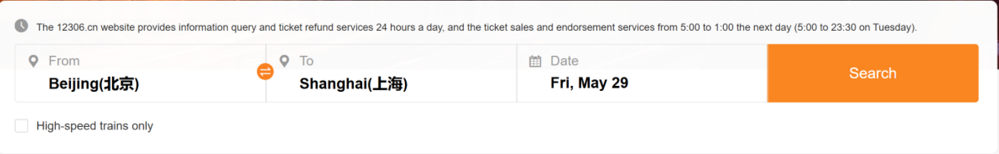
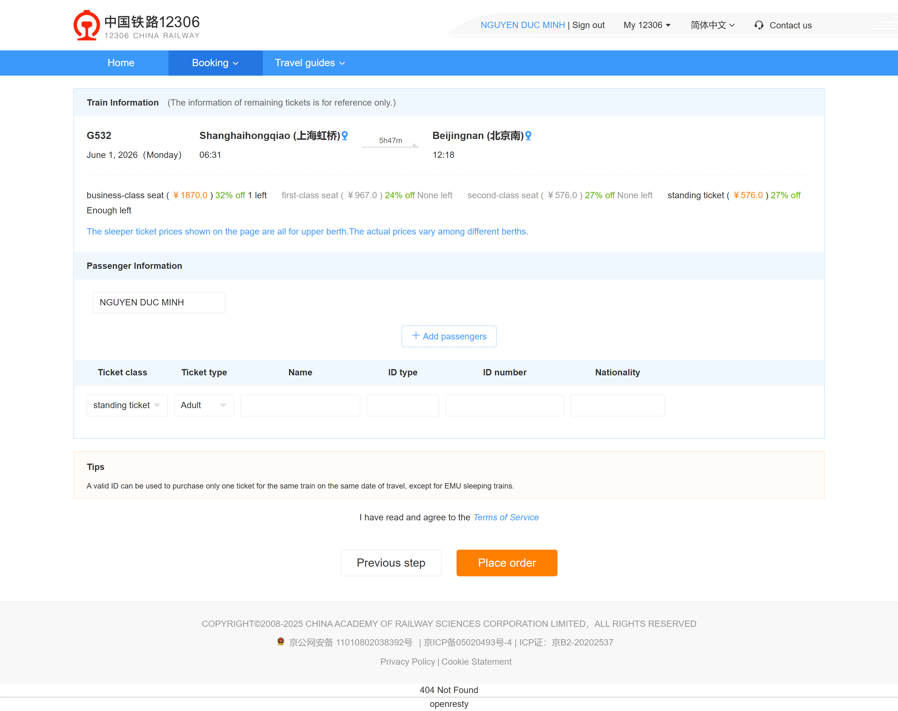

# Small Train Ticket Booking System

This product lets a visitor create an account or sign in, search a published timetable, select a train, and create one booking for that selected journey. The public home page contains the shared header plus From, To, Date and Search controls. A successful search opens a result page; a result row can open a protected booking page; a confirmed booking opens its success page. An account is a persistent identity with a unique username and email. A session represents the current signed-in browser and controls access to booking creation and booking records. A train is a published timetable record identified by its train number and internal stable identity; a booking belongs to exactly one account and one selected train/date. All successful registrations and bookings must persist. Reloading, reopening in the same signed-in browser, or opening a related page as the booking owner reads the same saved state. A failed validation, unavailable train, duplicate account, or unauthorized booking access changes neither account nor booking data. Ticket payment, cancellation, refunds, seat inventory allocation, passenger lists, order history, and administrative timetable editing are outside scope.

## REQ-1 Public home page and account access

The public home page is the first page for an unauthenticated visitor. Its header exposes Register and Login links and the search form defined by REQ-2. After authentication the same header exposes the current username and Sign out; it must no longer show the anonymous-only action as the active account action. Registration creates an account and the session used by REQ-3; login recreates that session from a previously saved account. The product does not implement email verification, password recovery, profile editing, or multiple roles.

**Type:** FOLDER
**Dependencies:** None

### REQ-1.1 Register a traveler account

An unauthenticated visitor opens Register from the public header. The Register page visibly labels Nationality, Name, Passport number, Passport expiration date, Date of birth, Gender, Username, Email address, Password, Confirm password, the Terms of service/Privacy policy checkbox, and Next step. Nationality must be one of the values offered by the control; Name is trimmed and must contain 2–100 non-whitespace characters; passport number is trimmed and must contain 6–30 ASCII letters, digits, or hyphens; expiration date and date of birth must be valid calendar dates, with birth date before the current date and expiration date after the current date; exactly one gender choice is required. Username is trimmed, 3–32 characters, and may contain only ASCII letters, digits, hyphens, or underscores. Email is trimmed, at most 254 characters, contains one @, and has non-empty local and domain parts with a dot in the domain. Password is 12–128 characters and contains at least one uppercase letter, one lowercase letter, one digit, and one non-alphanumeric character; Confirm password must match it exactly. After all fields are valid and terms are accepted, the system atomically saves the account and traveler profile, starts a session, returns to the home page, and displays the username and Sign out. Username and email are globally unique after trimming and email comparison is case-insensitive. Any failed submission stays on Register, displays a field-level reason or conflict message, preserves non-secret fields, never displays the password value, and creates neither account nor session. Optional visual reference: 

**Type:** ATOMIC
**Dependencies:** None

**Scenarios:**

- Register a unique traveler and start a session
  - **GIVEN:** A visitor is on the public home page without a session; the intended trimmed username and case-insensitive email do not belong to another account.
  - **WHEN:** The visitor opens Register, supplies every visible profile and credential field with values satisfying the stated constraints, checks the terms box, and clicks Next step.
  - **THEN:** The home page shows the new username and Sign out, proving that a session was created; a reload still shows that signed-in state, and the account can later be used by REQ-1.2.
- Reject invalid or incomplete registration without a partial account
  - **GIVEN:** A visitor is on Register and has a missing required field, invalid date/profile value, invalid username/email/password, mismatched confirmation, or unchecked terms box.
  - **WHEN:** The visitor clicks Next step.
  - **THEN:** Register remains visible with the applicable validation feedback and retained non-secret input; the header remains anonymous and reopening Login cannot authenticate the attempted username/email.
- Reject duplicate username or email
  - **GIVEN:** A saved account exists and the visitor is signed out; a second otherwise-valid form repeats its username or repeats its email using different letter case.
  - **WHEN:** The visitor submits the second form.
  - **THEN:** The page identifies the conflicting field, remains signed out, and does not create a second account or replace the existing account profile.

### REQ-1.2 Sign in with an existing account

An unauthenticated visitor opens Login from the public header. The page provides a visibly labelled Username or email input accepting a saved username or email, a visibly labelled Password input, and a Login button. The identifier is trimmed before lookup; an email match is case-insensitive and a username match follows the saved normalized username. The password is compared exactly. A valid match atomically creates a new current-browser session and returns the visitor to the home page, where the saved username and Sign out are visible. The session survives a reload and permits the protected flow in REQ-3. Empty fields, an unknown identifier, and an incorrect password all leave the visitor signed out and show the same generic credential failure message; the message must not reveal whether a particular account exists. Login does not alter account profile data or create an account. Optional visual reference: 

**Type:** ATOMIC
**Dependencies:** REQ-1.1

**Scenarios:**

- Sign in by username or email and retain the session
  - **GIVEN:** A saved account created by REQ-1.1 exists and the visitor is signed out.
  - **WHEN:** The visitor opens Login and submits either its username or email with the correct password.
  - **THEN:** The home page displays the saved username and Sign out; after reload the same signed-in state remains available.
- Normalize surrounding identifier whitespace
  - **GIVEN:** A saved account exists and the visitor is on Login.
  - **WHEN:** The visitor enters the account username or email with leading and trailing spaces and submits the correct password.
  - **THEN:** The system signs in as the saved account, rather than creating another account or preserving whitespace as a different identity.
- Reject invalid credentials without exposing account existence
  - **GIVEN:** The visitor is on Login with an unknown account, wrong password, or one missing credential.
  - **WHEN:** The visitor clicks Login.
  - **THEN:** Login remains available with a generic credential failure message, no username/Sign out appears, and refreshing cannot restore an authenticated session.

## REQ-2 Search trains and select a journey

Any visitor may search the published timetable from the home page. A search is a read-only request defined by normalized From, To, and Date values; it does not create an account, session, reservation, or booking. The result page repeats the normalized criteria and shows either matching train cards or the empty state. Each train card represents one concrete selectable journey and exposes its train number, route, timetable, and Book action. Selecting a card hands its stable train identity and date to the protected booking entry defined by REQ-2.3 and REQ-3.

**Type:** FOLDER
**Dependencies:** None

### REQ-2.1 Search valid criteria and show matching trains

From the home page, a visitor enters From, To, and Date and clicks Search. All three inputs are required; each is trimmed, must contain 1–100 visible characters after trimming, and Date must be a valid published travel-date string. From and To must not be equal after case-insensitive trimming. For valid criteria the result page displays the normalized From, To, Date, a numeric result count, and only train cards whose saved departure city, destination city, and travel date match exactly after the same normalization. Each card shows train number, departure and destination stations/cities, departure time, arrival time, and Book. Search is read-only: reloading or reopening the result URL with the same criteria shows the same criteria and current matching data. Invalid input stays on the home page with a visible reason and does not navigate to a result page. Optional visual reference:  

**Type:** ATOMIC
**Dependencies:** None

**Scenarios:**

- Search a published route and inspect matching cards
  - **GIVEN:** The visitor is on the home page and the timetable contains a published train for a valid From, To, Date combination.
  - **WHEN:** The visitor fills all three fields and clicks Search.
  - **THEN:** The result page repeats the normalized criteria, a nonzero count, and the matching train card with its route, times, and Book action; refresh preserves the criteria and still does not create a booking.
- Trim criteria before matching the timetable
  - **GIVEN:** The same published route exists and the visitor enters leading or trailing spaces around one or more criteria.
  - **WHEN:** The visitor clicks Search.
  - **THEN:** The result page displays normalized values without those spaces and returns the same matching card as the trimmed input.
- Reject an incomplete, same-city, or invalid-date search
  - **GIVEN:** The visitor is on the home page with a missing field, From equal to To, or a date outside the published date format/data.
  - **WHEN:** The visitor clicks Search.
  - **THEN:** The home page displays the relevant validation message, retains supplied values, and does not show a fabricated result list or booking entry.

### REQ-2.2 Display a real empty search result

When criteria pass REQ-2.1 validation but no published timetable record matches them, the result page is still opened. It repeats the normalized From, To, and Date, displays result count 0 and an explicit No trains/No results message, and displays no train card or Book action. This is a successful read-only search, not a validation or system error. Reloading or reopening the same result URL keeps the same criteria and empty state until the underlying timetable is changed.

**Type:** ATOMIC
**Dependencies:** REQ-2.1

**Scenarios:**

- Preserve a valid no-match search as an empty result
  - **GIVEN:** A visitor has a valid normalized route and date for which no published train exists.
  - **WHEN:** The visitor submits that search from the home page.
  - **THEN:** The result page repeats all criteria, shows count 0 and an explicit empty message, and contains neither a train card nor Book action; reload retains that outcome.

### REQ-2.3 Select a train and open its booking entry

On a non-empty result page, a visitor chooses Book on one visible train card. The system carries that card's stable train identity and searched travel date into the booking entry and loads that exact train's train number, stations, times, and date; it must not silently substitute the first or a different search result. Booking entry itself is public, but REQ-3.1 requires authentication before the booking form can be used. A missing, expired, unpublished, or date-incompatible train identity produces an explicit Not found/Not bookable message and no usable booking form. Manually opening an old booking URL follows the same rule and never creates a booking context from incomplete query data. Optional visual reference:  

**Type:** ATOMIC
**Dependencies:** REQ-2.1

**Scenarios:**

- Carry the selected result into the booking entry
  - **GIVEN:** A result page contains at least two bookable train cards whose train numbers differ.
  - **WHEN:** The visitor clicks Book on one identified card.
  - **THEN:** The booking entry displays that card's train number, route, timetable, and searched date, not another card's details.
- Reject a missing or no-longer-bookable target
  - **GIVEN:** A visitor opens a booking entry whose train identity is absent, unpublished, expired, or paired with no travel date.
  - **WHEN:** The page attempts to load the selected journey.
  - **THEN:** The visitor sees an explicit not-found or not-bookable message and no enabled booking submission action.

## REQ-3 Create and view a booking

Booking begins only from the selected journey context established by REQ-2.3 and requires the authenticated session created by REQ-1.1 or REQ-1.2. The booking page first shows the selected train summary, then lets the owner enter passenger and ticket details. Confirmation is the sole action that creates a booking record. The saved booking is visible only to its owner and is represented by a unique booking number, selected train/date, passenger values, selected seat type, status, creator, and creation time. A validation or authorization failure must not create a partial booking, and a successful booking must remain visible after reload or direct reopen by the owner.

**Type:** FOLDER
**Dependencies:** REQ-1, REQ-2

### REQ-3.1 Display a selected train on the protected booking page

A signed-in visitor who arrives from REQ-2.3 opens the Booking page. The page shows a Selected train/Train information section containing the selected train number, departure station or city, destination station or city, departure time, arrival time, and travel date, followed by Passenger information and the booking controls defined in REQ-3.2. If no session exists, the visitor is redirected to Login or shown a clear sign-in-required message; no passenger controls can submit. If the selected train context is missing or unavailable, the page shows the REQ-2.3 not-bookable message instead of a stale summary. Loading this page is read-only and does not create a booking.

**Type:** ATOMIC
**Dependencies:** REQ-1.2, REQ-2.3

**Scenarios:**

- Signed-in traveler sees the exact selected journey before booking
  - **GIVEN:** A signed-in traveler selected a published train through REQ-2.3.
  - **WHEN:** The traveler opens the Booking page.
  - **THEN:** The page shows the selected train number, route, times, and date plus Passenger information, while no booking number exists yet.
- Block an unauthenticated booking form
  - **GIVEN:** A visitor has a valid selected-train booking URL but no active session.
  - **WHEN:** The visitor opens the URL.
  - **THEN:** The system requests sign-in or shows an authorization message and does not expose a working booking submission action.

### REQ-3.2 Confirm passenger details and create one booking record

A signed-in traveler on a valid Booking page enters Passenger name, ID number, Nationality, Ticket class, Ticket type, checks Terms of service, clicks Place order, reviews the confirmation summary, and clicks Confirm. Passenger name and nationality are trimmed and must contain 2–100 and 2–60 visible characters respectively. ID number is trimmed and must contain 6–30 ASCII letters, digits, or hyphens. Ticket class and Ticket type must be values currently offered by their visible controls; the supported seed combinations are standing ticket/Adult and Business Class/Adult. The confirmation summary repeats the selected journey, passenger values, and choices, and Confirm atomically saves exactly one booking for the current account and selected train/date. The success result then belongs to REQ-3.3. Missing/invalid values, unchecked terms, unavailable selected train, expired session, or confirmation failure leaves the user on the form or confirmation view with a visible cause and creates no booking. Repeating Confirm after the first successful click must not create a second booking; the page remains or redirects to the same saved success record. Optional visual reference: 

**Type:** ATOMIC
**Dependencies:** REQ-3.1

**Scenarios:**

- Confirm valid passenger details and persist one booking
  - **GIVEN:** A signed-in traveler is on a valid Booking page with a selected published train and no confirmation in progress.
  - **WHEN:** The traveler enters valid passenger values, chooses a supported ticket class/type, accepts the terms, clicks Place order, verifies the summary, and clicks Confirm once.
  - **THEN:** A success result opens for one new booking number containing the selected train/date, passenger name/ID/nationality, and selected ticket values; reloading it does not create another booking.
- Reject invalid passenger data before confirmation
  - **GIVEN:** A signed-in traveler is on Booking with a one-character name, short or illegal ID, missing nationality, no terms acceptance, or an unsupported/missing ticket choice.
  - **WHEN:** The traveler clicks Place order.
  - **THEN:** The relevant validation feedback is visible, the confirmation summary is not opened, and no booking number or saved booking is created.
- Prevent duplicate creation from repeated confirmation
  - **GIVEN:** The traveler is viewing a valid confirmation summary for one selected journey and one passenger input set.
  - **WHEN:** The traveler clicks Confirm and then attempts to click Confirm again or reloads during the completed transition.
  - **THEN:** The system exposes only the original success record and booking number; it does not persist a second booking with the same confirmation action.

### REQ-3.3 View the saved booking success record

After REQ-3.2 saves a booking, its dedicated success page visibly shows Booking number, a success/confirmed status, Train summary, Passenger summary, travel date, selected ticket class/type, and passenger name. The success page reads the persisted booking identified by its URL/context; it is not a static acknowledgement. Reloading or reopening that same success page as the owner shows the same booking number and data. A different signed-in account, a signed-out visitor, or an unknown booking identifier is denied with a sign-in-required, not-found, or no-access message and must not receive passenger or journey details. Viewing a success record is read-only and does not change its status or create another record. Optional visual reference: 

**Type:** ATOMIC
**Dependencies:** REQ-3.2

**Scenarios:**

- View a newly created booking result
  - **GIVEN:** The current traveler has confirmed a valid REQ-3.2 booking.
  - **WHEN:** The success page opens.
  - **THEN:** The page displays that booking's unique number, confirmed status, train summary, passenger summary, travel date, and ticket values.
- Reopen the same owner booking without changing it
  - **GIVEN:** The booking owner is viewing a saved booking success page and records its booking number.
  - **WHEN:** The owner reloads or reopens that page in the same authenticated browser.
  - **THEN:** The same booking number and details remain visible, and the viewing action creates no additional booking.
- Deny another user or visitor access to a booking record
  - **GIVEN:** A booking exists for one traveler and another traveler or signed-out visitor has its success-page URL.
  - **WHEN:** The non-owner opens that URL.
  - **THEN:** The page denies access without displaying the booking's passenger or train details; the owner can still reopen the unchanged record.
